# Выпускная квалификационная работа

Тема: **Автоматизация подбора параметров алгоритма факторизации больших чисел с применением эллиптических кривых на основе эвристических методов оптимизации**

## Реферат

На 30 с., 4 рис., 4 табл., 2 прил.

Ключевые слова: факторизация целых чисел, ECM, GMP-ECM, параметры B1 и B2, эвристическая оптимизация, оптимизация «черного ящика», дифференциальная эволюция, генетический алгоритм, роевой алгоритм, байесовская оптимизация.

Тема выпускной квалификационной работы: «Автоматизация подбора параметров алгоритма факторизации больших чисел с применением эллиптических кривых на основе эвристических методов оптимизации».

Данная работа посвящена автоматизации выбора параметров B1 и B2 метода факторизации на эллиптических кривых. Объект исследования – алгоритм ECM и его реализация в GMP-ECM; цель – разработать систему подбора параметров ECM с применением эвристических методов оптимизации и оценить выигрыш относительно справочных значений GMP-ECM.

В ходе исследования выполнены анализ алгоритмов факторизации, формализация выбора B1/B2 как стохастической оптимизации «черного ящика», разработка программного конвейера на Python и вычислительные эксперименты. Использовались случайный поиск, дифференциальная эволюция, генетический алгоритм, роевой алгоритм и байесовская оптимизация.

В результате разработана система генерации датасетов, запуска GMP-ECM, оптимизации, валидации и анализа. Для чисел с 20-значным простым делителем получено снижение валидационной метрики до 25,14%, среднего времени до 21,04% и среднего числа кривых до 62,42% относительно справочных параметров GMP-ECM. Эксперименты показали, что методы оптимизации находят область эффективных параметров, а последующее уточнение границ поиска позволяет получить более показательные конфигурации. Результаты применимы в вычислительной теории чисел, криптоанализе и предварительной факторизации. Использованы Python 3, NumPy, SciPy, matplotlib, GMP-ECM, Git и ресурсы СКЦ СПбПУ.

## Abstract

On 30 pages, 4 figures, 4 tables, 2 appendices.

Keywords: integer factorization, ECM, GMP-ECM, B1 and B2 parameters, heuristic optimization, differential evolution, genetic algorithm, particle swarm optimization, Bayesian optimization.

The subject of the graduate qualification work is “Automation of Parameter Selection for the Elliptic Curve Factorization Algorithm Using Heuristic Optimization Methods”.

The work is devoted to automating the selection of B1 and B2 parameters for the elliptic curve factorization method. The object is ECM and its implementation in GMP-ECM; the goal is to develop a system for ECM parameter tuning using heuristic optimization methods and evaluate its advantage over GMP-ECM reference parameters.

The research included analysis of factorization algorithms, formulation of B1/B2 tuning as black-box optimization, development of a Python pipeline, and computational experiments. The study used random search, differential evolution, genetic algorithm, particle swarm optimization, and Bayesian optimization.

As a result, a system for dataset generation, GMP-ECM execution, optimization, validation, and analysis was developed. For numbers with 20-digit prime factors, the validation score was reduced by up to 25.14%, average time by up to 21.04%, and the average number of curves by up to 62.42% compared with GMP-ECM reference parameters. The experiments showed that optimization methods identify effective parameter regions, while subsequent refinement of the search bounds produces more representative configurations. The results are applicable in computational number theory, cryptanalysis, and preliminary factorization. The work used Python 3, NumPy, SciPy, matplotlib, GMP-ECM, Git, and SPbPU supercomputing resources.

## Содержание

Введение
1. Аналитический обзор методов факторизации и выбора параметров ECM
2. Математическая постановка задачи и методы оптимизации
3. Разработка программной системы автоматизированного выбора параметров ECM
4. Вычислительные эксперименты и анализ результатов
Заключение
Список использованных источников
Приложения

# ВВЕДЕНИЕ

Факторизация больших целых чисел занимает особое место в вычислительной теории чисел и прикладной криптографии. С математической точки зрения задача состоит в разложении составного числа N на нетривиальные множители. С прикладной точки зрения она тесно связана со стойкостью RSA и других схем, безопасность которых опирается на вычислительную трудность восстановления простых множителей по их произведению. При этом практическая факторизация редко сводится к одному универсальному алгоритму: в реальных вычислительных сценариях применяются цепочки методов, где специализированные алгоритмы ищут сравнительно малые делители, а методы общего назначения используются для оставшегося кофактора.

Метод эллиптических кривых Ленстры (ECM, Elliptic Curve Method) был предложен как вероятностный алгоритм поиска нетривиального делителя составного числа [1]. В отличие от методов общего назначения, сложность ECM зависит главным образом от размера найденного простого делителя, а не от размера всего числа N. Благодаря этому ECM сохраняет важную роль даже на фоне развития GNFS: он используется для поиска малых и средних делителей, предварительной факторизации, кофакторизации в задачах решета числового поля и обработки больших наборов чисел [2, 3].

Практическая эффективность ECM существенно зависит от выбора параметров B1 и B2. Эти параметры задают границы первой и второй стадий алгоритма. Увеличение B1 и B2 повышает вероятность успеха одной кривой, однако одновременно увеличивает стоимость обработки кривой. При фиксированном вычислительном бюджете это приводит к нетривиальному компромиссу: максимальная вероятность успеха одной попытки не обязательно означает минимальное ожидаемое время нахождения делителя. Поэтому выбор B1 и B2 является не только теоретическим, но и инженерным вопросом.

В библиотеке GMP-ECM используются справочные таблицы параметров, построенные на основании накопленного опыта и анализа вероятностей гладкости. Эти таблицы являются сильным эталоном и подходят для широкого класса задач. Однако они не обязаны быть оптимальными для конкретной вычислительной платформы, версии GMP-ECM, типа входных чисел, бюджета кривых и выбранной метрики качества. Возникает исследовательская задача: можно ли автоматически подбирать параметры B1 и B2 для заданного класса чисел так, чтобы получить выигрыш относительно справочных значений.

Актуальность работы определяется тремя обстоятельствами. Во-первых, ECM остается практически значимым компонентом современных схем факторизации, в том числе в криптоаналитических расчетах и кофакторизации. Во-вторых, стоимость массовых ECM-запусков высока, поэтому даже умеренное снижение среднего времени или числа кривых имеет прикладной эффект. В-третьих, автоматическая настройка алгоритмов и беспроизводная (derivative-free) оптимизация активно применяются для дорогих задач «черного ящика» (black-box), но задача настройки B1/B2 в ECM обычно рассматривается через аналитические рекомендации и таблицы, а не как воспроизводимый экспериментальный конвейер (pipeline).

Объектом исследования является алгоритм факторизации целых чисел методом эллиптических кривых и его реализация в GMP-ECM. Предметом исследования является автоматизированный выбор параметров B1 и B2 с применением эвристических методов оптимизации.

Цель работы – разработать и исследовать программную систему, которая автоматически подбирает параметры ECM с использованием эвристических методов оптимизации и снижает эмпирическую оценку ожидаемой стоимости нахождения делителя по сравнению со справочными параметрами GMP-ECM.

Для достижения цели поставлены следующие задачи:

1. Провести аналитический обзор алгоритмов факторизации и определить место ECM среди специализированных и универсальных методов.
2. Рассмотреть теоретические основы ECM и влияние параметров B1 и B2 на вероятность успеха и стоимость вычислений.
3. Проанализировать существующие практические подходы к выбору параметров ECM.
4. Формализовать подбор B1/B2 как задачу стохастической black-box оптимизации с ограничениями.
5. Обосновать набор эвристических методов оптимизации для рассматриваемой задачи.
6. Разработать программную систему генерации датасетов, запуска GMP-ECM, оптимизации, валидации и анализа.
7. Провести вычислительные эксперименты и сравнить найденные параметры со справочными параметрами GMP-ECM.
8. Проанализировать устойчивость результатов и ограничения применимости.
9. Сформулировать практические рекомендации по использованию автоматического подбора параметров ECM.

Научная новизна работы заключается в формализации выбора B1/B2 как эмпирической стохастической black-box оптимизации, в сравнении нескольких эвристических методов в едином воспроизводимом pipeline и в экспериментальной оценке найденных параметров на независимой контрольной выборке. Практическая значимость состоит в разработке программного инструмента, который может быть использован для локальной настройки ECM под конкретную платформу и класс чисел.

Результаты вычислительных экспериментов были получены с использованием вычислительных ресурсов суперкомпьютерного центра Санкт-Петербургского политехнического университета Петра Великого [4].

# ГЛАВА 1. Аналитический обзор методов факторизации и выбора параметров ECM

## 1.1. Задача факторизации и криптографический контекст

В простейшем случае задача факторизации формулируется как нахождение простых p и q по их произведению $N = pq$. В более общем случае требуется разложить составное число N на простые множители произвольной кратности. Для RSA выбираются большие простые p и q, а открытый модуль N публикуется. Если атакующий сможет эффективно найти p и q, он сможет восстановить закрытые параметры схемы. Поэтому практические рекорды факторизации и оценки стоимости GNFS имеют прямое значение для выбора размеров ключей [2, 5].

Следует различать полную факторизацию числа и поиск любого нетривиального делителя. ECM обычно не конкурирует напрямую с GNFS при факторизации большого RSA-модуля целиком. Его сильная сторона – нахождение сравнительно небольшого простого делителя p в большом N. Такая постановка возникает при предварительной обработке чисел, при факторизации кофакторов, при проверке специальных последовательностей и в распределенных вычислительных проектах. Если число содержит 20-, 30- или 40-значный делитель, ECM может найти его значительно эффективнее, чем методы общего назначения, ориентированные на размер всего N.

Классы алгоритмов факторизации приведены в таблице 1.1.

Таблица 1.1
Классы алгоритмов факторизации целых чисел

| Класс | Примеры | Основная зависимость сложности | Типичное применение |
|---|---|---|---|
| Специализированные методы | Pollard rho, Pollard p-1, ECM | От свойств или размера делителя | Поиск малых и средних делителей |
| Методы общего назначения | QS (Quadratic Sieve, квадратичное решето), GNFS (General Number Field Sieve, общее решето числового поля) | От размера N | Полная факторизация больших общих чисел |
| Вспомогательные методы | ECM в кофакторизации | От размера остаточных делителей | Постобработка и предварительная обработка |

Как видно из таблицы 1.1, в контексте данной работы ECM относится к специализированным методам: его целесообразно применять для поиска малых и средних делителей, тогда как методы общего назначения рассматриваются как следующий этап при необходимости полной факторизации числа.

## 1.2. Краткий обзор алгоритмов факторизации

Метод p-1 Полларда использует ситуацию, когда для некоторого простого делителя p числа N значение p - 1 является гладким, то есть раскладывается на простые множители, не превосходящие выбранной границы [6]. Тогда вычисление больших степеней по модулю N и последующий НОД могут привести к нахождению p. Метод прост и эффективен при благоприятной структуре p - 1, но его успех сильно зависит от арифметических свойств конкретного делителя.

Метод rho Полларда является вероятностным алгоритмом, основанным на итерации псевдослучайного отображения и обнаружении циклов [7]. Его ожидаемая стоимость для нахождения делителя p имеет порядок $O(\sqrt{p})$, поэтому он полезен для малых делителей, но быстро становится дорогим при росте размера p.

Квадратичное решето строит сравнение квадратов по модулю N и использует гладкость значений полиномов [8]. Этот метод исторически был одним из основных для чисел среднего размера. Для более крупных общих чисел доминирует общее решето числового поля, эвристическая сложность которого существенно лучше, чем у QS [9]. Именно GNFS лежит в основе современных рекордов факторизации RSA-модулей [2, 5].

ECM занимает промежуточное место. Он сохраняет идею гладкости, но вместо фиксированной группы по модулю p использует группы случайных эллиптических кривых над конечным полем. Это делает вероятность успеха менее зависимой от структуры p - 1 и позволяет многократно пробовать разные группы, выбирая новые кривые [1, 6].

Место ECM среди методов факторизации показано на рисунке 1.1.

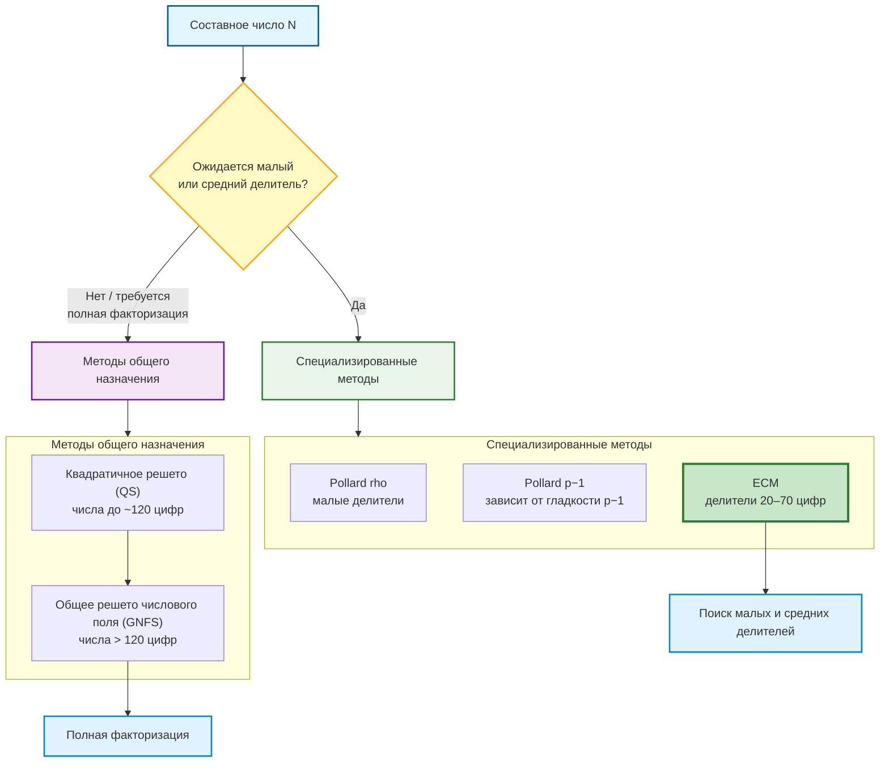

Рис. 1.1 Место ECM среди алгоритмов факторизации

На рисунке 1.1 показана логика выбора класса методов в зависимости от ожидаемого размера делителя. Если ожидается малый или средний делитель, в первую очередь применяются специализированные алгоритмы (Pollard rho, Pollard p−1, ECM), причем ECM в этой ветви рассматривается как основной инструмент для поиска делителей средней длины; диапазон «20–70 цифр» указан как практический ориентир по обзорам и табличным рекомендациям ECM/GMP-ECM (в частности, 40–65 цифр в параметрах GMP-ECM и рекордные множители порядка 66 цифр) [10, 11]. Если же требуется полная факторизация без выраженной гипотезы о малом делителе, применяются методы общего назначения: квадратичное решето (QS) и, для более крупных чисел, общее решето числового поля (GNFS); граница «около 120 цифр» также носит эвристический характер и следует из обзорных оценок, где QS рассматривается как метод выбора примерно до 120 цифр, а NFS/GNFS – для больших чисел [8, 9].

## 1.3. Теоретические основы ECM

Идея ECM состоит в том, чтобы заменить мультипликативную группу по модулю p, используемую в методе p-1, группой точек случайной эллиптической кривой над полем F_p [1]. Пусть N – составное число, p – неизвестный простой делитель N. Алгоритм выбирает эллиптическую кривую и точку P, затем выполняет арифметику по модулю N. Если в процессе вычислений возникает невозможность инвертировать элемент по модулю N, НОД этого элемента с N может дать нетривиальный делитель.

Успех одной кривой связан с гладкостью порядка группы E(F_p). По теореме Хассе порядок группы близок к p + 1, но меняется при выборе кривой. Поэтому многократный перебор случайных кривых фактически дает многократные попытки получить группу, порядок которой достаточно гладок для выбранных границ. Это принципиально отличает ECM от p-1, где используется только структура p - 1.

В первой стадии ECM точка умножается на число, содержащее простые степени до границы B1. Если порядок группы является B1-гладким, стадия с высокой вероятностью приводит к успеху. Вторая стадия расширяет область успеха: допускается, что после первой стадии в порядке группы остается один дополнительный простой множитель, не превосходящий B2. Введение второй стадии было одним из ключевых практических усилений ECM [12].

В практических реализациях важную роль играет ускорение операций над точками. Форма Монтгомери позволяет выполнять вычисления через проективные координаты и уменьшать стоимость сложения и удвоения точек, что существенно для массовой обработки кривых [13].

Общая схема ECM показана на рисунке 1.2.

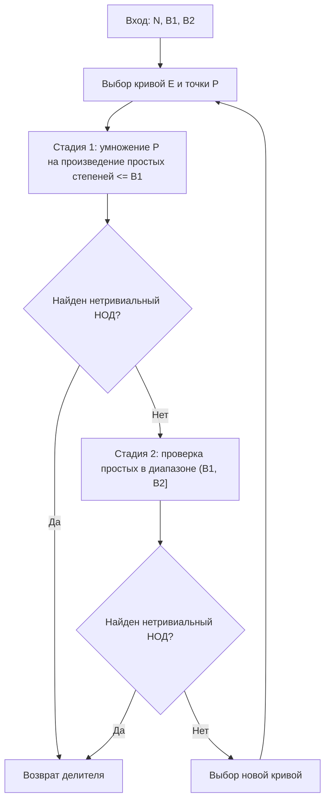
Рис. 1.2 Блок-схема ECM со стадиями 1 и 2

На рисунке 1.2 показан типовой цикл работы ECM: после задания параметров запуска выбирается случайная эллиптическая кривая и стартовая точка, затем последовательно выполняются первая и вторая стадии с проверкой НОД после каждой из них. Если на любой проверке получен нетривиальный НОД, алгоритм завершает работу с найденным делителем. Если обе стадии на текущей кривой не дали результата, выбирается новая кривая и цикл повторяется до получения делителя или исчерпания вычислительного бюджета. Такая структура отражает вероятностную природу ECM, где итоговая эффективность определяется не одной попыткой, а серией независимых запусков на разных кривых.

## 1.4. Параметры B1 и B2

Параметры B1 и B2 определяют главный инженерный компромисс ECM. При малых значениях B1 и B2 одна кривая обрабатывается быстро, но вероятность успеха невелика. При больших значениях вероятность успеха одной кривой выше, однако стоимость каждой попытки возрастает. Для фиксированного времени запуска оптимальная стратегия должна учитывать не только вероятность успеха, но и число кривых, которое можно обработать.

Практический анализ параметров ECM проводился через распределение гладких чисел и функцию Дикмана [14]. В GMP-ECM эта теория и накопленный практический опыт отражены в таблицах рекомендуемых значений B1, B2 и ожидаемого числа кривых [10]. Фрагмент такой таблицы, используемый в работе как эталон, приведен в таблице 1.2.

Таблица 1.2
Справочные параметры GMP-ECM

| Размер делителя, цифр | B1 | B2 | Ожидаемое число кривых |
|---:|---:|---:|---:|
| 20 | 11000 | 1900000 | 74 |
| 25 | 50000 | 13000000 | 214 |
| 30 | 250000 | 130000000 | 430 |
| 35 | 1000000 | 1000000000 | 904 |
| 40 | 3000000 | 5700000000 | 2350 |
| 45 | 11000000 | 35000000000 | 4480 |
| 50 | 43000000 | 240000000000 | 7553 |
| 55 | 110000000 | 780000000000 | 17769 |
| 60 | 260000000 | 3200000000000 | 42017 |
| 65 | 850000000 | 16000000000000 | 69408 |

Справочные параметры не следует трактовать как слабую точку сравнения. Напротив, это сильная инженерная рекомендация общего назначения. Однако локальная оптимизация может быть полезна, если заранее известны класс чисел, бюджет кривых, версия GMP-ECM и вычислительная среда. Именно эта гипотеза проверяется в настоящей работе.

## 1.5. Практические реализации ECM

Практическая эффективность ECM обеспечивается не только выбором B1/B2, но и множеством алгоритмических улучшений. Параметризация Суямы увеличивает вероятность благоприятной структуры порядка группы. Развитие второй стадии, continuation techniques, полиномиальные методы и оптимизация спаривания простых также существенно влияют на стоимость одной кривой [11].

В данной работе GMP-ECM используется как внешний исполнитель. Выбор именно этой реализации обусловлен несколькими причинами: GMP-ECM является де-факто стандартом практического ECM и аккумулирует многолетние алгоритмические улучшения (параметризация Суямы, оптимизации стадий, инженерные ускорения), поэтому сравнение с табличными параметрами выполняется в релевантной «промышленной» точке [10, 11]; использование зрелой внешней реализации снижает риск смещения результатов из-за ошибок собственной низкоуровневой реализации арифметики на кривых и позволяет интерпретировать выигрыш именно как эффект подбора B1/B2, а не эффект переписывания ядра ECM; CLI-интерфейс GMP-ECM обеспечивает воспроизводимые пакетные запуски, фиксируемые seed/ограничения и удобный сбор метрик времени и числа кривых в автоматизированном pipeline. Это позволяет сосредоточиться не на переписывании арифметики эллиптических кривых, а на задаче автоматического выбора параметров и воспроизводимого анализа результатов. В экспериментах использовалась версия GMP-ECM 7.0.6, tag git-7.0.6, выпущенная 4 июля 2024 года [15].

Отдельное направление связано с аппаратными и GPU-реализациями. Работы по ECM на GPU показывают, что массовая обработка кривых хорошо ложится на параллельные вычислительные архитектуры [16]. Это подтверждает практическую ценность оптимизации ECM: выигрыш в стоимости одной кривой или в числе необходимых кривых масштабируется при больших вычислительных кампаниях.

## 1.6. Выводы по главе 1

ECM является хорошо изученным и практически значимым методом факторизации, особенно при поиске малых и средних делителей больших чисел. Его эффективность определяется вероятностной природой выбора кривых, гладкостью порядка группы и параметрами B1/B2. Существующие таблицы GMP-ECM являются надежным эталоном, но не исключают возможности локальной настройки под конкретный класс задач. Это обосновывает переход от ручного выбора параметров к автоматизированной оптимизации.

# ГЛАВА 2. Математическая постановка задачи и методы оптимизации

## 2.1. Формализация задачи

Пусть задан набор составных чисел $D = \{N_1, \ldots, N_L\}$. Для каждого N_j известен простой делитель целевого размера d, что необходимо для формирования датасета и последующей проверки результата. В реальном запуске оптимизатору известны только сами числа N_j и результаты работы GMP-ECM.

Управляемыми параметрами являются B1 и B2. Так как значения параметров меняются на порядки в зависимости от целевого размера делителя, оптимизация выполняется в логарифмическом пространстве:

$x = (\log_{10}(B_1), \log_{10}(B_2)).$

Допустимая область задается ограничениями:

$$
\begin{aligned}
B_{1,\min} &\le B_1 \le B_{1,\max},\\
B_{2,\min} &\le B_2 \le B_{2,\max},\\
B_1 &\le B_2,\\
\frac{B_2}{B_1} &\le R_{\max}.
\end{aligned}
$$

Внешняя функция оценки запускает GMP-ECM на наборе чисел и возвращает статистики успеха, времени и числа кривых. Идеальная целевая функция могла бы минимизировать оценку ожидаемого времени нахождения делителя:

$$
F(B_1, B_2) = \frac{1}{L} \sum_{j=1}^{L} \widehat{ET}(N_j, B_1, B_2).
$$

Здесь $\widehat{ET}(N_j, B_1, B_2)$ – эмпирическая оценка (по конечной выборке запусков) математического ожидания времени нахождения нетривиального делителя числа $N_j$ при выбранных границах $B_1, B_2$.

На практике используется композитная оценка (composite score), учитывающая среднюю долю успешных запусков, средние значения числа кривых и времени до успешной факторизации. В реализованной системе оценка (score) минимизируется:

$$
\begin{aligned}
\mathrm{score} ={}&\max(0,\, 0,90 - \mathrm{success\_rate}) \cdot 200000 \\
&+ \mathrm{mean\_time\_sec} \cdot 10000 \\
&+ \mathrm{mean\_curves} \cdot 50.
\end{aligned}
$$

Такая метрика задает приоритет: сначала не допустить слишком низкой доли успеха, затем минимизировать время и число кривых. Численные веса являются инженерной частью постановки и фиксируются для сопоставимости экспериментов.

## 2.2. Особенности целевой функции

Целевая функция не имеет аналитического выражения. Ее значение получается только через запуск внешней программы GMP-ECM. Кроме того, оценка является шумной: результат зависит от случайного выбора кривых, конкретного набора чисел, загрузки вычислительной среды, таймаутов и случайных seed. Один вызов функции дорогой, поскольку включает множество запусков ECM.

Эти свойства делают нецелесообразным применение классических градиентных методов. Градиент не задан, гладкость функции не гарантируется, а дискретизация B1 и B2 приводит к нерегулярной поверхности качества. Полный перебор также не подходит: пространство параметров велико, а оценка одной точки занимает значимое время. Поэтому задача естественно относится к классу дорогих стохастических black-box задач с ограничениями.

Для защиты от переобучения используется разделение на обучающую (train) и контрольную (control) выборки. Оптимизатор подбирает параметры на train-наборе, а итоговое сравнение с эталоном выполняется на независимой control-выборке. Такой подход соответствует общей логике автоматической конфигурации алгоритмов, где качество найденной конфигурации должно подтверждаться вне обучающего набора.

## 2.3. Выбор методов оптимизации

Для сопоставимого сравнения все методы применяются в одном и том же пространстве параметров $x=(\log_{10}B_1,\log_{10}B_2)$, используют единую внешнюю функцию оценки и одинаковый принцип budget-aware остановки (по числу оценок и/или по времени). Ниже каждый метод рассмотрен отдельно, с акцентом на алгоритмическую часть.

### 2.3.1. Случайный поиск

Случайный поиск (Random Search, RS) используется как базовый стохастический метод с минимальными предположениями о форме целевой функции [17]. На каждой итерации случайным образом выбирается (сэмплируется) кандидат в допустимой области, после чего выполняется внешняя оценка через GMP-ECM и обновляется лучшее значение (best-so-far).

Под равномерным случайным выбором (сэмплированием) понимается независимая генерация значений $\log_{10} B_1$ и $\log_{10} B_2$ из заданных интервалов:

$$ \log_{10} B_1 \sim U[B_1^{\min}, B_1^{\max}], \quad \log_{10} B_2 \sim U[B_2^{\min}, B_2^{\max}] $$

где $U[a,b]$ обозначает равномерное распределение на отрезке $[a,b]$ (все значения в интервале равновероятны). После генерации кандидат проверяется на выполнение ограничений $B_2 \geq B_1$ и $\frac{B_2}{B_1} \leq R_{\max}$. Если сгенерированный кандидат нарушает ограничения, он либо корректируется (приводится к ближайшей допустимой точке), либо отбрасывается с генерацией нового.

Алгоритмически RS в данной задаче важен по двум причинам: он задает честные опорные значения для дорогой black-box оптимизации; при малой размерности (две переменные) и сильном шуме измерений может быть конкурентоспособным с более сложными стратегиями.

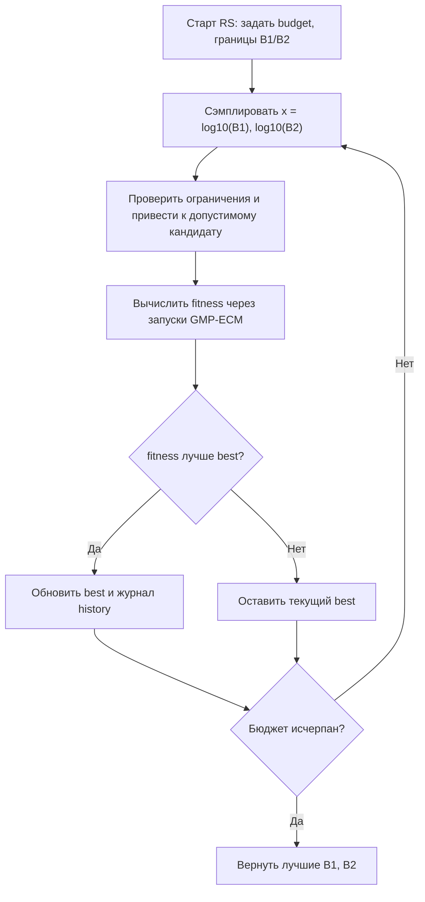

Рис. 2.1 Блок-схема алгоритма случайного поиска (RS)

На рисунке 2.1 показан простой цикл RS: равномерная генерация кандидата в заданных границах, проверка и коррекция ограничений, дорогая внешняя оценка, условное обновление лучшего решения и переход к следующей итерации до исчерпания бюджета. Целевая функция при этом представляет собой эмпирическую оценку ожидаемого времени факторизации $\widehat{ET}(N_j, B_1, B_2)$, усреднённую по обучающей выборке.

### 2.3.2. Дифференциальная эволюция

Дифференциальная эволюция (Differential Evolution, DE) – популяционный эволюционный метод для непрерывной оптимизации [18, 19]. Ключевая идея – мутация через разности векторов популяции, что естественно масштабирует шаг поиска под текущую геометрию облака решений.

В данной работе один индивид популяции кодирует пару параметров $x_i=(\log_{10}B_1,\log_{10}B_2)$. Соответственно, популяция в поколении $g$ имеет вид $P^{(g)}=\{x_1^{(g)},\dots,x_{NP}^{(g)}\}$, где $NP$ – размер популяции.

Процедура обновления популяции для каждого целевого вектора $x_i^{(g)}$ строится по схеме DE/rand/1. Сначала случайным образом выбираются три различных индивида $x_{r1}^{(g)},x_{r2}^{(g)},x_{r3}^{(g)}$, после чего формируется мутантный вектор $v_i^{(g)}=x_{r1}^{(g)} + F\cdot\big(x_{r2}^{(g)}-x_{r3}^{(g)}\big)$, где $F\in(0,2)$ задаёт коэффициент дифференциального усиления. Далее выполняется кроссовер между родительским и мутантным векторами: trial-вектор $u_i^{(g)}$ собирается покомпонентно из $v_i^{(g)}$ с вероятностью $CR$ и из $x_i^{(g)}$ с вероятностью $1-CR$, где $CR\in[0,1]$ является параметром интенсивности рекомбинации. После этого рассчитывается значение score($u_i^{(g)}$) через внешний запуск GMP-ECM, и выполняется жадный отбор: если trial-вектор не хуже родительского, то он переходит в следующее поколение, то есть $x_i^{(g+1)}=u_i^{(g)}$; в противном случае сохраняется исходный вектор $x_i^{(g+1)}=x_i^{(g)}$.

Интуитивно разность $\big(x_{r2}-x_{r3}\big)$ задает «направление поиска», обнаруженное самой популяцией: если хорошие решения сгруппированы, шаги автоматически становятся меньше; если популяция разрежена, шаги крупнее. Это делает DE удобным для black-box задач с неоднородным рельефом функции.

Для задачи подбора $B_1,B_2$ дополнительно важны ограничения $B_2\ge B_1$ и $\frac{B_2}{B_1}\le R_{\max}$. Поэтому после мутации/кроссовера trial-вектор либо проецируется в допустимую область, либо пересэмплируется. После этого запускается дорогая внешняя оценка; именно она определяет основную стоимость одной итерации DE.

Таким образом, один цикл DE представляет собой последовательность из формирования направленного возмущения на основе текущей популяции, комбинирования полученного вектора с родительским решением и последующего принятия только неухудшающего кандидата. Благодаря жадному отбору лучшее найденное значение score в процессе смены поколений не ухудшается.

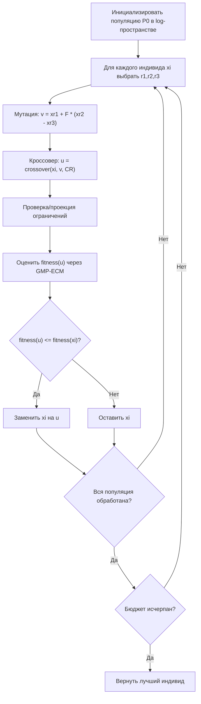

Рис. 2.2 Блок-схема дифференциальной эволюции (DE)

На рисунке 2.2 отражены основные операторы DE (мутация, кроссовер, отбор), которые повторяются поколениями до исчерпания лимита вычислений.

### 2.3.3. Генетический алгоритм

Генетический алгоритм (Genetic Algorithm, GA) относится к классу эволюционных методов оптимизации. В его основе лежит последовательное применение трёх операторов: селекции (выбор родителей), скрещивания (рекомбинация) и мутации (случайное возмущение). Дополнительно используется механизм элитизма – сохранение лучших особей текущего поколения без изменений. GA работает с вещественным кодированием кандидатов, что естественно для непрерывной задачи подбора $B_1$ и $B_2$ (единое пространство параметров задано в начале раздела 2.3).

Как и в DE, один индивид кодирует пару $x_i=(\log_{10}B_1,\log_{10}B_2)$, а значение приспособленности определяется дорогой внешней оценкой через GMP-ECM на обучающей выборке. Однако механизм порождения новых точек отличается: в GA источник новых решений связан не с разностными векторами, а с рекомбинацией «родительских» кандидатов. Это позволяет сохранять и комбинировать удачные частичные структуры, например «хороший масштаб $B_1$» и «хорошее отношение $B_2/B_1$».

Начальная популяция $P^{(0)}$ формируется случайно в заданных границах логарифмического пространства. После оценки всех особей каждое новое поколение строится следующим образом. Сначала выполняется турнирная селекция: из текущей популяции случайно выбирается небольшая группа кандидатов, и родителем становится особь с минимальным значением score. Такой механизм увеличивает вероятность выбора хороших решений, но не исключает менее сильные особи полностью, что помогает поддерживать разнообразие.

Для двух выбранных родителей $p_a$ и $p_b$ применяется вещественное арифметическое скрещивание: $c=\alpha p_a+(1-\alpha)p_b$, где $\alpha\sim U(0,1)$. Потомок $c$ лежит на отрезке между родительскими решениями в лог-пространстве и наследует их координаты в сглаженной форме. Далее с вероятностью $p_m$ выполняется гауссова мутация: $c'=c+\varepsilon$, где $\varepsilon\sim\mathcal{N}(0,\sigma^2)$ покомпонентно. Мутация отвечает за локальное исследование окрестности и снижает риск преждевременного схлопывания популяции.

После скрещивания и мутации кандидат приводится к допустимой области поиска: логарифмические координаты ограничиваются заданными диапазонами, а при декодировании дополнительно соблюдаются условия $B_2\ge B_1$ и $\frac{B_2}{B_1}\le R_{\max}$. Затем потомок оценивается через GMP-ECM. Новое поколение формируется из элитных особей текущей популяции и оценённых потомков. Элитизм гарантирует, что лучшие найденные решения не теряются при случайной рекомбинации и мутации.

Таким образом, один цикл GA состоит из выбора родителей с предпочтением более качественных решений, построения промежуточного потомка, случайного локального возмущения, коррекции ограничений и сохранения лучших кандидатов. Для задачи подбора $B_1,B_2$ это дает компромисс между эксплуатацией уже найденных перспективных масштабов параметров и исследованием соседних областей.

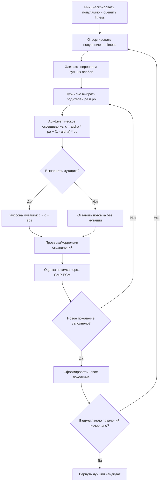

Рис. 2.3 Блок-схема генетического алгоритма (GA)

На рисунке 2.3 показано, что GA поддерживает разнообразие популяции через турнирную селекцию и мутацию, а прогресс стабилизирует за счет элитизма и сохранения лучшего найденного кандидата.

### 2.3.4. Роевой алгоритм

Роевой алгоритм (Particle Swarm Optimization, PSO) рассматривает набор частиц, которые одновременно «летают» по пространству решений и обмениваются информацией о найденных удачных точках [20]. Для каждой частицы хранятся: текущая позиция $x_i$, текущая скорость $v_i$, личный лучший найденный вектор $pbest_i$ и значение его приспособленности. Для всего роя дополнительно поддерживается глобальный лучший вектор $gbest$.

В постановке подбора параметров ECM позиция частицы задается в общем пространстве параметров, введенном в начале раздела 2.3, а fitness определяется той же внешней black-box оценкой через запуск GMP-ECM на обучающей выборке. Поэтому PSO использует тот же механизм декодирования кандидата в реальные значения $B_1,B_2$ с учетом ограничений.

На итерации $t$ движение частицы обновляется по классическим формулам:

$$ v_i^{(t+1)} = \omega v_i^{(t)} + c_1 r_1\big(pbest_i - x_i^{(t)}\big) + c_2 r_2\big(gbest - x_i^{(t)}\big), $$ $$ x_i^{(t+1)} = x_i^{(t)} + v_i^{(t+1)}, $$

где $\omega$ – коэффициент инерции, $c_1$ и $c_2$ – веса когнитивной и социальной компонент, $r_1,r_2\sim U(0,1)$ – независимые случайные множители. Слагаемые имеют интуитивный смысл: инерционная часть сохраняет направление предыдущего движения, когнитивная тянет частицу к ее личному успешному опыту, социальная – к лучшему решению, найденному всем роем.

После обновления позиции выполняется приведение к допустимой области: координаты ограничиваются диапазонами поиска, а при декодировании дополнительно соблюдаются условия $B_2\ge B_1$ и $\frac{B_2}{B_1}\le R_{\max}$. При необходимости применяется отсечение скорости (velocity clamping), чтобы частицы не делали слишком больших скачков и не «перелетали» узкие перспективные области.

Далее для новых позиций вычисляется score через дорогой запуск GMP-ECM. Если частица улучшила собственный рекорд, обновляется $pbest_i$; если среди всех частиц найдено лучшее значение, обновляется $gbest$. Затем цикл повторяется до исчерпания budget-aware лимита (по времени и/или числу оценок).

Таким образом, один цикл PSO состоит из направленного перемещения частиц под влиянием личного и коллективного опыта, проекции в допустимую область, внешней оценки и обновления рекордов. Для задачи подбора $B_1,B_2$ это дает баланс между быстрым выходом в перспективные зоны (за счет социальной компоненты) и локальным уточнением найденных параметров (за счет инерции и личной памяти частиц).

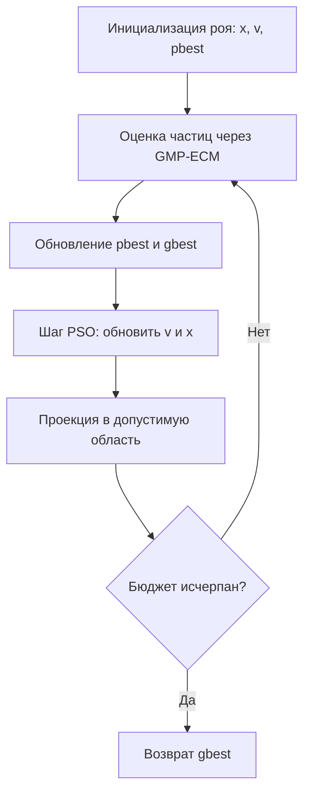

Рис. 2.4 Блок-схема роевого алгоритма (PSO)

На рисунке 2.4 показан итерационный цикл PSO: оценка текущих позиций, обновление личных/глобального рекордов и новое перемещение частиц.

### 2.3.5. Байесовская оптимизация

Байесовская оптимизация (Bayesian Optimization, BO) строит вероятностную суррогатную модель дорогой целевой функции и на каждом шаге выбирает новую точку не «вслепую», а с учетом уже накопленных измерений [21, 22]. В контексте настройки ECM это означает: минимизировать число дорогостоящих вызовов GMP-ECM, извлекая максимум информации из каждой выполненной оценки.

Как и в предыдущих методах, кандидат задается в едином пространстве $x=(\log_{10}B_1,\log_{10}B_2)$, а истинное значение score получается только после внешнего запуска. Отличие BO в том, что между этими запусками поддерживается статистическая модель $\hat f(x)$, которая для любой точки возвращает прогноз среднего значения $\mu(x)$ и меру неопределенности $\sigma(x)$. Вблизи уже измеренных областей прогноз обычно увереннее, а в удаленных или внутренне противоречивых зонах неопределенность выше. Поэтому следующий шаг выбирается так, чтобы сбалансировать движение к уже перспективным участкам и проверку областей, где пока недостаточно информации.

В типичной реализации суррогатом служит гауссовский процесс (Gaussian Process, GP). Он задается ядром $k(x,x')$, описывающим ожидаемую близость значений функции в соседних точках, и шумовым параметром, отражающим стохастичность измерений (в нашем случае из-за случайных кривых ECM, таймаутов и системных флуктуаций). По набору наблюдений $\mathcal{D}_t=\{(x_i,y_i)\}_{i=1}^{t}$, где $y_i=\mathrm{score}(x_i)$, получается апостериорное распределение прогноза в произвольной точке $x$.

Чтобы выбрать следующую точку, максимизируется acquisition-функция $a(x\mid\mathcal{D}_t)$. В работе используется стандартная логика exploration/exploitation, характерная для критериев типа Expected Improvement (EI) или Upper/Lower Confidence Bound (UCB/LCB): компонент exploitation делает приоритетными точки с низким прогнозируемым значением score $\mu(x)$, тогда как компонент exploration смещает выбор к областям с высокой неопределенностью $\sigma(x)$; итоговый критерий объединяет оба эффекта и определяет кандидат $x_{t+1}$.

Для задачи подбора $B_1,B_2$ это особенно полезно при ограниченном бюджете: если простой перебор «тратит» оценку на каждую проверку одинаково, то BO пытается направлять дорогостоящие запуски туда, где ожидается наибольшая информационная или практическая отдача.

С учетом ограничений процедура одной итерации BO имеет следующий вид. Сначала в допустимой области строится начальный дизайн (несколько стартовых точек), и для них вычисляется истинный score через GMP-ECM. Затем итеративно: переобучается суррогат по текущему набору наблюдений; решается внутренняя задача максимизации acquisition-функции; найденный кандидат декодируется в $B_1,B_2$, приводится к условиям $B_2\ge B_1$ и $\frac{B_2}{B_1}\le R_{\max}$, при необходимости дискретизуется; выполняется дорогой внешний запуск; новая пара $(x_{t+1},y_{t+1})$ добавляется в базу наблюдений.

Таким образом, BO можно интерпретировать как «управляемый экспериментальный дизайн»: каждая новая точка выбирается не сама по себе, а как наиболее перспективная с точки зрения текущих знаний о рельефе функции. Это делает BO естественным кандидатом для дорогой black-box оптимизации с малым числом допустимых вызовов целевой функции.

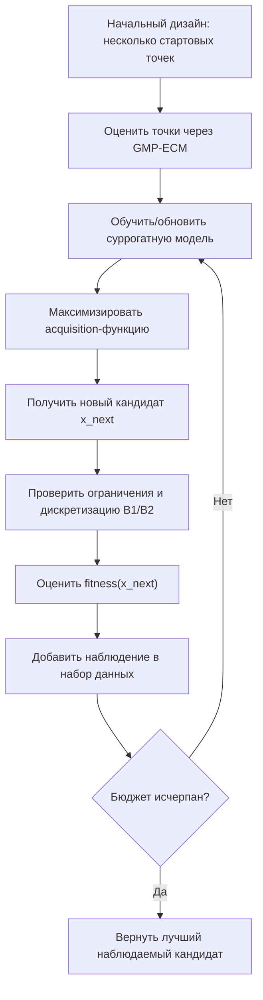

Рис. 2.5 Блок-схема байесовской оптимизации (BO)

На рисунке 2.5 подчеркнута ключевая особенность BO: явная модель неопределенности, позволяющая выбирать новые точки более экономно по числу дорогих вычислений.

### 2.3.6. Итоговое сопоставление методов

В целом выбранная постановка близка к автоматической конфигурации алгоритмов: подбирается не решение исходной математической задачи, а параметры вычислительного метода, качество которых затем проверяется на независимых экземплярах [23, 24]. Сравнение методов приведено в таблице 2.1.

Таблица 2.1
Методы оптимизации, применяемые в работе

| Метод | Тип | Преимущества | Основные риски |
|---|---|---|---|
| RS | Случайный поиск | Простота, дешевизна, устойчивый эталон | Нет направленного поиска |
| DE | Эволюционный | Хорош для непрерывных black-box задач | Высокая стоимость при больших популяциях |
| GA | Эволюционный | Гибкость, элитизм, разнообразие популяции | Преждевременная сходимость |
| PSO | Роевой | Быстрое движение к перспективным зонам | Сходимость к границам |
| BO | Суррогатный | Экономия дорогих оценок | Чувствительность к шуму |

Таблица 2.1 показывает, что в работе сознательно выбраны методы разных классов: эталонный ненаправленный (RS), популяционные эволюционные (DE, GA), роевой (PSO) и суррогатный (BO). Такое покрытие позволяет сравнить стратегии по ключевому компромиссу «качество найденных параметров против стоимости вычислений». Практически это означает, что RS используется как базовый уровень, DE/GA/PSO – как основные рабочие эвристики для непрерывного пространства $B_1, B_2$, а BO – как вариант для режима, где каждая оценка особенно дорога и требуется более экономный подбор кандидатов.

Конкретные диапазоны поиска и значения гиперпараметров оптимизаторов приведены в главе 3 (реализация), а их эмпирическая эффективность и сравнение по метрикам – в главе 4.

## 2.4. Валидация и статистический анализ

Оценка качества найденных параметров выполняется в два этапа. На первом этапе оптимизатор минимизирует целевую функцию на обучающей выборке (train). На втором этапе полученная конфигурация $(B_1, B_2)$ проверяется на независимой контрольной выборке (control), которая не использовалась в процессе поиска. Такое разделение необходимо для проверки обобщающей способности настройки и снижения риска переобучения под конкретные экземпляры чисел и случайные seed.

Основным критерием сравнения является значение составной валидационной метрики (composite score) на контрольном наборе. Дополнительно анализируются частные показатели, позволяющие интерпретировать причины изменения оценки:

1. **валидационная метрика** – значение целевой метрики на контрольной выборке;
2. **относительный выигрыш валидационной метрики, %** – относительное улучшение по сравнению с эталонными параметрами GMP-ECM;
3. **среднее время, с** – среднее время до исхода запуска;
4. **среднее число кривых** – среднее число обработанных кривых до исхода;
5. **доля успешных факторизаций** – доля успешных запусков в заданном бюджете;
6. **время достижения лучшего решения** и **полная длительность оптимизации** – характеристики вычислительной стоимости метода.

Относительный выигрыш валидационной метрики вычисляется по формуле

$$
\mathrm{gain}(\%) = \frac{\mathrm{score}_{\mathrm{baseline}}-\mathrm{score}_{\mathrm{method}}}{\mathrm{score}_{\mathrm{baseline}}} \cdot 100.
$$

Положительное значение этой метрики означает улучшение относительно эталона, нулевое – сопоставимый результат, отрицательное – ухудшение.

Поскольку функция качества шумная, статистический анализ строится на устойчивых характеристиках распределений. Для каждой метрики рассчитываются медиана, квартили и межквартильный размах (IQR). Для оценки неопределенности используются bootstrap-доверительные интервалы, формируемые по множеству повторных выборок с возвращением. Такой подход не требует предположения о нормальности распределения и хорошо подходит для стохастических вычислительных экспериментов.

Для попарного сравнения методов применяется доля побед: метод считается победившим в запуске, если его валидационная метрика ниже оценки сопоставляемого метода. На уровне итоговой интерпретации используются категории принятия решения:

- **к внедрению** (*adopt*) – метод демонстрирует устойчивое улучшение и приемлемую вычислительную стоимость;
- **требует наблюдения** (*watch*) – наблюдается потенциальный выигрыш, но его устойчивость требует дополнительных повторов;
- **пониженный приоритет** (*deprioritize*) – улучшение отсутствует либо достигается ценой несоразмерных вычислительных затрат.

При ограниченном числе запусков статистические выводы формулируются консервативно. Отсутствие статистически значимых различий не интерпретируется как доказательство равенства методов; оно указывает на недостаточную мощность выборки для надежной фиксации эффекта. Поэтому в работе одновременно учитываются как формальные интервальные оценки, так и практическая величина эффекта (effect size), выраженная в процентах выигрыша по ключевым метрикам.

## 2.5. Выводы по главе 2

Подбор параметров ECM естественно формализуется как дорогая стохастическая оптимизация «черного ящика» с ограничениями. Выбор эвристических методов обоснован отсутствием аналитического градиента, шумом измерений и высокой стоимостью оценки. Независимая валидация является обязательной частью постановки, поскольку оптимизация на train-наборе может привести к переобучению параметров под конкретные числа и seed.

# ГЛАВА 3. Разработка программной системы автоматизированного выбора параметров ECM

## 3.1. Требования к системе

Разработанная система должна обеспечивать полный цикл вычислительного эксперимента, включающий генерацию данных, запуск ECM, оптимизацию параметров, независимую валидацию, аналитическую обработку и сохранение итоговых артефактов. При этом требования к системе сформулированы в проверяемом виде, то есть их выполнение может быть подтверждено результатами одного воспроизводимого запуска по фиксированному сценарию.

В функциональном отношении система должна формировать независимые train- и control-наборы для заданного класса чисел $N = pq$, выполнять запуск GMP-ECM для заданных пар $B_1$ и $B_2$ с учетом ограничений по числу кривых и таймауту, вычислять целевую метрику (fitness) и сохранять историю оценок в процессе оптимизации. Также требуется поддержка нескольких методов оптимизации (RS, DE, GA, PSO, BO) через единый интерфейс, проведение независимой проверки найденных параметров на control-наборе и формирование выходных материалов в форматах JSON, CSV, PNG и Markdown.

Нефункциональные требования ориентированы на корректность и эксплуатационную устойчивость. Система должна обеспечивать воспроизводимость эксперимента: при фиксированном seed должен сохраняться состав датасета и структура выходных артефактов. Обработка таймаутов и неуспешных запусков ECM должна быть отказоустойчивой: такие события учитываются как failure, но не приводят к прерыванию всего pipeline. Кроме того, реализация должна поддерживать масштабируемый пакетный запуск через сценарии `run-plan`, параллельное выполнение этапов и совместимость с HPC-средой на базе SLURM для длительных серий расчетов.

В качестве минимальных критериев приемки в рамках данной работы принимается следующее: один JSON-план должен выполняться полностью от этапа `generate` до этапа `analyze`; по итогам выполнения должны формироваться согласованные optimize/validate-отчеты и сводные таблицы; для каждой тестируемой пары $B_1/B_2$ должны сохраняться метаданные запуска, включая seed, заданные лимиты, статус успеха и время выполнения.

## 3.2. Архитектура пакета

Программный комплекс реализован на Python и организован как пакет `ecm_optimizer` [25], в котором архитектура разделена на слои предметной логики, алгоритмов оптимизации, интерфейсов запуска и аналитической постобработки. Такое разбиение выбрано для того, чтобы изолировать вычислительное ядро (оценку параметров ECM) от сценариев экспериментов и от форматов итоговой отчетности.

Ядро системы сосредоточено в каталоге `ecm_optimizer/core`. Модуль `problem.py` отвечает за генерацию простых чисел, построение составных чисел $N = pq$ и подготовку датасетов с манифестами, обеспечивая воспроизводимость входных данных. Модуль `ecm_runner.py` инкапсулирует запуск внешнего исполняемого файла GMP-ECM, контроль таймаута и нормализованный разбор результатов каждого прогона. Модуль `fitness.py` реализует вычисление целевой метрики и агрегированных статистик по сериям запусков, а `baseline.py` формирует эталонные параметры для сопоставления с оптимизированными решениями.

Слой оптимизации реализован в `ecm_optimizer/optimizers/` и включает методы RS, DE, GA, PSO и BO, использующие единый контракт взаимодействия с fitness-evaluator. Благодаря этому каждый алгоритм может быть заменен или донастроен без изменения логики запуска GMP-ECM и без изменения формата выходных артефактов. Слой интерфейсов в `ecm_optimizer/cli/` предоставляет команды `generate`, `optimize`, `validate`, `run-plan` и `analyze`, через которые реализуется полный жизненный цикл вычислительного эксперимента: от подготовки входных данных до построения итоговых отчетов. Слой `ecm_optimizer/analysis/` отвечает за агрегацию результатов и выпуск таблиц и графиков в форматах, пригодных для последующей интерпретации в экспериментальной главе.

Архитектура системы показана на рисунке 3.1.

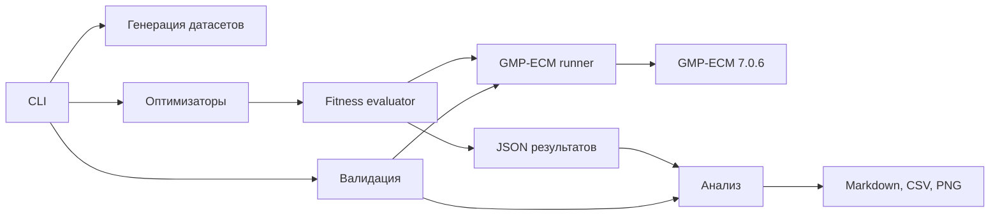

Рис. 3.1 Архитектура программной системы автоматизированного подбора параметров ECM

Схема на рисунке 3.1 отражает не только состав модулей, но и направление потоков данных. Узел `CLI` является точкой оркестрации и инициирует как этап генерации датасетов, так и этапы оптимизации и валидации. Блок «Оптимизаторы» не взаимодействует с GMP-ECM напрямую: каждый кандидат $B_1/B_2$ передается в `Fitness evaluator`, который выполняет серийную оценку через `GMP-ECM runner`. Такое разделение принципиально важно, поскольку позволяет централизовать правила оценки (ограничения, повторы, stop-on-success, учет таймаутов) и обеспечить сопоставимость результатов разных методов.

Выход `Fitness evaluator` сохраняется в JSON-артефакты, которые затем совместно с результатами отдельного этапа валидации передаются в блок анализа. Валидация на схеме выделена отдельной веткой, чтобы подчеркнуть методологическое разделение между оптимизацией на train-наборе и проверкой обобщающей способности на control-наборе. Конечным продуктом архитектурного контура являются агрегированные отчеты и визуализации (Markdown, CSV, PNG), используемые как основание для сравнительного анализа методов в главе 4.

## 3.3. Генерация датасетов

Модуль генерации датасетов реализует воспроизводимое построение наборов полупростых чисел вида $N = p q$ для последующей оптимизации и независимой проверки. На вход подаются целевой размер простого делителя p, размер кофактора q, мощности train и control наборов, а также значение seed. Фиксация seed используется как обязательный механизм детерминизации: при одинаковой конфигурации генератор формирует одинаковую последовательность кандидатов и идентичный состав итогового набора.

Внутренний контур генерации включает четыре последовательных этапа: выбор кандидата p заданной разрядности, выбор кандидата q требуемой длины, проверку простоты обоих множителей и формирование числа $N = p q$ с последующей валидацией битовой длины. Если хотя бы одно условие нарушается, кандидат отбрасывается и цикл генерации повторяется до достижения требуемого количества элементов. После построения пула выполняется разделение на train и control без пересечений, что исключает утечку данных между этапом настройки и этапом подтверждения качества.

Для каждого запуска сохраняется manifest, содержащий идентификатор датасета, параметры генерации, seed, временные метки, а также записи по каждому объекту $(p, q, N)$ и его служебные признаки. Такое представление обеспечивает трассируемость и позволяет верифицировать корректность найденного делителя при анализе результатов оптимизации. Дополнительно фиксируются инварианты корректности: уникальность элементов в пределах набора, соответствие целевой длине множителей и отсутствие пересечения между train и control.

Использование искусственно сгенерированных полупростых чисел оправдано целью работы, поскольку позволяет контролируемо оценивать способность оптимизатора находить эффективные параметры для заданного размера делителя. Вместе с тем перенос выводов на специальные классы чисел (например, числа вида $s^n \pm 1$ или кофакторы из реальных GNFS-задач) требует отдельной экспериментальной проверки.

Логика модуля генерации представлена на рисунке 3.2.

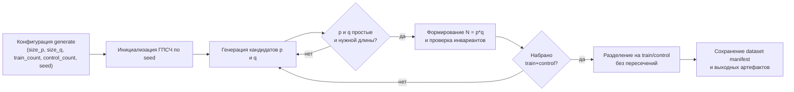

Рис. 3.2 Блок-схема модуля генерации датасетов

## 3.4. Интеграция с GMP-ECM

GMP-ECM запускается как внешний исполняемый файл. Для одной кривой используется команда вида:

```text
ecm <B1> <B2>
```

Число N передается во входной поток процесса. Результат считается успешным, если в выводе GMP-ECM обнаружена строка `Factor found`. Для каждого запуска фиксируются success/failure, время выполнения и служебный вывод. Таймауты учитываются как неуспешные попытки.

Оценка пары B1/B2 выполняется по схеме stop-on-success. Для каждого числа проводится несколько повторов; внутри повтора кривые запускаются до первого успеха или до достижения `max_curves_per_n`. Это отражает практический сценарий, где после нахождения делителя дальнейшая обработка данного числа не нужна.

С инженерной точки зрения интерфейс `ECM runner` можно рассматривать как контракт вида «вход: N, B1, B2, лимиты времени и числа кривых; выход: success/failure, найденный делитель (при наличии), число выполненных кривых, затраченное время и диагностический статус завершения». Такой контракт унифицирует обработку таймаутов, пустого или неполного вывода и ошибок внешнего процесса, а также обеспечивает единый формат данных для последующего расчета fitness и сравнительного анализа методов.

## 3.5. Реализация оптимизаторов

Алгоритмические детали RS, DE, GA, PSO и BO были подробно рассмотрены в п. 2.3; в программной системе главы 3 их реализация сохраняет ту же методическую логику, но унифицирована общим вычислительным контрактом. Каждый метод работает в едином пространстве параметров, передает кандидаты в `fitness evaluator` и получает сопоставимую оценку качества при одинаковых правилах учета таймаутов, ограничений и stop-on-success, что обеспечивает корректность межметодного сравнения.

Общая часть реализации включает преобразование внутренних представлений кандидатов к целочисленным B1 и B2, проверку ограничений задачи и централизованную регистрацию результатов оценки. Если кандидат нарушает инварианты B2 >= B1 или B2 / B1 <= R_max, он корректируется либо отклоняется по правилам конкретного метода, после чего в истории запуска фиксируются objective, best-so-far, признак `new_best` и служебные метаданные для последующего анализа траектории поиска. Для явной фиксации используемых в практических запусках конфигурационных полей и их роли в вычислительном контуре в таблице 3.1 приведены ключевые параметры оптимизаторов и пояснения к ним.

Таблица 3.1
Параметры конфигурации оптимизаторов в текущей реализации и их назначение

| Параметр | Назначение в реализации |
|---|---|
| `method` | Выбирает используемый оптимизатор (`rs`, `de`, `ga`, `pso`, `bo`) и соответствующий набор обязательных параметров запуска. |
| `seed` | Фиксирует инициализацию стохастических компонентов оптимизации и обеспечивает воспроизводимость траектории поиска. |
| `b1_min`, `b1_max` | Задают диапазон поиска для параметра B1. |
| `b2_min`, `b2_max` | Задают диапазон поиска для параметра B2. |
| `ratio_max` | Ограничивает допустимое отношение B2/B1 в процессе генерации и проверки кандидатов. |
| `max_curves_per_n` | Задает верхний предел числа кривых на одно число N при оценке кандидата. |
| `repeats_per_n` | Определяет число повторных stop-on-success прогонов на каждом N для устойчивой оценки fitness. |
| `curve_timeout_sec` | Устанавливает лимит времени для одного запуска кривой ECM при вычислении fitness. |
| `de_popsize`, `de_maxiter` | Пара обязательных параметров метода DE: размер популяции (множитель) и число итераций. |
| `rs_budget` | Обязательный параметр метода RS: бюджет числа оценок fitness. |
| `pso_swarm_size`, `pso_iterations` | Пара обязательных параметров метода PSO: размер роя и число итераций. |
| `bo_initial_samples`, `bo_iterations`, `bo_candidate_pool` | Обязательные параметры BO: начальная выборка, число шагов оптимизации и размер пула кандидатов на шаге. |
| `ga_population_size`, `ga_generations`, `ga_mutation_prob` | Обязательные параметры GA: размер популяции, число поколений и вероятность мутации. |


## 3.6. Автоматизация экспериментов и HPC

Для воспроизводимых многошаговых запусков реализована команда `run-plan`, принимающая JSON-план. План включает этапы `generate`, `optimize`, `validate` и `analyze`, а также поддерживает шаблоны параметров, повторения по списку методов и передачу артефактов между шагами через ссылки `$ref`.

Так как общая архитектура и поток данных уже подробно рассмотрены в п. 3.2, в данном разделе акцент сделан на практической организации расчетов. Все длительные прогоны выполнялись на суперкомпьютере СПбПУ через SLURM в разделе `tornado`, поскольку в работе использовались CPU-вычисления. Типовой сценарий заключался в запуске одного плана на полный цикл эксперимента с последующим сбором артефактов в каталогах `data/experiments` и `data/analysis`.

В качестве воспроизводимого примера использовался план `data/plans/time_balanced_3h_all_methods_20d.json`, по которому были получены основные результаты для 20-значных делителей. Полный текст указанного плана приведен в приложении А.

## 3.7. Система анализа результатов

Подсистема `analyze` предназначена для сводного просмотра результатов оптимизации и валидации в едином формате. Она объединяет соответствующие JSON-артефакты, выполняет группировку по ключевым признакам (размер делителя, датасет, метод, seed) и формирует компактные итоговые таблицы и графики.

Практически этот модуль используется как инструмент сравнительного обзора: он позволяет в одной визуальной области сопоставить методы между собой, быстро оценить динамику метрик и получить базовые статистические сводки по эксперименту. Выходные материалы (Markdown, CSV, PNG) удобны для навигации по результатам и последующего детального разбора в отдельных optimize/validate-отчетах.

## 3.8. Выводы по главе 3

В главе 3 представлена практическая реализация программной системы автоматизированного подбора параметров ECM, охватывающая полный вычислительный контур: формирование датасетов, запуск оптимизации, независимую валидацию и сводный анализ результатов. Для всех этапов определены единые правила обмена артефактами и параметры воспроизводимости, что позволяет повторять эксперименты в сопоставимых условиях.

Архитектурно система построена как набор согласованных модулей с разделением ответственности между CLI-оркестрацией, вычислением fitness, запуском внешнего GMP-ECM и аналитической обработкой. Такой подход обеспечивает корректное сравнение методов RS, DE, GA, PSO и BO при едином протоколе оценки кандидатов и фиксированных ограничениях задачи.

Практическая часть главы подтверждает готовность системы к серийному запуску экспериментов по JSON-планам в среде суперкомпьютера (SLURM, раздел `tornado`) с сохранением всех ключевых результатов в форматах JSON, CSV, PNG и Markdown. Тем самым сформирована технологическая основа для экспериментального анализа, представленного в главе 4.

# ГЛАВА 4. Вычислительные эксперименты и анализ результатов

## 4.1. Дизайн экспериментов

Вычислительные эксперименты проводились на составных числах с 20-значным простым делителем и 30-значным кофактором. Для каждого эксперимента формировались обучающая выборка train и независимая контрольная выборка control. Эталонные параметры определялись по таблице GMP-ECM: для 20-значного делителя использовались $B_1 = 11000$, $B_2 = 1900000$ и ожидаемое число кривых около 74 [10].

В экспериментах сравнивались RS, DE, GA, PSO и BO. Для оценки найденных параметров использовалась независимая валидация на control-наборе. Все основные результаты, приведенные ниже, получены с использованием вычислительных ресурсов суперкомпьютерного центра СПбПУ [4].

Методика экспериментов включала два последовательных этапа. На первом этапе использовались широкие границы поиска, чтобы определить область эффективных значений $B_1$ и $B_2$. На втором этапе отношение $B_2/B_1$ ограничивалось строже, что позволяло подробнее исследовать найденную область и получить более показательные параметры. Такой порядок соответствует практической задаче автоматической настройки: сначала требуется локализовать перспективный диапазон, затем выбрать конфигурации с лучшим балансом качества, времени и числа кривых.

## 4.2. Эксперимент с широкими границами поиска

На первом этапе использовались seed = 1001, train-count = 80, control-count = 80, max-curves-per-n = 260 на этапе оптимизации и 600 на этапе валидации. Область поиска задавалась как $B_1$ от $100$ до $100000$, $B_2$ от $10000$ до $5000000$, отношение $\frac{B_2}{B_1}$ не более $5000$.

Результаты показывают, что все методы нашли параметры лучше справочных значений GMP-ECM. Валидационная метрика снизилась на 20,62-23,90%, среднее время – на 18,36-19,53%, среднее число кривых – на 35,37-52,50%. Доля успешных факторизаций на валидации достигла 0,9998-1,0000. Наибольшее относительное снижение валидационной метрики показал BO (-23,90%), наибольшее сокращение числа кривых относительно эталона также получил BO (-52,50%), а GA дал наименьшее итоговое значение целевой функции в сводном анализе.

Значение этого этапа состоит не только в конкретных выигрышах, но и в локализации области поиска. Все пять методов пришли к значениям $B_1$ порядка 21-34 тыс. и $B_2$ порядка 2,0-3,3 млн. Это означает, что эффективные конфигурации для исследованного класса чисел расположены выше справочного $B_1 = 11000$, но при этом дают меньшее среднее число кривых за счет большей вероятности успеха одной кривой.

## 4.3. Основные результаты для 20-значных делителей

На втором этапе использовались те же размеры train/control выборок и та же глубина валидации, но отношение $\frac{B_2}{B_1}$ было ограничено значением 1000. Это ограничение отсекало чрезмерно растянутые конфигурации второй стадии и заставляло методы подробнее исследовать область, обнаруженную на первом этапе.

Сравнение эталонных и оптимизированных параметров приведено в таблице 4.1. Знак минус означает улучшение, поскольку валидационная метрика, время и число кривых минимизируются.

Таблица 4.1
Сравнение эталонных параметров GMP-ECM и найденных параметров для 20-значных делителей

| Этап поиска | Метод | Найденные параметры | Изменение валидационной метрики | Изменение времени | Изменение числа кривых | Доля успешных факторизаций |
|---|---|---|---:|---:|---:|---:|
| Широкие границы | BO | $B_1 = 30742$, $B_2 = 3280170$ | -23,90% | -19,53% | -52,50% | 1,0000 |
| Широкие границы | DE | $B_1 = 33362$, $B_2 = 2032277$ | -22,91% | -18,90% | -49,25% | 1,0000 |
| Широкие границы | RS | $B_1 = 21086$, $B_2 = 2248545$ | -20,62% | -18,36% | -35,37% | 1,0000 |
| Широкие границы | PSO | $B_1 = 25910$, $B_2 = 2742610$ | -22,53% | -19,05% | -45,40% | 0,9998 |
| Широкие границы | GA | $B_1 = 34038$, $B_2 = 2518196$ | -22,96% | -18,91% | -49,45% | 1,0000 |
| Уточненные границы | BO | $B_1 = 20510$, $B_2 = 636495$ | -13,70% | -14,30% | -9,71% | 0,9988 |
| Уточненные границы | DE | $B_1 = 33716$, $B_2 = 3003081$ | -22,35% | -17,92% | -51,69% | 1,0000 |
| Уточненные границы | RS | $B_1 = 22985$, $B_2 = 1273334$ | -19,29% | -17,29% | -32,48% | 1,0000 |
| Уточненные границы | PSO | $B_1 = 52298$, $B_2 = 2726216$ | -24,46% | -18,75% | -62,42% | 1,0000 |
| Уточненные границы | GA | $B_1 = 32609$, $B_2 = 2737437$ | -25,14% | -21,04% | -52,14% | 1,0000 |

При уточненных границах все методы также улучшили эталон по валидационной метрике и времени. Диапазон снижения валидационной метрики составил 13,70-25,14%, времени – 14,30-21,04%, числа кривых – 9,71-62,42%. Наилучшую валидационную метрику и максимальное ускорение показал GA, крупнейшее сокращение числа кривых – PSO. DE сохранил сильный компромисс между валидационной метрикой, временем и числом кривых. BO также улучшил эталон, однако при уточнении границ его преимущество оказалось менее выраженным.

Сводные статистики подтверждают различие между этапами. Для этапа с широкими границами медианный относительный выигрыш валидационной метрики составил 22,912%, медианное итоговое значение целевой функции – 24716,45. Для этапа с уточненными границами медианный относительный выигрыш валидационной метрики составил 22,355%, медианное итоговое значение целевой функции – 25799,23. Несмотря на близкие медианные значения, уточненные границы дали более выраженное разделение методов: GA и PSO оказались наиболее показательными по итоговым метрикам.

На рисунке 4.1 приведено сравнение относительного выигрыша валидационной метрики по методам. Этот график показывает, насколько каждая найденная конфигурация улучшает эталонные параметры GMP-ECM на независимой контрольной выборке.

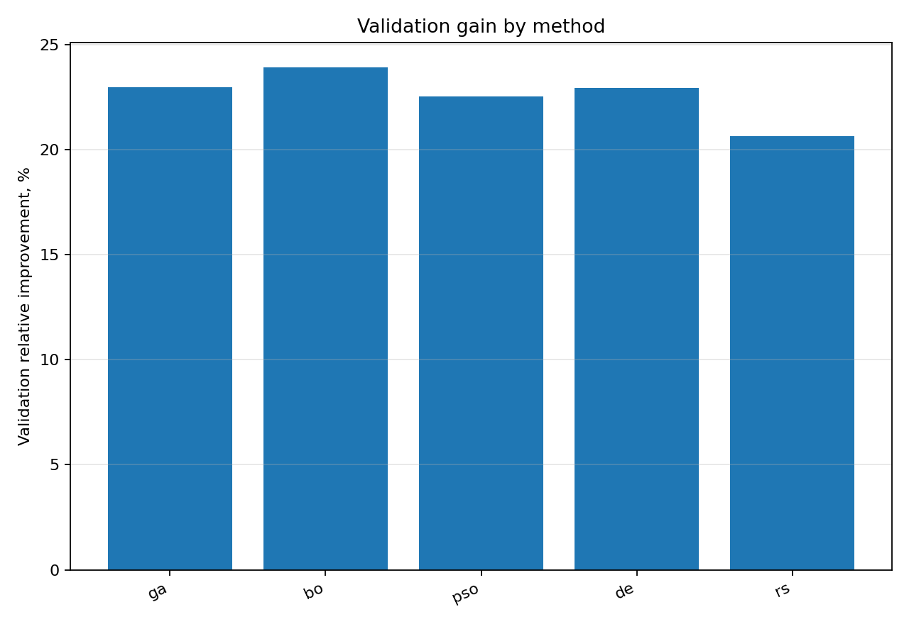

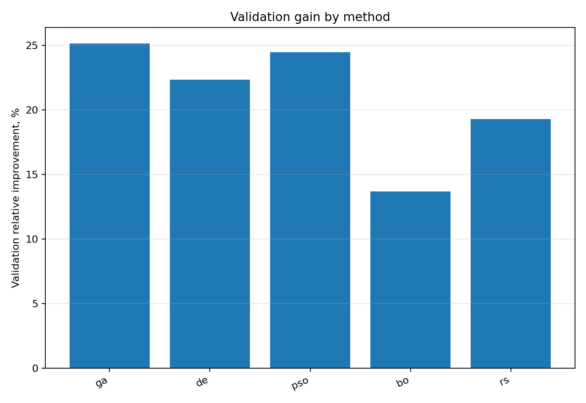

На рисунке 4.2 показан компромисс между относительным выигрышем и временем оптимизации. Он важен для практического применения, поскольку максимальное улучшение валидационной метрики не всегда соответствует минимальной стоимости поиска параметров.

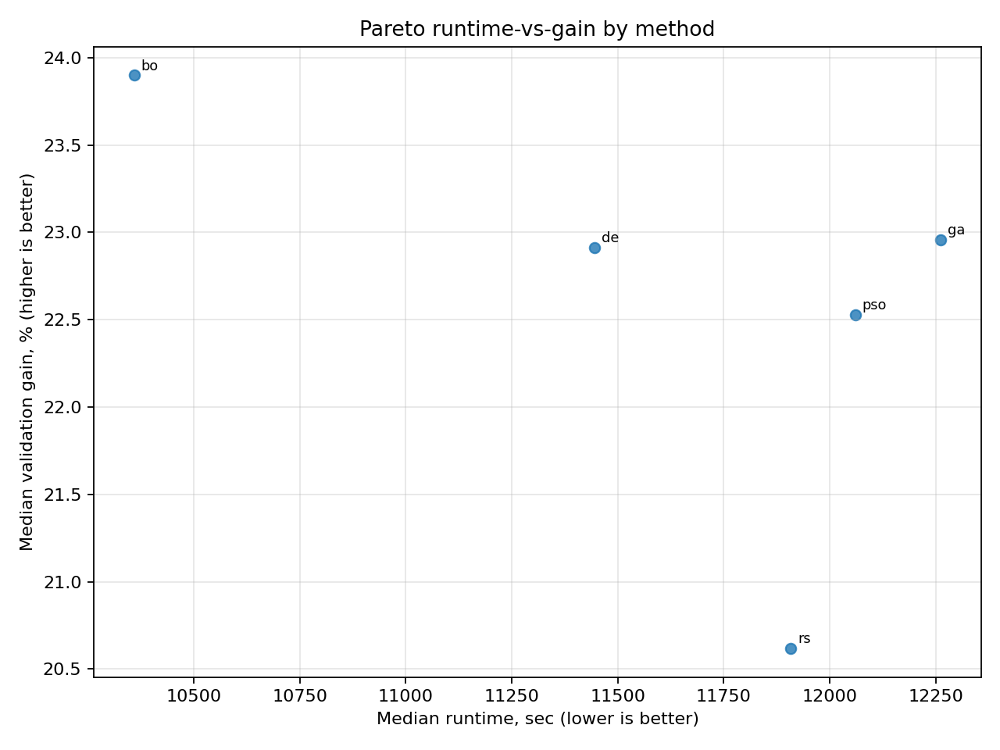

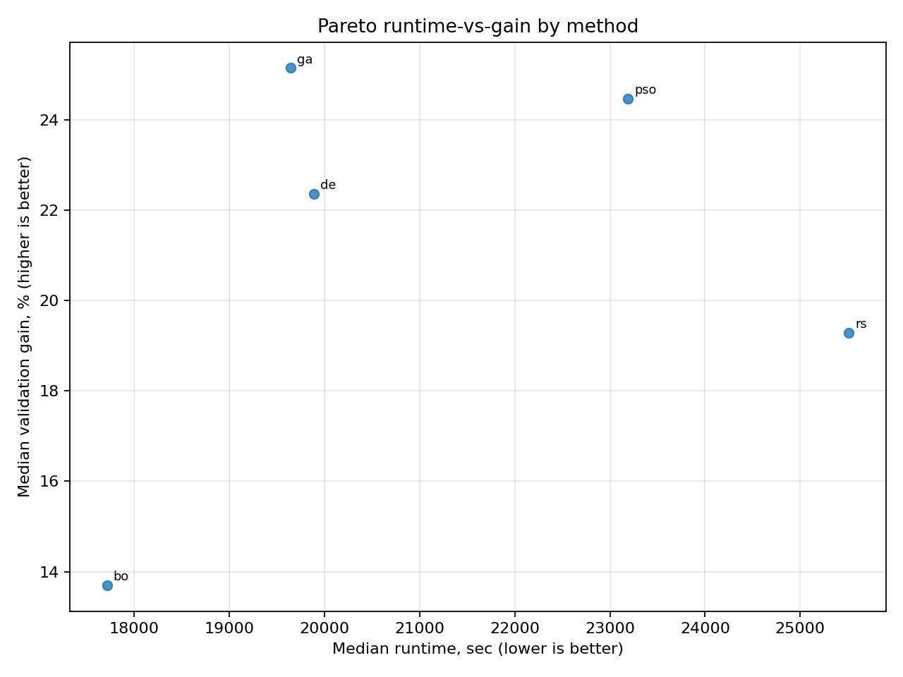

На рисунке 4.3 представлена динамика сходимости трех лучших методов. По этому графику можно оценить, насколько быстро метод приближается к лучшей найденной конфигурации и сохраняется ли улучшение в ходе дальнейших вычислений.

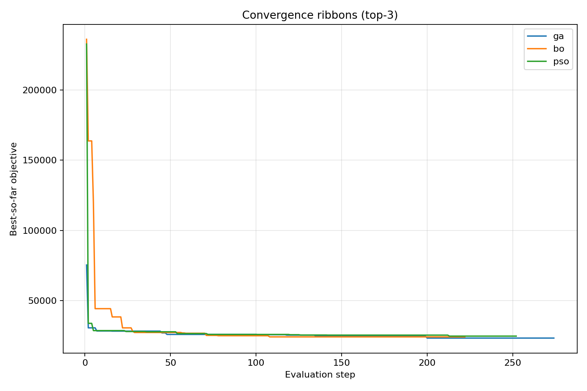

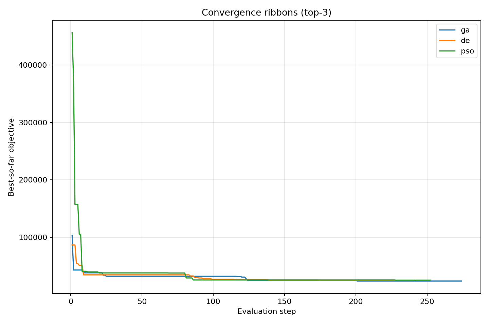

## 4.4. Сравнение методов по качеству и стоимости

При выборе метода важно учитывать не только относительный выигрыш валидационной метрики, но и стоимость оптимизации. BO был сильным при широких границах поиска, однако после уточнения области его преимущество уменьшилось. GA оказался наиболее убедительным по итоговому качеству: на этапе широкого поиска он имел лучшее итоговое значение целевой функции, а при уточненных границах дал максимальное снижение валидационной метрики (-25,14%) и времени (-21,04%). PSO особенно интересен как профиль минимизации числа кривых: при уточненных границах он сократил их на 62,42%.

DE дал ровный компромисс без провалов: валидационная метрика снижалась на 22,91% и 22,35%, время – на 18,90% и 17,92%, число кривых – на 49,25% и 51,69%. RS оказался самым простым методом, но также улучшил эталон во всех ключевых метриках. Его роль практична: он может использоваться как быстрый ориентир или как нижняя граница эффективности автоматического подбора.

Практическая интерпретация результатов следующая. Если требуется надежный профиль для исследованного класса 20-значных делителей, предпочтительны GA, PSO и DE: GA – по качеству и времени, PSO – по числу кривых, DE – как сбалансированный вариант. BO полезен как метод исследования широких областей, но после сужения окна требует дополнительного контроля и настройки бюджета.

## 4.5. Ограничения экспериментов

Основное ограничение текущей версии результатов состоит в том, что итоговый экспериментальный вывод относится к 20-значным делителям. Следовательно, вывод о практической эффективности является надежным для исследованного класса, но не должен без проверки переноситься на более крупные делители.

Второе ограничение связано с типом чисел. Использовались полупростые числа $N = pq$ с контролируемым размером p и q. Для специальных классов, например чисел Мерсенна, Ферма, чисел вида s^n +/- 1 и кофакторов из реальных NFS-задач, требуется отдельная проверка. Третье ограничение – стохастический характер ECM и оптимизаторов. Результаты следует подтверждать несколькими seed и независимыми control-наборами.

Наконец, найденные параметры не являются доказательством глобальной оптимальности. Они являются эмпирически хорошими конфигурациями для заданного pipeline, версии GMP-ECM, вычислительной среды и метрики.

## 4.6. Практические рекомендации

Полученные результаты показывают, что таблицы GMP-ECM целесообразно использовать как надежный стартовый эталон, но не как окончательный ответ для всех вычислительных условий. При наличии большого количества однотипных чисел локальная оптимизация параметров $B_1$ и $B_2$ под конкретный размер делителя, версию GMP-ECM и вычислительную платформу способна дать заметное снижение времени и числа кривых.

Выбор параметров следует выполнять в два этапа. Сначала необходимо использовать достаточно широкую область поиска, чтобы определить перспективный диапазон значений $B_1$ и $B_2$. После этого область следует уточнять, в том числе за счет более строгого ограничения отношения $B_2/B_1$, поскольку именно этот этап позволяет получить более практически полезные конфигурации и уменьшить риск выбора чрезмерно растянутой второй стадии.

Найденные параметры не следует принимать только по обучающей оценке. Обязательной частью процедуры должна быть независимая проверка на контрольной выборке, поскольку задача является стохастической, а отдельная конфигурация может оказаться переобученной под конкретные числа и seed. Для воспроизводимости необходимо сохранять версию GMP-ECM, seed, датасеты, JSON-результаты, сведения о вычислительной среде и идентификаторы задач в системе управления расчетами.

Если вычислительный бюджет ограничен, в качестве первичного ориентира можно использовать RS или укороченные конфигурации GA, PSO и DE. Для итогового выбора в исследованном классе задач наиболее показательными являются GA, PSO и DE: GA обеспечивает лучший баланс качества и времени, PSO минимизирует число кривых, а DE дает устойчивый компромисс между всеми основными метриками.

## 4.7. Выводы по главе 4

Эксперименты подтверждают практическую состоятельность автоматического подбора параметров ECM. Для 20-значных делителей все рассмотренные методы улучшили справочные параметры GMP-ECM по валидационной метрике и среднему времени. Этап с широкими границами поиска показал область эффективных параметров с улучшением валидационной метрики на 20,62-23,90%, а уточнение границ позволило получить максимум 25,14% по валидационной метрике, 21,04% по времени и 62,42% по числу кривых.

Наиболее сильными итоговыми кандидатами являются GA, PSO и DE. GA дал лучший результат по валидационной метрике и времени, PSO – наибольшее сокращение числа кривых, DE – наиболее ровный компромисс между метриками. Для расширения выводов требуется провести аналогичные эксперименты для 25-, 30- и более крупных делителей.

# ЗАКЛЮЧЕНИЕ

В работе рассмотрена задача автоматизации выбора параметров метода факторизации на эллиптических кривых. Проведенный обзор показал, что ECM остается важным специализированным методом поиска малых и средних делителей, а параметры B1 и B2 существенно влияют на баланс между вероятностью успеха и стоимостью одной кривой.

В ходе работы выполнены поставленные задачи: проведены аналитический обзор и теоретический анализ ECM, формализован подбор B1/B2 как задача стохастической оптимизации «черного ящика» с ограничениями, обоснован и реализован набор эвристических методов (случайный поиск, дифференциальная эволюция, генетический алгоритм, роевой алгоритм, байесовская оптимизация), а также сформулированы практические рекомендации по применению автоматического подбора параметров ECM. Таким образом, цель работы достигнута.

Разработана программная система на Python, обеспечивающая генерацию обучающей и контрольной выборок, запуск GMP-ECM, расчет составной целевой метрики, запуск оптимизаторов, независимую валидацию, автоматизированные эксперименты по планам в формате JSON и анализ результатов. Система сохраняет артефакты в форматах JSON, CSV, PNG и Markdown, что обеспечивает воспроизводимость расчетов.

Экспериментальная проверка на составных числах с 20-значным простым делителем показала, что автоматический подбор параметров способен улучшить справочные параметры GMP-ECM. При широких границах поиска все методы снизили значение валидационной метрики на 20,62-23,90%, среднее время – на 18,36-19,53%, среднее число кривых – на 35,37-52,50%. При уточненных границах снижение валидационной метрики составило 13,70-25,14%, времени – 14,30-21,04%, числа кривых – 9,71-62,42%. Лучший итоговый результат по валидационной метрике и времени показал GA, а наибольшее сокращение числа кривых – PSO.

Основной практический результат работы состоит в том, что выбор параметров ECM можно рассматривать как воспроизводимую задачу автоматической конфигурации алгоритма. Это позволяет не заменять таблицы GMP-ECM, а дополнять их локальной настройкой под конкретную платформу, класс чисел и вычислительный бюджет.

Ограничения работы связаны с тем, что итоговые результаты относятся к 20-значным делителям и конкретной вычислительной среде. Дальнейшая работа должна включать эксперименты для 25-, 30-, 35-значных и более крупных делителей, проверку на специальных классах чисел, оценку прироста эффективности на один процессорный час, адаптивную остановку оптимизации и исследование переносимости найденных параметров между платформами.

Результаты работы были получены с использованием вычислительных ресурсов суперкомпьютерного центра Санкт-Петербургского политехнического университета Петра Великого [4].

## Список сокращений и условных обозначений

- **BO** – Bayesian Optimization, байесовская оптимизация.
- **DE** – Differential Evolution, дифференциальная эволюция.
- **ECM** – Elliptic Curve Method, метод факторизации на эллиптических кривых.
- **GA** – Genetic Algorithm, генетический алгоритм.
- **GNFS** – General Number Field Sieve, общее решето числового поля.
- **HPC** – High Performance Computing, высокопроизводительные вычисления.
- **PSO** – Particle Swarm Optimization, роевой алгоритм.
- **QS** – Quadratic Sieve, квадратичное решето.
- **RS** – Random Search, случайный поиск.
- **SLURM** – система управления заданиями в вычислительном кластере.

# Список использованных источников

1. Lenstra Jr. H. W. Factoring integers with elliptic curves // Annals of Mathematics. – 1987. – Vol. 126, No. 3. – P. 649–673. – DOI: 10.2307/1971363.
2. Boudot F., Gaudry P., Guillevic A., Heninger N., Thomé E., Zimmermann P. The State of the Art in Integer Factoring and Breaking Public-Key Cryptography // IEEE Security and Privacy Magazine. – 2022. – Vol. 20, No. 2. – P. 80–86. – DOI: 10.1109/MSEC.2022.3141918.
3. Bos J. W., Kleinjung T. ECM at Work // Advances in Cryptology – ASIACRYPT 2012. – Berlin, Heidelberg: Springer, 2012. – P. 467–484. – DOI: 10.1007/978-3-642-34961-4_29.
4. Суперкомпьютерный центр Санкт-Петербургского политехнического университета Петра Великого [Электронный ресурс]. – URL: https://www.spbstu.ru (дата обращения: 19.05.2026).
5. Kleinjung T., Bos J. W., Lenstra A. K., Osvik D. A., Aoki K., Contini S., Franke J., Thomé E., Jermini P., Thiemard M., Leyland P., Montgomery P. L., Timofeev A., Stockinger H. A heterogeneous computing environment to solve the 768-bit RSA challenge // Designs, Codes and Cryptography. – 2010. – DOI: 10.1007/s10623-010-9455-7.
6. Pollard J. M. Theorems on factorization and primality testing // Mathematical Proceedings of the Cambridge Philosophical Society. – 1974. – Vol. 76, No. 3. – P. 521–528. – DOI: 10.1017/S0305004100049252.
7. Pollard J. M. A Monte Carlo method for factorization // BIT Numerical Mathematics. – 1975. – Vol. 15, No. 3. – P. 331–334. – DOI: 10.1007/BF01933667.
8. Pomerance C. Smooth numbers and the quadratic sieve // Surveys in Algorithmic Number Theory / ed. by J. P. Buhler, P. Stevenhagen. – Cambridge University Press, 2008. – P. 69–81. – (MSRI Publications; Vol. 44).
9. Buhler J. P., Lenstra Jr. H. W., Pomerance C. Factoring Integers with the Number Field Sieve // The Development of the Number Field Sieve / Ed. by A. K. Lenstra, H. W. Lenstra Jr. – Berlin, Heidelberg: Springer, 1993. – P. 50–94. – DOI: 10.1007/3-540-57055-4_2.
10. Zimmermann P. GMP-ECM: Elliptic Curve Method for Integer Factorization [Электронный ресурс]. – URL: https://gitlab.inria.fr/zimmerma/ecm (дата обращения: 19.05.2026).
11. Zimmermann P., Dodson B. 20 Years of ECM // Algorithmic Number Theory – ANTS VII. – Berlin, Heidelberg: Springer, 2006. – P. 525–542. – (LNCS 4076). – DOI: 10.1007/11792086_37.
12. Brent R. P. Some Integer Factorization Algorithms Using Elliptic Curves // Australian Computer Science Communications. – 1986. – Vol. 8. – P. 149–163.
13. Montgomery P. L. Speeding the Pollard and Elliptic Curve Methods of Factorization // Mathematics of Computation. – 1987. – Vol. 48, No. 177. – P. 243–264. – DOI: 10.1090/S0025-5718-1987-0866113-7.
14. Silverman R. D., Wagstaff Jr. S. S. A Practical Analysis of the Elliptic Curve Factoring Algorithm // Mathematics of Computation. – 1993. – Vol. 61, No. 203. – P. 445–462. – DOI: 10.1090/S0025-5718-1993-1122078-7.
15. Zimmermann P. GMP-ECM release 7.0.6 [Электронный ресурс]. – URL: https://gitlab.inria.fr/zimmerma/ecm/-/releases/git-7.0.6 (дата обращения: 19.05.2026).
16. Wloka J., Richter-Brockmann J., Güneysu T., Stahlke C., Priplata C., Kleinjung T. A High-Performance and Scalable Implementation of the Elliptic Curve Method on Graphics Processing Units // Topics in Cryptology – CT-RSA 2021. – Cham: Springer, 2021. – P. 306–326. – DOI: 10.1007/978-3-030-65411-5_13.
17. Bergstra J., Bengio Y. Random Search for Hyper-Parameter Optimization // Journal of Machine Learning Research. – 2012. – Vol. 13. – P. 281–305.
18. Storn R., Price K. Differential Evolution - A Simple and Efficient Heuristic for Global Optimization over Continuous Spaces // Journal of Global Optimization. – 1997. – Vol. 11. – P. 341–359.
19. Price K. V. The Differential Evolution Algorithm // Differential Evolution: A Practical Approach to Global Optimization. – Springer, 2005. – Chapter 2. – P. 37–134.
20. Eberhart R. C., Kennedy J. Particle Swarm Optimization // Proceedings of IEEE International Conference on Neural Networks. – 1995. – Vol. 4. – P. 1942–1948.
21. Jones D. R., Schonlau M., Welch W. J. Efficient Global Optimization of Expensive Black-Box Functions // Journal of Global Optimization. – 1998. – Vol. 13. – P. 455–492.
22. Snoek J., Larochelle H., Adams R. P. Practical Bayesian Optimization of Machine Learning Algorithms // Advances in Neural Information Processing Systems 25 (NIPS 2012). – 2012. – P. 2951–2959.
23. Hutter F., Hoos H. H., Leyton-Brown K., Stützle T. ParamILS: An Automatic Algorithm Configuration Framework // Journal of Artificial Intelligence Research. – 2009. – Vol. 36. – P. 267–306.
24. López-Ibáñez M., Dubois-Lacoste J., Pérez Cáceres L., Birattari M., Stützle T. The irace package: Iterated racing for automatic algorithm configuration // Operations Research Perspectives. – 2016. – Vol. 3. – P. 43–58.
25. Плеханов Е. С. ECM Evolutionary Optimization: программный комплекс для автоматизированного подбора параметров метода эллиптических кривых [Электронный ресурс]. – URL: https://github.com/EgorPlehanov/ecm-evolutionary-optimization (дата обращения: 19.05.2026).

# Приложения

## Приложение А. Пример JSON-плана `run-plan` для эксперимента на 20-значных делителях

Ниже приведен план `data/plans/time_balanced_3h_all_methods_20d.json`, использованный для получения основных результатов главы 4.

```json
{
  "format": "ecm_run_plan_v1",
  "description": "Прогон по всем методам (de/rs/pso/bo/ga) для target-digits=20 с широкими границами поиска.",
  "params": {
    "seed": 1001,
    "search": {
      "b1-min": 100,
      "b1-max": 100000,
      "b2-min": 10000,
      "b2-max": 5000000,
      "ratio-max": 5000
    },
    "method_list": [
      "de",
      "rs",
      "pso",
      "bo",
      "ga"
    ],
    "method_opt": {
      "de": {
        "de-popsize": 10,
        "de-maxiter": 11
      },
      "rs": {
        "rs-budget": 210
      },
      "pso": {
        "pso-swarm-size": 18,
        "pso-iterations": 13
      },
      "bo": {
        "bo-initial-samples": 24,
        "bo-iterations": 198,
        "bo-candidate-pool": 2500
      },
      "ga": {
        "ga-population-size": 22,
        "ga-generations": 12,
        "ga-mutation-prob": 0.14
      }
    },
    "shared_opt_args": {
      "max-curves-per-n": 260,
      "repeats-per-n": 8
    },
    "shared_val_args": {
      "max-curves-per-n": 600,
      "repeats-per-n": 80
    },
    "generate_args": {
      "target-digits": 20,
      "cofactor-digits": 30,
      "train-count": 80,
      "control-count": 80
    },
    "analyze_group_by": [
      "divisor_size",
      "method"
    ]
  },
  "operations": [
    {
      "type": "generate",
      "label": "dataset_20_single",
      "args": {
        "$spread_ref": "params.generate_args",
        "seed": "$ref:params.seed"
      }
    },
    {
      "repeat": {
        "as": "method_iter",
        "values": {
          "method": "$ref:params.method_list"
        }
      },
      "operations": [
        {
          "type": "optimize",
          "label": "opt_{{method_iter.method}}_single",
          "args": {
            "dataset": "$ref:dataset_20_single.dataset_dir",
            "method": "$ref:method_iter.method",
            "seed": "$ref:params.seed",
            "$spread_ref": [
              "params.shared_opt_args",
              "params.method_opt.{{method_iter.method}}",
              "params.search"
            ]
          }
        },
        {
          "type": "validate",
          "label": "val_{{method_iter.method}}_single",
          "args": {
            "dataset": "$ref:dataset_20_single.dataset_dir",
            "opt-result-file": "$ref:opt_{{method_iter.method}}_single.result_file",
            "seed": "$ref:params.seed",
            "$spread_ref": "params.shared_val_args"
          }
        }
      ]
    },
    {
      "type": "analyze",
      "label": "analysis_single_dataset_all_methods",
      "args": {
        "dataset": "$ref:dataset_20_single.dataset_dir",
        "group-by": "$ref:params.analyze_group_by"
      }
    }
  ]
}
```

