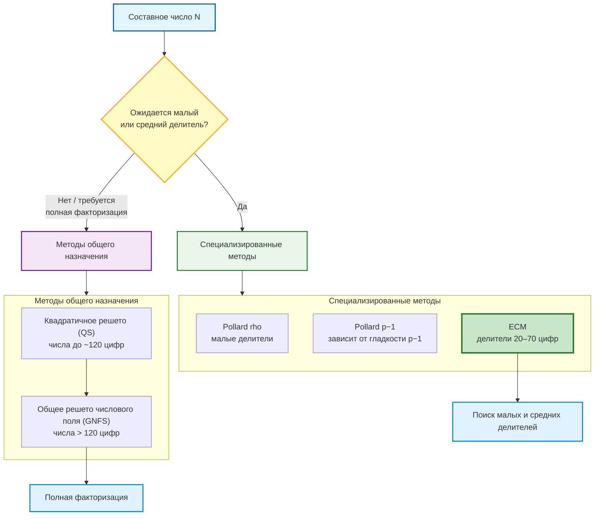
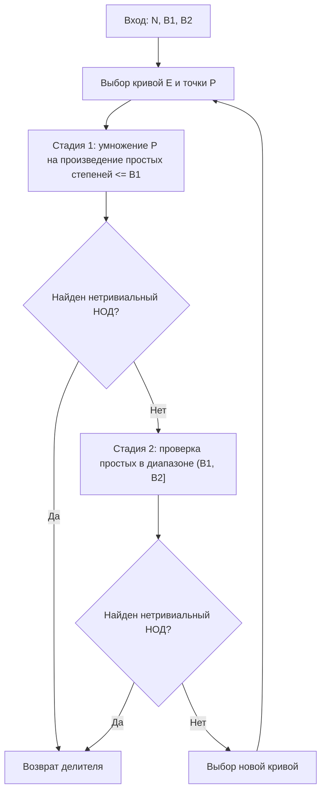
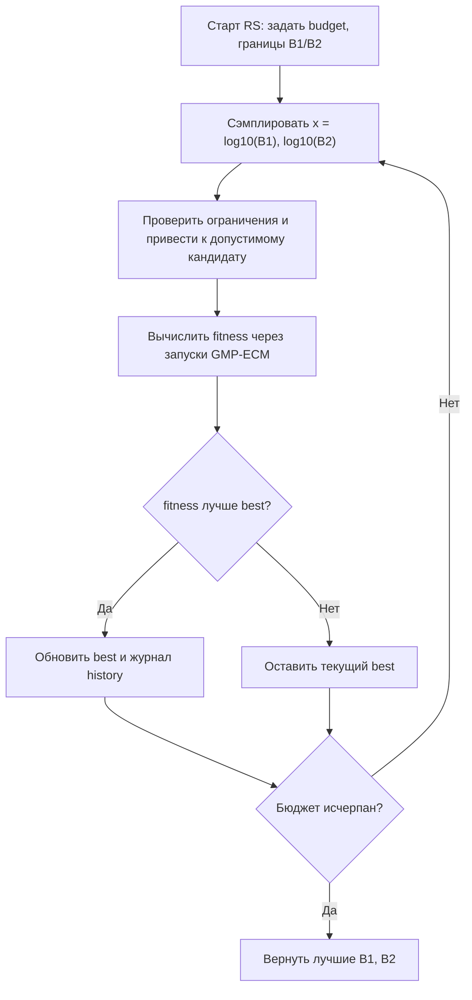
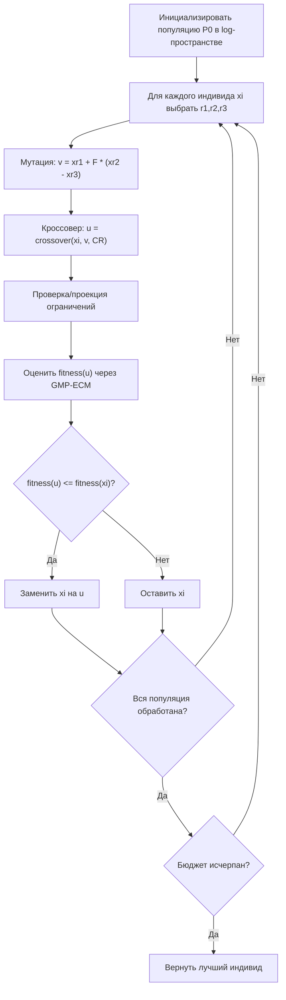
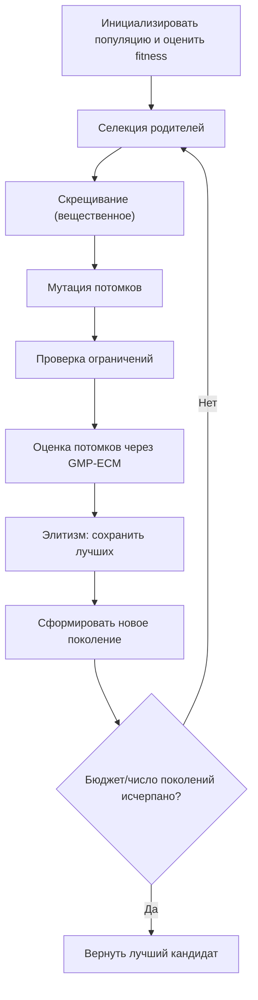
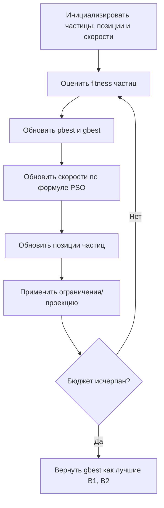
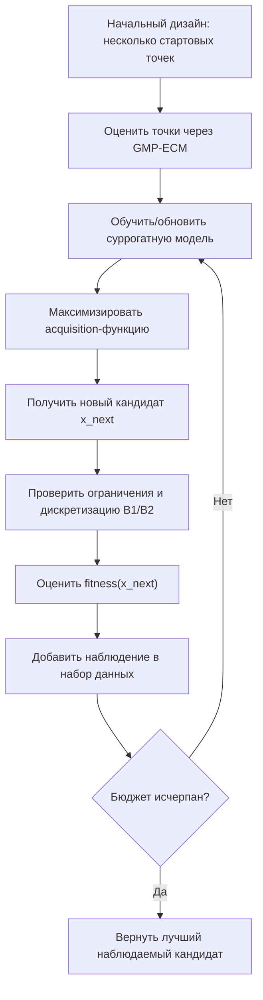
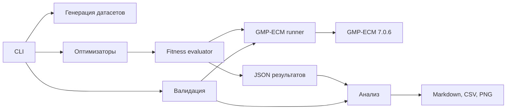

# Выпускная квалификационная работа

Тема: **Автоматизация подбора параметров алгоритма факторизации больших чисел с применением эллиптических кривых на основе эвристических методов оптимизации**

## Реферат

На 30 с., 4 рис., 4 табл., 2 прил.

Ключевые слова: факторизация целых чисел, ECM, GMP-ECM, параметры B1 и B2, эвристическая оптимизация, оптимизация «черного ящика», дифференциальная эволюция, генетический алгоритм, роевой алгоритм, байесовская оптимизация.

Тема выпускной квалификационной работы: «Автоматизация подбора параметров алгоритма факторизации больших чисел с применением эллиптических кривых на основе эвристических методов оптимизации».

Данная работа посвящена автоматизации выбора параметров B1 и B2 метода факторизации на эллиптических кривых. Объект исследования – алгоритм ECM и его реализация в GMP-ECM; цель – разработать систему подбора параметров ECM с применением эвристических методов оптимизации и оценить выигрыш относительно справочных значений GMP-ECM.

В ходе исследования выполнены анализ алгоритмов факторизации, формализация выбора B1/B2 как стохастической оптимизации «черного ящика», разработка программного конвейера на Python и вычислительные эксперименты. Использовались случайный поиск, дифференциальная эволюция, генетический алгоритм, роевой алгоритм и байесовская оптимизация.

В результате разработана система генерации датасетов, запуска GMP-ECM, оптимизации, валидации и анализа. Для чисел с 20-значным простым делителем получено снижение проверочной метрики на 20,67-24,38%, времени – на 15,03-19,39%, числа кривых – на 50,44-63,33%. Результаты применимы в вычислительной теории чисел, криптоанализе и предварительной факторизации. Использованы Python 3, NumPy, SciPy, matplotlib, GMP-ECM, Git и ресурсы СКЦ СПбПУ.

## Abstract

On 30 pages, 4 figures, 4 tables, 2 appendices.

Keywords: integer factorization, ECM, GMP-ECM, B1 and B2 parameters, heuristic optimization, differential evolution, genetic algorithm, particle swarm optimization, Bayesian optimization.

The subject of the graduate qualification work is “Automation of Parameter Selection for the Elliptic Curve Factorization Algorithm Using Heuristic Optimization Methods”.

The work is devoted to automating the selection of B1 and B2 parameters for the elliptic curve factorization method. The object is ECM and its implementation in GMP-ECM; the goal is to develop a system for ECM parameter tuning using heuristic optimization methods and evaluate its advantage over GMP-ECM reference parameters.

The research included analysis of factorization algorithms, formulation of B1/B2 tuning as black-box optimization, development of a Python pipeline, and computational experiments. The study used random search, differential evolution, genetic algorithm, particle swarm optimization, and Bayesian optimization.

As a result, a system for dataset generation, GMP-ECM execution, optimization, validation, and analysis was developed. For numbers with 20-digit prime factors, validation score was reduced by 20,67-24,38%, average time by 15,03-19,39%, and the number of curves by 50,44-63,33%. The results are applicable in computational number theory, cryptanalysis, and preliminary factorization. The work used Python 3, NumPy, SciPy, matplotlib, GMP-ECM, Git, and SPbPU supercomputing resources.

## Содержание

Введение
1. Аналитический обзор методов факторизации и выбора параметров ECM
2. Математическая постановка задачи и методы оптимизации
3. Разработка программной системы автоматизированного выбора параметров ECM
4. Вычислительные эксперименты и анализ результатов
Заключение
Список использованных источников
Приложения

# ВВЕДЕНИЕ

Факторизация больших целых чисел занимает особое место в вычислительной теории чисел и прикладной криптографии. С математической точки зрения задача состоит в разложении составного числа N на нетривиальные множители. С прикладной точки зрения она тесно связана со стойкостью RSA и других схем, безопасность которых опирается на вычислительную трудность восстановления простых множителей по их произведению. При этом практическая факторизация редко сводится к одному универсальному алгоритму: в реальных вычислительных сценариях применяются цепочки методов, где специализированные алгоритмы ищут сравнительно малые делители, а методы общего назначения используются для оставшегося кофактора.

Метод эллиптических кривых Ленстры (ECM, Elliptic Curve Method) был предложен как вероятностный алгоритм поиска нетривиального делителя составного числа [1]. В отличие от методов общего назначения, сложность ECM зависит главным образом от размера найденного простого делителя, а не от размера всего числа N. Благодаря этому ECM сохраняет важную роль даже на фоне развития GNFS: он используется для поиска малых и средних делителей, предварительной факторизации, кофакторизации в задачах решета числового поля и обработки больших наборов чисел [2, 3].

Практическая эффективность ECM существенно зависит от выбора параметров B1 и B2. Эти параметры задают границы первой и второй стадий алгоритма. Увеличение B1 и B2 повышает вероятность успеха одной кривой, однако одновременно увеличивает стоимость обработки кривой. При фиксированном вычислительном бюджете это приводит к нетривиальному компромиссу: максимальная вероятность успеха одной попытки не обязательно означает минимальное ожидаемое время нахождения делителя. Поэтому выбор B1 и B2 является не только теоретическим, но и инженерным вопросом.

В библиотеке GMP-ECM используются справочные таблицы параметров, построенные на основании накопленного опыта и анализа вероятностей гладкости. Эти таблицы являются сильным эталоном и подходят для широкого класса задач. Однако они не обязаны быть оптимальными для конкретной вычислительной платформы, версии GMP-ECM, типа входных чисел, бюджета кривых и выбранной метрики качества. Возникает исследовательская задача: можно ли автоматически подбирать параметры B1 и B2 для заданного класса чисел так, чтобы получить выигрыш относительно справочных значений.

Актуальность работы определяется тремя обстоятельствами. Во-первых, ECM остается практически значимым компонентом современных схем факторизации, в том числе в криптоаналитических расчетах и кофакторизации. Во-вторых, стоимость массовых ECM-запусков высока, поэтому даже умеренное снижение среднего времени или числа кривых имеет прикладной эффект. В-третьих, автоматическая настройка алгоритмов и беспроизводная (derivative-free) оптимизация активно применяются для дорогих задач «черного ящика» (black-box), но задача настройки B1/B2 в ECM обычно рассматривается через аналитические рекомендации и таблицы, а не как воспроизводимый экспериментальный конвейер (pipeline).

Объектом исследования является алгоритм факторизации целых чисел методом эллиптических кривых и его реализация в GMP-ECM. Предметом исследования является автоматизированный выбор параметров B1 и B2 с применением эвристических методов оптимизации.

Цель работы – разработать и исследовать программную систему, которая автоматически подбирает параметры ECM с использованием эвристических методов оптимизации и снижает эмпирическую оценку ожидаемой стоимости нахождения делителя по сравнению со справочными параметрами GMP-ECM.

Для достижения цели поставлены следующие задачи:

1. Провести аналитический обзор алгоритмов факторизации и определить место ECM среди специализированных и универсальных методов.
2. Рассмотреть теоретические основы ECM и влияние параметров B1 и B2 на вероятность успеха и стоимость вычислений.
3. Проанализировать существующие практические подходы к выбору параметров ECM.
4. Формализовать подбор B1/B2 как задачу стохастической black-box оптимизации с ограничениями.
5. Обосновать набор эвристических методов оптимизации для рассматриваемой задачи.
6. Разработать программную систему генерации датасетов, запуска GMP-ECM, оптимизации, валидации и анализа.
7. Провести вычислительные эксперименты и сравнить найденные параметры со справочными параметрами GMP-ECM.
8. Проанализировать устойчивость результатов и ограничения применимости.
9. Сформулировать практические рекомендации по использованию автоматического подбора параметров ECM.

Научная новизна работы заключается в формализации выбора B1/B2 как эмпирической стохастической black-box оптимизации, в сравнении нескольких эвристических методов в едином воспроизводимом pipeline и в экспериментальной оценке найденных параметров на независимой контрольной выборке. Практическая значимость состоит в разработке программного инструмента, который может быть использован для локальной настройки ECM под конкретную платформу и класс чисел.

Результаты вычислительных экспериментов были получены с использованием вычислительных ресурсов суперкомпьютерного центра Санкт-Петербургского политехнического университета Петра Великого [25].

# ГЛАВА 1. Аналитический обзор методов факторизации и выбора параметров ECM

## 1.1. Задача факторизации и криптографический контекст

В простейшем случае задача факторизации формулируется как нахождение простых p и q по их произведению $N = pq$. В более общем случае требуется разложить составное число N на простые множители произвольной кратности. Для RSA выбираются большие простые p и q, а открытый модуль N публикуется. Если атакующий сможет эффективно найти p и q, он сможет восстановить закрытые параметры схемы. Поэтому практические рекорды факторизации и оценки стоимости GNFS имеют прямое значение для выбора размеров ключей [3, 4].

Следует различать полную факторизацию числа и поиск любого нетривиального делителя. ECM обычно не конкурирует напрямую с GNFS при факторизации большого RSA-модуля целиком. Его сильная сторона – нахождение сравнительно небольшого простого делителя p в большом N. Такая постановка возникает при предварительной обработке чисел, при факторизации кофакторов, при проверке специальных последовательностей и в распределенных вычислительных проектах. Если число содержит 20-, 30- или 40-значный делитель, ECM может найти его значительно эффективнее, чем методы общего назначения, ориентированные на размер всего N.

Классы алгоритмов факторизации приведены в таблице 1.1.

Таблица 1.1
Классы алгоритмов факторизации целых чисел

| Класс | Примеры | Основная зависимость сложности | Типичное применение |
|---|---|---|---|
| Специализированные методы | Pollard rho, Pollard p-1, ECM | От свойств или размера делителя | Поиск малых и средних делителей |
| Методы общего назначения | QS (Quadratic Sieve, квадратичное решето), GNFS (General Number Field Sieve, общее решето числового поля) | От размера N | Полная факторизация больших общих чисел |
| Вспомогательные методы | ECM в кофакторизации | От размера остаточных делителей | Постобработка и предварительная обработка |

Как видно из таблицы 1.1, в контексте данной работы ECM относится к специализированным методам: его целесообразно применять для поиска малых и средних делителей, тогда как методы общего назначения рассматриваются как следующий этап при необходимости полной факторизации числа.

## 1.2. Краткий обзор алгоритмов факторизации

Метод p-1 Полларда использует ситуацию, когда для некоторого простого делителя p числа N значение p - 1 является гладким, то есть раскладывается на простые множители, не превосходящие выбранной границы [5]. Тогда вычисление больших степеней по модулю N и последующий НОД могут привести к нахождению p. Метод прост и эффективен при благоприятной структуре p - 1, но его успех сильно зависит от арифметических свойств конкретного делителя.

Метод rho Полларда является вероятностным алгоритмом, основанным на итерации псевдослучайного отображения и обнаружении циклов [6]. Его ожидаемая стоимость для нахождения делителя p имеет порядок $O(\sqrt{p})$, поэтому он полезен для малых делителей, но быстро становится дорогим при росте размера p.

Квадратичное решето строит сравнение квадратов по модулю N и использует гладкость значений полиномов [7]. Этот метод исторически был одним из основных для чисел среднего размера. Для более крупных общих чисел доминирует общее решето числового поля, эвристическая сложность которого существенно лучше, чем у QS [8]. Именно GNFS лежит в основе современных рекордов факторизации RSA-модулей [3, 4].

ECM занимает промежуточное место. Он сохраняет идею гладкости, но вместо фиксированной группы по модулю p использует группы случайных эллиптических кривых над конечным полем. Это делает вероятность успеха менее зависимой от структуры p - 1 и позволяет многократно пробовать разные группы, выбирая новые кривые [1, 2].

Место ECM среди методов факторизации показано на рисунке 1.1.



Рис. 1.1 Место ECM среди алгоритмов факторизации

На рисунке 1.1 показана логика выбора класса методов в зависимости от ожидаемого размера делителя. Если ожидается малый или средний делитель, в первую очередь применяются специализированные алгоритмы (Pollard rho, Pollard p−1, ECM), причем ECM в этой ветви рассматривается как основной инструмент для поиска делителей средней длины; диапазон «20–70 цифр» указан как практический ориентир по обзорам и табличным рекомендациям ECM/GMP-ECM (в частности, 40–65 цифр в параметрах GMP-ECM и рекордные множители порядка 66 цифр) [2, 12]. Если же требуется полная факторизация без выраженной гипотезы о малом делителе, применяются методы общего назначения: квадратичное решето (QS) и, для более крупных чисел, общее решето числового поля (GNFS); граница «около 120 цифр» также носит эвристический характер и следует из обзорных оценок, где QS рассматривается как метод выбора примерно до 120 цифр, а NFS/GNFS – для больших чисел [7, 8].

## 1.3. Теоретические основы ECM

Идея ECM состоит в том, чтобы заменить мультипликативную группу по модулю p, используемую в методе p-1, группой точек случайной эллиптической кривой над полем F_p [1]. Пусть N – составное число, p – неизвестный простой делитель N. Алгоритм выбирает эллиптическую кривую и точку P, затем выполняет арифметику по модулю N. Если в процессе вычислений возникает невозможность инвертировать элемент по модулю N, НОД этого элемента с N может дать нетривиальный делитель.

Успех одной кривой связан с гладкостью порядка группы E(F_p). По теореме Хассе порядок группы близок к p + 1, но меняется при выборе кривой. Поэтому многократный перебор случайных кривых фактически дает многократные попытки получить группу, порядок которой достаточно гладок для выбранных границ. Это принципиально отличает ECM от p-1, где используется только структура p - 1.

В первой стадии ECM точка умножается на число, содержащее простые степени до границы B1. Если порядок группы является B1-гладким, стадия с высокой вероятностью приводит к успеху. Вторая стадия расширяет область успеха: допускается, что после первой стадии в порядке группы остается один дополнительный простой множитель, не превосходящий B2. Введение второй стадии было одним из ключевых практических усилений ECM [9].

В практических реализациях важную роль играет ускорение операций над точками. Форма Монтгомери позволяет выполнять вычисления через проективные координаты и уменьшать стоимость сложения и удвоения точек, что существенно для массовой обработки кривых [10].

Общая схема ECM показана на рисунке 1.2.


Рис. 1.2 Блок-схема ECM со стадиями 1 и 2

На рисунке 1.2 показан типовой цикл работы ECM: после задания параметров запуска выбирается случайная эллиптическая кривая и стартовая точка, затем последовательно выполняются первая и вторая стадии с проверкой НОД после каждой из них. Если на любой проверке получен нетривиальный НОД, алгоритм завершает работу с найденным делителем. Если обе стадии на текущей кривой не дали результата, выбирается новая кривая и цикл повторяется до получения делителя или исчерпания вычислительного бюджета. Такая структура отражает вероятностную природу ECM, где итоговая эффективность определяется не одной попыткой, а серией независимых запусков на разных кривых.

## 1.4. Параметры B1 и B2

Параметры B1 и B2 определяют главный инженерный компромисс ECM. При малых значениях B1 и B2 одна кривая обрабатывается быстро, но вероятность успеха невелика. При больших значениях вероятность успеха одной кривой выше, однако стоимость каждой попытки возрастает. Для фиксированного времени запуска оптимальная стратегия должна учитывать не только вероятность успеха, но и число кривых, которое можно обработать.

Практический анализ параметров ECM проводился через распределение гладких чисел и функцию Дикмана [11]. В GMP-ECM эта теория и накопленный практический опыт отражены в таблицах рекомендуемых значений B1, B2 и ожидаемого числа кривых [12]. Фрагмент такой таблицы, используемый в работе как эталон, приведен в таблице 1.2.

Таблица 1.2
Справочные параметры GMP-ECM

| Размер делителя, цифр | B1 | B2 | Ожидаемое число кривых |
|---:|---:|---:|---:|
| 20 | 11000 | 1900000 | 74 |
| 25 | 50000 | 13000000 | 214 |
| 30 | 250000 | 130000000 | 430 |
| 35 | 1000000 | 1000000000 | 904 |
| 40 | 3000000 | 5700000000 | 2350 |
| 45 | 11000000 | 35000000000 | 4480 |
| 50 | 43000000 | 240000000000 | 7553 |
| 55 | 110000000 | 780000000000 | 17769 |
| 60 | 260000000 | 3200000000000 | 42017 |
| 65 | 850000000 | 16000000000000 | 69408 |

Справочные параметры не следует трактовать как слабую точку сравнения. Напротив, это сильная инженерная рекомендация общего назначения. Однако локальная оптимизация может быть полезна, если заранее известны класс чисел, бюджет кривых, версия GMP-ECM и вычислительная среда. Именно эта гипотеза проверяется в настоящей работе.

## 1.5. Практические реализации ECM

Практическая эффективность ECM обеспечивается не только выбором B1/B2, но и множеством алгоритмических улучшений. Параметризация Суямы увеличивает вероятность благоприятной структуры порядка группы. Развитие второй стадии, continuation techniques, полиномиальные методы и оптимизация спаривания простых также существенно влияют на стоимость одной кривой [2].

В данной работе GMP-ECM используется как внешний исполнитель. Выбор именно этой реализации обусловлен несколькими причинами: GMP-ECM является де-факто стандартом практического ECM и аккумулирует многолетние алгоритмические улучшения (параметризация Суямы, оптимизации стадий, инженерные ускорения), поэтому сравнение с табличными параметрами выполняется в релевантной «промышленной» точке [2, 12]; использование зрелой внешней реализации снижает риск смещения результатов из-за ошибок собственной низкоуровневой реализации арифметики на кривых и позволяет интерпретировать выигрыш именно как эффект подбора B1/B2, а не эффект переписывания ядра ECM; CLI-интерфейс GMP-ECM обеспечивает воспроизводимые пакетные запуски, фиксируемые seed/ограничения и удобный сбор метрик времени и числа кривых в автоматизированном pipeline. Это позволяет сосредоточиться не на переписывании арифметики эллиптических кривых, а на задаче автоматического выбора параметров и воспроизводимого анализа результатов. В экспериментах использовалась версия GMP-ECM 7.0.6, tag git-7.0.6, выпущенная 4 июля 2024 года [13].

Отдельное направление связано с аппаратными и GPU-реализациями. Работы по ECM на GPU показывают, что массовая обработка кривых хорошо ложится на параллельные вычислительные архитектуры [14, 15]. Это подтверждает практическую ценность оптимизации ECM: выигрыш в стоимости одной кривой или в числе необходимых кривых масштабируется при больших вычислительных кампаниях.

## 1.6. Выводы по главе 1

ECM является хорошо изученным и практически значимым методом факторизации, особенно при поиске малых и средних делителей больших чисел. Его эффективность определяется вероятностной природой выбора кривых, гладкостью порядка группы и параметрами B1/B2. Существующие таблицы GMP-ECM являются надежным эталоном, но не исключают возможности локальной настройки под конкретный класс задач. Это обосновывает переход от ручного выбора параметров к автоматизированной оптимизации.

# ГЛАВА 2. Математическая постановка задачи и методы оптимизации

## 2.1. Формализация задачи

Пусть задан набор составных чисел $D = \{N_1, \ldots, N_L\}$. Для каждого N_j известен простой делитель целевого размера d, что необходимо для формирования датасета и последующей проверки результата. В реальном запуске оптимизатору известны только сами числа N_j и результаты работы GMP-ECM.

Управляемыми параметрами являются B1 и B2. Так как значения параметров меняются на порядки в зависимости от целевого размера делителя, оптимизация выполняется в логарифмическом пространстве:

$x = (\log_{10}(B_1), \log_{10}(B_2)).$

Допустимая область задается ограничениями:

$$
\begin{aligned}
B_{1,\min} &\le B_1 \le B_{1,\max},\\
B_{2,\min} &\le B_2 \le B_{2,\max},\\
B_1 &\le B_2,\\
\frac{B_2}{B_1} &\le R_{\max}.
\end{aligned}
$$

Внешняя функция оценки запускает GMP-ECM на наборе чисел и возвращает статистики успеха, времени и числа кривых. Идеальная целевая функция могла бы минимизировать оценку ожидаемого времени нахождения делителя:

$$
F(B_1, B_2) = \frac{1}{L} \sum_{j=1}^{L} \widehat{ET}(N_j, B_1, B_2).
$$

Здесь $\widehat{ET}(N_j, B_1, B_2)$ – эмпирическая оценка (по конечной выборке запусков) математического ожидания времени нахождения нетривиального делителя числа $N_j$ при выбранных границах $B_1, B_2$.

На практике используется композитная оценка (composite score), учитывающая среднюю долю успешных запусков, средние значения числа кривых и времени до успешной факторизации. В реализованной системе оценка (score) минимизируется:

$$
\begin{aligned}
\mathrm{score} ={}&\max(0,\, 0,90 - \mathrm{success\_rate}) \cdot 200000 \\
&+ \mathrm{mean\_time\_sec} \cdot 10000 \\
&+ \mathrm{mean\_curves} \cdot 50.
\end{aligned}
$$

Такая метрика задает приоритет: сначала не допустить слишком низкой доли успеха, затем минимизировать время и число кривых. Численные веса являются инженерной частью постановки и фиксируются для сопоставимости экспериментов.

## 2.2. Особенности целевой функции

Целевая функция не имеет аналитического выражения. Ее значение получается только через запуск внешней программы GMP-ECM. Кроме того, оценка является шумной: результат зависит от случайного выбора кривых, конкретного набора чисел, загрузки вычислительной среды, таймаутов и случайных seed. Один вызов функции дорогой, поскольку включает множество запусков ECM.

Эти свойства делают нецелесообразным применение классических градиентных методов. Градиент не задан, гладкость функции не гарантируется, а дискретизация B1 и B2 приводит к нерегулярной поверхности качества. Полный перебор также не подходит: пространство параметров велико, а оценка одной точки занимает значимое время. Поэтому задача естественно относится к классу дорогих стохастических black-box задач с ограничениями.

Для защиты от переобучения используется разделение на обучающую (train) и контрольную (control) выборки. Оптимизатор подбирает параметры на train-наборе, а итоговое сравнение с эталоном выполняется на независимой control-выборке. Такой подход соответствует общей логике автоматической конфигурации алгоритмов, где качество найденной конфигурации должно подтверждаться вне обучающего набора.

## 2.3. Выбор методов оптимизации

Для сопоставимого сравнения все методы применяются в одном и том же пространстве параметров $x=(\log_{10}B_1,\log_{10}B_2)$, используют единую внешнюю функцию оценки и одинаковый принцип budget-aware остановки (по числу оценок и/или по времени). Ниже каждый метод рассмотрен отдельно, с акцентом на алгоритмическую часть.

### 2.3.1. Случайный поиск

Случайный поиск (Random Search, RS) используется как базовый стохастический метод с минимальными предположениями о форме целевой функции [19]. На каждой итерации случайным образом выбирается (сэмплируется) кандидат в допустимой области, после чего выполняется внешняя оценка через GMP-ECM и обновляется лучшее значение (best-so-far).

Под равномерным случайным выбором (сэмплированием) понимается независимая генерация значений $\log_{10} B_1$ и $\log_{10} B_2$ из заданных интервалов:

$$
\log_{10} B_1 \sim U[B_1^{\min}, B_1^{\max}], \quad
\log_{10} B_2 \sim U[B_2^{\min}, B_2^{\max}]
$$

где $U[a,b]$ обозначает **равномерное распределение** на отрезке $[a,b]$ (все значения в интервале равновероятны). После генерации кандидат проверяется на выполнение ограничений $B_2 \geq B_1$ и $\frac{B_2}{B_1} \leq R_{\max}$. Если сгенерированный кандидат нарушает ограничения, он либо корректируется (приводится к ближайшей допустимой точке), либо отбрасывается с генерацией нового.

Алгоритмически RS в данной задаче важен по двум причинам: он задает честные опорные значения для дорогой black-box оптимизации; при малой размерности (две переменные) и сильном шуме измерений может быть конкурентоспособным с более сложными стратегиями.



Рис. 2.1 Блок-схема алгоритма случайного поиска (RS)

На рисунке 2.1 показан простой цикл RS: равномерная генерация кандидата в заданных границах, проверка и коррекция ограничений, дорогая внешняя оценка, условное обновление лучшего решения и переход к следующей итерации до исчерпания бюджета. Целевая функция при этом представляет собой эмпирическую оценку ожидаемого времени факторизации $\widehat{ET}(N_j, B_1, B_2)$, усреднённую по обучающей выборке.

### 2.3.2. Дифференциальная эволюция

Дифференциальная эволюция (Differential Evolution, DE) – популяционный эволюционный метод для непрерывной оптимизации [16, 17]. Ключевая идея – мутация через разности векторов популяции, что естественно масштабирует шаг поиска под текущую геометрию облака решений.

Для каждого индивида формируется мутант, затем выполняется кроссовер с исходным вектором, после чего trial-вектор оценивается и проходит жадный отбор против родителя. Такой механизм обеспечивает баланс исследования и эксплуатации без вычисления градиента.



Рис. 2.2 Блок-схема дифференциальной эволюции (DE)

На рисунке 2.2 отражены основные операторы DE (мутация, кроссовер, отбор), которые повторяются поколениями до исчерпания лимита вычислений.

### 2.3.3. Генетический алгоритм

Генетический алгоритм (Genetic Algorithm, GA) использует эволюционную схему «селекция → скрещивание → мутация → элитизм» и работает с вещественным кодированием кандидатов в лог-пространстве параметров.

В отличие от DE, в GA источник новых решений связан с рекомбинацией «родительских» кандидатов, что позволяет сохранять и комбинировать удачные частичные структуры (например, «хороший масштаб B1» и «хорошее отношение B2/B1»).



Рис. 2.3 Блок-схема генетического алгоритма (GA)

На рисунке 2.3 показано, что GA поддерживает разнообразие популяции через мутацию и одновременно стабилизирует прогресс через элитизм.

### 2.3.4. Роевой алгоритм

Роевой алгоритм (Particle Swarm Optimization, PSO) моделирует движение частиц в пространстве решений [18]. Каждая частица хранит личный лучший результат (pbest), а рой – глобальный лучший (gbest). Скорость обновляется как сумма инерционной, когнитивной и социальной компонент.

В данной задаче PSO удобен для быстрого «подтягивания» частиц к перспективным областям, однако требует контроля, чтобы избежать преждевременного схлопывания роя на границах допустимого диапазона.



Рис. 2.4 Блок-схема роевого алгоритма (PSO)

На рисунке 2.4 показан итерационный цикл PSO: оценка текущих позиций, обновление личных/глобального рекордов и новое перемещение частиц.

### 2.3.5. Байесовская оптимизация

Байесовская оптимизация (Bayesian Optimization, BO) строит суррогат дорогой функции и выбирает следующую точку по acquisition-критерию [20, 21]. В контексте ECM это означает: минимизировать число дорогостоящих вызовов GMP-ECM, извлекая максимум информации из уже измеренных точек.

Алгоритмически BO состоит из чередования двух шагов: (1) обновление вероятностной модели по накопленным наблюдениям; (2) оптимизация acquisition-функции, задающей компромисс exploration/exploitation.



Рис. 2.5 Блок-схема байесовской оптимизации (BO)

На рисунке 2.5 подчеркнута ключевая особенность BO: явная модель неопределенности, позволяющая выбирать новые точки более экономно по числу дорогих вычислений.

### 2.3.6. Итоговое сопоставление методов

В целом выбранная постановка близка к автоматической конфигурации алгоритмов: подбирается не решение исходной математической задачи, а параметры вычислительного метода, качество которых затем проверяется на независимых экземплярах [22, 23]. Сравнение методов приведено в таблице 2.1.

Таблица 2.1
Методы оптимизации, применяемые в работе

| Метод | Тип | Преимущества | Основные риски |
|---|---|---|---|
| RS | Случайный поиск | Простота, дешевизна, устойчивый эталон | Нет направленного поиска |
| DE | Эволюционный | Хорош для непрерывных black-box задач | Высокая стоимость при больших популяциях |
| GA | Эволюционный | Гибкость, элитизм, разнообразие популяции | Преждевременная сходимость |
| PSO | Роевой | Быстрое движение к перспективным зонам | Сходимость к границам |
| BO | Суррогатный | Экономия дорогих оценок | Чувствительность к шуму |
## 2.4. Валидация и статистический анализ

Качество найденных параметров оценивается не только по final objective на train-наборе, но и по независимой валидации. Основные метрики:

1. проверочной метрики – значение composite score на control-наборе;
2. validation gain – относительное улучшение score относительно эталона;
3. среднее время до исхода;
4. среднее число кривых до исхода;
5. success rate;
6. time to best и общее время оптимизации.

Для интерпретации результатов используются медианы, межквартильные интервалы, bootstrap confidence interval, win-rate и decision labels вида adopt, watch, deprioritize. При малом числе запусков статистические выводы трактуются осторожно: отсутствие значимых пар не означает отсутствия практического эффекта, а только отражает ограниченный объем повторов.

## 2.5. Выводы по главе 2

Подбор параметров ECM естественно формализуется как дорогая стохастическая оптимизация «черного ящика» с ограничениями. Выбор эвристических методов обоснован отсутствием аналитического градиента, шумом измерений и высокой стоимостью оценки. Независимая валидация является обязательной частью постановки, поскольку оптимизация на train-наборе может привести к переобучению параметров под конкретные числа и seed.

# ГЛАВА 3. Разработка программной системы автоматизированного выбора параметров ECM

## 3.1. Требования к системе

Разработанная система должна обеспечивать полный цикл эксперимента: генерацию данных, запуск ECM, оптимизацию, валидацию, анализ и сохранение артефактов. Функциональные требования включают генерацию train/control наборов, запуск GMP-ECM для заданных B1/B2, расчет fitness, поддержку нескольких оптимизаторов через единый интерфейс, независимую валидацию и формирование JSON, CSV, PNG и Markdown-отчетов.

Нефункциональные требования включают воспроизводимость через seed, сохранение метаданных, устойчивость к таймаутам, возможность параллельного запуска, совместимость с SLURM и пригодность для длительных вычислений на HPC.

## 3.2. Архитектура пакета

Программный комплекс реализован на Python и организован как пакет `ecm_optimizer` [24]. Основные модули:

- `ecm_optimizer/core/problem.py` – генерация простых чисел, составных $N = pq$ и датасетов;
- `ecm_optimizer/core/ecm_runner.py` – запуск GMP-ECM и парсинг результата;
- `ecm_optimizer/core/fitness.py` – вычисление составной целевой метрики и статистик;
- `ecm_optimizer/core/baseline.py` – выбор эталонных параметров GMP-ECM;
- `ecm_optimizer/optimizers/` – реализации RS, DE, GA, PSO и BO;
- `ecm_optimizer/cli/` – команды `generate`, `optimize`, `validate`, `run-plan`, `analyze`;
- `ecm_optimizer/analysis/` – агрегация результатов, статистика, таблицы и графики.

Архитектура системы показана на рисунке 3.1.



Рис. 3.1 Архитектура программной системы автоматизированного подбора параметров ECM

## 3.3. Генерация датасетов

Датасеты строятся из чисел вида $N = pq$, где p – простой делитель целевого размера, а q – кофактор заданной длины. Для каждого эксперимента формируются независимые train и control наборы. В manifest сохраняются исходные p, q и N, что позволяет проверять корректность найденных делителей и воспроизводить эксперимент.

Использование искусственно сгенерированных полупростых чисел оправдано целью работы: требуется контролируемо проверить способность оптимизатора находить параметры для заданного размера делителя. При этом результаты не следует автоматически переносить на все классы чисел, например числа специального вида или кофакторы из реальных GNFS-задач. Такая проверка выделена как направление дальнейшей работы.

## 3.4. Интеграция с GMP-ECM

GMP-ECM запускается как внешний исполняемый файл. Для одной кривой используется команда вида:

```text
ecm <B1> <B2>
```

Число N передается во входной поток процесса. Результат считается успешным, если в выводе GMP-ECM обнаружена строка `Factor found`. Для каждого запуска фиксируются success/failure, время выполнения и служебный вывод. Таймауты учитываются как неуспешные попытки.

Оценка пары B1/B2 выполняется по схеме stop-on-success. Для каждого числа проводится несколько повторов; внутри повтора кривые запускаются до первого успеха или до достижения `max_curves_per_n`. Это отражает практический сценарий, где после нахождения делителя дальнейшая обработка данного числа не нужна.

## 3.5. Реализация оптимизаторов

Все оптимизаторы используют единое представление кандидата в логарифмическом пространстве. После генерации кандидата выполняется преобразование к целым B1 и B2, проверка ограничений и запуск fitness evaluator. Если кандидат нарушает ограничения B2 >= B1 или B2 / B1 <= R_max, он корректируется или отбрасывается в зависимости от реализации метода.

В процессе оптимизации сохраняются все оценки, текущий best-so-far и события `new_best`. Это позволяет строить графики траекторий B1/B2, прогресса objective, времени до первого улучшения и времени до лучшего решения. Такая история важна не только для визуализации, но и для инженерного анализа стоимости метода.

## 3.6. Автоматизация экспериментов и HPC

Для воспроизводимых многошаговых запусков реализована команда `run-plan`, принимающая JSON-план. План может включать генерацию датасета, последовательные запуски нескольких методов, валидацию найденных параметров и итоговый анализ. Поддерживаются повторения, ссылки между шагами и шаблоны параметров.

Поток данных вычислительного эксперимента показан на рисунке 3.2.


Рис. 3.2 Поток данных вычислительного эксперимента

Длительные эксперименты выполнялись на ресурсах суперкомпьютерного центра СПбПУ с использованием SLURM. В вычислительной среде доступны разделы `tornado` и `tornado-k40`. Раздел `tornado` включает узлы с двумя Intel Xeon CPU E5-2697 v3 @ 2,60GHz, 28 ядрами / 56 hardware threads на узел, 64 ГБ RAM и сетью 56Gbps FDR Infiniband. Раздел `tornado-k40` дополнительно содержит по две Nvidia Tesla K40x на узел. Общее хранилище – 1 PB Lustre FS.

## 3.7. Система анализа результатов

Команда `analyze` агрегирует optimize и validate JSON, группирует результаты по размеру делителя, датасету, методу и seed, строит таблицы summary, method ranking, validation gain ranking, coverage matrix и adoption candidates. Также формируются графики final objective, validation gain, Pareto runtime/gain, risk/gain и time to best.

Главная задача анализа – отделить улучшение на train-наборе от подтвержденного улучшения на control-наборе. Поэтому в экспериментальной главе основной акцент делается на validation gain, времени валидации, числе кривых и success rate, а не только на final objective оптимизатора.

## 3.8. Выводы по главе 3

Разработанная система закрывает полный цикл автоматического подбора параметров ECM: от генерации данных до статистической интерпретации. Использование GMP-ECM как внешнего исполнителя делает результаты практически сопоставимыми с реальными ECM-запусками, а сохранение JSON-планов и артефактов обеспечивает воспроизводимость вычислительных экспериментов.

# ГЛАВА 4. Вычислительные эксперименты и анализ результатов

## 4.1. Дизайн экспериментов

Основной обработанный класс экспериментов в текущей версии проекта – составные числа с 20-значным простым делителем и 30-значным кофактором. Для каждого запуска формировались train и control наборы. Baseline определялся по таблице GMP-ECM: для 20-значного делителя использовались $B_1 = 11000$, $B_2 = 1900000$ и ожидаемое число кривых около 74 [12].

В экспериментах сравнивались RS, DE, GA, PSO и BO. Для оценки найденных параметров использовалась независимая валидация на control-наборе. Все основные результаты, приведенные ниже, получены с использованием вычислительных ресурсов суперкомпьютерного центра СПбПУ.

## 4.2. Ретроспектива ранних запусков

Ранние прогоны для 20-значных делителей показали, что при широких окнах поиска лучшие решения часто лежали около нижних границ B1 и при умеренном отношении B2/B1. В отдельных запусках BO давал нестабильные или отрицательные результаты, тогда как RS, GA и PSO чаще демонстрировали устойчивый выигрыш на control-наборе. Эти наблюдения привели к уточнению области поиска, увеличению числа повторов и более строгой валидации.

Такой этап был важен методически: он показал, что сама постановка допускает переобучение и что качество нельзя оценивать только по train objective. В последующих майских запусках акцент был перенесен на validation gain и на сравнение стоимости методов.

## 4.3. Основные результаты для 20-значных делителей

В актуальном обработанном запуске `20_dset_20260518T233806Z_job7101768` использовались seed = 42, train-count = 80, control-count = 80, max-curves-per-n = 260 на этапе оптимизации и 600 на этапе валидации. Область поиска задавалась как $B_1$ от $100$ до $10^6$, $B_2$ от $10^4$ до $10^8$, отношение $\frac{B_2}{B_1}$ не более $1000$.

Сравнение эталонных и оптимизированных параметров приведено в таблице 4.1.

Таблица 4.1
Сравнение эталонных параметров GMP-ECM и найденных параметров для 20-значных делителей

| Метод | Найденные параметры | Изменение score | Изменение времени | Изменение числа кривых | Success rate |
|---|---|---:|---:|---:|---:|
| BO | $B_1 = 41720$, $B_2 = 2639911$ | -24,38% | -19,39% | -57,55% | 1,0000 |
| DE | $B_1 = 32163$, $B_2 = 2689055$ | -23,26% | -19,15% | -50,44% | 1,0000 |
| RS | $B_1 = 35198$, $B_2 = 3921020$ | -20,67% | -15,03% | -57,91% | 1,0000 |
| PSO | $B_1 = 46568$, $B_2 = 4510472$ | -21,72% | -15,39% | -63,33% | 1,0000 |
| GA | $B_1 = 37035$, $B_2 = 3399282$ | -22,61% | -17,54% | -55,98% | 1,0000 |

Все методы улучшили эталон одновременно по трем ключевым метрикам: score, среднему времени и числу кривых. Наибольшее относительное снижение score показал BO (-24,38%), максимальное сокращение числа кривых показал PSO (-63,33%), а DE дал лучший баланс между абсолютным final objective и временем валидации. GA оказался близок к DE по качеству и также дал устойчивое улучшение.

Сводный анализ `analyze_20260519T100317Z_job7101779` показал медианное улучшение на проверке 22,611% и decision label `adopt` для размера делителя 20. Это означает, что для исследованного класса чисел автоматический подбор параметров можно считать практически успешным, хотя лидерство конкретного метода требует дополнительных повторов.

Ранние майские запуски подтверждают устойчивость эффекта. В запуске `2026-05-05T214657Z` все методы снизили score примерно на 22,67-25,44%, а в запуске `2026-05-09T075225Z` – на 20,62-23,90%. Таким образом, выигрыш не является единичным артефактом одного seed.

## 4.4. Сравнение методов по качеству и стоимости

При выборе метода важно учитывать не только validation gain, но и стоимость оптимизации. BO в актуальном запуске имел наибольший gain и наименьшее wall-clock время оптимизации среди методов, но его результаты в ранних экспериментах были менее стабильными. DE и GA дали сильные objective-значения, однако потребовали больше вычислительного времени. RS оказался простым и относительно дешевым методом, который все равно дал улучшение более 20%. PSO особенно интересен в режиме минимизации числа кривых.

Практическая интерпретация результатов следующая. Если бюджет оптимизации ограничен, разумно начинать с RS или укороченных конфигураций GA/PSO. Если требуется максимизировать качество и доступен HPC-бюджет, целесообразно запускать несколько методов и выбирать параметры по независимой валидации. BO можно использовать как сильный, но требующий контроля устойчивости model-based кандидат.

## 4.5. Ограничения экспериментов

Основное ограничение текущей версии результатов состоит в том, что полностью обработанные датасеты в репозитории относятся к 20-значным делителям. В плане ВКР предусмотрено расширение на 25- и 30-значные делители, однако в текущем дереве `data/numbers` и `data/experiments` сохранены только наборы и результаты для размера 20. Поэтому вывод о практической эффективности является надежным для исследованного класса, но не должен без проверки переноситься на более крупные делители.

Второе ограничение связано с типом чисел. Использовались полупростые числа $N = pq$ с контролируемым размером p и q. Для специальных классов, например чисел Мерсенна, Ферма, чисел вида s^n +/- 1 и кофакторов из реальных NFS-задач, требуется отдельная проверка. Третье ограничение – стохастический характер ECM и оптимизаторов. Результаты следует подтверждать несколькими seed и независимыми control-наборами.

Наконец, найденные параметры не являются доказательством глобальной оптимальности. Они являются эмпирически хорошими конфигурациями для заданного pipeline, версии GMP-ECM, вычислительной среды и метрики.

## 4.6. Практические рекомендации

На основании экспериментов можно сформулировать следующие рекомендации:

1. Использовать таблицы GMP-ECM как надежный стартовый эталон.
2. При большом количестве однотипных задач запускать локальную оптимизацию B1/B2 под конкретный размер делителя и платформу.
3. Не принимать параметры по train objective без независимой validation-проверки.
4. При ограниченном бюджете начинать с RS, GA или PSO в умеренном окне поиска.
5. Для финального выбора учитывать не только score, но и время оптимизации, число кривых и переносимость между seed.
6. Сохранять версию GMP-ECM, seed, датасеты, JSON результатов, SLURM job id и сведения о платформе.

## 4.7. Выводы по главе 4

Эксперименты подтверждают практическую состоятельность автоматического подбора параметров ECM. Для 20-значных делителей все рассмотренные методы улучшили эталонные параметры GMP-ECM по валидационной метрике, времени и числу кривых. Медианный validation gain актуального сводного анализа составил 22,611%, а размер 20 получил рекомендацию к принятию результатов. Для окончательного расширения выводов требуется провести аналогичные эксперименты для 25-, 30- и более крупных делителей.

# ЗАКЛЮЧЕНИЕ

В работе рассмотрена задача автоматизации выбора параметров метода факторизации на эллиптических кривых. Проведенный обзор показал, что ECM остается важным специализированным методом поиска малых и средних делителей, а параметры B1 и B2 существенно влияют на баланс между вероятностью успеха и стоимостью одной кривой.

В ходе работы выполнены поставленные задачи: проведены аналитический обзор и теоретический анализ ECM, формализован подбор B1/B2 как задача стохастической оптимизации «черного ящика» с ограничениями, обоснован и реализован набор эвристических методов (случайный поиск, дифференциальная эволюция, генетический алгоритм, роевой алгоритм, байесовская оптимизация), а также сформулированы практические рекомендации по применению автоматического подбора параметров ECM. Таким образом, цель работы достигнута.

Разработана программная система на Python, обеспечивающая генерацию обучающей и контрольной выборок, запуск GMP-ECM, расчет составной целевой метрики, запуск оптимизаторов, независимую валидацию, автоматизированные эксперименты по планам в формате JSON и анализ результатов. Система сохраняет артефакты в форматах JSON, CSV, PNG и Markdown, что обеспечивает воспроизводимость расчетов.

Экспериментальная проверка на составных числах с 20-значным простым делителем показала, что автоматический подбор параметров способен улучшить справочные параметры GMP-ECM. В актуальном запуске все методы снизили значение проверочной метрики на 20,67-24,38%, среднее время – на 15,03-19,39%, а среднее число кривых – на 50,44-63,33%. Сводный анализ показал медианное улучшение на проверке 22,611% и рекомендацию к принятию результатов для размера делителя 20.

Основной практический результат работы состоит в том, что выбор параметров ECM можно рассматривать как воспроизводимую задачу автоматической конфигурации алгоритма. Это позволяет не заменять таблицы GMP-ECM, а дополнять их локальной настройкой под конкретную платформу, класс чисел и вычислительный бюджет.

Ограничения работы связаны с тем, что полностью обработанные результаты относятся к 20-значным делителям и конкретной вычислительной среде. Дальнейшая работа должна включать эксперименты для 25-, 30-, 35-значных и более крупных делителей, проверку на специальных классах чисел, оценку прироста эффективности на один процессорный час, адаптивную остановку оптимизации и исследование переносимости найденных параметров между платформами.

Результаты работы были получены с использованием вычислительных ресурсов суперкомпьютерного центра Санкт-Петербургского политехнического университета Петра Великого [25].

## Список сокращений и условных обозначений

- **BO** – Bayesian Optimization, байесовская оптимизация.
- **DE** – Differential Evolution, дифференциальная эволюция.
- **ECM** – Elliptic Curve Method, метод факторизации на эллиптических кривых.
- **GA** – Genetic Algorithm, генетический алгоритм.
- **GNFS** – General Number Field Sieve, общее решето числового поля.
- **HPC** – High Performance Computing, высокопроизводительные вычисления.
- **PSO** – Particle Swarm Optimization, роевой алгоритм.
- **QS** – Quadratic Sieve, квадратичное решето.
- **RS** – Random Search, случайный поиск.
- **SLURM** – система управления заданиями в вычислительном кластере.

# Список использованных источников

1. Lenstra Jr. H. W. Factoring integers with elliptic curves // Annals of Mathematics. – 1987. – Vol. 126, No. 3. – P. 649–673. – DOI: 10.2307/1971363.
2. Zimmermann P., Dodson B. 20 Years of ECM // Algorithmic Number Theory – ANTS VII. – Berlin, Heidelberg: Springer, 2006. – P. 525–542. – (LNCS 4076). – DOI: 10.1007/11792086_37.
3. Boudot F., Gaudry P., Guillevic A., Heninger N., Thomé E., Zimmermann P. The State of the Art in Integer Factoring and Breaking Public-Key Cryptography // IEEE Security and Privacy Magazine. – 2022. – Vol. 20, No. 2. – P. 80–86. – DOI: 10.1109/MSEC.2022.3141918.
4. Kleinjung T., Bos J. W., Lenstra A. K., Osvik D. A., Aoki K., Contini S., Franke J., Thomé E., Jermini P., Thiemard M., Leyland P., Montgomery P. L., Timofeev A., Stockinger H. A heterogeneous computing environment to solve the 768-bit RSA challenge // Designs, Codes and Cryptography. – 2010. – DOI: 10.1007/s10623-010-9455-7.
5. Pollard J. M. Theorems on factorization and primality testing // Mathematical Proceedings of the Cambridge Philosophical Society. – 1974. – Vol. 76, No. 3. – P. 521–528. – DOI: 10.1017/S0305004100049252.
6. Pollard J. M. A Monte Carlo method for factorization // BIT Numerical Mathematics. – 1975. – Vol. 15, No. 3. – P. 331–334. – DOI: 10.1007/BF01933667.
7. Pomerance C. Smooth numbers and the quadratic sieve // Surveys in Algorithmic Number Theory / ed. by J. P. Buhler, P. Stevenhagen. – Cambridge University Press, 2008. – P. 69–81. – (MSRI Publications; Vol. 44).
8. Buhler J. P., Lenstra Jr. H. W., Pomerance C. Factoring Integers with the Number Field Sieve // The Development of the Number Field Sieve / Ed. by A. K. Lenstra, H. W. Lenstra Jr. – Berlin, Heidelberg: Springer, 1993. – P. 50–94. – DOI: 10.1007/3-540-57055-4_2.
9. Brent R. P. Some Integer Factorization Algorithms Using Elliptic Curves // Australian Computer Science Communications. – 1986. – Vol. 8. – P. 149–163.
10. Montgomery P. L. Speeding the Pollard and Elliptic Curve Methods of Factorization // Mathematics of Computation. – 1987. – Vol. 48, No. 177. – P. 243–264. – DOI: 10.1090/S0025-5718-1987-0866113-7.
11. Silverman R. D., Wagstaff Jr. S. S. A Practical Analysis of the Elliptic Curve Factoring Algorithm // Mathematics of Computation. – 1993. – Vol. 61, No. 203. – P. 445–462. – DOI: 10.1090/S0025-5718-1993-1122078-7.
12. Zimmermann P. GMP-ECM: Elliptic Curve Method for Integer Factorization [Электронный ресурс]. – URL: https://gitlab.inria.fr/zimmerma/ecm (дата обращения: 19.05.2026).
13. Zimmermann P. GMP-ECM release 7.0.6 [Электронный ресурс]. – URL: https://gitlab.inria.fr/zimmerma/ecm/-/releases/git-7.0.6 (дата обращения: 19.05.2026).
14. Bos J. W., Kleinjung T. ECM at Work // Advances in Cryptology – ASIACRYPT 2012. – Berlin, Heidelberg: Springer, 2012. – P. 467–484. – DOI: 10.1007/978-3-642-34961-4_29.
15. Wloka J., Richter-Brockmann J., Güneysu T., Stahlke C., Priplata C., Kleinjung T. A High-Performance and Scalable Implementation of the Elliptic Curve Method on Graphics Processing Units // Topics in Cryptology – CT-RSA 2021. – Cham: Springer, 2021. – P. 306–326. – DOI: 10.1007/978-3-030-65411-5_13.
16. Storn R., Price K. Differential Evolution - A Simple and Efficient Heuristic for Global Optimization over Continuous Spaces // Journal of Global Optimization. – 1997. – Vol. 11. – P. 341–359.
17. Price K. V. The Differential Evolution Algorithm // Differential Evolution: A Practical Approach to Global Optimization. – Springer, 2005. – Chapter 2. – P. 37–134.
18. Eberhart R. C., Kennedy J. Particle Swarm Optimization // Proceedings of IEEE International Conference on Neural Networks. – 1995. – Vol. 4. – P. 1942–1948.
19. Bergstra J., Bengio Y. Random Search for Hyper-Parameter Optimization // Journal of Machine Learning Research. – 2012. – Vol. 13. – P. 281–305.
20. Jones D. R., Schonlau M., Welch W. J. Efficient Global Optimization of Expensive Black-Box Functions // Journal of Global Optimization. – 1998. – Vol. 13. – P. 455–492.
21. Snoek J., Larochelle H., Adams R. P. Practical Bayesian Optimization of Machine Learning Algorithms // Advances in Neural Information Processing Systems 25 (NIPS 2012). – 2012. – P. 2951–2959.
22. Hutter F., Hoos H. H., Leyton-Brown K., Stützle T. ParamILS: An Automatic Algorithm Configuration Framework // Journal of Artificial Intelligence Research. – 2009. – Vol. 36. – P. 267–306.
23. López-Ibáñez M., Dubois-Lacoste J., Pérez Cáceres L., Birattari M., Stützle T. The irace package: Iterated racing for automatic algorithm configuration // Operations Research Perspectives. – 2016. – Vol. 3. – P. 43–58.
24. Плеханов Е. С. ECM Evolutionary Optimization: программный комплекс для автоматизированного подбора параметров метода эллиптических кривых [Электронный ресурс]. – URL: https://github.com/EgorPlehanov/ecm-evolutionary-optimization (дата обращения: 19.05.2026).
25. Суперкомпьютерный центр Санкт-Петербургского политехнического университета Петра Великого [Электронный ресурс]. – URL: https://www.spbstu.ru (дата обращения: 19.05.2026).

# Приложения

## Приложение А. Команды запуска экспериментов

Пример генерации датасета:

```bash
ecm-optimizer generate \
  --seed 42 \
  --target-digits 20 \
  --cofactor-digits 30 \
  --train-count 80 \
  --control-count 80
```

Пример запуска оптимизации:

```bash
ecm-optimizer optimize \
  --dataset 20_dset_20260518T233806Z_job7101768 \
  --method de \
  --seed 42 \
  --max-curves-per-n 260 \
  --repeats-per-n 8 \
  --b1-min 100 \
  --b1-max 1000000 \
  --b2-min 10000 \
  --b2-max 100000000 \
  --ratio-max 1000
```

Пример валидации:

```bash
ecm-optimizer validate \
  --opt-result-file <optimize_result.json> \
  --seed 42 \
  --max-curves-per-n 600 \
  --repeats-per-n 80
```

## Приложение Б. Основные артефакты проекта

- `data/numbers/20_dset_20260518T233806Z_job7101768/` – train/control датасет актуального эксперимента.
- `data/experiments/20_dset_20260518T233806Z_job7101768/` – optimize/validate результаты по методам.
- `data/analysis/analyze_20260519T100317Z_job7101779/overview/report.md` – сводный отчет анализа.
- `data/slurm_runs/sacct_full_history.csv` – сведения о SLURM-запусках.
- `run_ecm_plan.slurm`, `run_ecm_plan_multinode.slurm` – скрипты запуска на HPC.
