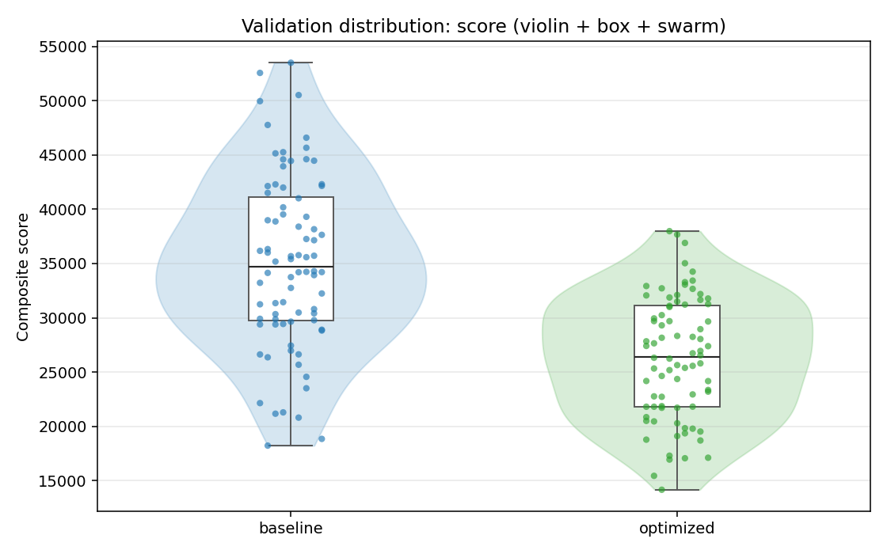

# План презентации для защиты ВКР

Тема ВКР: **«Автоматизация подбора параметров алгоритма факторизации больших чисел с применением эллиптических кривых на основе эвристических методов оптимизации»**.

Рекомендуемый формат: **19 слайдов, доклад на 10-12 минут**. Структура сохраняет обязательную логику защиты, но основная часть не сжимается в один слайд: методы, система, экспериментальный дизайн и результаты вынесены в отдельные слайды.

## Слайд 1. Титульный слайд

**Что должно быть на слайде:**

- Полное название ВКР.
- ФИО автора.
- Образовательная программа, группа.
- ФИО научного руководителя.
- Университет и год защиты.

**О чем рассказывать:**

Кратко представить тему и обозначить фокус работы: исследование посвящено автоматизации выбора параметров метода ECM, а не разработке новой низкоуровневой реализации факторизации. Подчеркнуть стык вычислительной теории чисел, криптографических приложений и эвристической оптимизации.

## Слайд 2. Актуальность и проблема исследования

**Что должно быть на слайде:**

- Факторизация больших чисел важна для вычислительной теории чисел и криптографии.
- ECM эффективен при поиске малых и средних простых делителей.
- Массовые ECM-запуски требуют значительных вычислительных ресурсов.
- Проблема: параметры $B_1$ и $B_2$ существенно влияют на время, число кривых и вероятность успеха.
- Справочные таблицы GMP-ECM являются надежным эталоном, но не обязаны быть оптимальными для конкретной платформы, класса чисел и метрики качества.

**Рекомендуемая визуализация:**

```text
Составное число N
        |
        v
поиск малых/средних делителей -> ECM
        |
        v
оставшийся кофактор -> QS/GNFS или другие методы
```

**О чем рассказывать:**

Объяснить, что ECM обычно применяется как часть практического конвейера факторизации. Он не заменяет GNFS во всех случаях, но хорошо подходит для поиска сравнительно небольшого делителя. Поэтому даже умеренное снижение среднего времени или числа кривых имеет практический эффект при массовых запусках.

## Слайд 3. Цель и задачи работы

**Что должно быть на слайде:**

- Цель: разработать и исследовать программную систему, которая автоматически подбирает параметры ECM с использованием эвристических методов оптимизации и снижает эмпирическую оценку ожидаемой стоимости нахождения делителя по сравнению со справочными параметрами GMP-ECM.
- Основные задачи:
  - провести обзор алгоритмов факторизации и определить место ECM;
  - рассмотреть теоретические основы ECM и влияние $B_1$, $B_2$;
  - формализовать подбор параметров как стохастическую black-box оптимизацию;
  - обосновать набор эвристических методов оптимизации;
  - разработать программный pipeline генерации данных, запуска GMP-ECM, оптимизации, валидации и анализа;
  - провести вычислительные эксперименты и сравнить найденные параметры со справочными;
  - сформулировать ограничения и практические рекомендации.

**О чем рассказывать:**

Показать, что задачи выстроены последовательно: от анализа предметной области к математической постановке, затем к программной реализации, экспериментам и интерпретации результатов.

## Слайд 4. Объект и предмет исследования

**Что должно быть на слайде:**

- Объект исследования: алгоритм факторизации целых чисел методом эллиптических кривых и его реализация в GMP-ECM.
- Предмет исследования: автоматизированный выбор параметров $B_1$ и $B_2$ с применением эвристических методов оптимизации.
- Исследовательская гипотеза: если класс чисел, вычислительная среда и метрика качества заранее заданы, то параметры ECM можно локально настроить лучше справочных значений.

**Рекомендуемая визуализация:**

```text
Объект: ECM / GMP-ECM
        |
        v
Предмет: автоматический выбор B1/B2
        |
        v
Критерий: успех + время + число кривых
```

**О чем рассказывать:**

Развести объект и предмет: объектом является сам метод ECM и его практическая реализация, а предметом - не вся факторизация, а настройка двух управляющих параметров. Подчеркнуть, что справочные параметры GMP-ECM используются как сильный baseline.

## Слайд 5. Метод ECM и роль параметров $B_1/B_2$

**Что должно быть на слайде:**

- ECM как вероятностный метод факторизации на эллиптических кривых.
- Две стадии алгоритма:
  - стадия 1: граница гладкости $B_1$;
  - стадия 2: расширение поиска до $B_2$.
- Главный компромисс:
  - большие $B_1/B_2$ повышают вероятность успеха одной кривой;
  - но увеличивают стоимость обработки одной кривой.

**Рекомендуемая визуализация:**

```text
N, B1, B2
  -> выбор кривой и точки
  -> стадия 1
  -> проверка НОД
  -> стадия 2
  -> успех или новая кривая
```

**О чем рассказывать:**

Дать интуитивное объяснение ECM: выбирается случайная эллиптическая кривая, а успех связан с гладкостью порядка группы этой кривой по неизвестному простому делителю $p$. Важно подчеркнуть, что максимизация вероятности успеха одной кривой не равна минимизации общего времени.

## Слайд 6. Математическая постановка задачи

**Что должно быть на слайде:**

- Набор составных чисел: $D = \{N_1, \ldots, N_L\}$.
- Управляемые параметры: $B_1$ и $B_2$.
- Оптимизация в логарифмическом пространстве:

```text
x = (log10(B1), log10(B2))
```

- Ограничения:
  - $B_{1,min} \le B_1 \le B_{1,max}$;
  - $B_{2,min} \le B_2 \le B_{2,max}$;
  - $B_1 \le B_2$;
  - $B_2 / B_1 \le R_{max}$.
- Целевая функция как дорогая стохастическая оценка через GMP-ECM.

**О чем рассказывать:**

Объяснить, что аналитической формулы качества для конкретной пары параметров нет: значение получается через реальные запуски GMP-ECM. Логарифмическое пространство выбрано потому, что параметры меняются на порядки. Ограничения нужны для исключения некорректных или практически бессмысленных конфигураций.

## Слайд 7. Целевая метрика и валидация

**Что должно быть на слайде:**

- Композитная метрика score:
  - штраф за недостаточную долю успеха;
  - среднее время;
  - среднее число кривых.
- Приоритет метрики:
  1. сохранить высокую вероятность успеха;
  2. снизить время;
  3. снизить число кривых.
- Разделение данных:
  - train для оптимизации;
  - control для независимой проверки.
- Относительный выигрыш:

```text
gain = (score_baseline - score_method) / score_baseline * 100%
```

**Рекомендуемая визуализация:**

```text
train-набор -> оптимизатор -> найденные B1/B2
control-набор -> независимая валидация -> сравнение с GMP-ECM
```

**О чем рассказывать:**

Подчеркнуть, что оптимизатору недостаточно хорошо сработать на обучающих числах. Из-за стохастичности ECM и ограниченного числа запусков возможен эффект переоценки. Поэтому итоговое сравнение выполняется на независимой контрольной выборке.

## Слайд 8. Использованные методы оптимизации

**Что должно быть на слайде:**

| Метод | Тип | Роль в работе |
|---|---|---|
| RS | случайный поиск | базовый ориентир |
| DE | дифференциальная эволюция | популяционный направленный поиск |
| GA | генетический алгоритм | эволюционный поиск с элитизмом |
| PSO | роевой алгоритм | поиск через личный и коллективный опыт частиц |
| BO | байесовская оптимизация | суррогатный метод для дорогих оценок |

**О чем рассказывать:**

Не нужно подробно выводить формулы всех алгоритмов. Важно показать, почему выбран набор разных классов: простой baseline, эволюционные методы, роевой метод и суррогатный метод. Это позволяет сравнить разные стратегии поиска в дорогой стохастической задаче.

## Слайд 9. Архитектура разработанной системы

**Что должно быть на слайде:**

- Python-пакет `ecm_optimizer`.
- Основные модули:
  - генерация датасетов;
  - запуск GMP-ECM;
  - расчет fitness;
  - оптимизаторы;
  - валидация;
  - анализ результатов.
- CLI-команды:
  - `generate`;
  - `optimize`;
  - `validate`;
  - `run-plan`;
  - `analyze`.
- Форматы артефактов: JSON, CSV, PNG, Markdown.

**Рекомендуемая визуализация:**

```text
CLI -> generate -> datasets
CLI -> optimize -> fitness -> GMP-ECM
CLI -> validate -> GMP-ECM
optimize/validate -> analyze -> tables + plots
```

**О чем рассказывать:**

Показать, что результатом работы является не разовый набор скриптов, а воспроизводимый программный pipeline. Отдельно подчеркнуть разделение ответственности: оптимизаторы не вызывают GMP-ECM напрямую, а работают через единый fitness evaluator.

## Слайд 10. Организация вычислительных экспериментов

**Что должно быть на слайде:**

- Исследованный класс чисел:
  - 20-значный простой делитель $p$;
  - 30-значный кофактор $q$;
  - числа вида $N = pq$.
- Train/control: по 80 чисел.
- Эталон GMP-ECM для 20-значного делителя:
  - $B_1 = 11000$;
  - $B_2 = 1900000$;
  - ожидаемое число кривых около 74.
- Два этапа поиска:
  1. широкие границы;
  2. уточненные границы с ограничением $B_2/B_1 \le 1000$.
- Вычисления на ресурсах СКЦ СПбПУ, SLURM.

**О чем рассказывать:**

Объяснить экспериментальный дизайн. Первый этап нужен для локализации перспективной области $B_1/B_2$, второй - для более детальной проверки найденного диапазона и исключения чрезмерно растянутых конфигураций второй стадии.

## Слайд 11. Результаты: широкие границы поиска

**Что должно быть на слайде:**

- Все методы улучшили справочные параметры GMP-ECM.
- Диапазоны улучшений:
  - валидационная метрика: 20,62-23,90%;
  - среднее время: 18,36-19,53%;
  - среднее число кривых: 35,37-52,50%.
- Локализована эффективная область:
  - $B_1$ порядка 21-34 тыс.;
  - $B_2$ порядка 2,0-3,3 млн.
- Лучший по снижению валидационной метрики и числа кривых на этом этапе: BO.

**Рекомендуемая визуализация:**

Основной график для слайда:


Дополнительный график, если нужно показать сам ход поиска:


**О чем рассказывать:**

Сделать акцент на том, что первый этап был разведочным. Его главный результат - не только конкретное улучшение, но и обнаружение области параметров, отличающейся от табличного $B_1$.

## Слайд 12. Результаты: уточненные границы поиска

**Что должно быть на слайде:**

| Метод | $B_1$ | $B_2$ | Метрика | Время | Кривые | Успех |
|---|---:|---:|---:|---:|---:|---:|
| BO | 20510 | 636495 | -13,70% | -14,30% | -9,71% | 0,9988 |
| DE | 33716 | 3003081 | -22,35% | -17,92% | -51,69% | 1,0000 |
| RS | 22985 | 1273334 | -19,29% | -17,29% | -32,48% | 1,0000 |
| PSO | 52298 | 2726216 | -24,46% | -18,75% | -62,42% | 1,0000 |
| GA | 32609 | 2737437 | -25,14% | -21,04% | -52,14% | 1,0000 |

**Рекомендуемая визуализация:**

Основной график для слайда:


Если нужно показать не только средний выигрыш, но и распределение результата:



**О чем рассказывать:**

Это центральный численный результат. Лучший общий результат дал GA: снижение метрики на 25,14% и времени на 21,04%. PSO дал максимальное сокращение числа кривых - 62,42%. DE показал устойчивый сбалансированный результат.

## Слайд 13. Сравнение методов и интерпретация

**Что должно быть на слайде:**

- GA: лучший баланс качества и времени.
- PSO: максимальное снижение числа кривых.
- DE: устойчивый компромисс без провалов.
- BO: полезен для разведки широких областей, но требует контроля бюджета после уточнения.
- RS: простой и полезный baseline, который тоже улучшает эталон.
- Практический вывод: таблицы GMP-ECM стоит использовать как стартовую точку, а не как окончательный ответ для всех условий.

**Рекомендуемая визуализация:**

| Практическая цель | Предпочтительный метод |
|---|---|
| минимизировать метрику и время | GA |
| минимизировать число кривых | PSO |
| получить устойчивый компромисс | DE |
| быстро получить ориентир | RS |
| исследовать широкую область | BO |

Дополнительные графики для интерпретации:


**О чем рассказывать:**

Перейти от чисел к инженерной интерпретации. Важно сказать, что разные методы полезны в разных сценариях, и это делает работу практически применимой.

## Слайд 14. Научная новизна и теоретическая значимость

**Что должно быть на слайде:**

- Научная новизна:
  - выбор $B_1/B_2$ формализован как эмпирическая стохастическая black-box оптимизация с ограничениями;
  - пять эвристических методов сопоставлены в едином воспроизводимом pipeline;
  - найденные параметры проверены на независимой контрольной выборке;
  - показана возможность локального улучшения справочных параметров GMP-ECM для заданного класса чисел.
- Теоретическая значимость:
  - уточнен взгляд на выбор параметров ECM как на задачу автоматической конфигурации алгоритма;
  - показан компромисс между вероятностью успеха, временем одной кривой и средним числом кривых;
  - сформирована основа для дальнейшего анализа параметров ECM на других размерах делителей.

**О чем рассказывать:**

Не повторять все результаты, а показать, что вклад работы не только программный. Важно, что задача выбора параметров рассмотрена как воспроизводимая оптимизационная постановка с независимой проверкой.

## Слайд 15. Практическая значимость и рекомендации

**Что должно быть на слайде:**

- Разработана программная система `ecm_optimizer`.
- Возможна локальная настройка ECM под:
  - платформу;
  - версию GMP-ECM;
  - класс чисел;
  - вычислительный бюджет;
  - выбранную метрику качества.
- Практические рекомендации:
  - использовать таблицы GMP-ECM как стартовый эталон;
  - выполнять настройку в два этапа: широкий поиск, затем уточнение области;
  - обязательно проверять параметры на control-наборе;
  - сохранять seed, датасеты, версии инструментов и результаты запусков;
  - для исследованного класса задач ориентироваться на GA, PSO и DE.

**О чем рассказывать:**

Подчеркнуть, что практический результат - не только найденные числа $B_1/B_2$, а воспроизводимый инструмент и процедура, которую можно применять для новых классов чисел.

## Слайд 16. Апробация работы

**Что должно быть на слайде:**

- Вычислительная апробация:
  - эксперименты выполнены на ресурсах суперкомпьютерного центра СПбПУ;
  - использована пакетная среда SLURM;
  - результаты сохранены в воспроизводимых артефактах: JSON, CSV, PNG, Markdown;
  - параметры проверены на независимой контрольной выборке.
- Программная апробация:
  - реализованы CLI-команды `generate`, `optimize`, `validate`, `run-plan`, `analyze`;
  - экспериментальные планы запускались как многошаговый pipeline.
- Публикаций и конференционных выступлений по теме ВКР нет.

**О чем рассказывать:**

Говорить только то, что подтверждается материалами ВКР: апробация результатов является экспериментальной и программной. Публикации и выступления на конференциях не заявлять.

## Слайд 17. Выводы

**Что должно быть на слайде:**

- Цель работы достигнута: разработана и исследована система автоматического подбора параметров ECM.
- Выполнены основные задачи:
  - проведен анализ ECM и подходов к выбору параметров;
  - сформулирована black-box постановка выбора $B_1/B_2$;
  - реализован программный pipeline;
  - проведено сравнение RS, DE, GA, PSO и BO;
  - выполнена независимая валидация;
  - сформулированы рекомендации.
- Итоговые численные результаты:
  - до 25,14% снижения валидационной метрики;
  - до 21,04% снижения среднего времени;
  - до 62,42% снижения среднего числа кривых.

**О чем рассказывать:**

Связать выводы с задачами и целью. Сказать, что найденные параметры не являются универсальными для всех случаев, но являются эмпирически эффективными для исследованного класса 20-значных делителей.

## Слайд 18. Перспективы дальнейших исследований

**Что должно быть на слайде:**

- Провести эксперименты для 25-, 30-, 35-значных и более крупных делителей.
- Проверить специальные классы чисел: числа Мерсенна, Ферма, $s^n \pm 1$, реальные NFS-кофакторы.
- Исследовать переносимость найденных параметров между разными платформами и версиями GMP-ECM.
- Увеличить число seed и независимых control-наборов.
- Оценивать прирост эффективности на один процессорный час.
- Разработать адаптивную остановку оптимизации и более гибкое распределение вычислительного бюджета.

**О чем рассказывать:**

Показать, что ограничения работы понятны и превращены в программу дальнейших исследований. Главная перспектива - расширить вывод с 20-значных делителей на более широкий набор размеров, типов чисел и вычислительных сред.

## Слайд 19. Заключительный слайд

**Что должно быть на слайде:**

- «Спасибо за внимание».
- Тема ВКР.
- ФИО автора.
- Короткая строка: «Готов ответить на вопросы».
- При необходимости: контакты или QR-ссылка на репозиторий/материалы.

**О чем рассказывать:**

Кратко поблагодарить комиссию и перейти к вопросам. Не добавлять на этот слайд новые результаты: он должен завершать доклад и служить экраном для обсуждения.

## Резервные материалы для вопросов

Эти материалы можно держать после заключительного слайда, но не включать в основной доклад:

- Почему использовался GMP-ECM, а не собственная реализация ECM?
- Почему оптимизация выполнялась в логарифмическом пространстве?
- Почему нужна независимая control-выборка?
- Почему улучшение числа кривых и времени не всегда совпадает?
- Почему результаты нельзя автоматически переносить на 30- или 40-значные делители?
- Как устроена композитная метрика score?
- Почему BO был сильнее на широком этапе, но слабее после уточнения границ?
