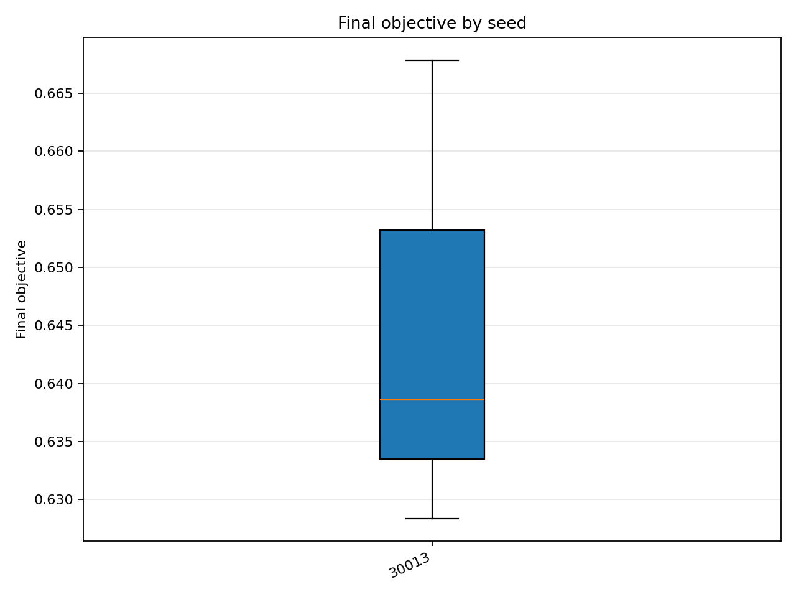
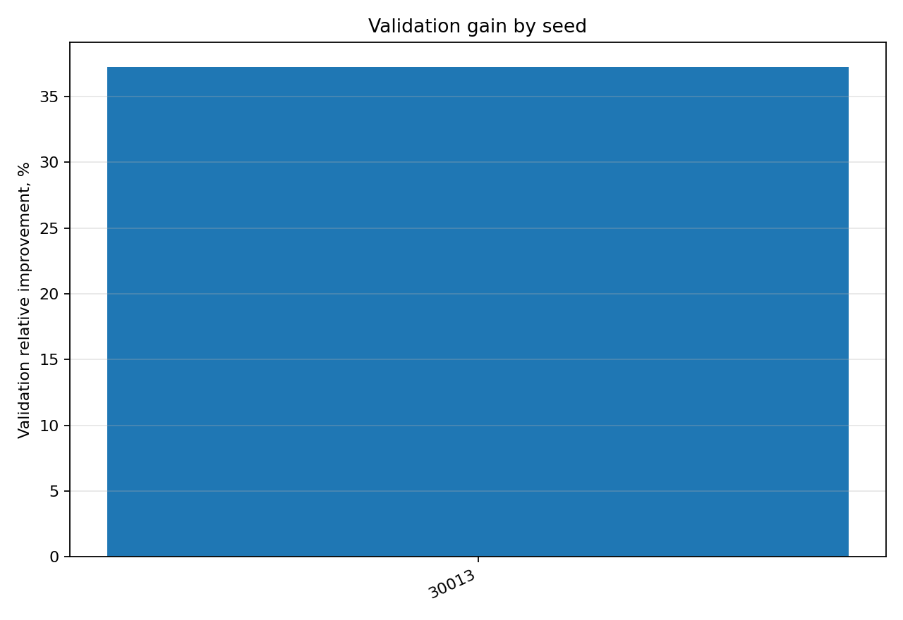

# Отчёт анализа: `seed=30013`

## Навигация
- Путь: /[overview](../../../../../../../../report.md)/[divisor_size=20](../../../../../../report.md)/[dataset=20_dset_20260409T102256Z](../../../../report.md)/[method=de](../../report.md)/seed=30013
- Нижних уровней группировки нет.

## Краткая сводка
- запусков в области: **3**
- медиана final objective: **0.638592**
- IQR objective: **0.019749**
- доля успеха (`objective <= 0.678229`): **100.00%**
- медианное время выполнения: **57.490 сек**
- медианный прирост по validation: **37.274%**

## Графики
- [final_objective_by_seed.png](plots/final_objective_by_seed.png)

- [validation_gain_by_seed.png](plots/validation_gain_by_seed.png)

## Таблицы

