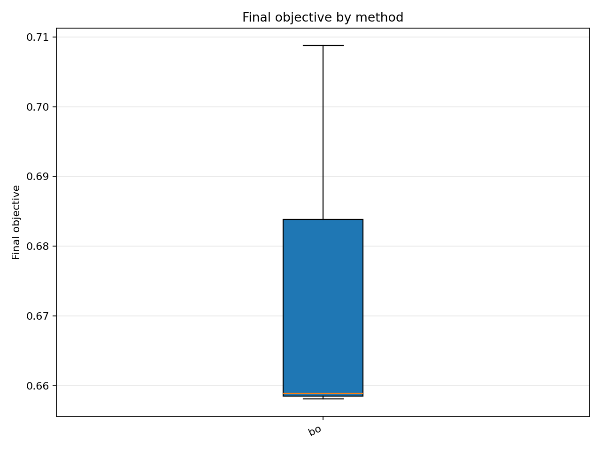
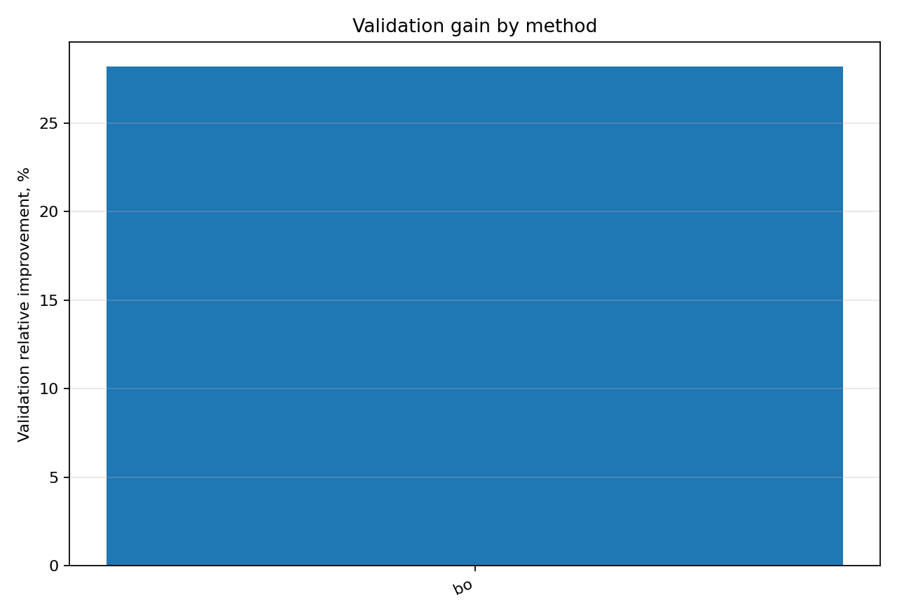

# Отчёт анализа: `method=bo`

## Навигация
- Путь: /[overview](../../../../../../report.md)/[divisor_size=20](../../../../report.md)/[dataset=20_dset_20260409T100023Z](../../report.md)/method=bo
- Переход на нижний уровень:
  - [seed=10007](groups/seed=10007/report.md)

## Краткая сводка
- запусков в области: **3**
- медиана final objective: **0.658901**
- IQR objective: **0.025311**
- доля успеха (`objective <= 0.678229`): **66.67%**
- медианное время выполнения: **12.098 сек**
- медианный прирост по validation: **28.176%**

## Графики
- [final_objective_by_method.png](plots/final_objective_by_method.png)

- [validation_gain_by_method.png](plots/validation_gain_by_method.png)

## Таблицы

