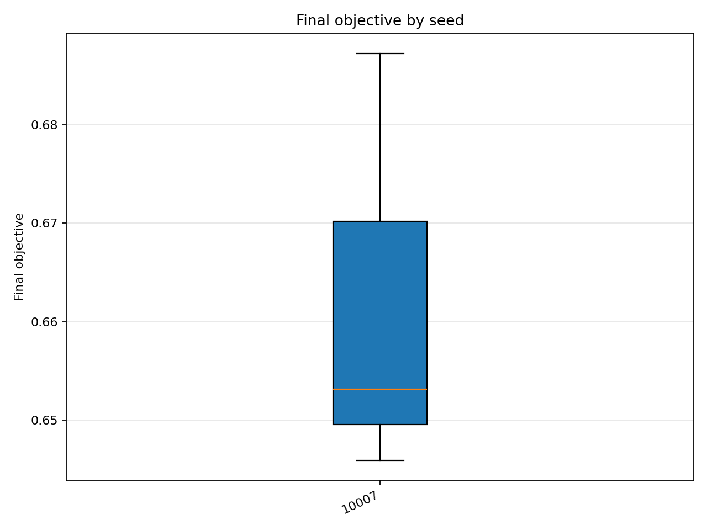
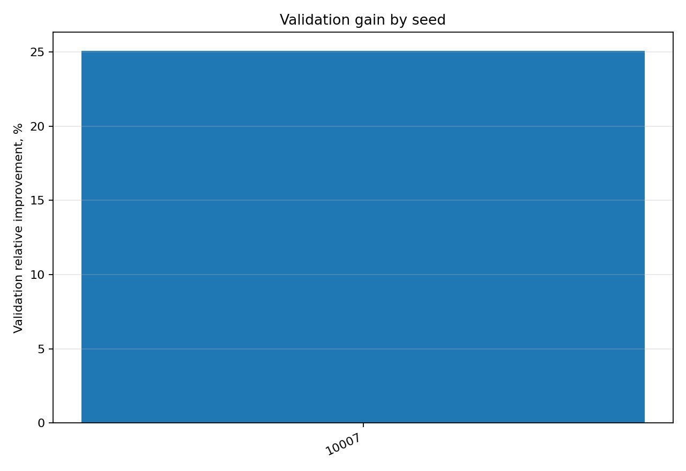

# Отчёт анализа: `seed=10007`

## Навигация
- Путь: /[overview](../../../../../../../../report.md)/[divisor_size=20](../../../../../../report.md)/[dataset=20_dset_20260409T100023Z](../../../../report.md)/[method=de](../../report.md)/seed=10007
- Нижних уровней группировки нет.

## Краткая сводка
- запусков в области: **3**
- медиана final objective: **0.653120**
- IQR objective: **0.020682**
- доля успеха (`objective <= 0.678229`): **66.67%**
- медианное время выполнения: **62.616 сек**
- медианный прирост по validation: **25.087%**

## Графики
- [final_objective_by_seed.png](plots/final_objective_by_seed.png)

- [validation_gain_by_seed.png](plots/validation_gain_by_seed.png)

## Таблицы

