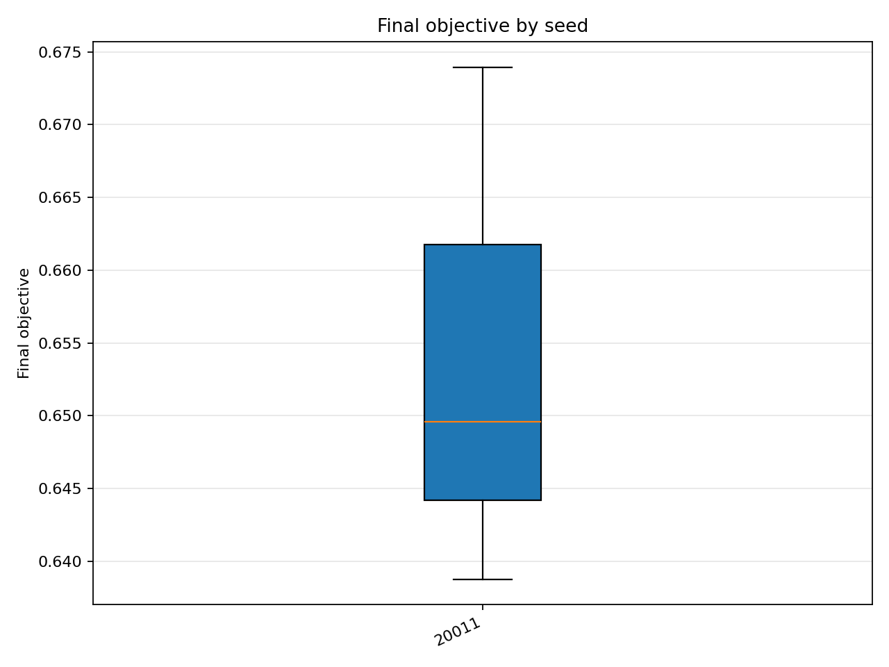
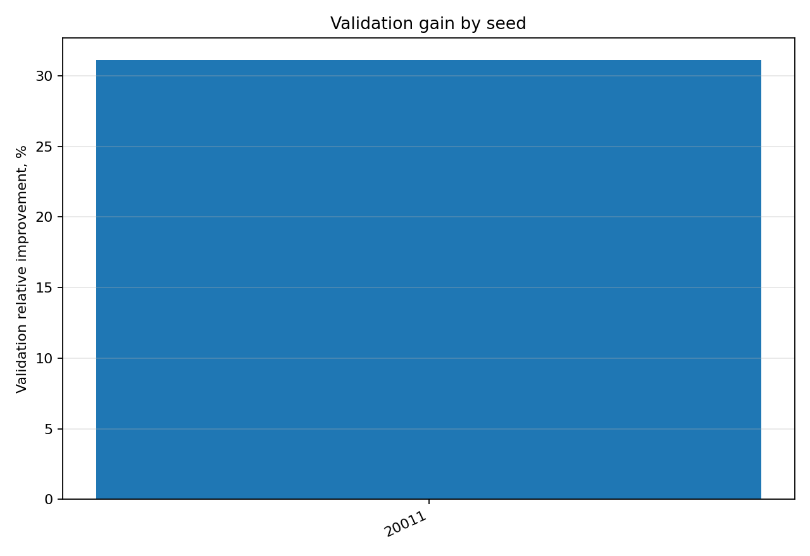

# Отчёт анализа: `seed=20011`

## Навигация
- Путь: /[overview](../../../../../../../../report.md)/[divisor_size=20](../../../../../../report.md)/[dataset=20_dset_20260409T101157Z](../../../../report.md)/[method=bo](../../report.md)/seed=20011
- Нижних уровней группировки нет.

## Краткая сводка
- запусков в области: **3**
- медиана final objective: **0.649579**
- IQR objective: **0.017597**
- доля успеха (`objective <= 0.678229`): **100.00%**
- медианное время выполнения: **11.767 сек**
- медианный прирост по validation: **31.139%**

## Графики
- [final_objective_by_seed.png](plots/final_objective_by_seed.png)

- [validation_gain_by_seed.png](plots/validation_gain_by_seed.png)

## Таблицы

