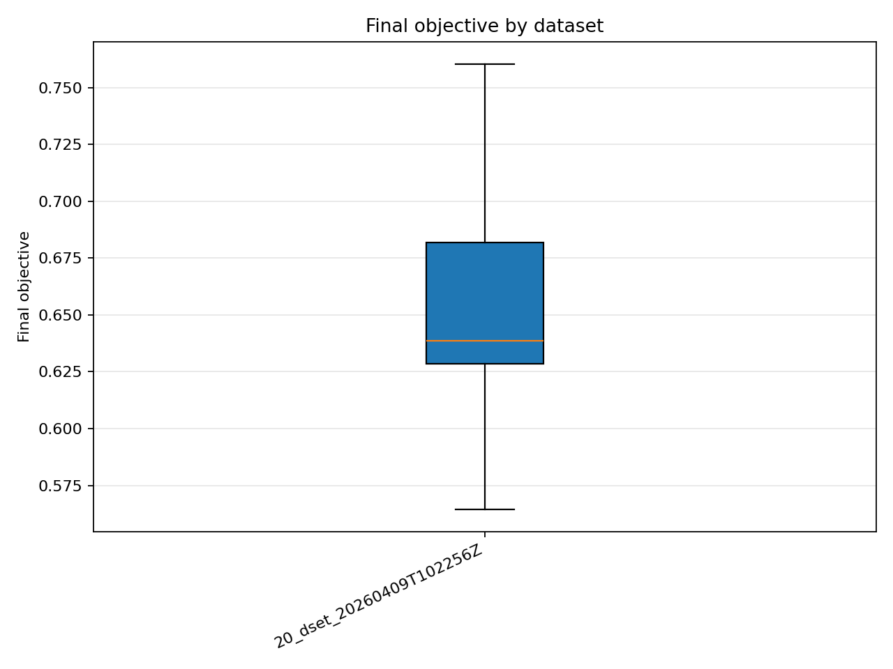
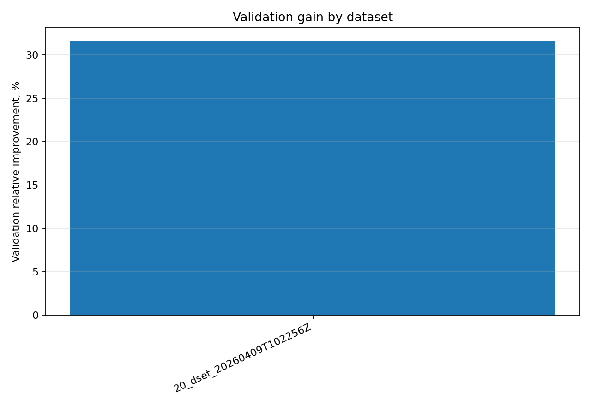

# Отчёт анализа: `dataset=20_dset_20260409T102256Z`

## Навигация
- Путь: /[overview](../../../../report.md)/[divisor_size=20](../../report.md)/dataset=20_dset_20260409T102256Z
- Переход на нижний уровень:
  - [method=bo](groups/method=bo/report.md)
  - [method=de](groups/method=de/report.md)
  - [method=ga](groups/method=ga/report.md)
  - [method=pso](groups/method=pso/report.md)
  - [method=rs](groups/method=rs/report.md)

## Краткая сводка
- запусков в области: **15**
- медиана final objective: **0.638592**
- IQR objective: **0.053448**
- доля успеха (`objective <= 0.678229`): **73.33%**
- медианное время выполнения: **51.499 сек**
- медианный прирост по validation: **31.557%**

## Графики
- [final_objective_by_dataset.png](plots/final_objective_by_dataset.png)

- [validation_gain_by_dataset.png](plots/validation_gain_by_dataset.png)

## Таблицы

