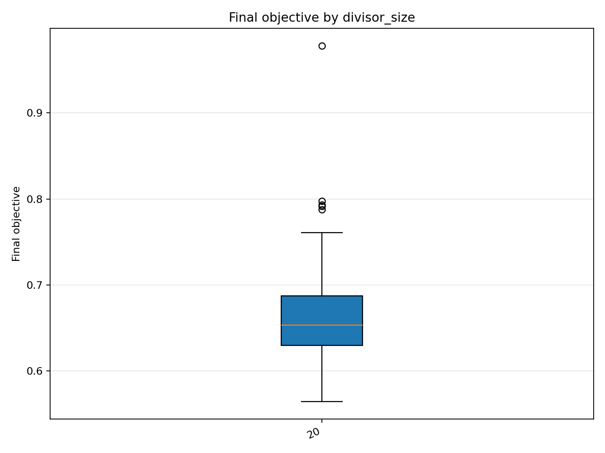
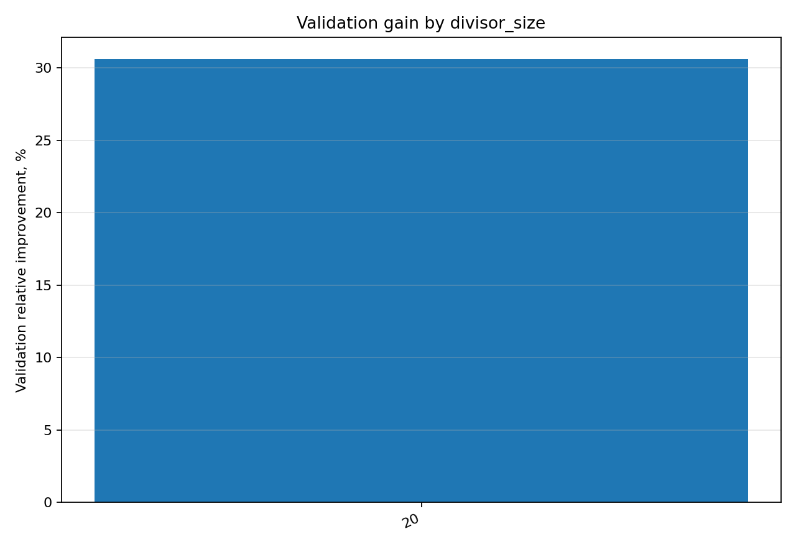

# Отчёт анализа: `divisor_size=20`

## Навигация
- Путь: /[overview](../../report.md)/divisor_size=20
- Переход на нижний уровень:
  - [dataset=20_dset_20260409T100023Z](groups/dataset=20_dset_20260409T100023Z/report.md)
  - [dataset=20_dset_20260409T101157Z](groups/dataset=20_dset_20260409T101157Z/report.md)
  - [dataset=20_dset_20260409T102256Z](groups/dataset=20_dset_20260409T102256Z/report.md)

## Краткая сводка
- запусков в области: **45**
- медиана final objective: **0.653120**
- IQR objective: **0.057531**
- доля успеха (`objective <= 0.678229`): **68.89%**
- медианное время выполнения: **51.499 сек**
- медианный прирост по validation: **30.587%**

## Графики
- [final_objective_by_divisor_size.png](plots/final_objective_by_divisor_size.png)

- [validation_gain_by_divisor_size.png](plots/validation_gain_by_divisor_size.png)

## Таблицы

