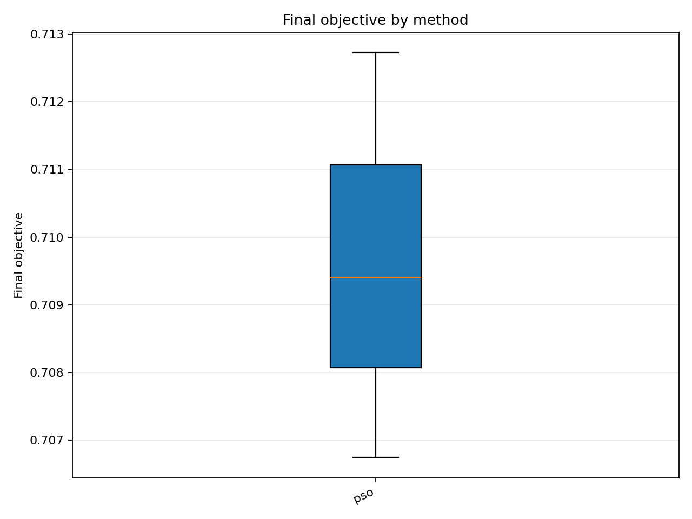
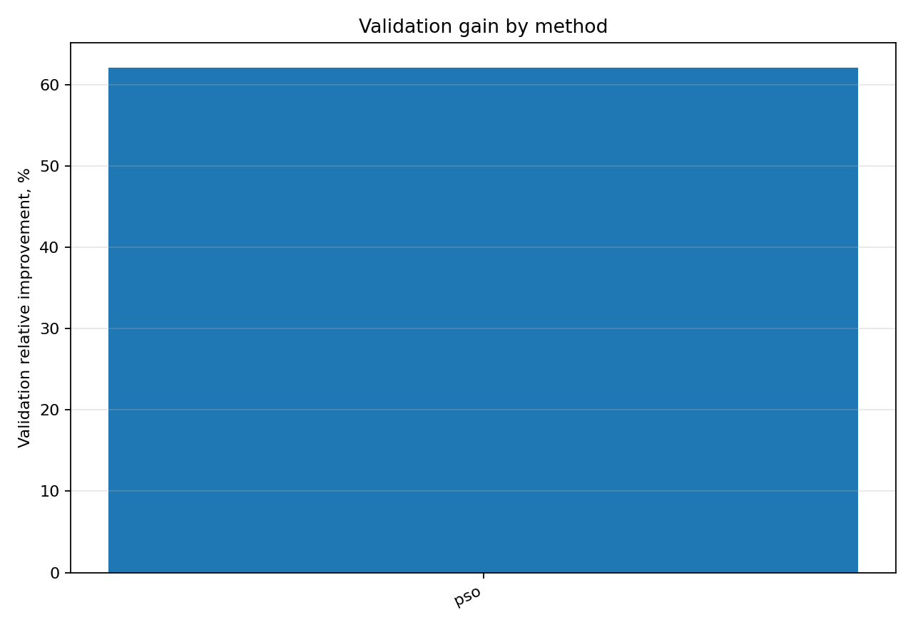

# Отчёт анализа: `method=pso`

## Навигация
- Путь: /[overview](../../../../../../report.md)/[divisor_size=25](../../../../report.md)/[dataset=25_dset_20260409T103515Z](../../report.md)/method=pso
- Переход на нижний уровень:
  - [seed=10007](groups/seed=10007/report.md)

## Краткая сводка
- запусков в области: **3**
- медиана final objective: **0.709405**
- IQR objective: **0.002994**
- доля успеха (`objective <= 0.678229`): **0.00%**
- медианное время выполнения: **58.003 сек**
- медианный прирост по validation: **62.094%**

## Графики
- [final_objective_by_method.png](plots/final_objective_by_method.png)

- [validation_gain_by_method.png](plots/validation_gain_by_method.png)

## Таблицы

