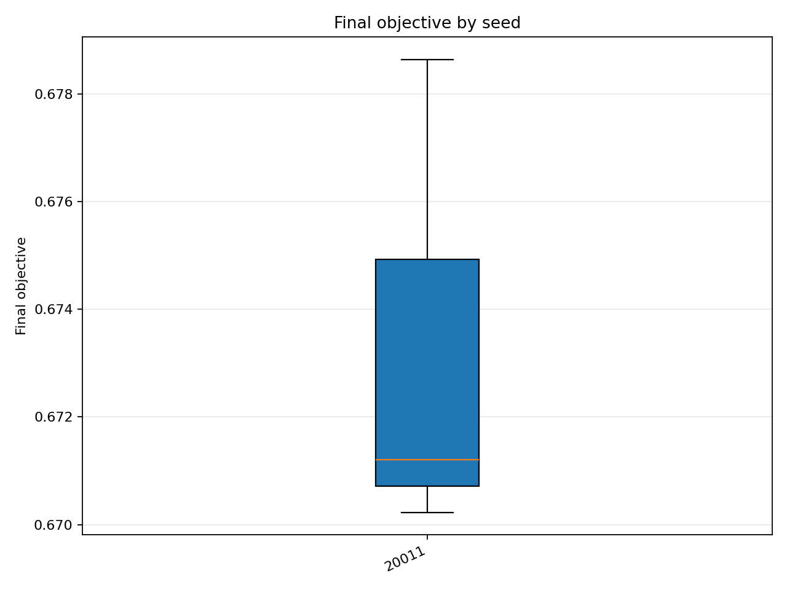
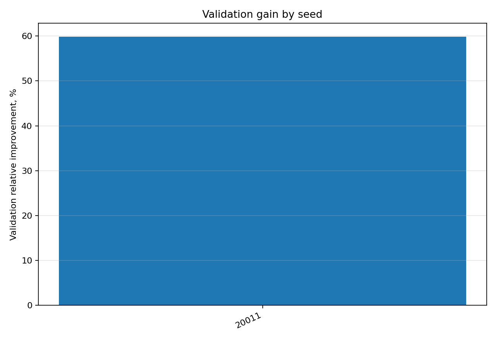

# Отчёт анализа: `seed=20011`

## Навигация
- Путь: /[overview](../../../../../../../../report.md)/[divisor_size=25](../../../../../../report.md)/[dataset=25_dset_20260409T105031Z](../../../../report.md)/[method=pso](../../report.md)/seed=20011
- Нижних уровней группировки нет.

## Краткая сводка
- запусков в области: **3**
- медиана final objective: **0.671204**
- IQR objective: **0.004205**
- доля успеха (`objective <= 0.678229`): **66.67%**
- медианное время выполнения: **54.221 сек**
- медианный прирост по validation: **59.876%**

## Графики
- [final_objective_by_seed.png](plots/final_objective_by_seed.png)

- [validation_gain_by_seed.png](plots/validation_gain_by_seed.png)

## Таблицы

