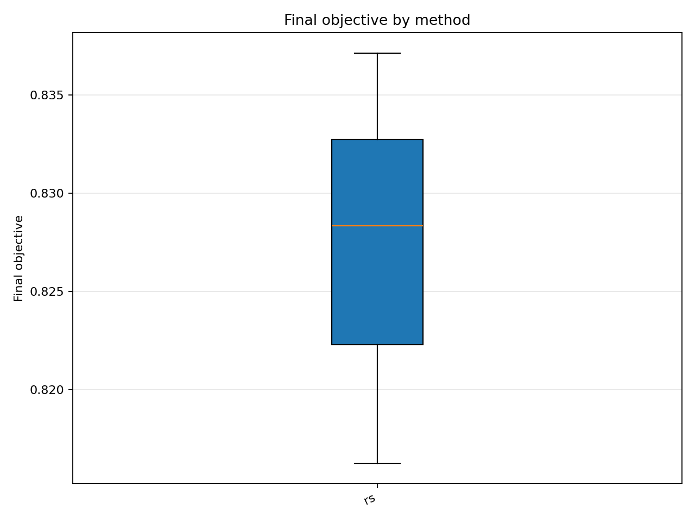
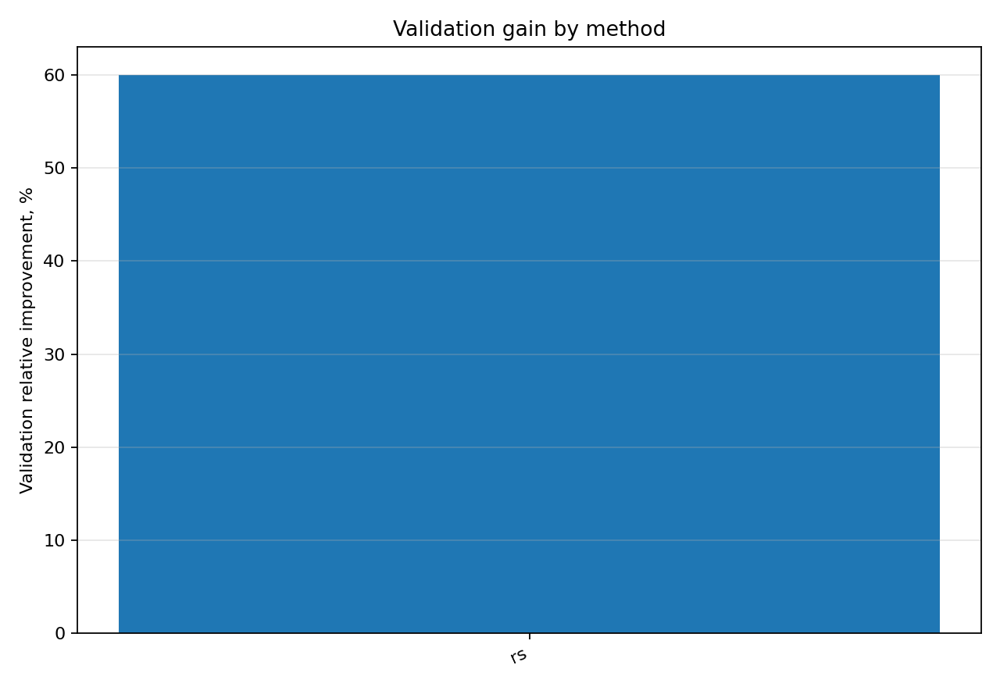

# Отчёт анализа: `method=rs`

## Навигация
- Путь: /[overview](../../../../../../report.md)/[divisor_size=25](../../../../report.md)/[dataset=25_dset_20260409T110755Z](../../report.md)/method=rs
- Переход на нижний уровень:
  - [seed=30013](groups/seed=30013/report.md)

## Краткая сводка
- запусков в области: **3**
- медиана final objective: **0.828350**
- IQR objective: **0.010455**
- доля успеха (`objective <= 0.678229`): **0.00%**
- медианное время выполнения: **29.615 сек**
- медианный прирост по validation: **60.008%**

## Графики
- [final_objective_by_method.png](plots/final_objective_by_method.png)

- [validation_gain_by_method.png](plots/validation_gain_by_method.png)

## Таблицы

