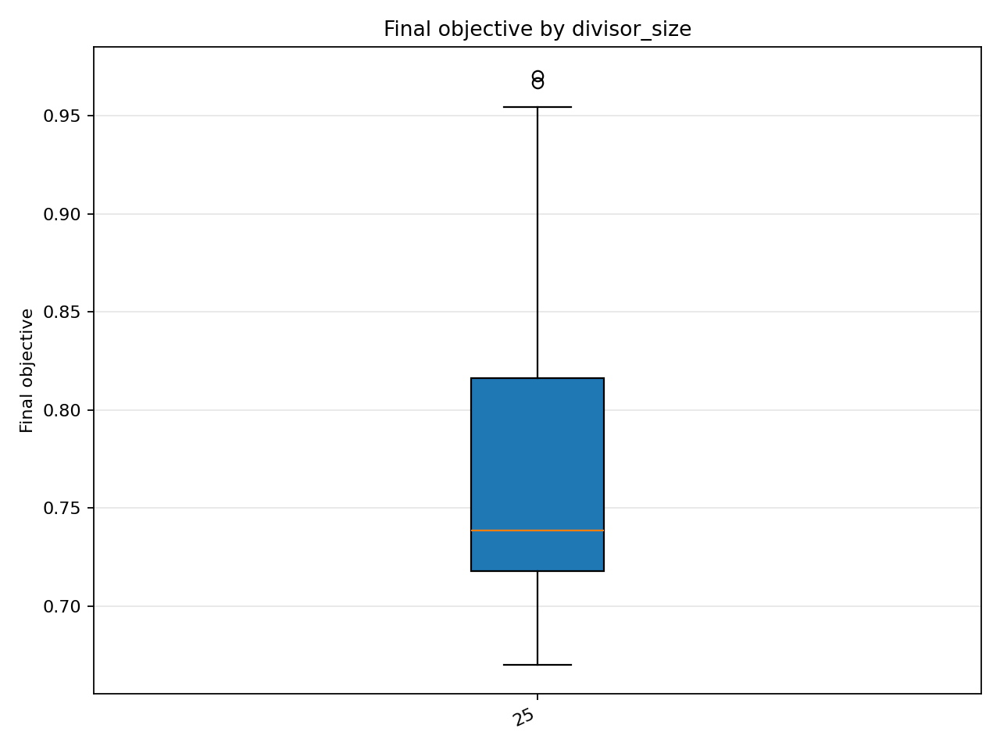
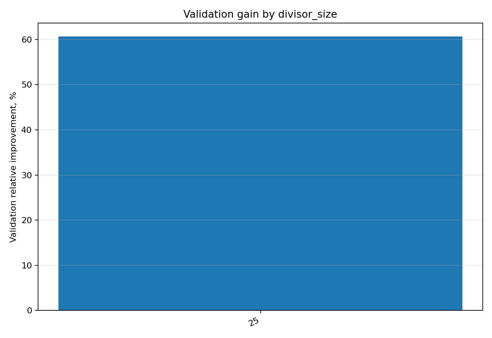

# Отчёт анализа: `divisor_size=25`

## Навигация
- Путь: /[overview](../../report.md)/divisor_size=25
- Переход на нижний уровень:
  - [dataset=25_dset_20260409T103515Z](groups/dataset=25_dset_20260409T103515Z/report.md)
  - [dataset=25_dset_20260409T105031Z](groups/dataset=25_dset_20260409T105031Z/report.md)
  - [dataset=25_dset_20260409T110755Z](groups/dataset=25_dset_20260409T110755Z/report.md)

## Краткая сводка
- запусков в области: **45**
- медиана final objective: **0.738731**
- IQR objective: **0.098214**
- доля успеха (`objective <= 0.678229`): **6.67%**
- медианное время выполнения: **58.615 сек**
- медианный прирост по validation: **60.624%**

## Графики
- [final_objective_by_divisor_size.png](plots/final_objective_by_divisor_size.png)

- [validation_gain_by_divisor_size.png](plots/validation_gain_by_divisor_size.png)

## Таблицы

