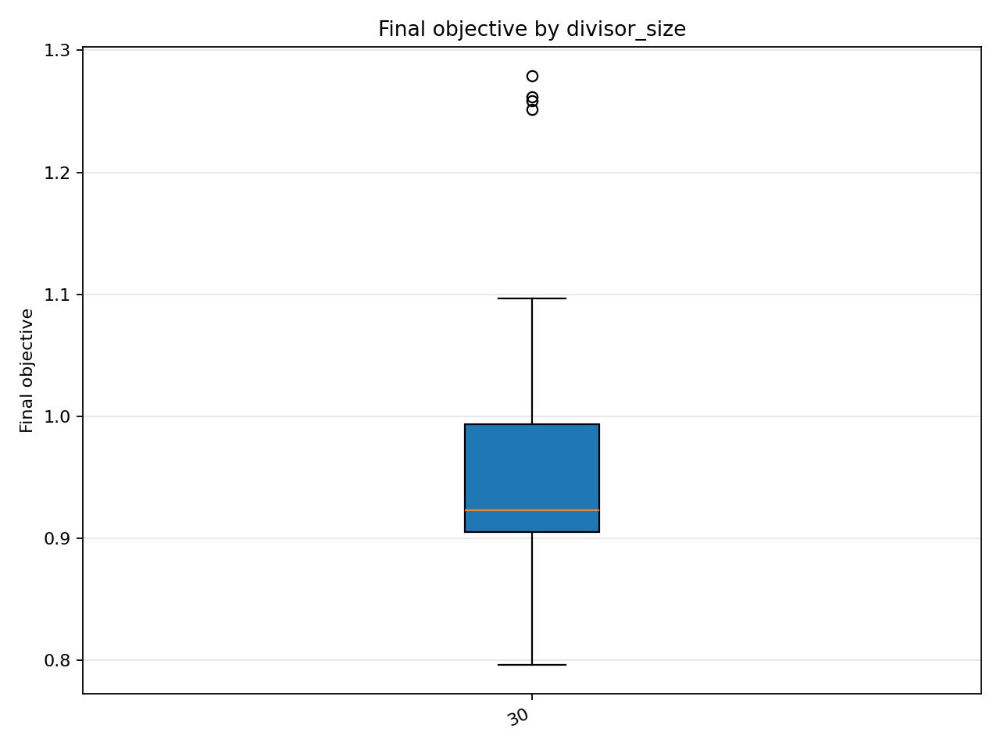
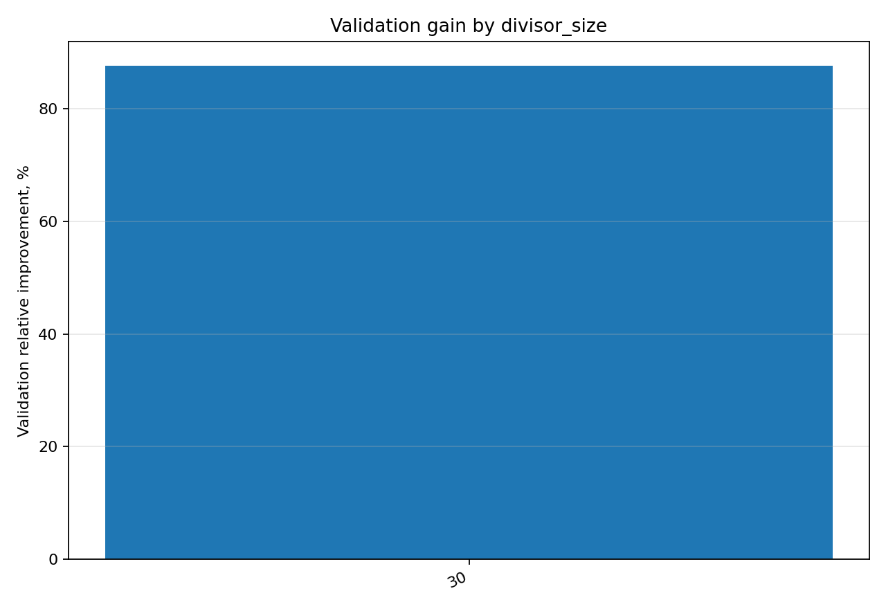

# Отчёт анализа: `divisor_size=30`

## Навигация
- Путь: /[overview](../../report.md)/divisor_size=30
- Переход на нижний уровень:
  - [dataset=30_dset_20260409T112558Z](groups/dataset=30_dset_20260409T112558Z/report.md)
  - [dataset=30_dset_20260409T115651Z](groups/dataset=30_dset_20260409T115651Z/report.md)
  - [dataset=30_dset_20260409T121414Z](groups/dataset=30_dset_20260409T121414Z/report.md)

## Краткая сводка
- запусков в области: **45**
- медиана final objective: **0.923022**
- IQR objective: **0.088471**
- доля успеха (`objective <= 0.678229`): **0.00%**
- медианное время выполнения: **70.931 сек**
- медианный прирост по validation: **87.541%**

## Графики
- [final_objective_by_divisor_size.png](plots/final_objective_by_divisor_size.png)

- [validation_gain_by_divisor_size.png](plots/validation_gain_by_divisor_size.png)

## Таблицы

