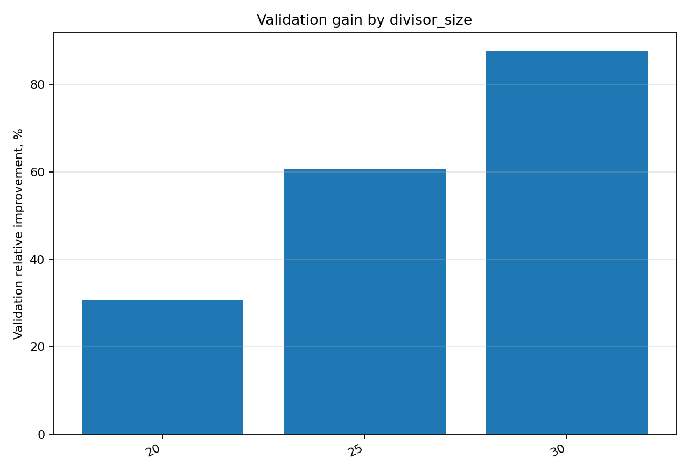

# Отчёт анализа: `overview`

## Навигация
- Путь: /overview
- Переход на нижний уровень:
  - [divisor_size=20](groups/divisor_size=20/report.md)
  - [divisor_size=25](groups/divisor_size=25/report.md)
  - [divisor_size=30](groups/divisor_size=30/report.md)

## Краткая сводка
- запусков в области: **135**
- медиана final objective: **0.754058**
- IQR objective: **0.235766**
- доля успеха (`objective <= 0.678229`): **25.19%**
- медианное время выполнения: **57.824 сек**
- медианный прирост по validation: **60.624%**

## Графики
- [final_objective_by_divisor_size.png](plots/final_objective_by_divisor_size.png)

- [validation_gain_by_divisor_size.png](plots/validation_gain_by_divisor_size.png)

## Таблицы

