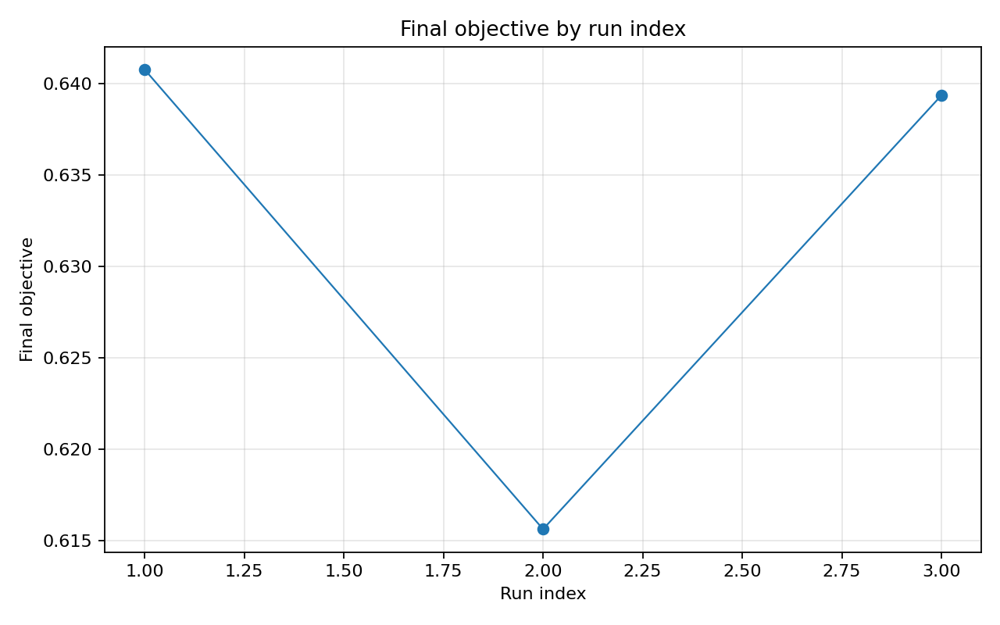

# Отчёт анализа: `seed=20011`

## Навигация
- Путь: /[overview](../../../../../../../../report.md)/[divisor_size=20](../../../../../../report.md)/[dataset=20_dset_20260409T101157Z](../../../../report.md)/[method=de](../../report.md)/seed=20011
- Нижних уровней группировки нет.

## Краткая сводка
- запусков в области: **3**
- медиана final objective: **0.639360**
- IQR objective: **0.012570**
- доля успеха (`objective <= 0.678229`): **100.00%**
- медианное время выполнения: **59.465 сек**
- медианный прирост по validation: **35.323%**

## Executive summary
- лучший сегмент по objective: **N/A**
- лучший сегмент по validation gain: **N/A**
- statistically significant пар: **0**
- кандидаты на adoption: **нет**
- кандидаты под наблюдение: **нет**
- кандидаты на понижение приоритета: **нет**

## Графики
- [final_objective_by_run_index.png](plots/final_objective_by_run_index.png)

## Таблицы

