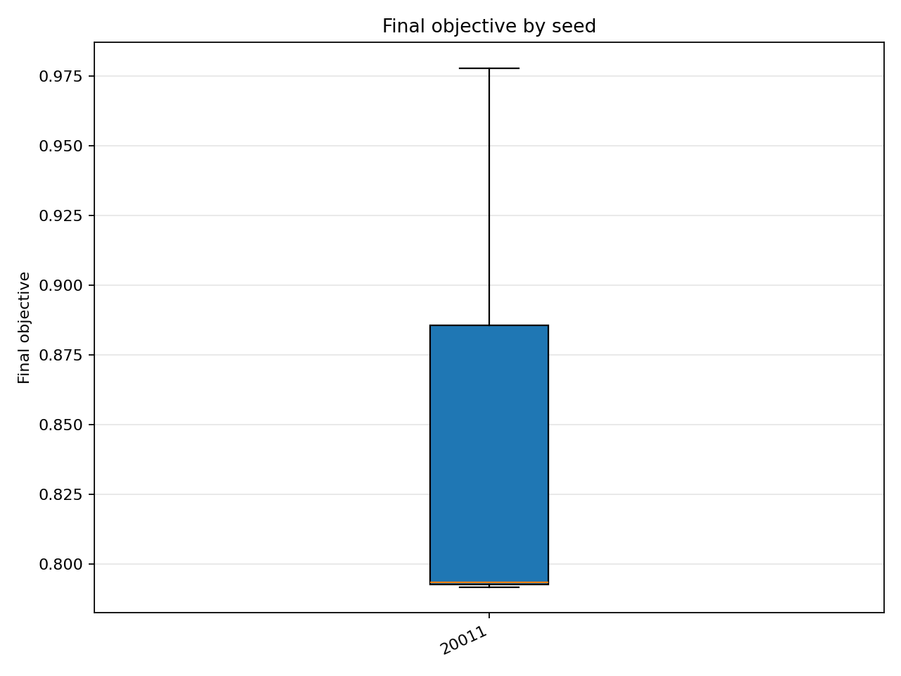
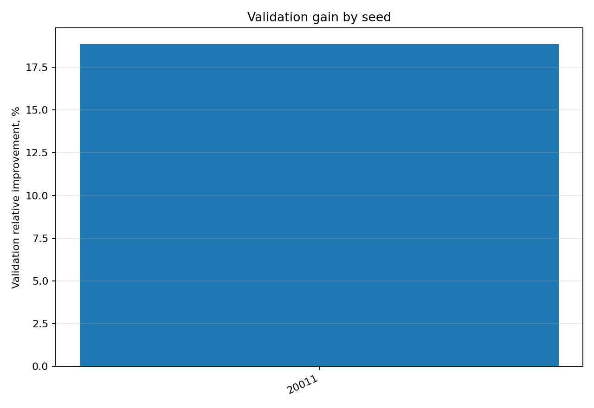
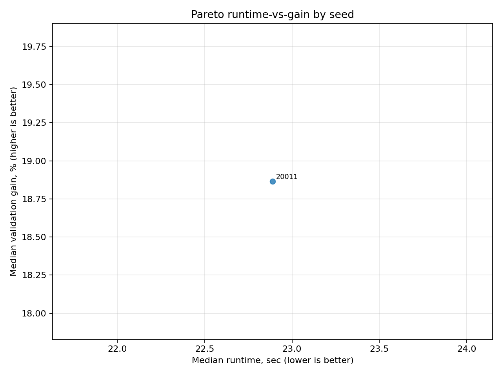
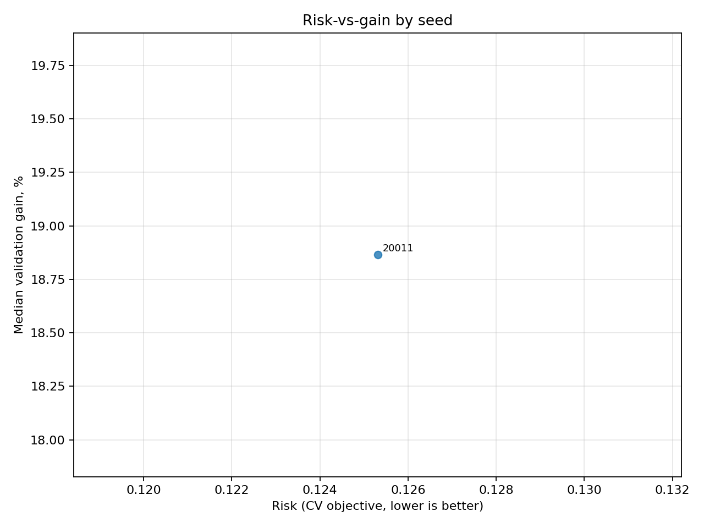
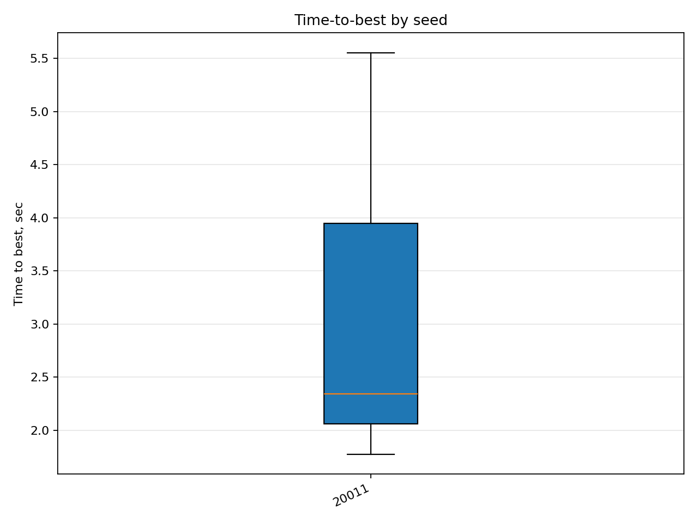
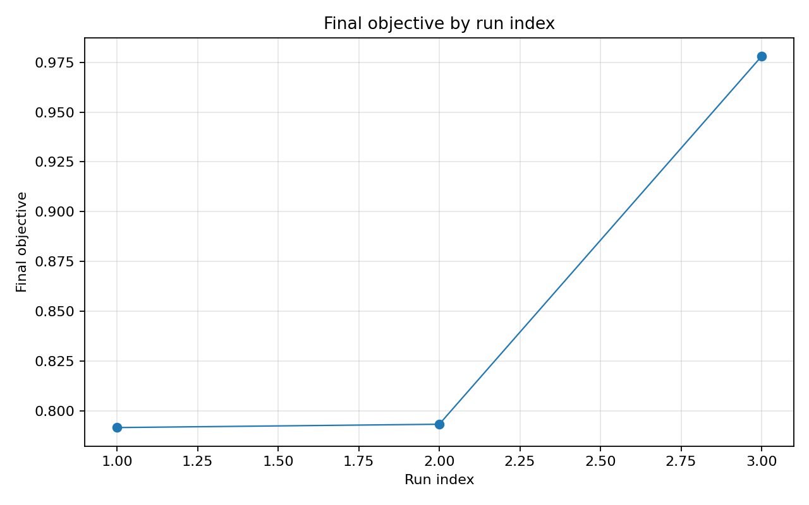

# Отчёт анализа: `method=rs`

## Навигация
- Путь: /[overview](../../../../../../report.md)/[divisor_size=20](../../../../report.md)/[dataset=20_dset_20260409T101157Z](../../report.md)/method=rs
- Переход на нижний уровень:
  - [seed=20011](groups/seed=20011/report.md) (3 runs)

## Краткая сводка
- запусков в области: **3**
- медиана final objective: **0.793387**
- IQR objective: **0.093130**
- доля успеха (`objective <= 0.678229`): **0.00%**
- медианное время выполнения: **22.889 сек**
- медианный прирост по validation: **18.865%**

## Executive summary
- лучший сегмент по objective: **20011**
- лучший сегмент по validation gain: **20011**
- statistically significant пар: **0**
- кандидаты на adoption: **нет**
- кандидаты под наблюдение: **20011**
- кандидаты на понижение приоритета: **нет**

## Графики
- [final_objective_by_seed.png](plots/final_objective_by_seed.png)

- [validation_gain_by_seed.png](plots/validation_gain_by_seed.png)

- [pareto_runtime_gain_by_seed.png](plots/pareto_runtime_gain_by_seed.png)

- [risk_vs_gain_by_seed.png](plots/risk_vs_gain_by_seed.png)

- [time_to_best_by_seed.png](plots/time_to_best_by_seed.png)

- [final_objective_by_run_index.png](plots/final_objective_by_run_index.png)

## Таблицы

