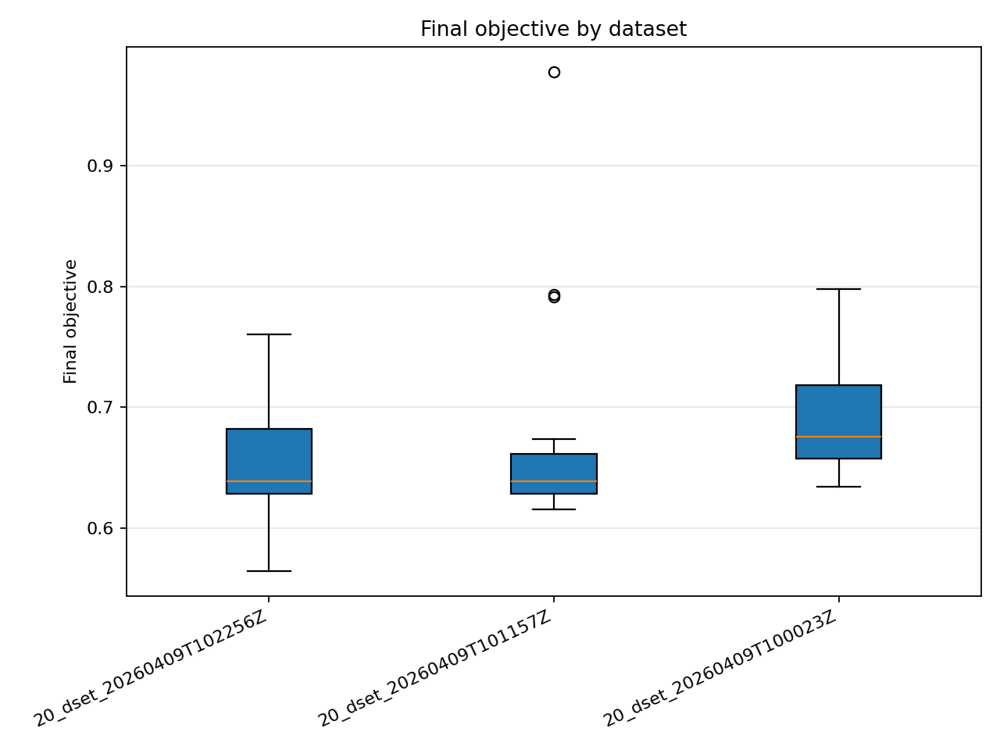
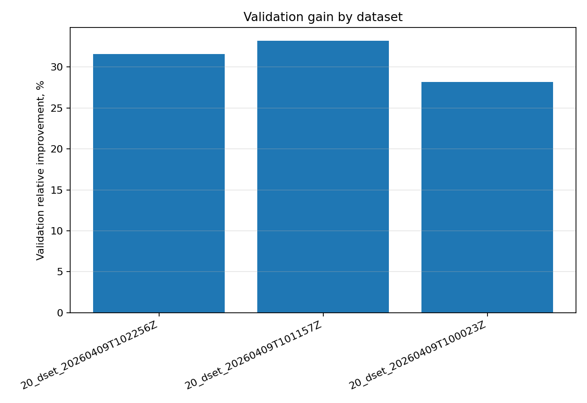
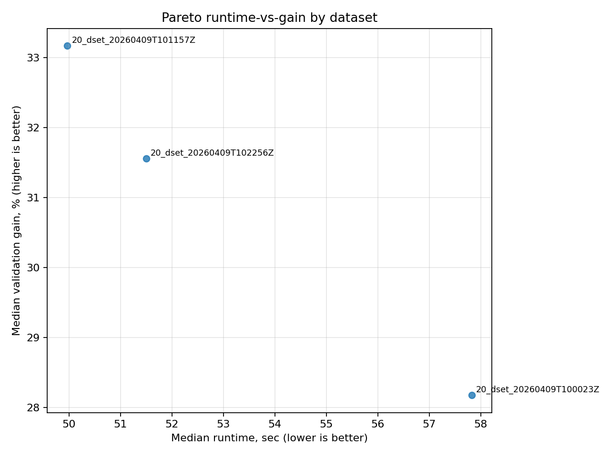
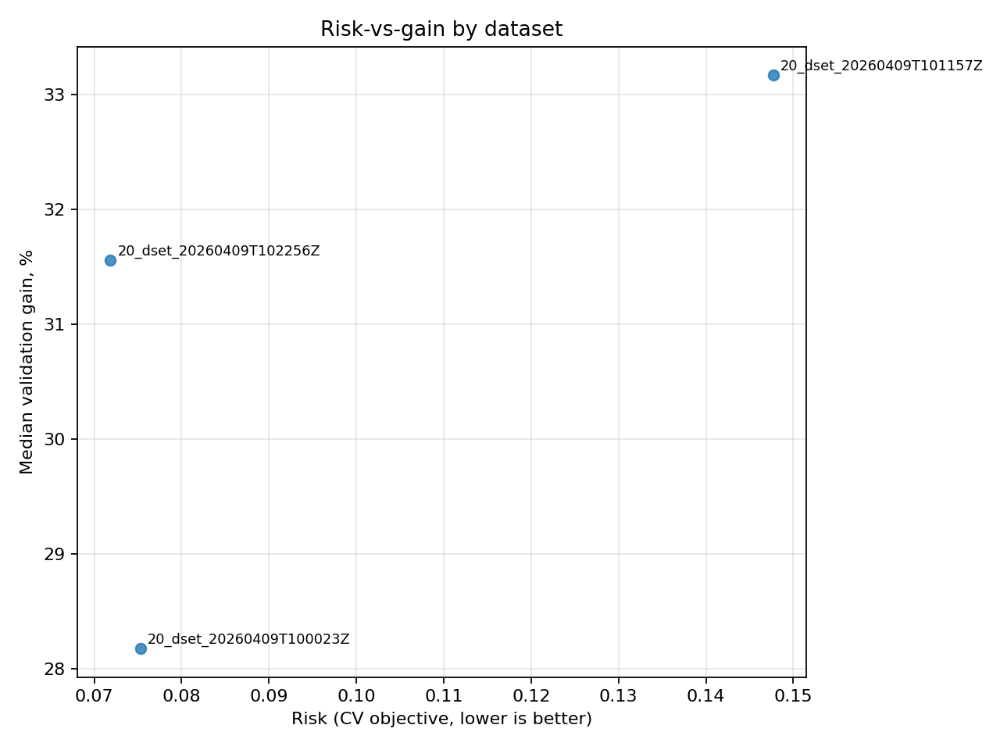
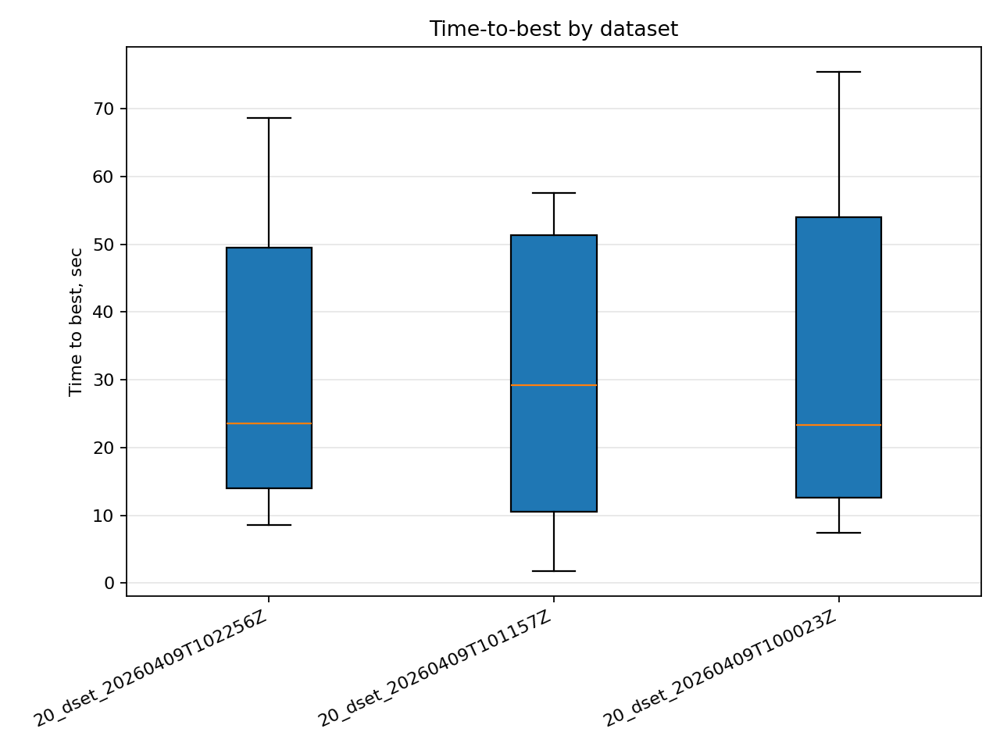
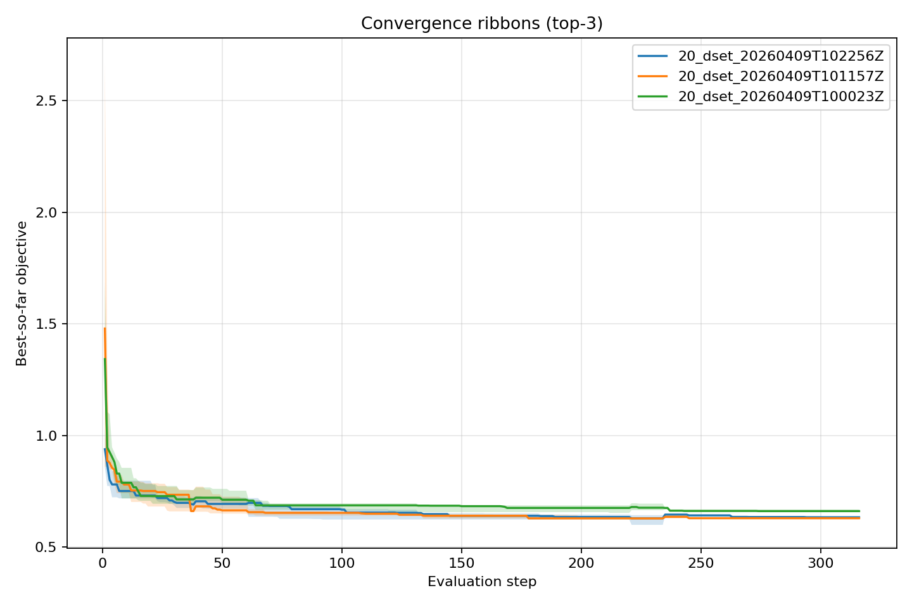
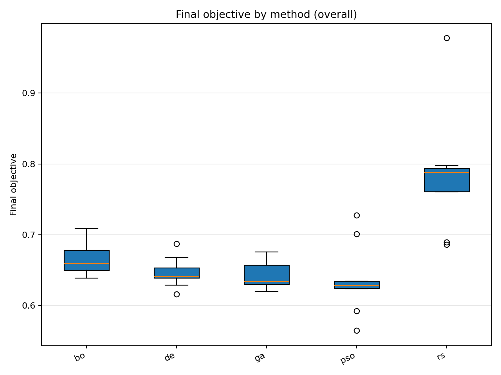
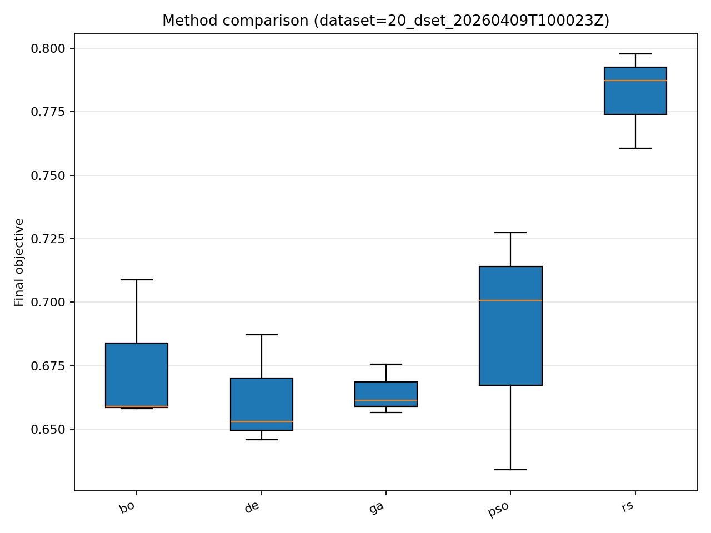
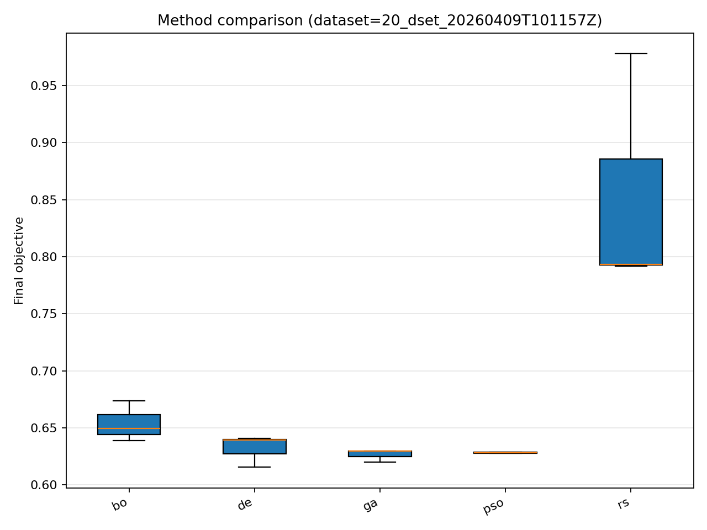
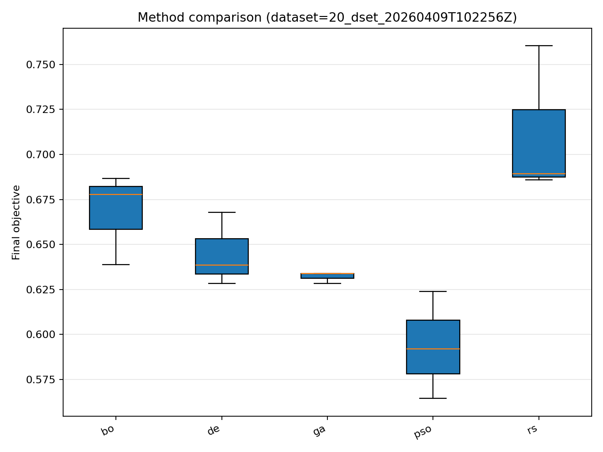

# Отчёт анализа: `divisor_size=20`

## Навигация
- Путь: /[overview](../../report.md)/divisor_size=20
- Переход на нижний уровень:
  - [dataset=20_dset_20260409T100023Z](groups/dataset=20_dset_20260409T100023Z/report.md) (15 runs)
  - [dataset=20_dset_20260409T101157Z](groups/dataset=20_dset_20260409T101157Z/report.md) (15 runs)
  - [dataset=20_dset_20260409T102256Z](groups/dataset=20_dset_20260409T102256Z/report.md) (15 runs)

## Краткая сводка
- запусков в области: **45**
- медиана final objective: **0.653120**
- IQR objective: **0.057531**
- доля успеха (`objective <= 0.678229`): **68.89%**
- медианное время выполнения: **51.499 сек**
- медианный прирост по validation: **30.587%**

## Executive summary
- лучший сегмент по objective: **20_dset_20260409T102256Z**
- лучший сегмент по validation gain: **20_dset_20260409T101157Z**
- statistically significant пар: **2**
- кандидаты на adoption: **20_dset_20260409T100023Z, 20_dset_20260409T101157Z, 20_dset_20260409T102256Z**
- кандидаты под наблюдение: **нет**
- кандидаты на понижение приоритета: **нет**

## Графики
- [final_objective_by_dataset.png](plots/final_objective_by_dataset.png)

- [validation_gain_by_dataset.png](plots/validation_gain_by_dataset.png)

- [pareto_runtime_gain_by_dataset.png](plots/pareto_runtime_gain_by_dataset.png)

- [risk_vs_gain_by_dataset.png](plots/risk_vs_gain_by_dataset.png)

- [time_to_best_by_dataset.png](plots/time_to_best_by_dataset.png)

- [convergence_ribbons_top3_methods.png](plots/convergence_ribbons_top3_methods.png)

- [final_objective_by_method_overall.png](plots/final_objective_by_method_overall.png)

- [final_objective_by_method_dataset=20_dset_20260409T100023Z.png](plots/final_objective_by_method_dataset=20_dset_20260409T100023Z.png)

- [final_objective_by_method_dataset=20_dset_20260409T101157Z.png](plots/final_objective_by_method_dataset=20_dset_20260409T101157Z.png)

- [final_objective_by_method_dataset=20_dset_20260409T102256Z.png](plots/final_objective_by_method_dataset=20_dset_20260409T102256Z.png)

## Таблицы

