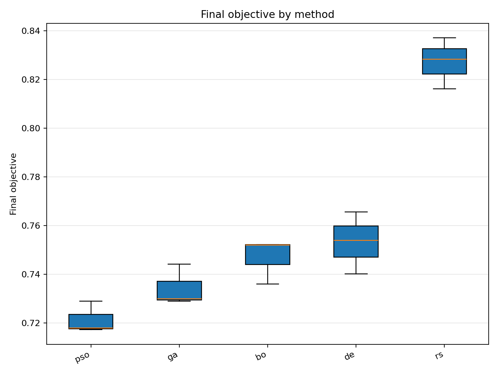
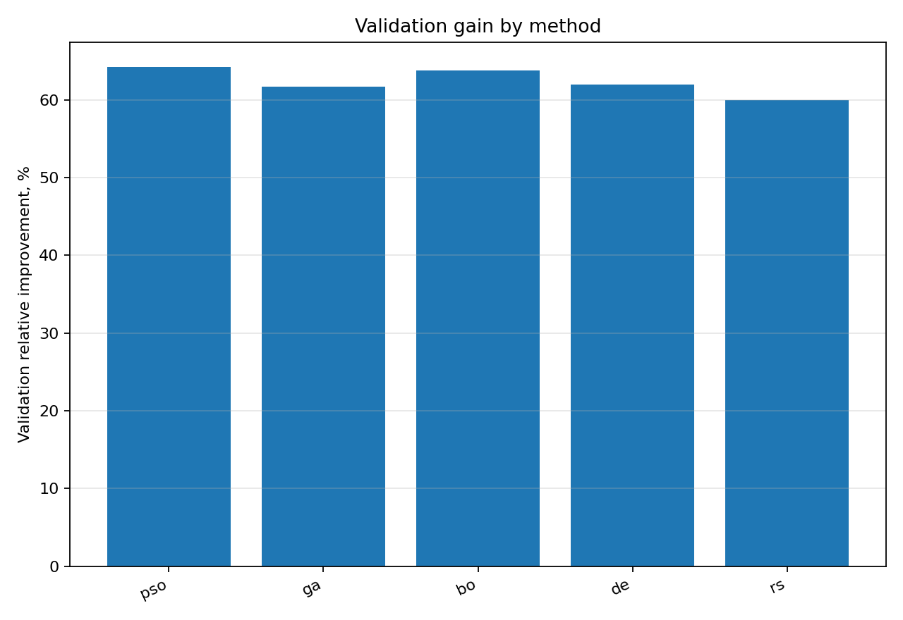
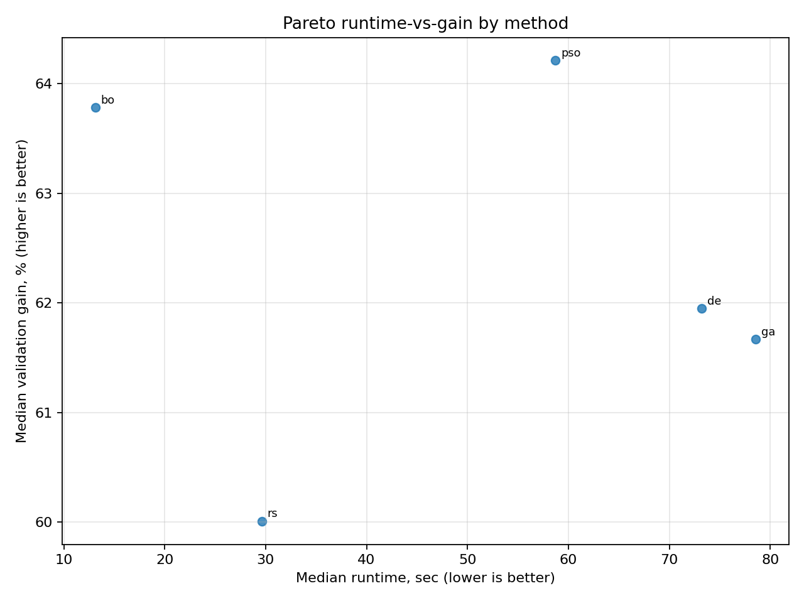
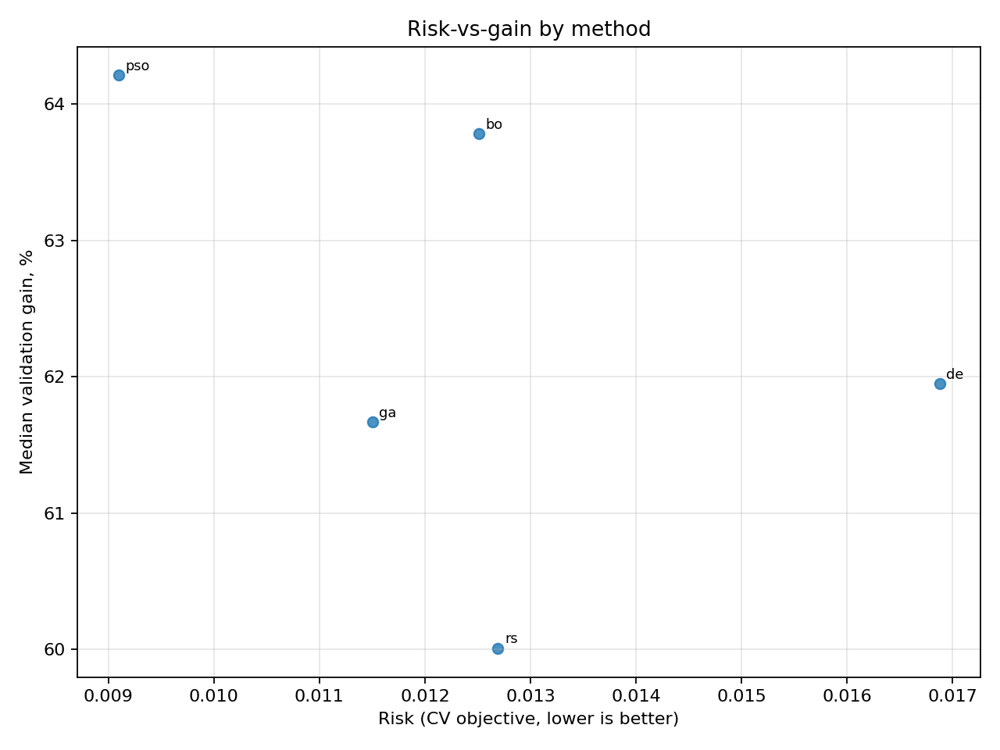
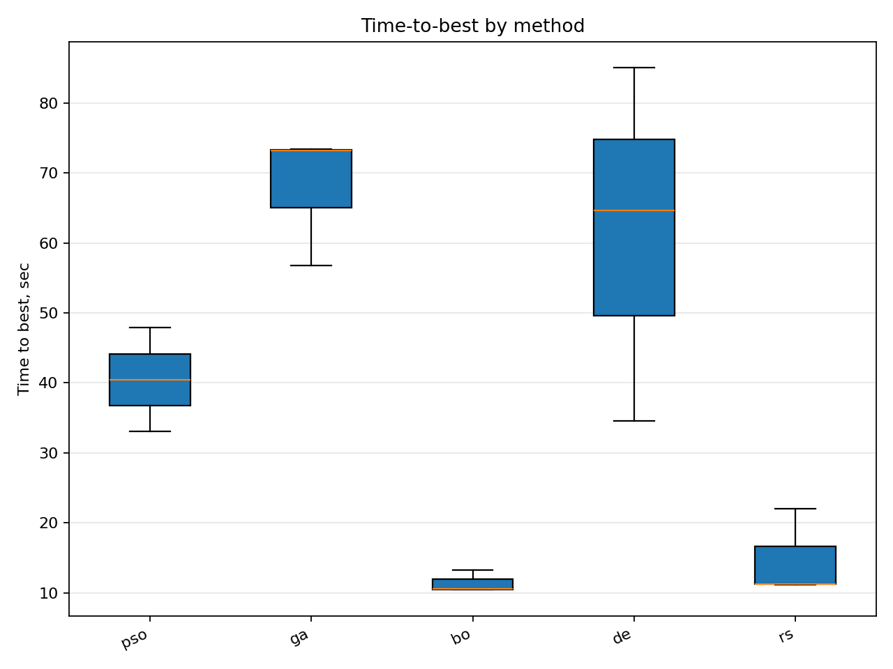
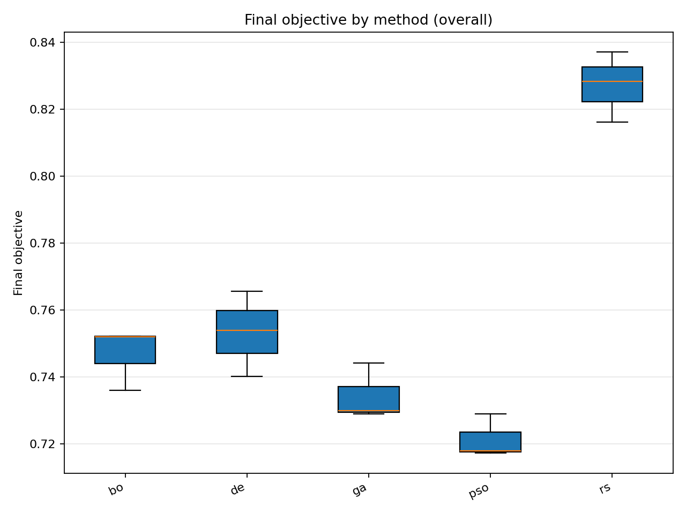

# Отчёт анализа: `dataset=25_dset_20260409T110755Z`

## Навигация
- Путь: /[overview](../../../../report.md)/[divisor_size=25](../../report.md)/dataset=25_dset_20260409T110755Z
- Переход на нижний уровень:
  - [method=bo](groups/method=bo/report.md) (3 runs)
  - [method=de](groups/method=de/report.md) (3 runs)
  - [method=ga](groups/method=ga/report.md) (3 runs)
  - [method=pso](groups/method=pso/report.md) (3 runs)
  - [method=rs](groups/method=rs/report.md) (3 runs)

## Краткая сводка
- запусков в области: **15**
- медиана final objective: **0.744175**
- IQR objective: **0.030285**
- доля успеха (`objective <= 0.678229`): **0.00%**
- медианное время выполнения: **58.724 сек**
- медианный прирост по validation: **61.949%**

## Executive summary
- лучший сегмент по objective: **pso**
- лучший сегмент по validation gain: **pso**
- statistically significant пар: **0**
- кандидаты на adoption: **bo, de, ga, pso, rs**
- кандидаты под наблюдение: **нет**
- кандидаты на понижение приоритета: **нет**

## Графики
- [final_objective_by_method.png](plots/final_objective_by_method.png)

- [validation_gain_by_method.png](plots/validation_gain_by_method.png)

- [pareto_runtime_gain_by_method.png](plots/pareto_runtime_gain_by_method.png)

- [risk_vs_gain_by_method.png](plots/risk_vs_gain_by_method.png)

- [time_to_best_by_method.png](plots/time_to_best_by_method.png)

- [final_objective_by_method_overall.png](plots/final_objective_by_method_overall.png)

## Таблицы

