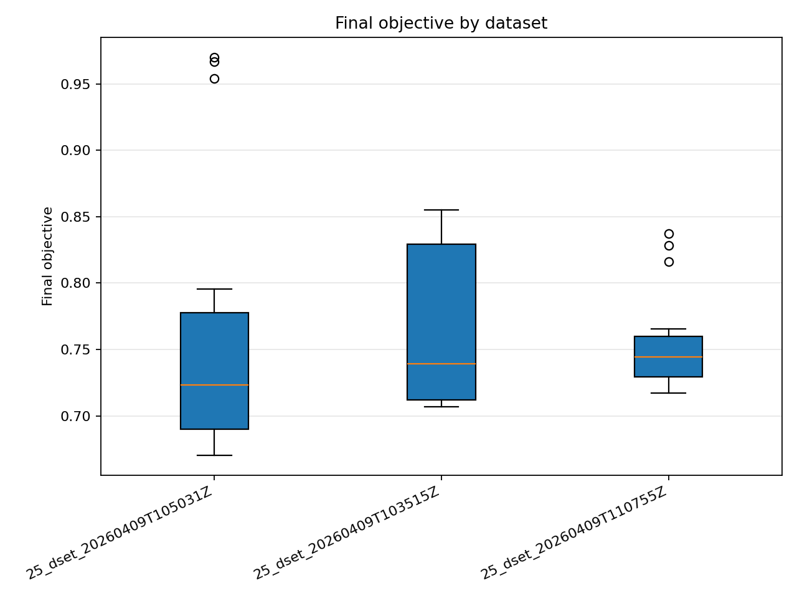
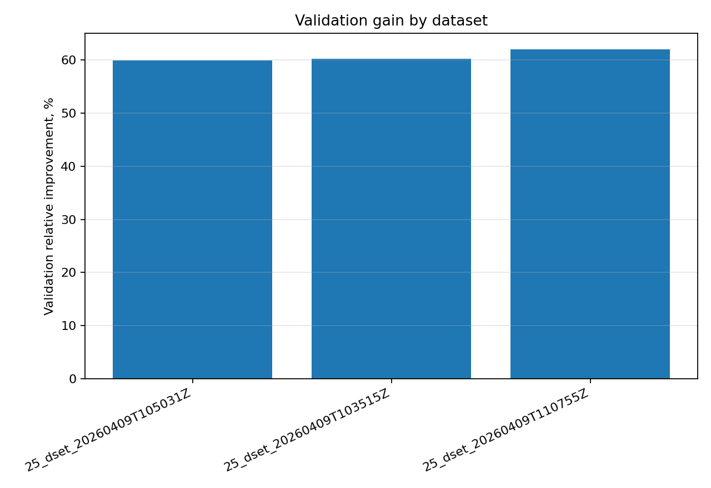
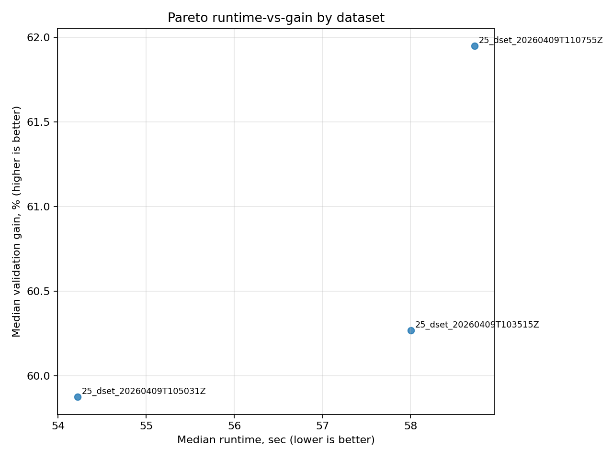
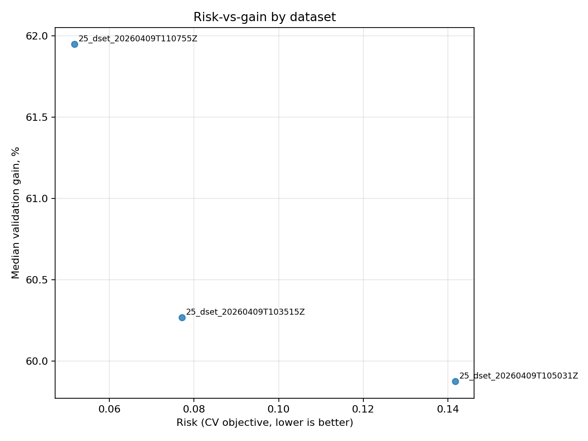
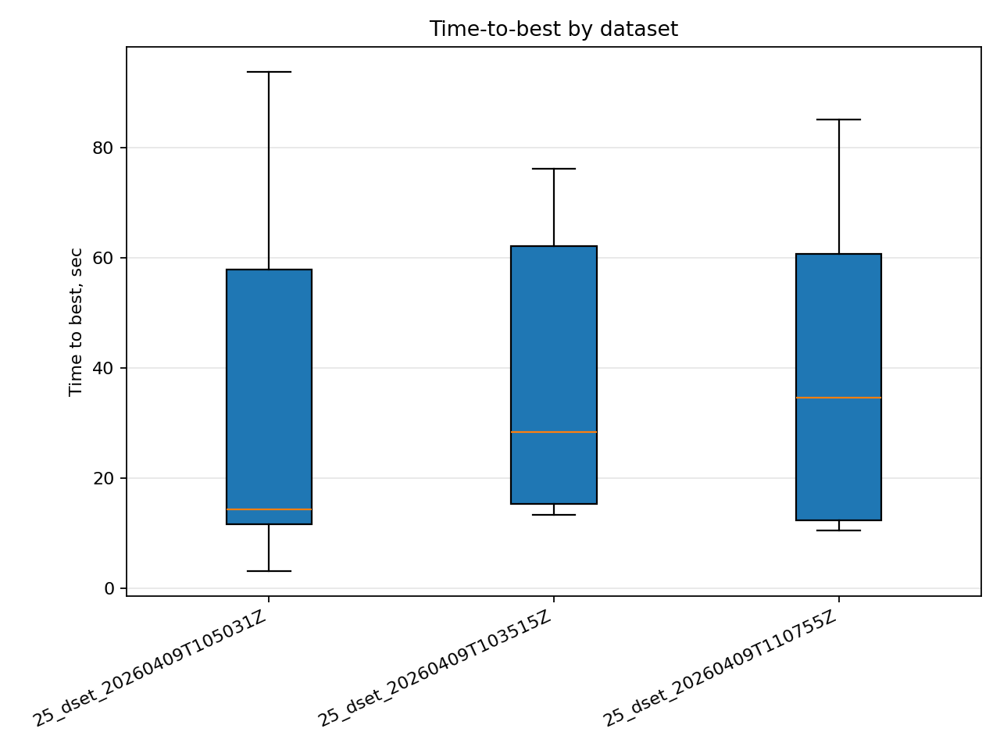
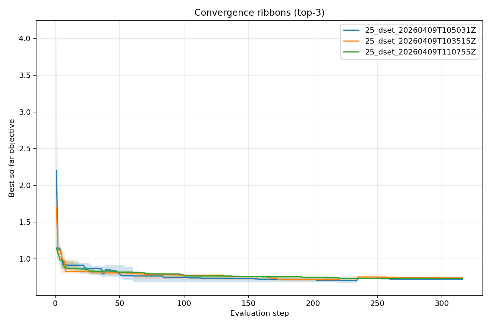
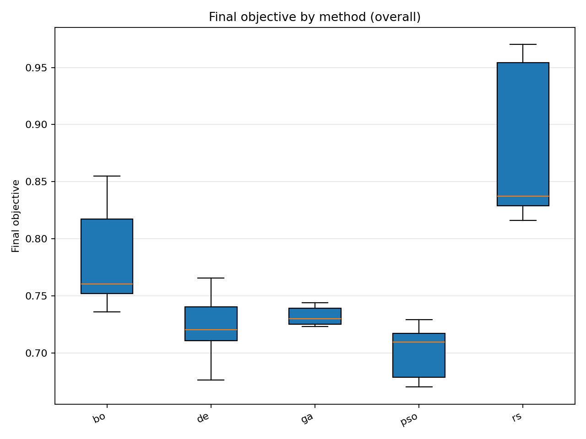
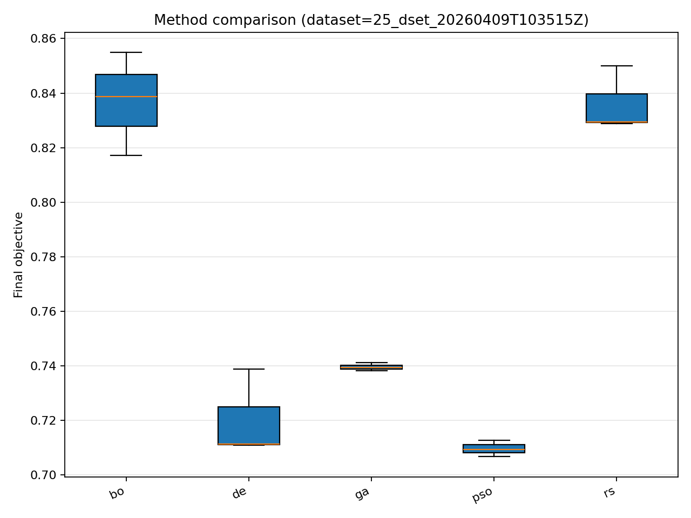
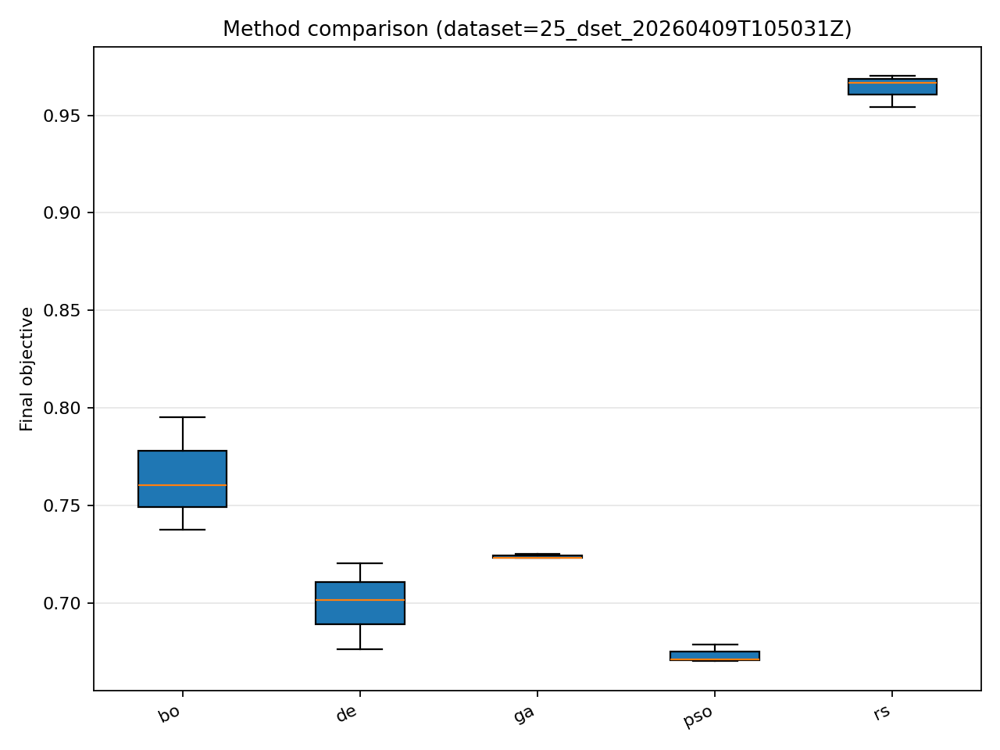
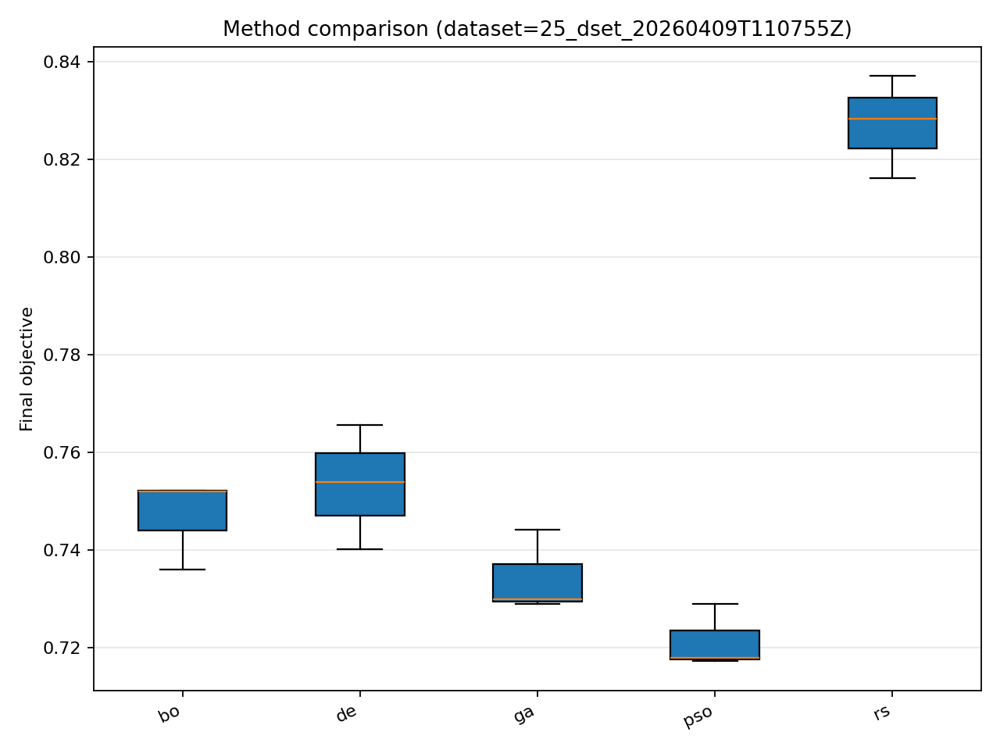

# Отчёт анализа: `divisor_size=25`

## Навигация
- Путь: /[overview](../../report.md)/divisor_size=25
- Переход на нижний уровень:
  - [dataset=25_dset_20260409T103515Z](groups/dataset=25_dset_20260409T103515Z/report.md) (15 runs)
  - [dataset=25_dset_20260409T105031Z](groups/dataset=25_dset_20260409T105031Z/report.md) (15 runs)
  - [dataset=25_dset_20260409T110755Z](groups/dataset=25_dset_20260409T110755Z/report.md) (15 runs)

## Краткая сводка
- запусков в области: **45**
- медиана final objective: **0.738731**
- IQR objective: **0.098214**
- доля успеха (`objective <= 0.678229`): **6.67%**
- медианное время выполнения: **58.615 сек**
- медианный прирост по validation: **60.624%**

## Executive summary
- лучший сегмент по objective: **25_dset_20260409T105031Z**
- лучший сегмент по validation gain: **25_dset_20260409T110755Z**
- statistically significant пар: **0**
- кандидаты на adoption: **25_dset_20260409T103515Z, 25_dset_20260409T105031Z, 25_dset_20260409T110755Z**
- кандидаты под наблюдение: **нет**
- кандидаты на понижение приоритета: **нет**

## Графики
- [final_objective_by_dataset.png](plots/final_objective_by_dataset.png)

- [validation_gain_by_dataset.png](plots/validation_gain_by_dataset.png)

- [pareto_runtime_gain_by_dataset.png](plots/pareto_runtime_gain_by_dataset.png)

- [risk_vs_gain_by_dataset.png](plots/risk_vs_gain_by_dataset.png)

- [time_to_best_by_dataset.png](plots/time_to_best_by_dataset.png)

- [convergence_ribbons_top3_methods.png](plots/convergence_ribbons_top3_methods.png)

- [final_objective_by_method_overall.png](plots/final_objective_by_method_overall.png)

- [final_objective_by_method_dataset=25_dset_20260409T103515Z.png](plots/final_objective_by_method_dataset=25_dset_20260409T103515Z.png)

- [final_objective_by_method_dataset=25_dset_20260409T105031Z.png](plots/final_objective_by_method_dataset=25_dset_20260409T105031Z.png)

- [final_objective_by_method_dataset=25_dset_20260409T110755Z.png](plots/final_objective_by_method_dataset=25_dset_20260409T110755Z.png)

## Таблицы

