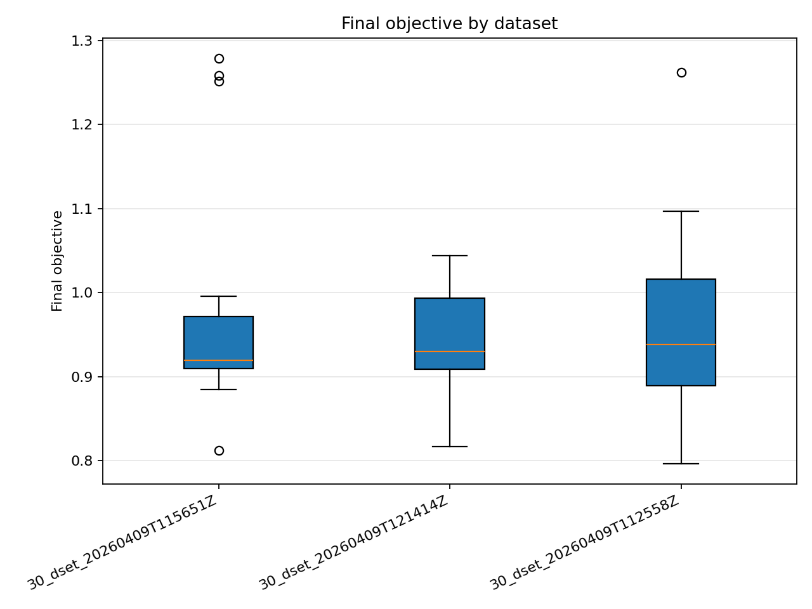
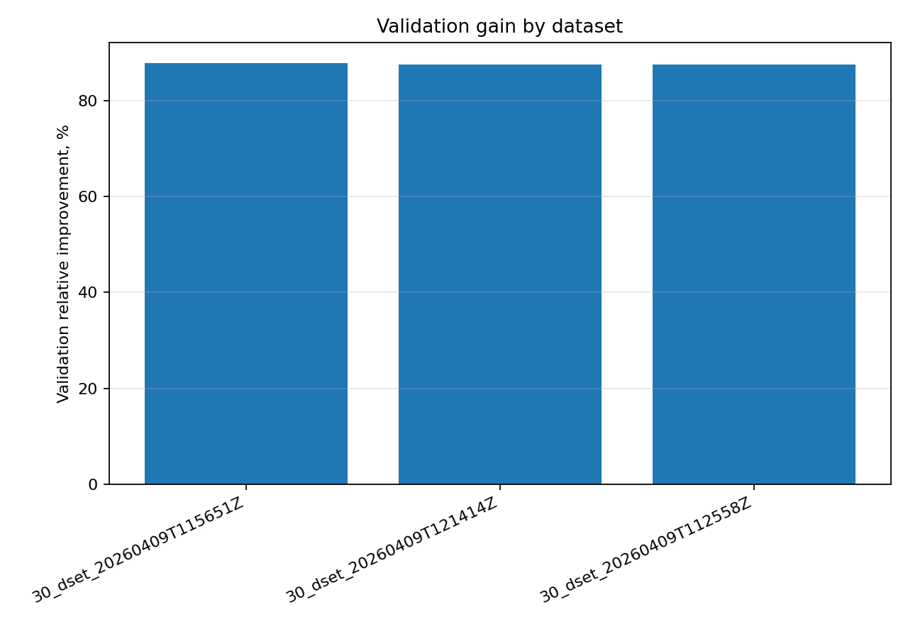
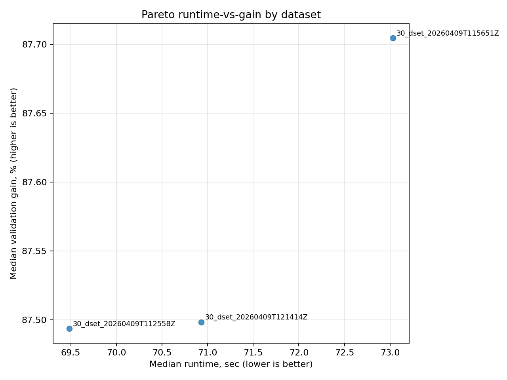
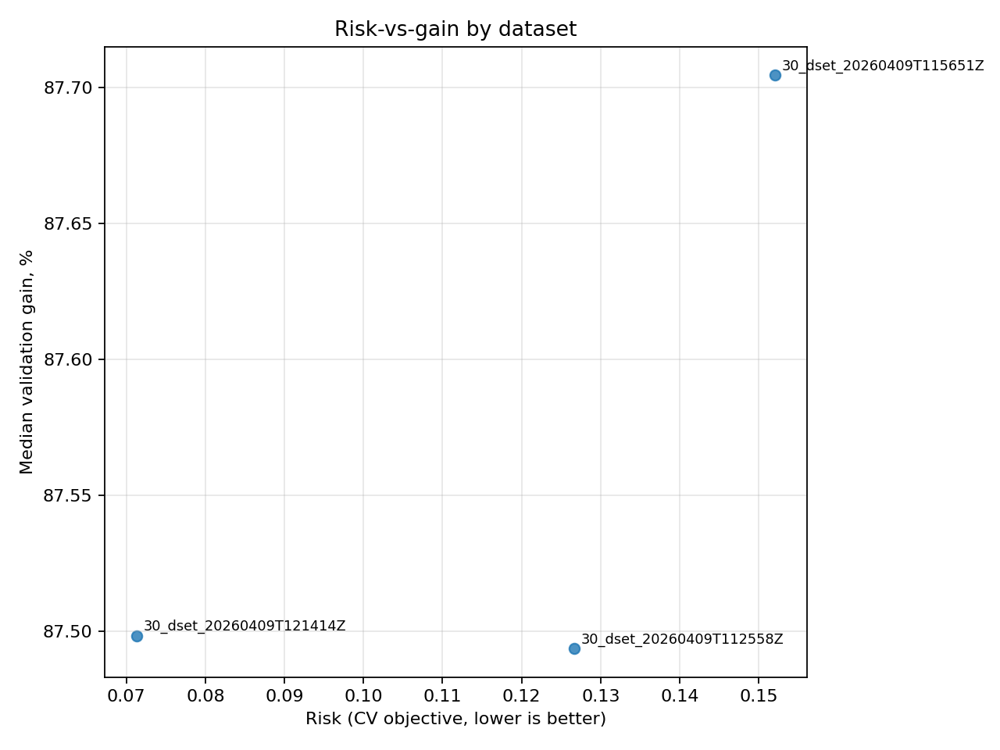
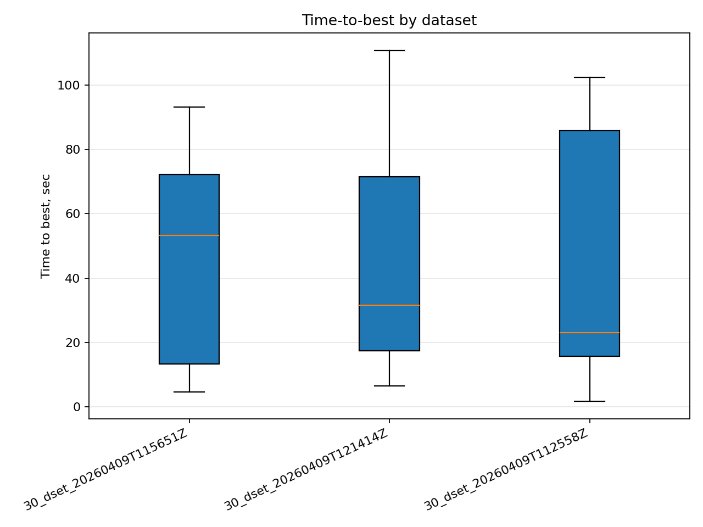
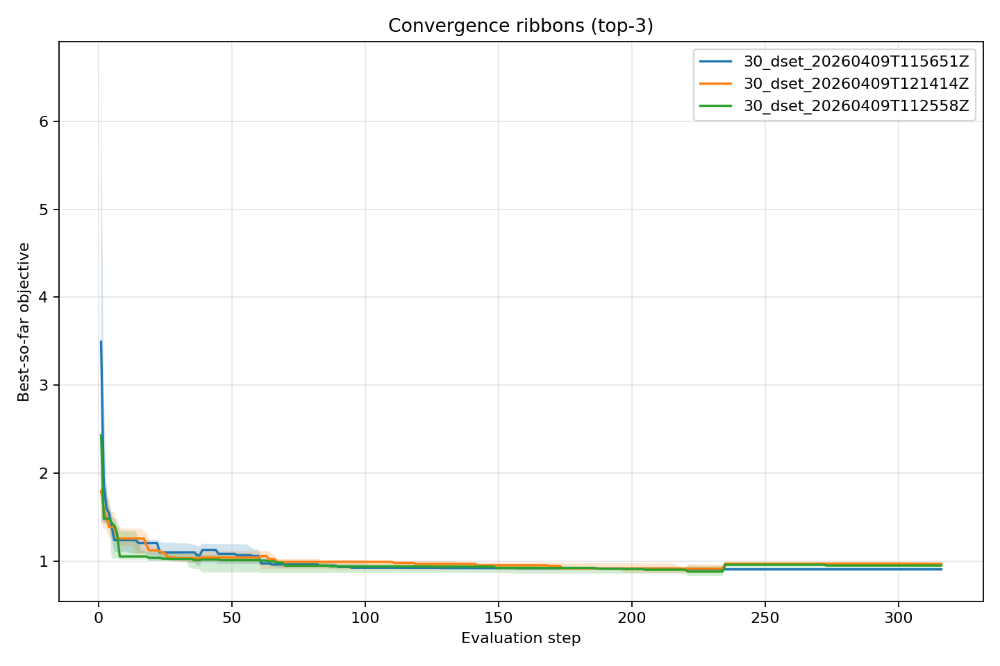
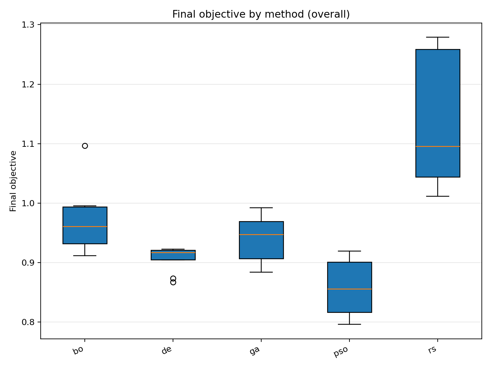
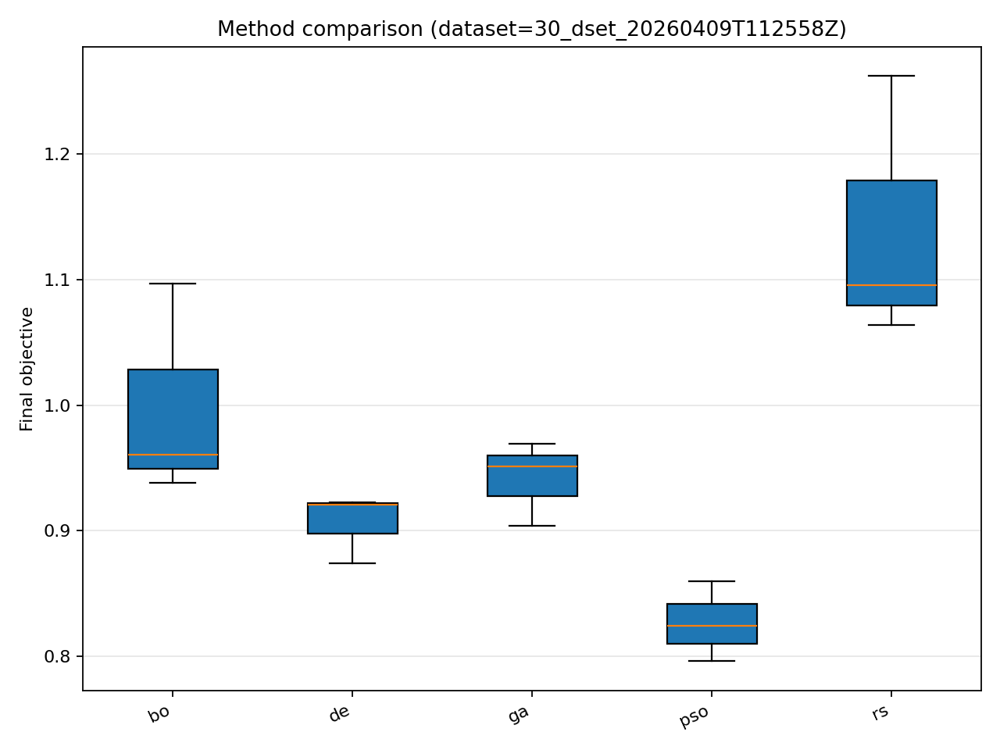
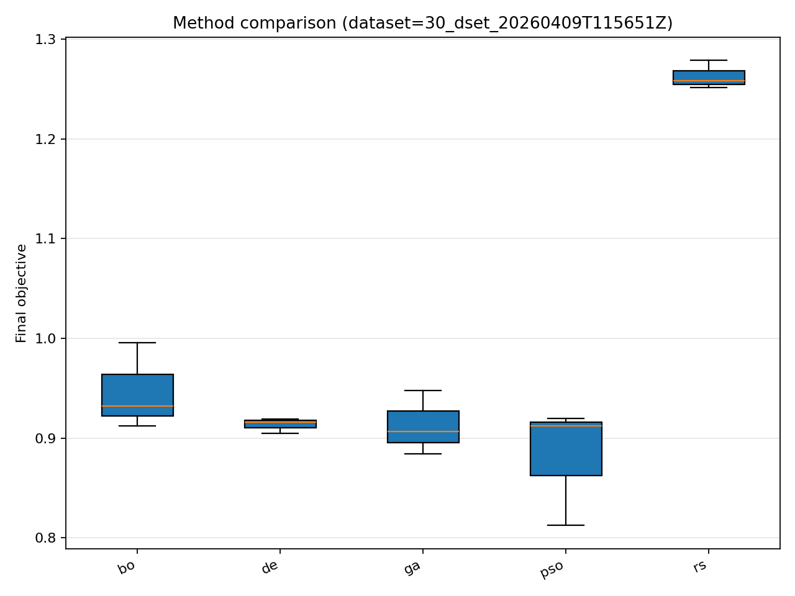
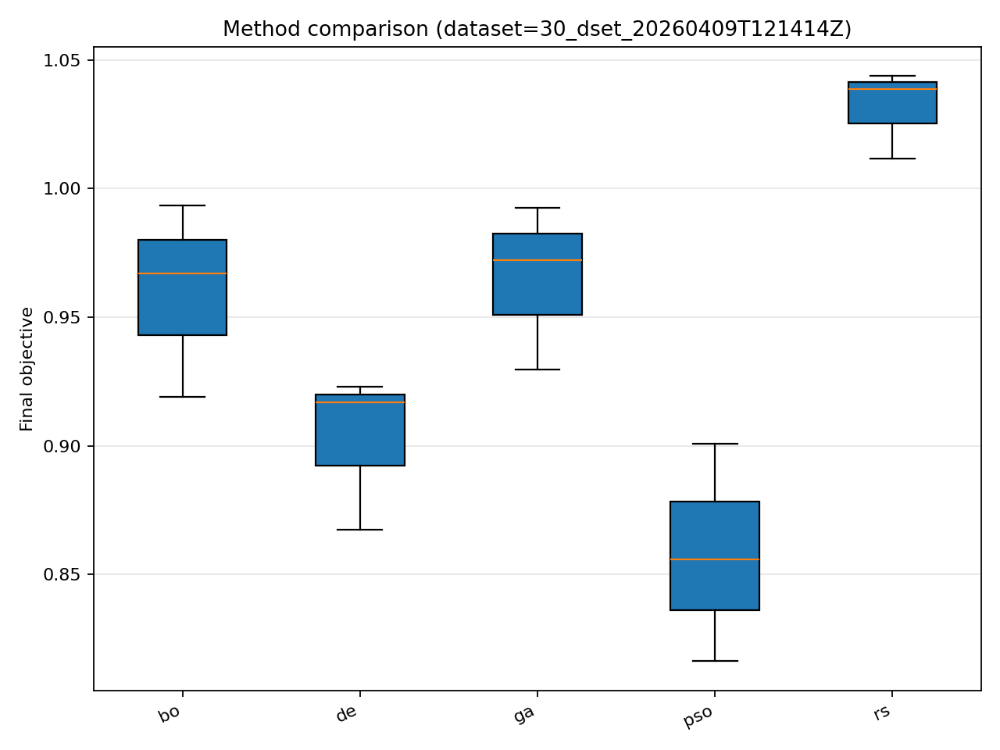

# Отчёт анализа: `divisor_size=30`

## Навигация
- Путь: /[overview](../../report.md)/divisor_size=30
- Переход на нижний уровень:
  - [dataset=30_dset_20260409T112558Z](groups/dataset=30_dset_20260409T112558Z/report.md) (15 runs)
  - [dataset=30_dset_20260409T115651Z](groups/dataset=30_dset_20260409T115651Z/report.md) (15 runs)
  - [dataset=30_dset_20260409T121414Z](groups/dataset=30_dset_20260409T121414Z/report.md) (15 runs)

## Краткая сводка
- запусков в области: **45**
- медиана final objective: **0.923022**
- IQR objective: **0.088471**
- доля успеха (`objective <= 0.678229`): **0.00%**
- медианное время выполнения: **70.931 сек**
- медианный прирост по validation: **87.541%**

## Executive summary
- лучший сегмент по objective: **30_dset_20260409T115651Z**
- лучший сегмент по validation gain: **30_dset_20260409T115651Z**
- statistically significant пар: **0**
- кандидаты на adoption: **30_dset_20260409T112558Z, 30_dset_20260409T115651Z, 30_dset_20260409T121414Z**
- кандидаты под наблюдение: **нет**
- кандидаты на понижение приоритета: **нет**

## Графики
- [final_objective_by_dataset.png](plots/final_objective_by_dataset.png)

- [validation_gain_by_dataset.png](plots/validation_gain_by_dataset.png)

- [pareto_runtime_gain_by_dataset.png](plots/pareto_runtime_gain_by_dataset.png)

- [risk_vs_gain_by_dataset.png](plots/risk_vs_gain_by_dataset.png)

- [time_to_best_by_dataset.png](plots/time_to_best_by_dataset.png)

- [convergence_ribbons_top3_methods.png](plots/convergence_ribbons_top3_methods.png)

- [final_objective_by_method_overall.png](plots/final_objective_by_method_overall.png)

- [final_objective_by_method_dataset=30_dset_20260409T112558Z.png](plots/final_objective_by_method_dataset=30_dset_20260409T112558Z.png)

- [final_objective_by_method_dataset=30_dset_20260409T115651Z.png](plots/final_objective_by_method_dataset=30_dset_20260409T115651Z.png)

- [final_objective_by_method_dataset=30_dset_20260409T121414Z.png](plots/final_objective_by_method_dataset=30_dset_20260409T121414Z.png)

## Таблицы

