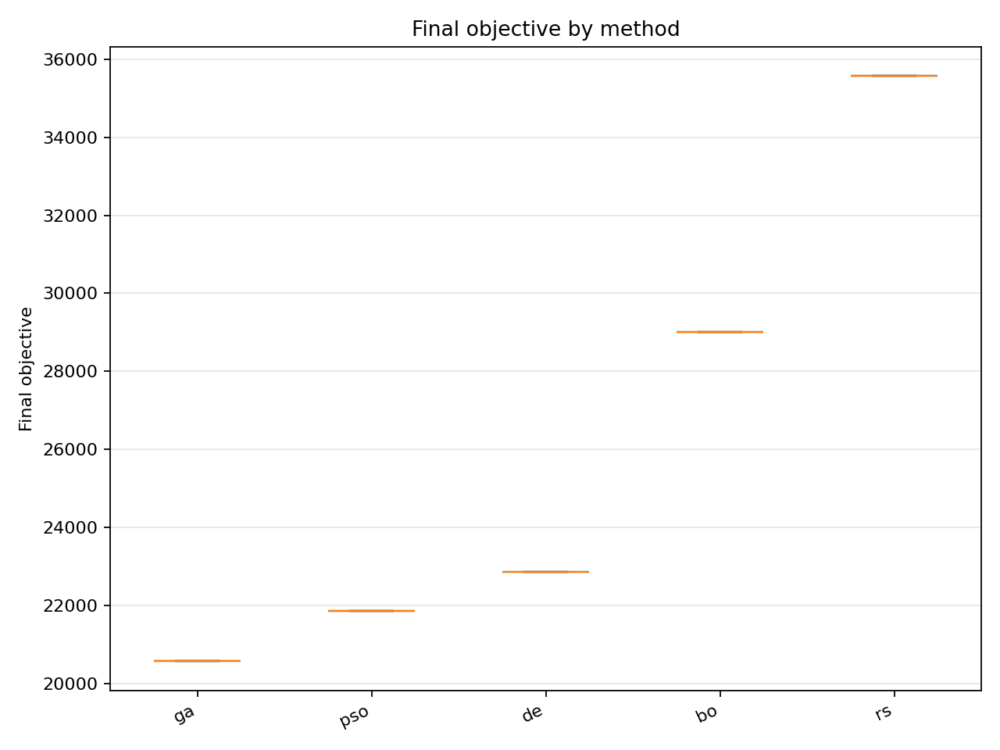
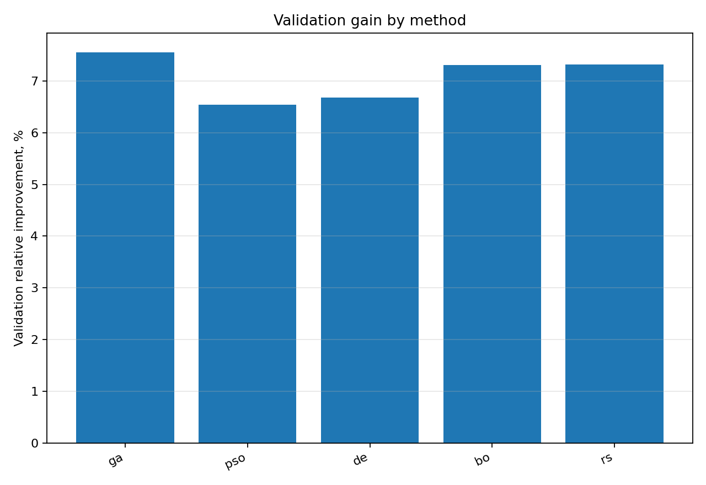
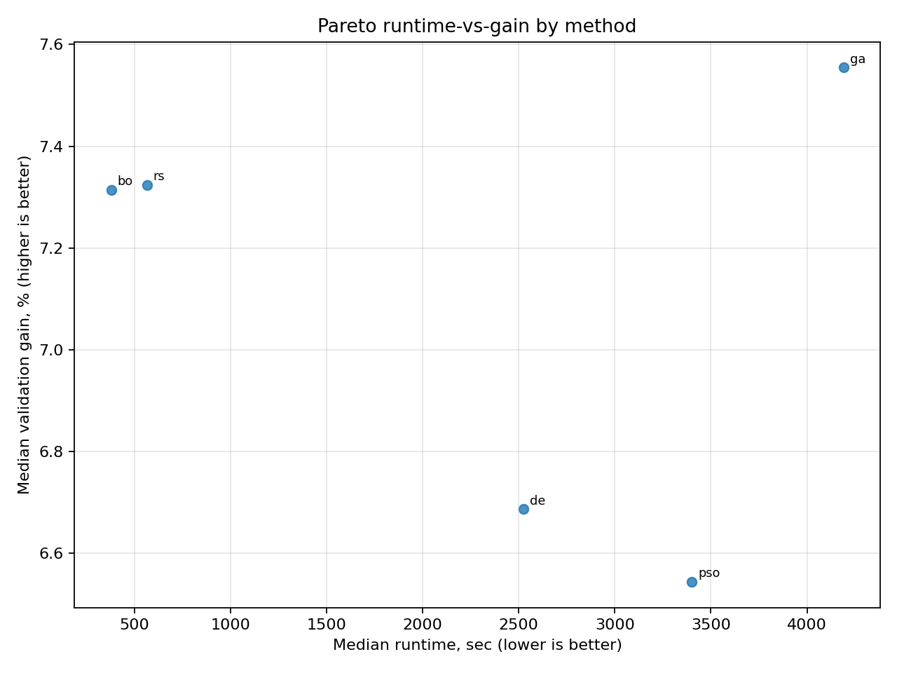
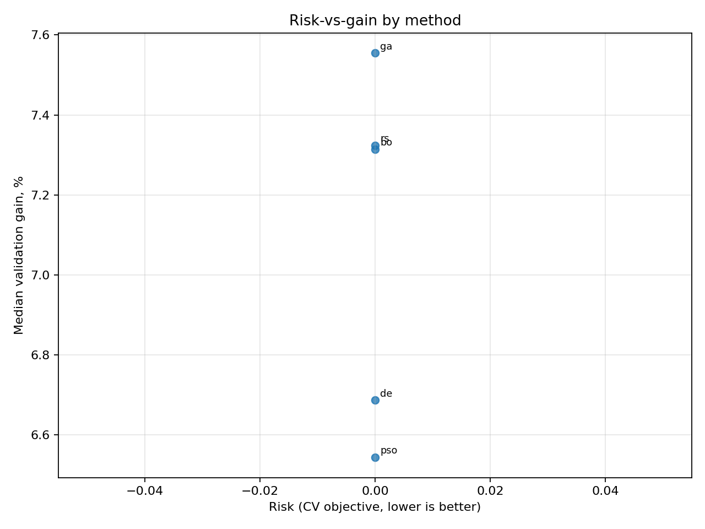
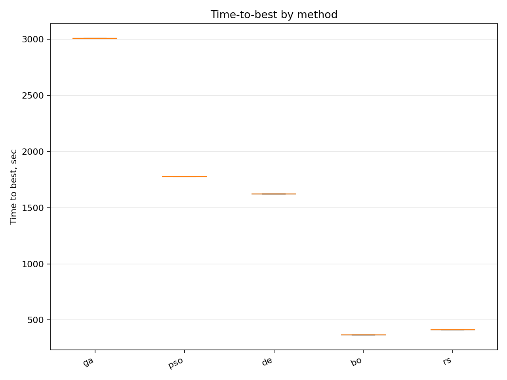
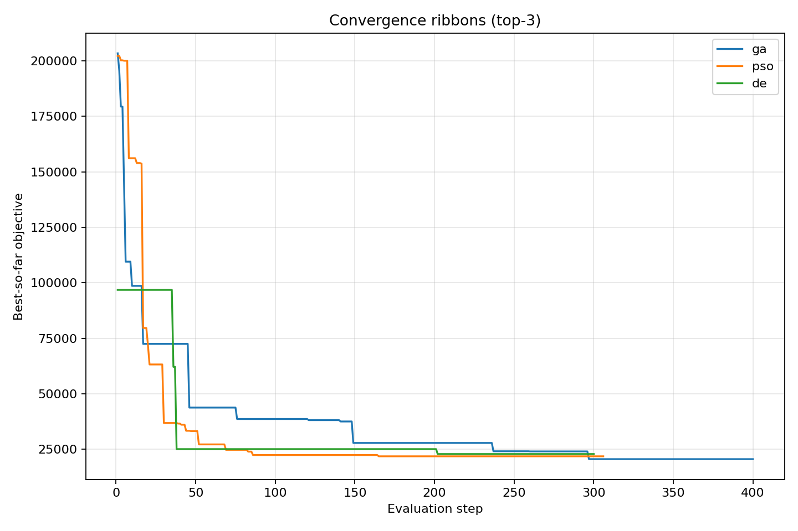
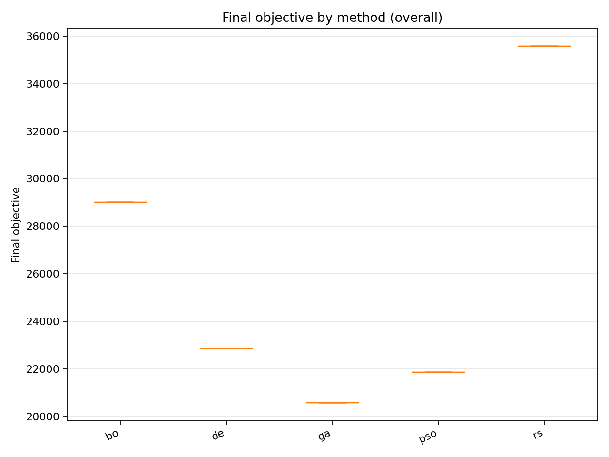
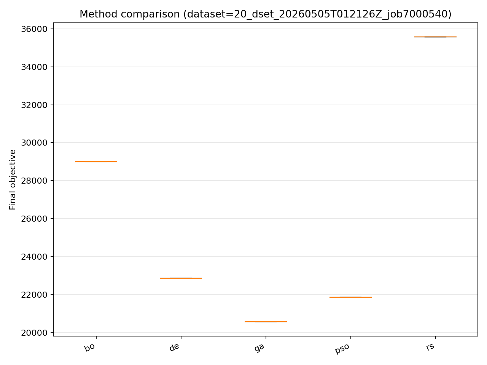

# Отчёт анализа: `divisor_size=20`

## Навигация
- Путь: /[overview](../../report.md)/divisor_size=20
- Переход на нижний уровень:
  - [method=bo](groups/method=bo/report.md) (1 runs)
  - [method=de](groups/method=de/report.md) (1 runs)
  - [method=ga](groups/method=ga/report.md) (1 runs)
  - [method=pso](groups/method=pso/report.md) (1 runs)
  - [method=rs](groups/method=rs/report.md) (1 runs)

## Краткая сводка
- запусков в области: **5**
- медиана final objective: **22861.799513**
- IQR objective: **7152.382429**
- доля успеха (`objective <= 21844.778768`): **40.00%**
- медианное время выполнения: **2525.826 сек**
- медианный прирост по validation: **7.314%**

## Executive summary
- лучший сегмент по objective: **ga**
- лучший сегмент по validation gain: **ga**
- statistically significant пар: **0**
- кандидаты на adoption: **нет**
- кандидаты под наблюдение: **bo, de, ga, pso, rs**
- кандидаты на понижение приоритета: **нет**

## Графики
- [final_objective_by_method.png](plots/final_objective_by_method.png)

- [validation_gain_by_method.png](plots/validation_gain_by_method.png)

- [pareto_runtime_gain_by_method.png](plots/pareto_runtime_gain_by_method.png)

- [risk_vs_gain_by_method.png](plots/risk_vs_gain_by_method.png)

- [time_to_best_by_method.png](plots/time_to_best_by_method.png)

- [convergence_ribbons_top3_methods.png](plots/convergence_ribbons_top3_methods.png)

- [final_objective_by_method_overall.png](plots/final_objective_by_method_overall.png)

- [final_objective_by_method_dataset=20_dset_20260505T012126Z_job7000540.png](plots/final_objective_by_method_dataset=20_dset_20260505T012126Z_job7000540.png)

## Таблицы

