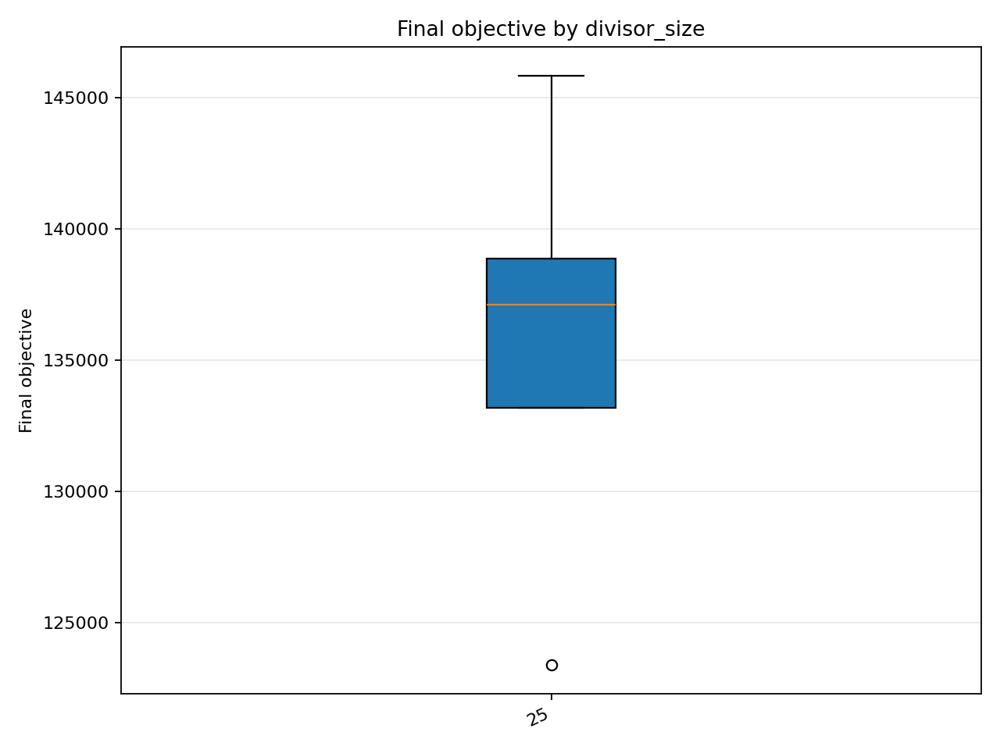
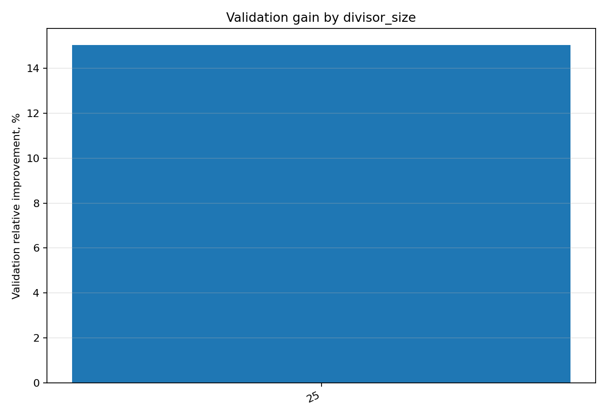
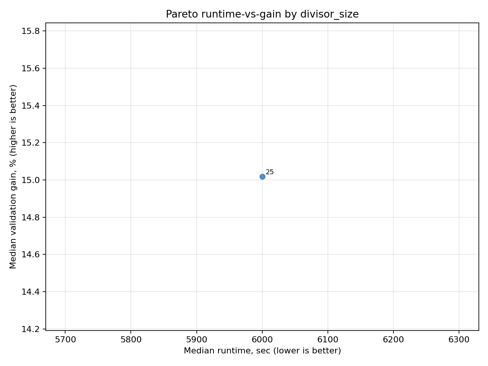
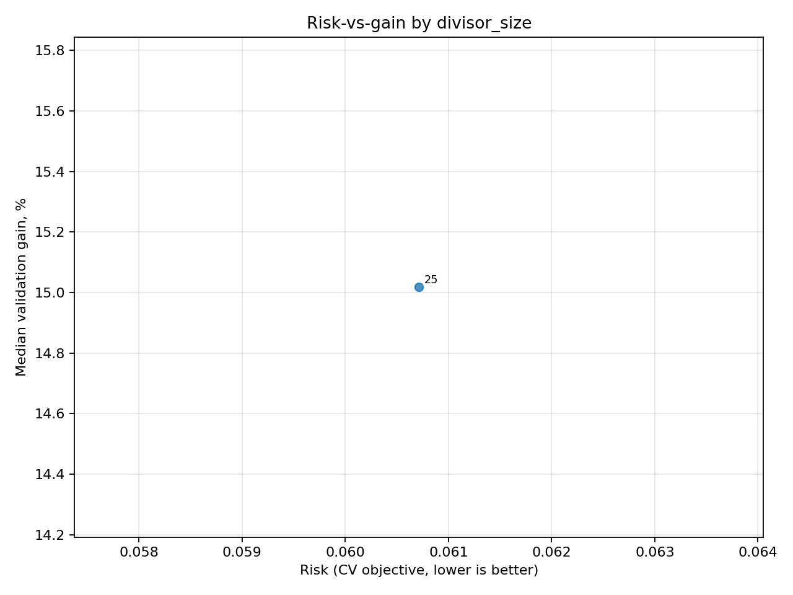
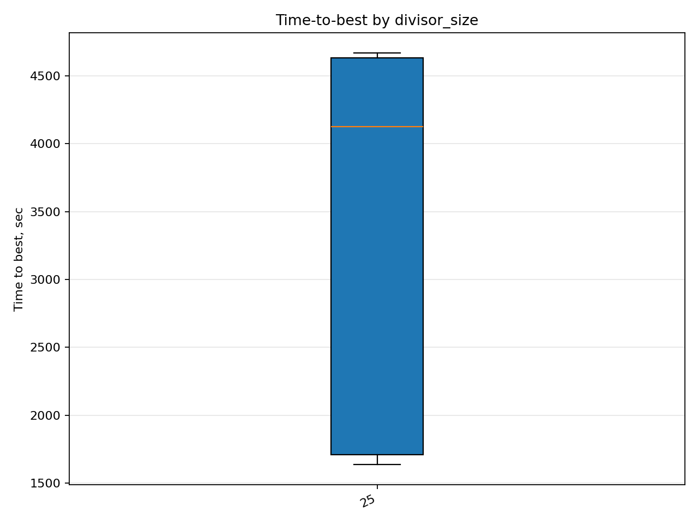
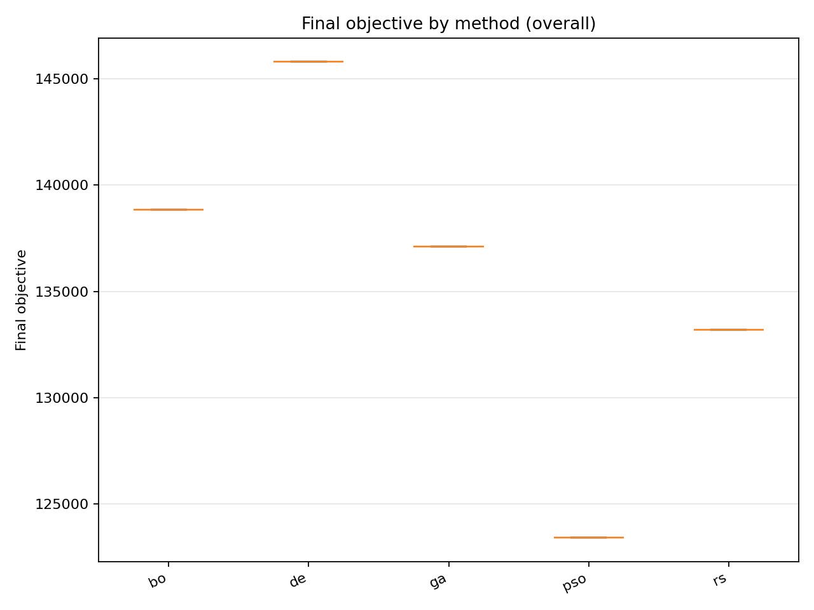
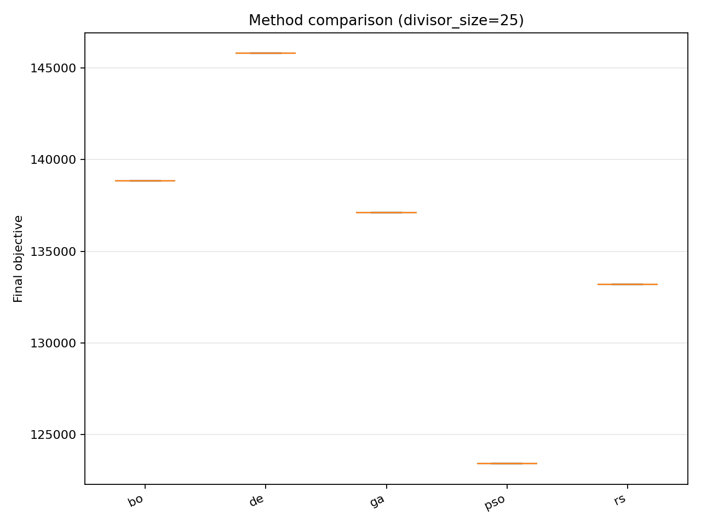

# Отчёт анализа: `overview`

## Навигация
- Путь: /overview
- Переход на нижний уровень:
  - [divisor_size=25](groups/divisor_size=25/report.md) (5 runs)

## Краткая сводка
- запусков в области: **5**
- медиана final objective: **137106.185549**
- IQR objective: **5665.033288**
- доля успеха (`objective <= 133182.802671`): **40.00%**
- медианное время выполнения: **6000.311 сек**
- медианный прирост по validation: **15.018%**

## Executive summary
- лучший сегмент по objective: **25**
- лучший сегмент по validation gain: **25**
- statistically significant пар: **0**
- кандидаты на adoption: **нет**
- кандидаты под наблюдение: **25**
- кандидаты на понижение приоритета: **нет**

## Графики
- [final_objective_by_divisor_size.png](plots/final_objective_by_divisor_size.png)

- [validation_gain_by_divisor_size.png](plots/validation_gain_by_divisor_size.png)

- [pareto_runtime_gain_by_divisor_size.png](plots/pareto_runtime_gain_by_divisor_size.png)

- [risk_vs_gain_by_divisor_size.png](plots/risk_vs_gain_by_divisor_size.png)

- [time_to_best_by_divisor_size.png](plots/time_to_best_by_divisor_size.png)

- [final_objective_by_method_overall.png](plots/final_objective_by_method_overall.png)

- [final_objective_by_method_divisor_size=25.png](plots/final_objective_by_method_divisor_size=25.png)

## Таблицы

