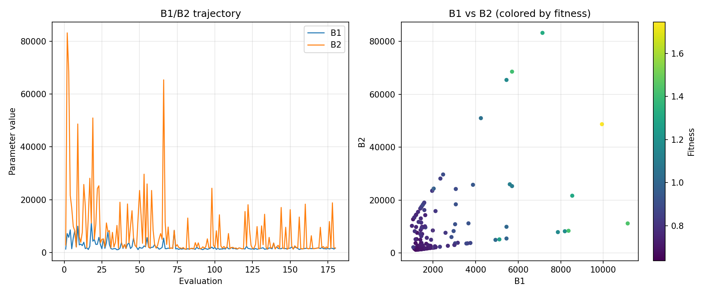
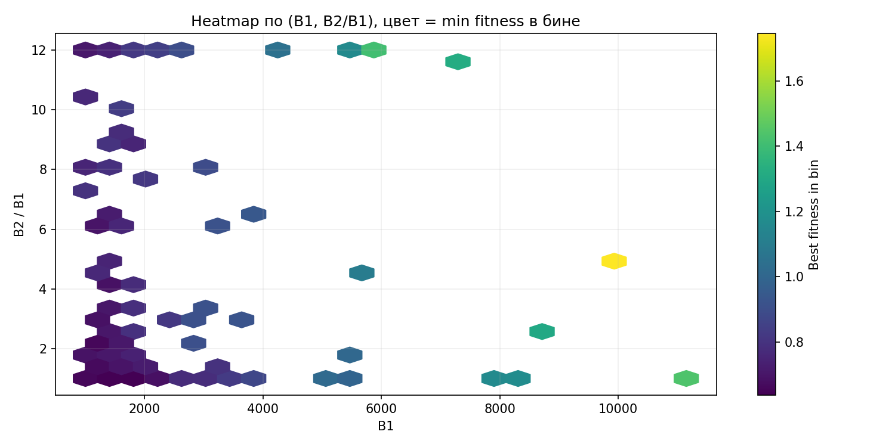
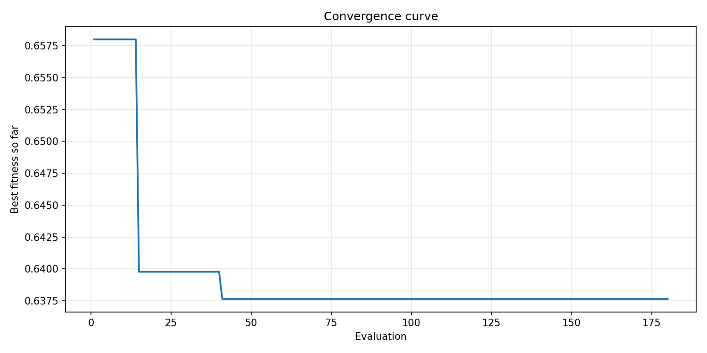
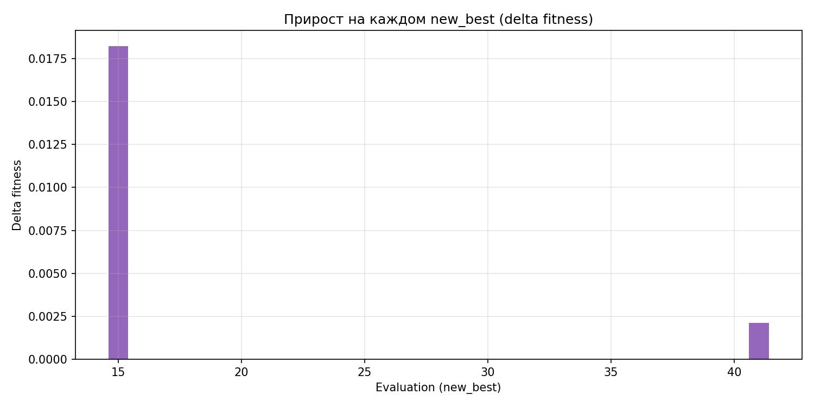
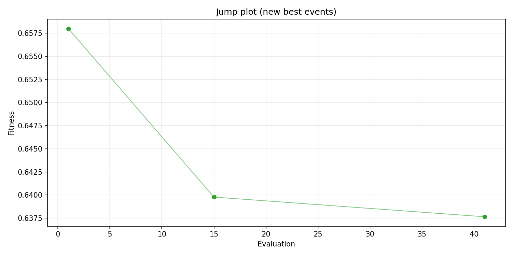
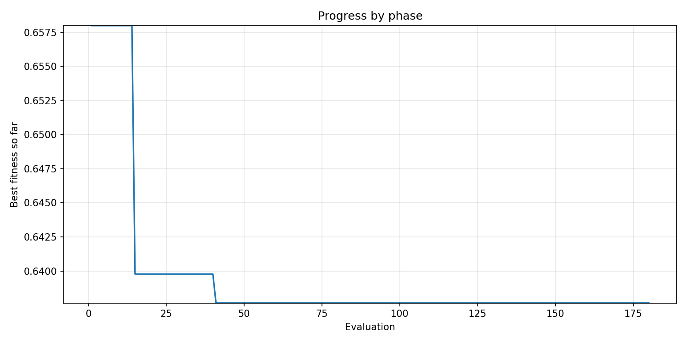
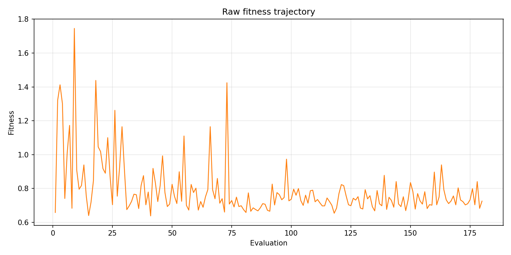
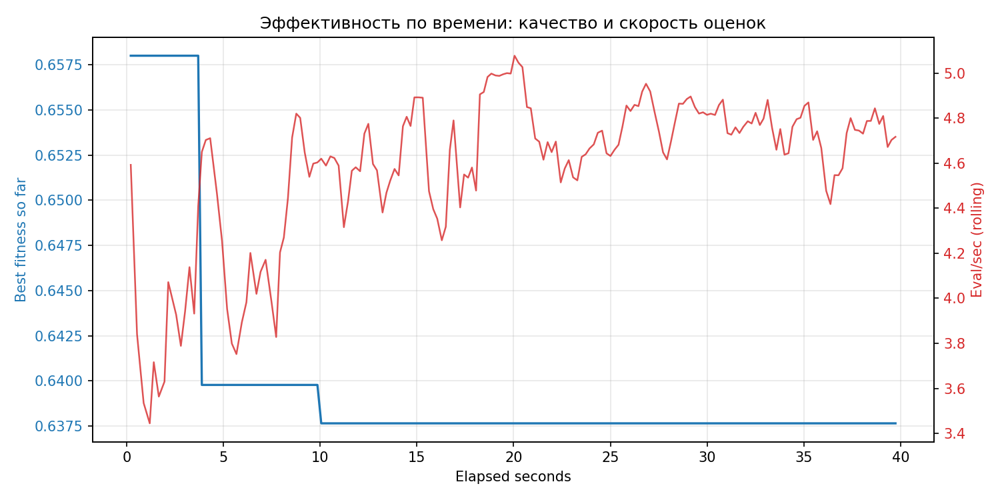

# Отчёт по оптимизации: de_optimize_20260407T150158Z

## Метаданные
- метод: `de`
- датасет: `data/numbers/20_dset_20260407T150118Z/train.json`
- оптимум `(B1, B2)`: `(1473, 1473)`
- objective: `0.6376503233332187`
- curves_per_n: `12`
- границы: `B1[1000.0, 12000.0]`, `B2[1000.0, 144000.0]`, `ratio_max=12.0`

## Ключевые статистики
- `best_eval`: `41`
- `best_eval_fraction`: `0.22777777777777777`
- `eval_per_sec`: `4.530871226684651`
- `evaluation_count`: `180`
- `improvement_percent`: `3.0925063119218903`
- `max_plateau_evals`: `139`
- `median_plateau_evals`: `19.0`
- `new_best_count`: `3`
- `new_best_rate`: `0.016666666666666666`
- `p90_plateau_evals`: `104.80000000000003`
- `time_to_best_sec`: `10.059171120054089`
- `time_to_first_improvement_sec`: `0.21777722402475774`
- `total_runtime_sec`: `39.72745880304137`

## Флаги внимания

| Флаг | Статус | Текущее значение | Порог | Что это значит | Что делать |
|---|---|---:|---:|---|---|
| `late_best` | ✅ ОК | `0.2532044944008349` | `> 0.85` | Лучшее решение найдено слишком поздно относительно общего времени. | Усилить ранний поиск или пересмотреть бюджет/инициализацию. |
| `low_improvement` | ⚠️ ВНИМАНИЕ | `3.0925063119218903` | `< 10%` | Итоговый прирост качества слишком мал. | Сузить границы поиска или изменить параметры метода. |
| `low_signal` | ⚠️ ВНИМАНИЕ | `0.016666666666666666` | `< 0.03` | Слишком низкая плотность новых best-событий (слабый сигнал оптимизации). | Перенастроить exploration и сделать переоценку top-k кандидатов. |
| `plateau_too_long` | ⚠️ ВНИМАНИЕ | `0.7722222222222223` | `> 0.50` | Слишком длинное плато: улучшений почти нет на большом участке запуска. | Увеличить exploration или добавить политику рестартов. |

## Графики
- [`de_optimize_20260407T150158Z_b1_b2_trajectory.png`](plots/de_optimize_20260407T150158Z_b1_b2_trajectory.png)

- [`de_optimize_20260407T150158Z_b1_ratio_heatmap.png`](plots/de_optimize_20260407T150158Z_b1_ratio_heatmap.png)

- [`de_optimize_20260407T150158Z_convergence.png`](plots/de_optimize_20260407T150158Z_convergence.png)

- [`de_optimize_20260407T150158Z_improvement_deltas.png`](plots/de_optimize_20260407T150158Z_improvement_deltas.png)

- [`de_optimize_20260407T150158Z_jump_plot.png`](plots/de_optimize_20260407T150158Z_jump_plot.png)

- [`de_optimize_20260407T150158Z_progress_by_phase.png`](plots/de_optimize_20260407T150158Z_progress_by_phase.png)

- [`de_optimize_20260407T150158Z_raw_fitness.png`](plots/de_optimize_20260407T150158Z_raw_fitness.png)

- [`de_optimize_20260407T150158Z_time_efficiency.png`](plots/de_optimize_20260407T150158Z_time_efficiency.png)

## Таблицы

