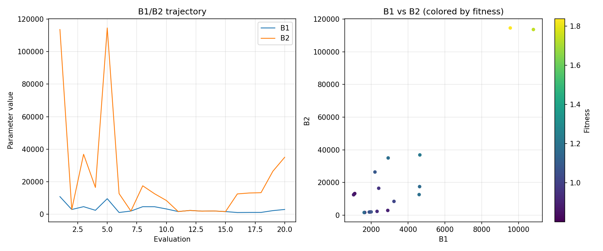
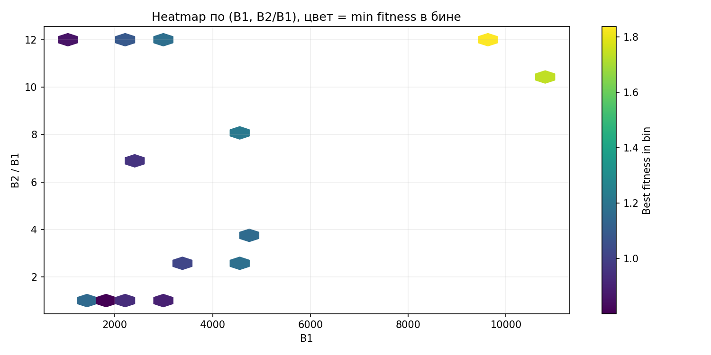
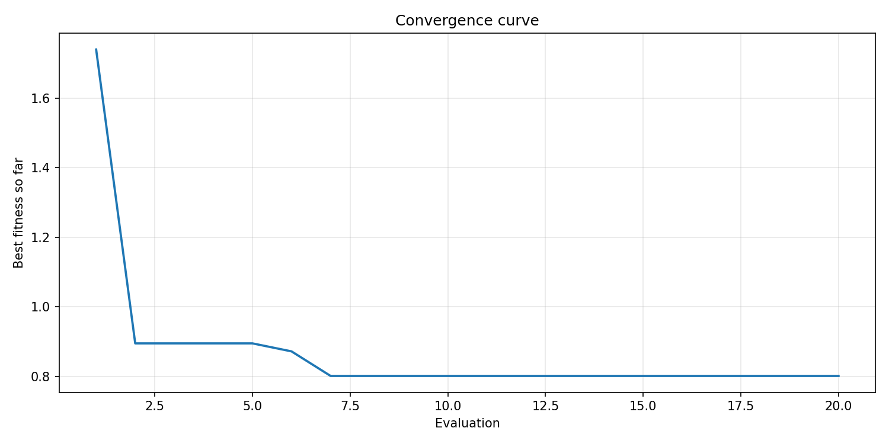
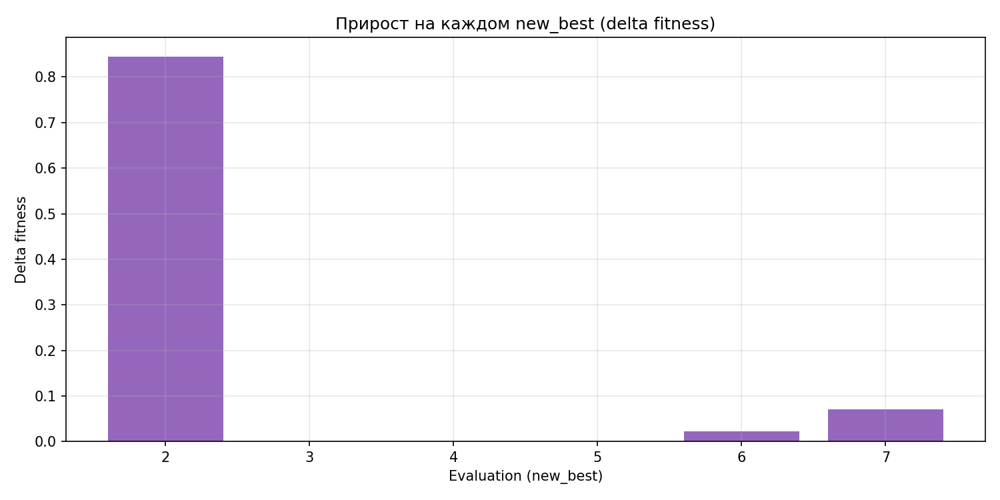
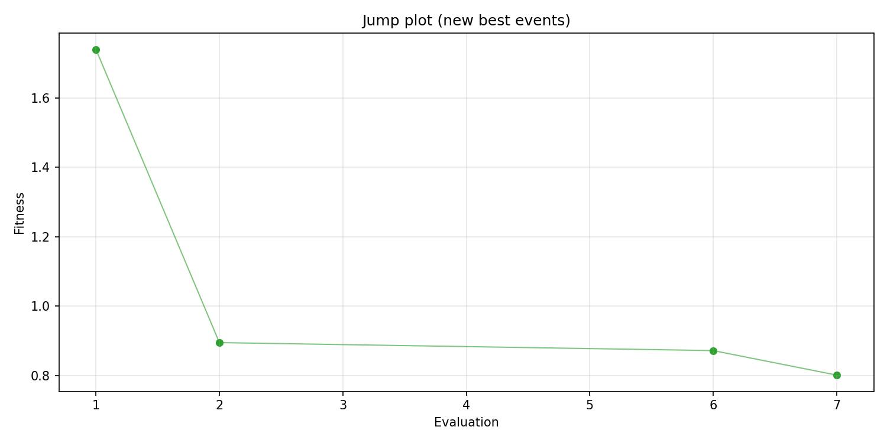
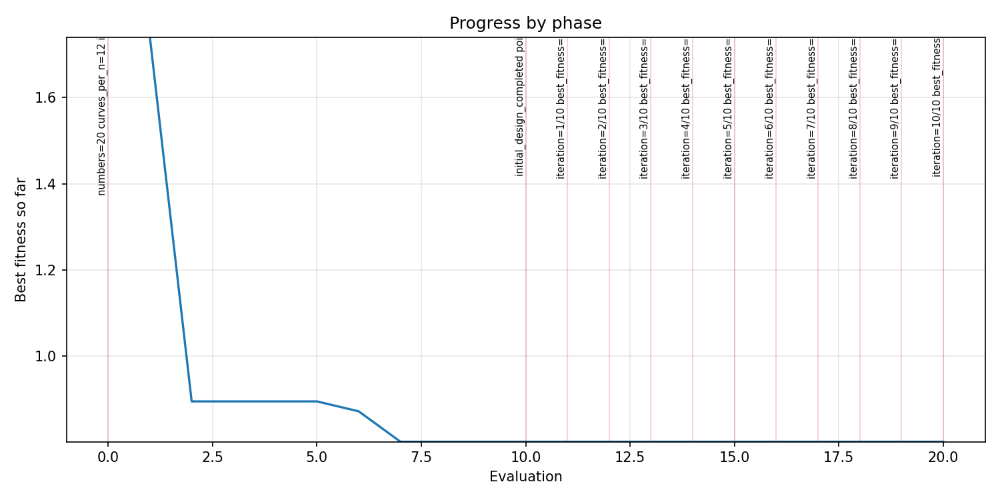
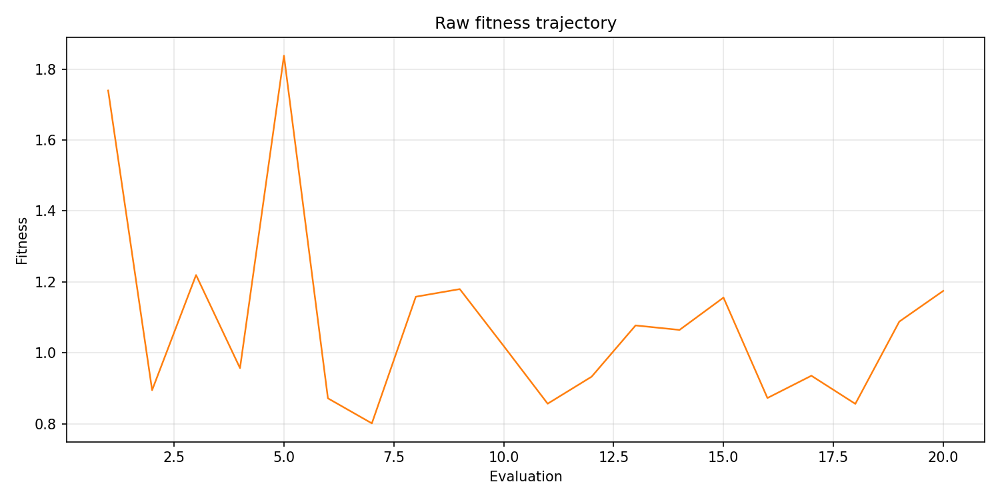
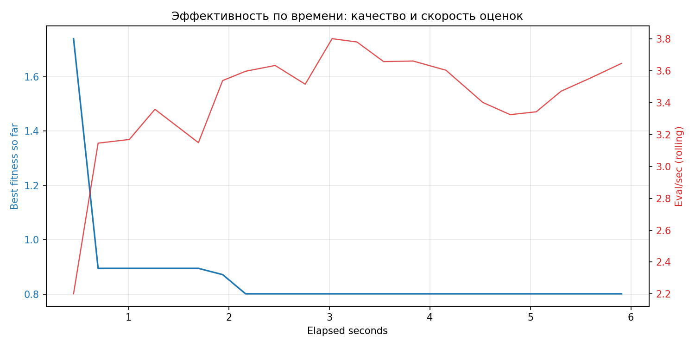

# Отчёт по оптимизации: bo_optimize_20260407T151158Z

## Метаданные
- метод: `bo`
- датасет: `data/numbers/20_dset_20260407T150927Z/train.json`
- оптимум `(B1, B2)`: `(1942, 1942)`
- objective: `0.8014524304016959`
- curves_per_n: `12`
- границы: `B1[1000.0, 12000.0]`, `B2[1000.0, 144000.0]`, `ratio_max=12.0`

## Ключевые статистики
- `best_eval`: `7`
- `best_eval_fraction`: `0.35`
- `eval_per_sec`: `3.3859629491008523`
- `evaluation_count`: `20`
- `improvement_percent`: `53.92937622982037`
- `max_plateau_evals`: `13`
- `median_plateau_evals`: `0.0`
- `new_best_count`: `4`
- `new_best_rate`: `0.2`
- `p90_plateau_evals`: `9.0`
- `time_to_best_sec`: `2.165911986026913`
- `time_to_first_improvement_sec`: `0.45446038799127564`
- `total_runtime_sec`: `5.906929421995301`

## Флаги внимания

| Флаг | Статус | Текущее значение | Порог | Что это значит | Что делать |
|---|---|---:|---:|---|---|
| `late_best` | ✅ ОК | `0.36667307687168704` | `> 0.85` | Лучшее решение найдено слишком поздно относительно общего времени. | Усилить ранний поиск или пересмотреть бюджет/инициализацию. |
| `low_improvement` | ✅ ОК | `53.92937622982037` | `< 10%` | Итоговый прирост качества слишком мал. | Сузить границы поиска или изменить параметры метода. |
| `low_signal` | ✅ ОК | `0.2` | `< 0.03` | Слишком низкая плотность новых best-событий (слабый сигнал оптимизации). | Перенастроить exploration и сделать переоценку top-k кандидатов. |
| `plateau_too_long` | ⚠️ ВНИМАНИЕ | `0.65` | `> 0.50` | Слишком длинное плато: улучшений почти нет на большом участке запуска. | Увеличить exploration или добавить политику рестартов. |

## Графики
- [`bo_optimize_20260407T151158Z_b1_b2_trajectory.png`](plots/bo_optimize_20260407T151158Z_b1_b2_trajectory.png)

- [`bo_optimize_20260407T151158Z_b1_ratio_heatmap.png`](plots/bo_optimize_20260407T151158Z_b1_ratio_heatmap.png)

- [`bo_optimize_20260407T151158Z_convergence.png`](plots/bo_optimize_20260407T151158Z_convergence.png)

- [`bo_optimize_20260407T151158Z_improvement_deltas.png`](plots/bo_optimize_20260407T151158Z_improvement_deltas.png)

- [`bo_optimize_20260407T151158Z_jump_plot.png`](plots/bo_optimize_20260407T151158Z_jump_plot.png)

- [`bo_optimize_20260407T151158Z_progress_by_phase.png`](plots/bo_optimize_20260407T151158Z_progress_by_phase.png)

- [`bo_optimize_20260407T151158Z_raw_fitness.png`](plots/bo_optimize_20260407T151158Z_raw_fitness.png)

- [`bo_optimize_20260407T151158Z_time_efficiency.png`](plots/bo_optimize_20260407T151158Z_time_efficiency.png)

## Таблицы

