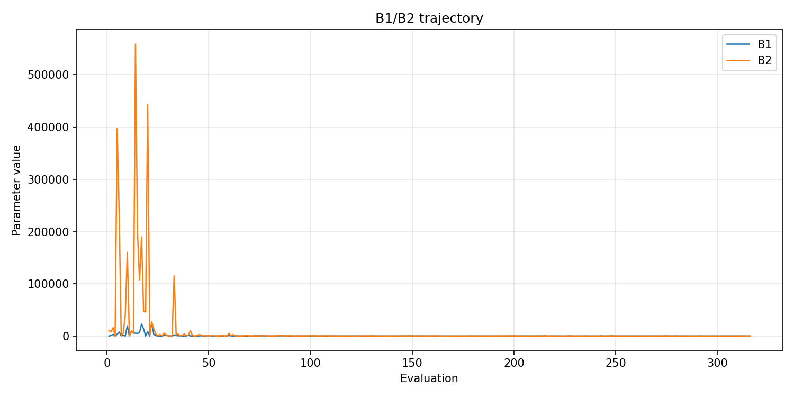
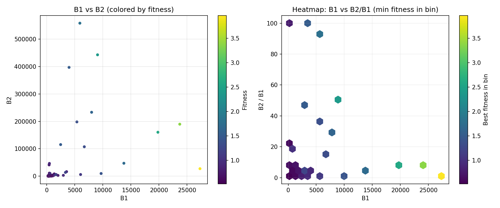
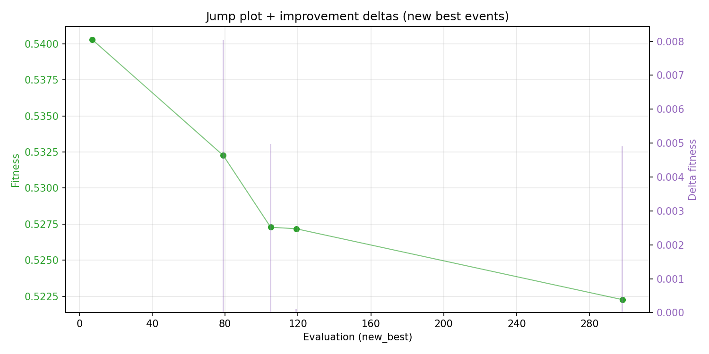
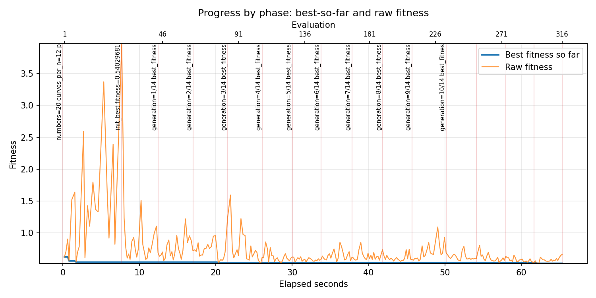
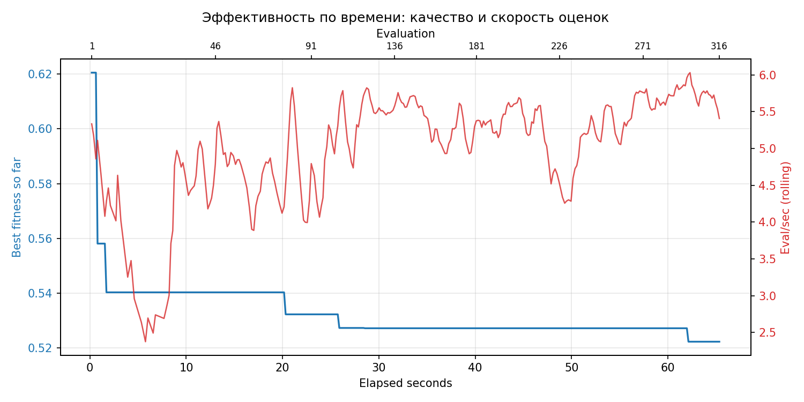
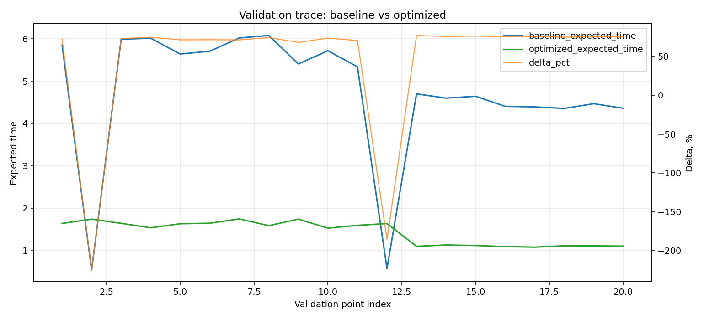

# Отчёт по оптимизации: ga_optimize_20260420T151851Z

## Метаданные
- метод: `ga`
- датасет: `data/numbers/20_dset_20260420T151523Z/train.json`
- оптимум `(B1, B2)`: `(356, 356)`
- objective: `0.5222693495004478`
- curves_per_n: `12`
- границы: `B1[100.0, 30000.0]`, `B2[100.0, 600000.0]`, `ratio_max=100.0`

## Ключевые статистики
- `best_eval`: `298`
- `best_eval_fraction`: `0.9430379746835443`
- `eval_per_sec`: `4.836380188147448`
- `evaluation_count`: `316`
- `improvement_percent`: `15.836962138663818`
- `max_plateau_evals`: `178`
- `median_plateau_evals`: `21.5`
- `new_best_count`: `5`
- `new_best_rate`: `0.015822784810126583`
- `p90_plateau_evals`: `124.5`
- `time_to_best_sec`: `62.13126111499969`
- `time_to_first_improvement_sec`: `7.69277947899991`
- `total_runtime_sec`: `65.33832051599984`

## Флаги внимания

| Флаг | Статус | Текущее значение | Порог | Что это значит | Что делать |
|---|---|---:|---:|---|---|
| `b1_hits_boundary` | ✅ ОК | `0.0031645569620253164` | `> 0.10` | Большая доля оценок проходит близко к границам B1. | Расширить диапазон B1, если упор в границу повторяется. |
| `b2_hits_boundary` | ✅ ОК | `0.0031645569620253164` | `> 0.10` | Большая доля оценок проходит близко к границам B2. | Расширить диапазон B2, если упор в границу повторяется. |
| `best_b1_on_boundary` | ✅ ОК | `356.0` | `within 2% of log-range [100.0, 30000.0]` | Лучший найденный B1 лежит на границе диапазона. | Проверить расширенный диапазон B1 вокруг текущей границы. |
| `best_b2_on_boundary` | ✅ ОК | `356.0` | `within 2% of log-range [100.0, 600000.0]` | Лучший найденный B2 лежит на границе диапазона. | Проверить расширенный диапазон B2 вокруг текущей границы. |
| `best_ratio_on_boundary` | ✅ ОК | `1.0` | `within 2% of log-range up to ratio_max=100.0` | Лучшее отношение B2/B1 находится у верхней границы ratio_max. | Увеличить ratio_max и перепроверить локальный поиск в новой области. |
| `late_best` | ⚠️ ВНИМАНИЕ | `0.9509161028983777` | `> 0.85` | Лучшее решение найдено слишком поздно относительно общего времени. | Усилить ранний поиск или пересмотреть бюджет/инициализацию. |
| `low_improvement` | ✅ ОК | `15.836962138663818` | `< 10%` | Итоговый прирост качества слишком мал. | Сузить границы поиска или изменить параметры метода. |
| `low_signal` | ⚠️ ВНИМАНИЕ | `0.015822784810126583` | `< 0.03` | Слишком низкая плотность новых best-событий (слабый сигнал оптимизации). | Перенастроить exploration и сделать переоценку top-k кандидатов. |
| `plateau_too_long` | ⚠️ ВНИМАНИЕ | `0.5632911392405063` | `> 0.50` | Слишком длинное плато: улучшений почти нет на большом участке запуска. | Увеличить exploration или добавить политику рестартов. |
| `ratio_hits_boundary` | ⚠️ ВНИМАНИЕ | `0.7373417721518988` | `> 0.10` | Большая доля оценок проходит близко к границе отношения B2/B1. | Увеличить ratio_max, если хорошие точки упираются в ограничение отношения B2/B1. |

## Графики
- [`ga_optimize_20260420T151851Z_b1_b2_trajectory.png`](plots/ga_optimize_20260420T151851Z_b1_b2_trajectory.png)

- [`ga_optimize_20260420T151851Z_b1_ratio_heatmap.png`](plots/ga_optimize_20260420T151851Z_b1_ratio_heatmap.png)

- [`ga_optimize_20260420T151851Z_jump_plot.png`](plots/ga_optimize_20260420T151851Z_jump_plot.png)

- [`ga_optimize_20260420T151851Z_progress_by_phase.png`](plots/ga_optimize_20260420T151851Z_progress_by_phase.png)

- [`ga_optimize_20260420T151851Z_time_efficiency.png`](plots/ga_optimize_20260420T151851Z_time_efficiency.png)

## Таблицы

## Validation runs

### Validation run `20260420T151854Z`
- validation file: [`ga_validate_20260420T151854Z.json`](ga_validate_20260420T151854Z.json)
- dataset: `data/numbers/20_dset_20260420T151523Z/control.json`
- method: `ga`
- optimized params: `(B1, B2)=(356, 356)`
- baseline params: `(B1, B2)=(11000, 220000)`
- curves_per_n: `24`
- curve_timeout_sec: `None`
- workers: `12`
- seed: `42`
- optimized_mean: `1.4230648160018973`
- baseline_mean: `4.739171412402948`
- relative_improvement_pct: `69.972286457553`
- trace plot: [`ga_validate_20260420T151854Z_trace.png`](plots/ga_validate_20260420T151854Z_trace.png)

---
