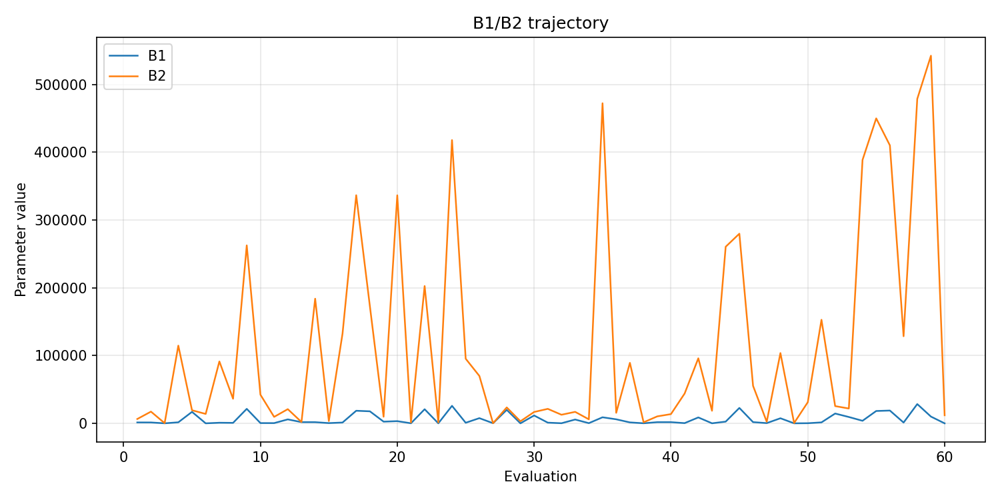
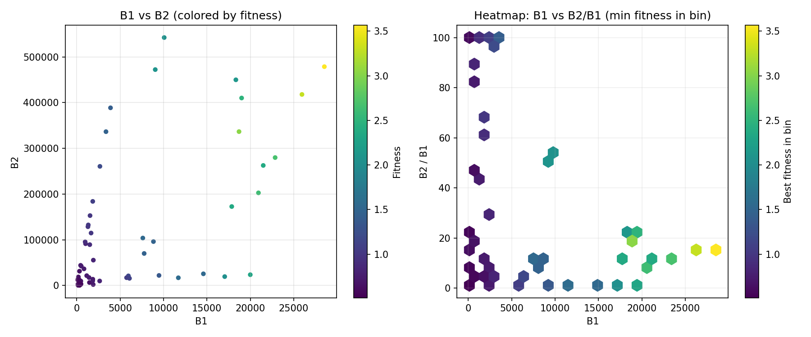
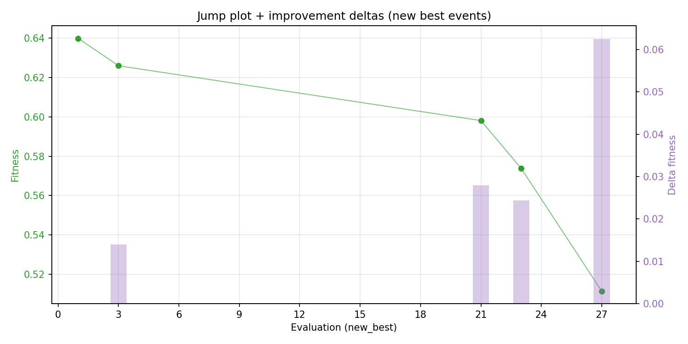
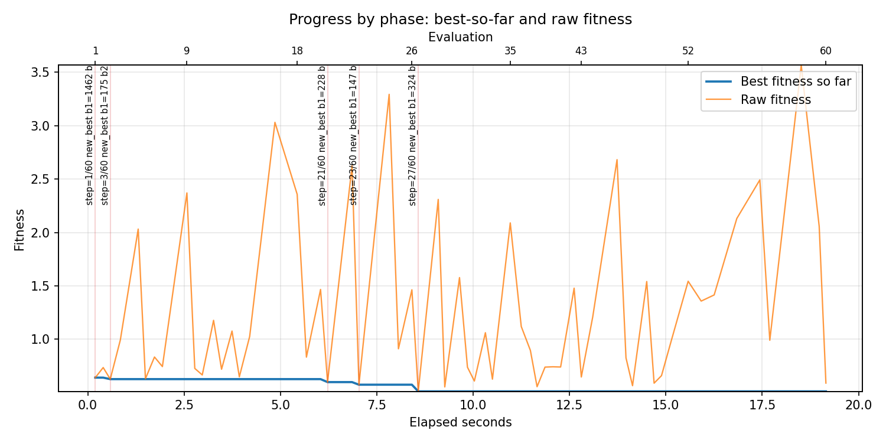
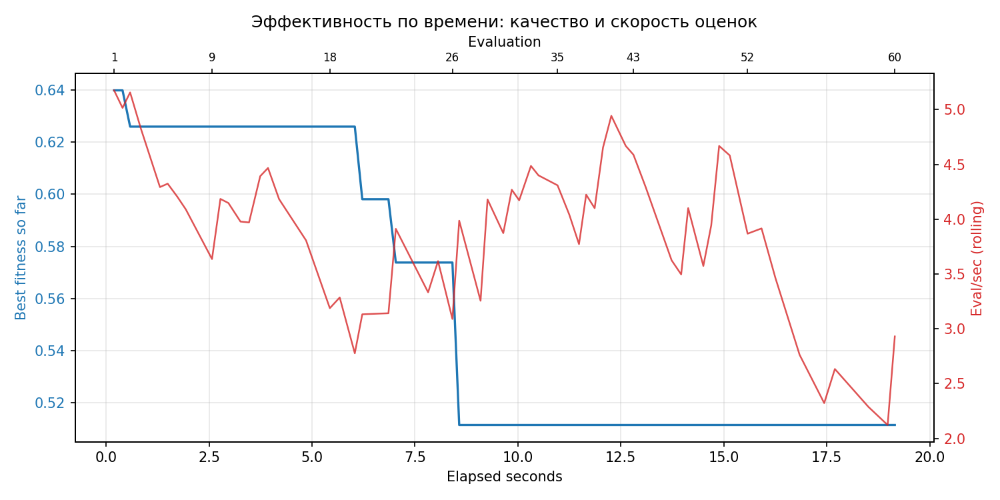
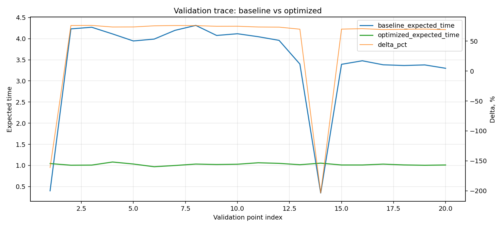

# Отчёт по оптимизации: rs_optimize_20260420T151633Z

## Метаданные
- метод: `rs`
- датасет: `data/numbers/20_dset_20260420T151523Z/train.json`
- оптимум `(B1, B2)`: `(324, 346)`
- objective: `0.5113237614980335`
- curves_per_n: `12`
- границы: `B1[100.0, 30000.0]`, `B2[100.0, 600000.0]`, `ratio_max=100.0`

## Ключевые статистики
- `best_eval`: `27`
- `best_eval_fraction`: `0.45`
- `eval_per_sec`: `3.132793344761482`
- `evaluation_count`: `60`
- `improvement_percent`: `20.102130655300662`
- `max_plateau_evals`: `33`
- `median_plateau_evals`: `2.0`
- `new_best_count`: `5`
- `new_best_rate`: `0.08333333333333333`
- `p90_plateau_evals`: `25.0`
- `time_to_best_sec`: `8.574509542000214`
- `time_to_first_improvement_sec`: `0.1932735360001061`
- `total_runtime_sec`: `19.15223680500003`

## Флаги внимания

| Флаг | Статус | Текущее значение | Порог | Что это значит | Что делать |
|---|---|---:|---:|---|---|
| `b1_hits_boundary` | ✅ ОК | `0.016666666666666666` | `> 0.10` | Большая доля оценок проходит близко к границам B1. | Расширить диапазон B1, если упор в границу повторяется. |
| `b2_hits_boundary` | ✅ ОК | `0.016666666666666666` | `> 0.10` | Большая доля оценок проходит близко к границам B2. | Расширить диапазон B2, если упор в границу повторяется. |
| `best_b1_on_boundary` | ✅ ОК | `324.0` | `within 2% of log-range [100.0, 30000.0]` | Лучший найденный B1 лежит на границе диапазона. | Проверить расширенный диапазон B1 вокруг текущей границы. |
| `best_b2_on_boundary` | ✅ ОК | `346.0` | `within 2% of log-range [100.0, 600000.0]` | Лучший найденный B2 лежит на границе диапазона. | Проверить расширенный диапазон B2 вокруг текущей границы. |
| `best_ratio_on_boundary` | ✅ ОК | `1.0679012345679013` | `within 2% of log-range up to ratio_max=100.0` | Лучшее отношение B2/B1 находится у верхней границы ratio_max. | Увеличить ratio_max и перепроверить локальный поиск в новой области. |
| `late_best` | ✅ ОК | `0.44770277379620155` | `> 0.85` | Лучшее решение найдено слишком поздно относительно общего времени. | Усилить ранний поиск или пересмотреть бюджет/инициализацию. |
| `low_improvement` | ✅ ОК | `20.102130655300662` | `< 10%` | Итоговый прирост качества слишком мал. | Сузить границы поиска или изменить параметры метода. |
| `low_signal` | ✅ ОК | `0.08333333333333333` | `< 0.03` | Слишком низкая плотность новых best-событий (слабый сигнал оптимизации). | Перенастроить exploration и сделать переоценку top-k кандидатов. |
| `plateau_too_long` | ⚠️ ВНИМАНИЕ | `0.55` | `> 0.50` | Слишком длинное плато: улучшений почти нет на большом участке запуска. | Увеличить exploration или добавить политику рестартов. |
| `ratio_hits_boundary` | ⚠️ ВНИМАНИЕ | `0.26666666666666666` | `> 0.10` | Большая доля оценок проходит близко к границе отношения B2/B1. | Увеличить ratio_max, если хорошие точки упираются в ограничение отношения B2/B1. |

## Графики
- [`rs_optimize_20260420T151633Z_b1_b2_trajectory.png`](plots/rs_optimize_20260420T151633Z_b1_b2_trajectory.png)

- [`rs_optimize_20260420T151633Z_b1_ratio_heatmap.png`](plots/rs_optimize_20260420T151633Z_b1_ratio_heatmap.png)

- [`rs_optimize_20260420T151633Z_jump_plot.png`](plots/rs_optimize_20260420T151633Z_jump_plot.png)

- [`rs_optimize_20260420T151633Z_progress_by_phase.png`](plots/rs_optimize_20260420T151633Z_progress_by_phase.png)

- [`rs_optimize_20260420T151633Z_time_efficiency.png`](plots/rs_optimize_20260420T151633Z_time_efficiency.png)

## Таблицы

## Validation runs

### Validation run `20260420T151636Z`
- validation file: [`rs_validate_20260420T151636Z.json`](rs_validate_20260420T151636Z.json)
- dataset: `data/numbers/20_dset_20260420T151523Z/control.json`
- method: `rs`
- optimized params: `(B1, B2)=(324, 346)`
- baseline params: `(B1, B2)=(11000, 220000)`
- curves_per_n: `24`
- curve_timeout_sec: `None`
- workers: `12`
- seed: `42`
- optimized_mean: `1.0242837750006402`
- baseline_mean: `3.484505104151026`
- relative_improvement_pct: `70.6046125809823`
- trace plot: [`rs_validate_20260420T151636Z_trace.png`](plots/rs_validate_20260420T151636Z_trace.png)

---
