# Отчёт по оптимизации: bo_optimize_20260427T233101Z

## Метаданные
- метод: `bo`
- датасет: `data/numbers/20_dset_20260427T224546Z/train.json`
- оптимум `(B1, B2)`: `(25732, 512730)`
- objective: `214301.23010447377`
- max_curves_per_n: `100`
- repeats_per_n: `3`
- границы: `B1[100.0, 30000.0]`, `B2[100.0, 600000.0]`, `ratio_max=100.0`

## Ключевые статистики
- `best_eval`: `25`
- `best_eval_fraction`: `0.6578947368421053`
- `eval_per_sec`: `0.21946443322722908`
- `evaluation_count`: `38`
- `improvement_percent`: `80.51807709467455`
- `max_plateau_evals`: `16`
- `median_plateau_evals`: `5.0`
- `new_best_count`: `4`
- `new_best_rate`: `0.10526315789473684`
- `p90_plateau_evals`: `14.8`
- `time_to_best_sec`: `85.23404154599848`
- `time_to_first_improvement_sec`: `1.3768083089962602`
- `total_runtime_sec`: `173.14888163499563`

## Флаги внимания

| Флаг | Статус | Текущее значение | Порог | Что это значит | Что делать |
|---|---|---:|---:|---|---|
| `b1_hits_boundary` | ⚠️ ВНИМАНИЕ | `0.13157894736842105` | `> 0.10` | Большая доля оценок проходит близко к границам B1. | Расширить диапазон B1, если упор в границу повторяется. |
| `b2_hits_boundary` | ⚠️ ВНИМАНИЕ | `0.18421052631578946` | `> 0.10` | Большая доля оценок проходит близко к границам B2. | Расширить диапазон B2, если упор в границу повторяется. |
| `best_b1_on_boundary` | ✅ ОК | `25732.0` | `within 2% of log-range [100.0, 30000.0]` | Лучший найденный B1 лежит на границе диапазона. | Проверить расширенный диапазон B1 вокруг текущей границы. |
| `best_b2_on_boundary` | ⚠️ ВНИМАНИЕ | `512730.0` | `within 2% of log-range [100.0, 600000.0]` | Лучший найденный B2 лежит на границе диапазона. | Проверить расширенный диапазон B2 вокруг текущей границы. |
| `best_ratio_on_boundary` | ✅ ОК | `19.925773356132442` | `within 2% of log-range up to ratio_max=100.0` | Лучшее отношение B2/B1 находится у верхней границы ratio_max. | Увеличить ratio_max и перепроверить локальный поиск в новой области. |
| `late_best` | ✅ ОК | `0.4922586894073913` | `> 0.85` | Лучшее решение найдено слишком поздно относительно общего времени. | Усилить ранний поиск или пересмотреть бюджет/инициализацию. |
| `low_improvement` | ✅ ОК | `80.51807709467455` | `< 10%` | Итоговый прирост качества слишком мал. | Сузить границы поиска или изменить параметры метода. |
| `low_signal` | ✅ ОК | `0.10526315789473684` | `< 0.03` | Слишком низкая плотность новых best-событий (слабый сигнал оптимизации). | Перенастроить exploration и сделать переоценку top-k кандидатов. |
| `plateau_too_long` | ✅ ОК | `0.42105263157894735` | `> 0.50` | Слишком длинное плато: улучшений почти нет на большом участке запуска. | Увеличить exploration или добавить политику рестартов. |
| `ratio_hits_boundary` | ⚠️ ВНИМАНИЕ | `0.3157894736842105` | `> 0.10` | Большая доля оценок проходит близко к границе отношения B2/B1. | Увеличить ratio_max, если хорошие точки упираются в ограничение отношения B2/B1. |

## Графики
- [`bo_optimize_20260427T233101Z_b1_b2_trajectory.png`](plots/bo_optimize_20260427T233101Z_b1_b2_trajectory.png)
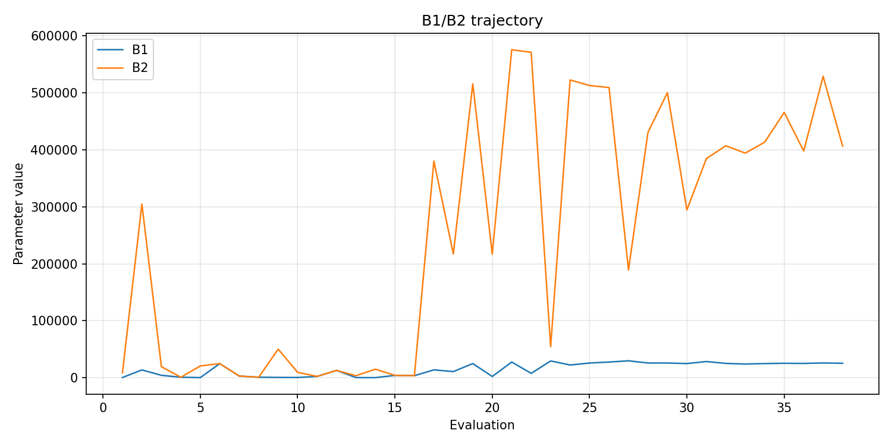
- [`bo_optimize_20260427T233101Z_b1_ratio_heatmap.png`](plots/bo_optimize_20260427T233101Z_b1_ratio_heatmap.png)
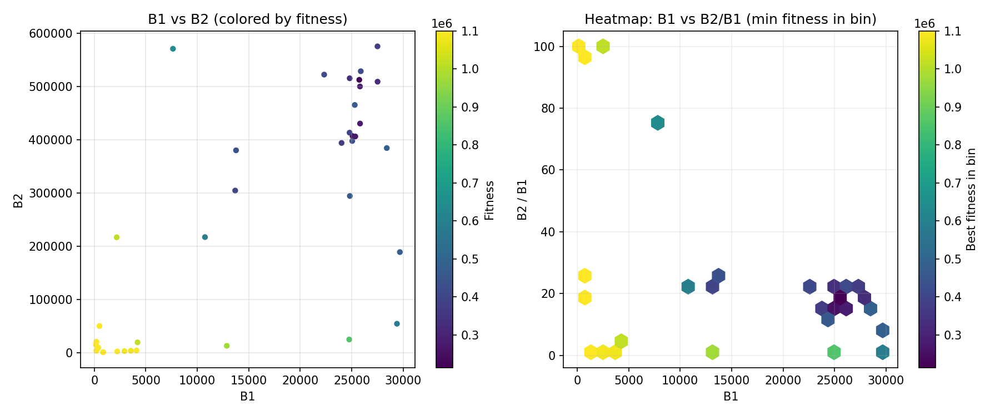
- [`bo_optimize_20260427T233101Z_jump_plot.png`](plots/bo_optimize_20260427T233101Z_jump_plot.png)
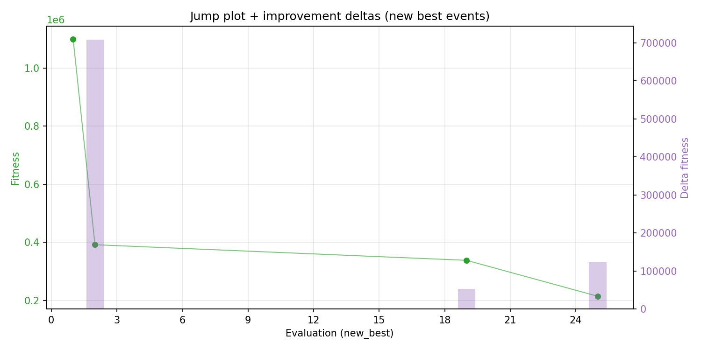
- [`bo_optimize_20260427T233101Z_progress_by_phase.png`](plots/bo_optimize_20260427T233101Z_progress_by_phase.png)
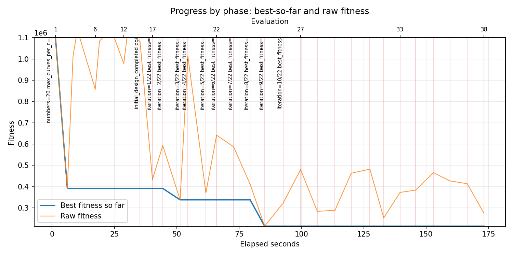
- [`bo_optimize_20260427T233101Z_time_efficiency.png`](plots/bo_optimize_20260427T233101Z_time_efficiency.png)
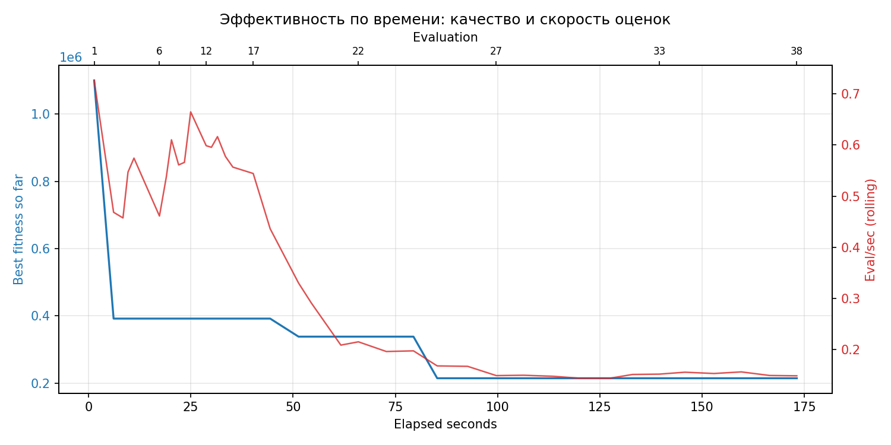

## Таблицы

## Validation runs

### Validation run `20260427T233357Z`
- validation file: [`bo_validate_20260427T233357Z.json`](bo_validate_20260427T233357Z.json)
- dataset: `data/numbers/20_dset_20260427T224546Z/control.json`
- method: `bo`
- optimized params: `(B1, B2)=(25732, 512730)`
- baseline params: `(B1, B2)=(11000, 220000)`
- max_curves_per_n: `150`
- repeats_per_n: `5`
- curve_timeout_sec: `None`
- workers: `56`
- seed: `42`
- optimized_mean_score: `163141.57933888485`
- baseline_mean_score: `553571.4988353759`
- relative_improvement_pct: `70.52926682784282`
- optimized_mean_time_sec: `1.5793388848912582`
- baseline_mean_time_sec: `1.4988353759669555`
- time_improvement_pct: `-5.3710707803628415`
- optimized_mean_curves: `63.14`
- baseline_mean_curves: `103.57000000000001`
- curves_improvement_pct: `39.0364005020759`
- optimized_mean_success_rate: `0.9`
- baseline_mean_success_rate: `0.55`
- success_rate_delta_pp: `35.0`
- trace plots:
  - curves_distribution_plot: [`bo_validate_20260427T233357Z_curves_distribution.png`](plots/bo_validate_20260427T233357Z_curves_distribution.png)
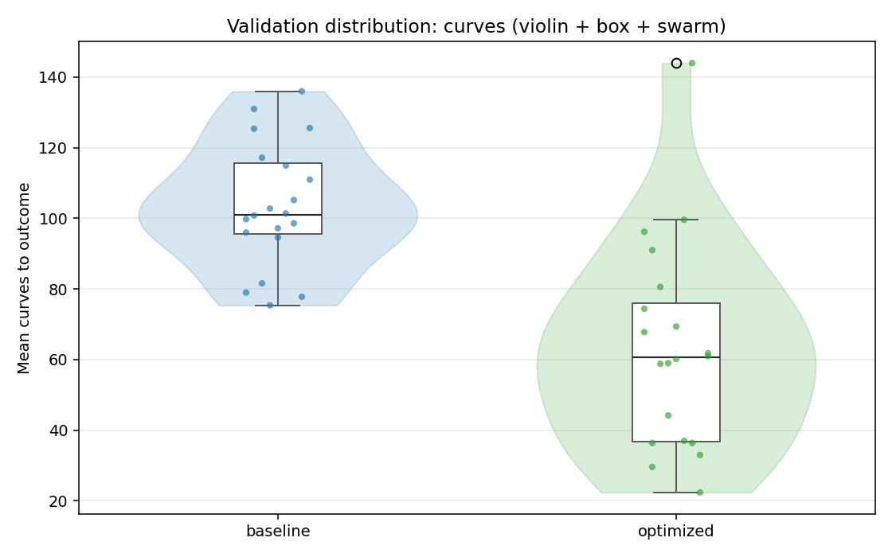
  - curves_trace_plot: [`bo_validate_20260427T233357Z_curves_trace.png`](plots/bo_validate_20260427T233357Z_curves_trace.png)
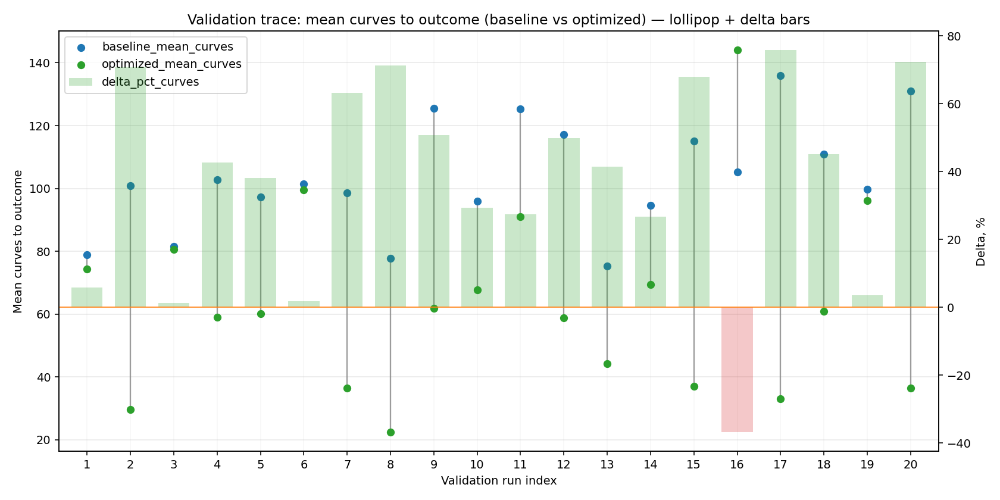
  - score_distribution_plot: [`bo_validate_20260427T233357Z_score_distribution.png`](plots/bo_validate_20260427T233357Z_score_distribution.png)
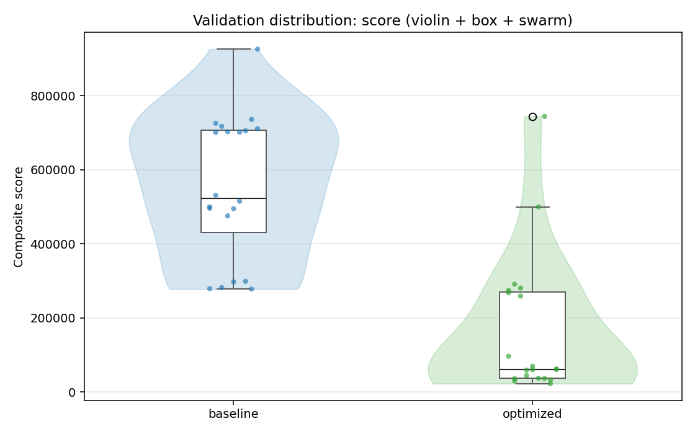
  - score_trace_plot: [`bo_validate_20260427T233357Z_score_trace.png`](plots/bo_validate_20260427T233357Z_score_trace.png)
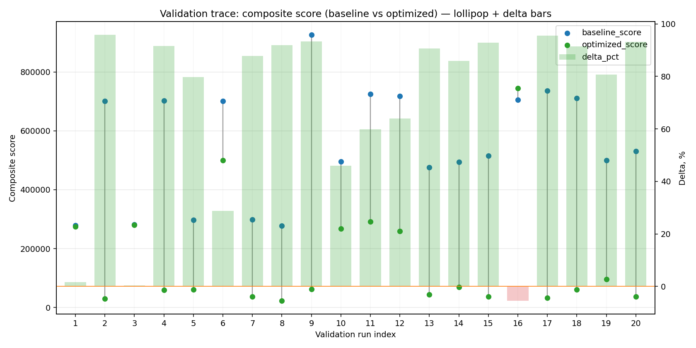
  - time_distribution_plot: [`bo_validate_20260427T233357Z_time_distribution.png`](plots/bo_validate_20260427T233357Z_time_distribution.png)
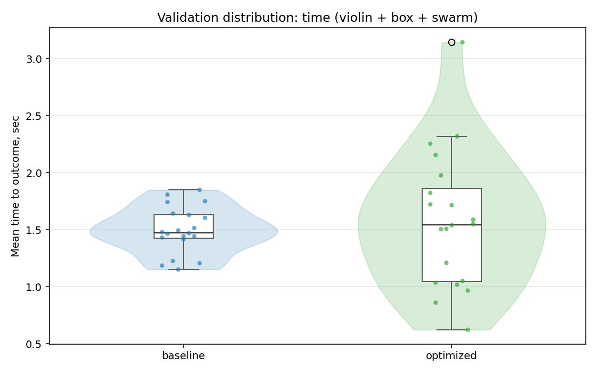
  - time_trace_plot: [`bo_validate_20260427T233357Z_time_trace.png`](plots/bo_validate_20260427T233357Z_time_trace.png)
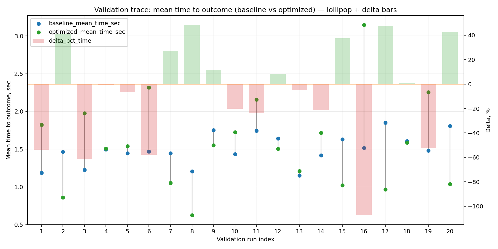

---
