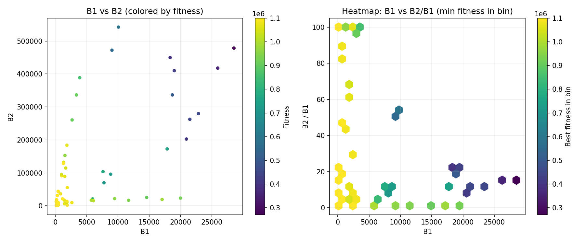
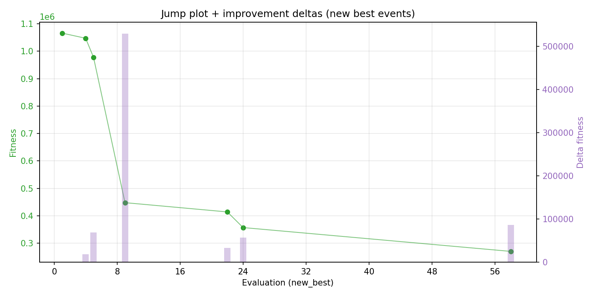
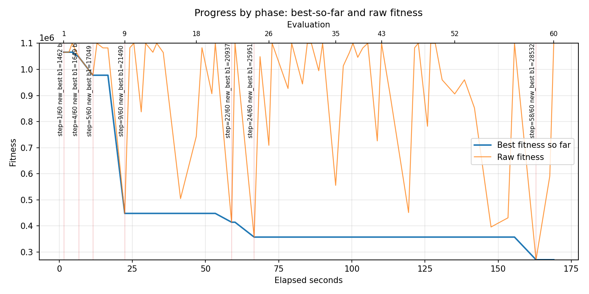
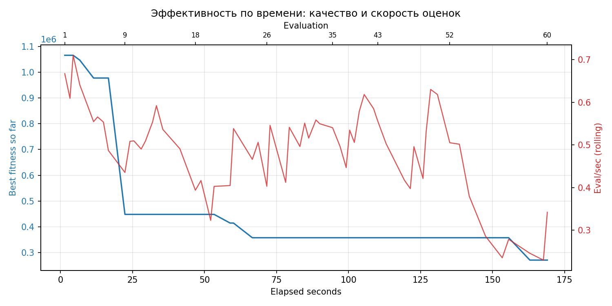
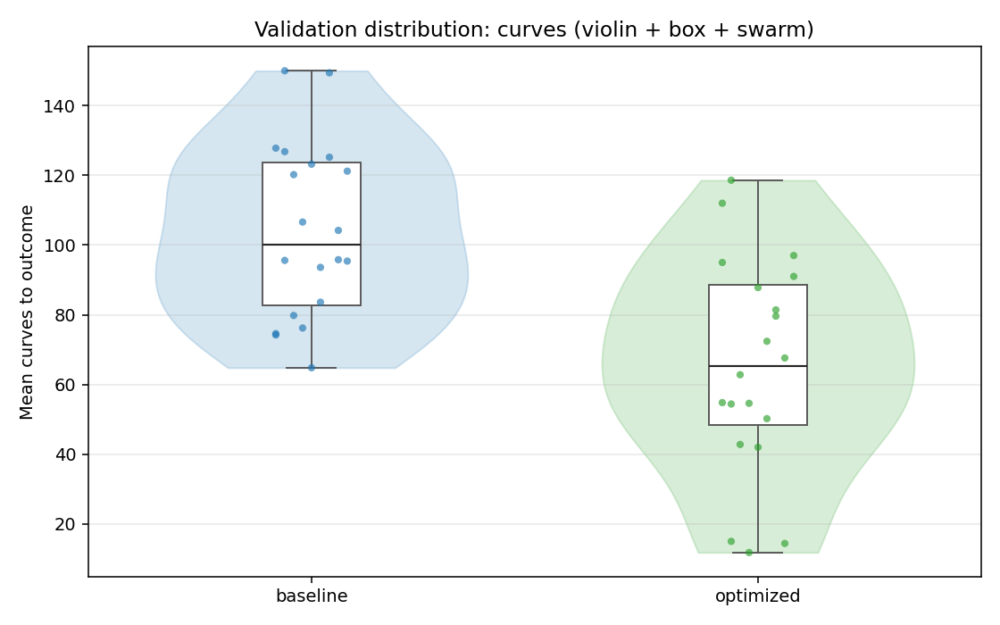
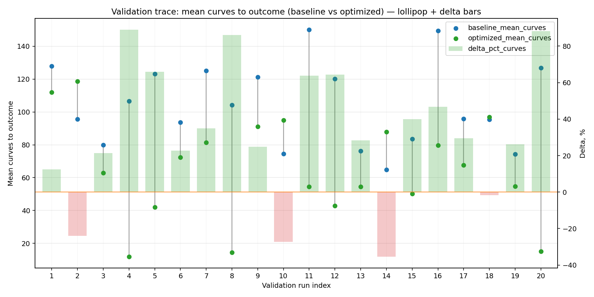
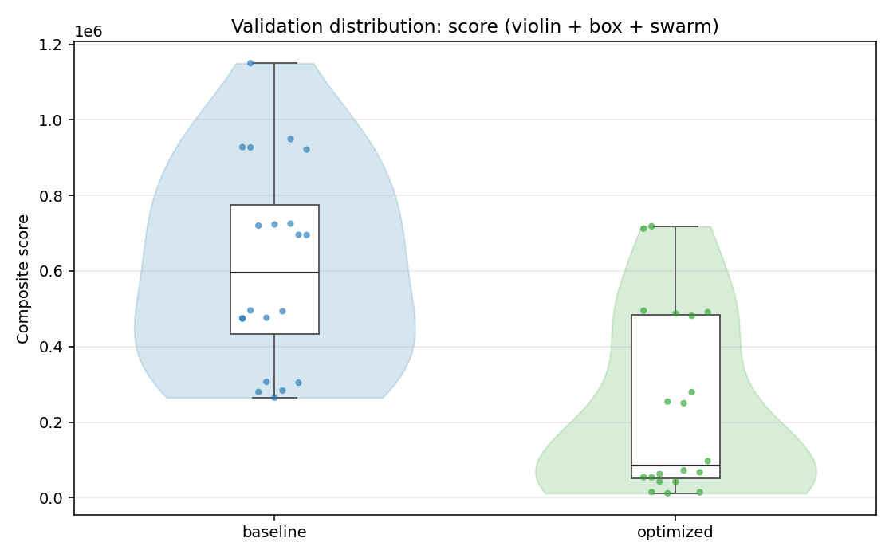
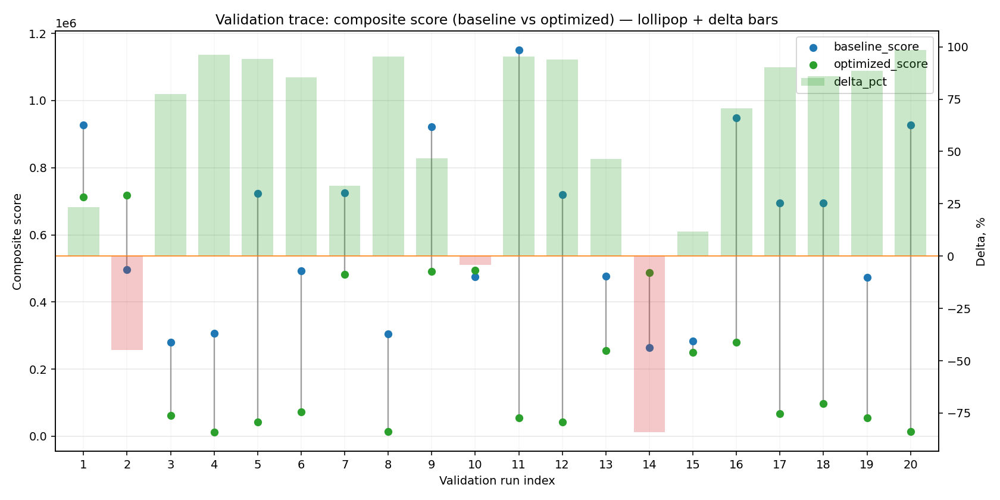
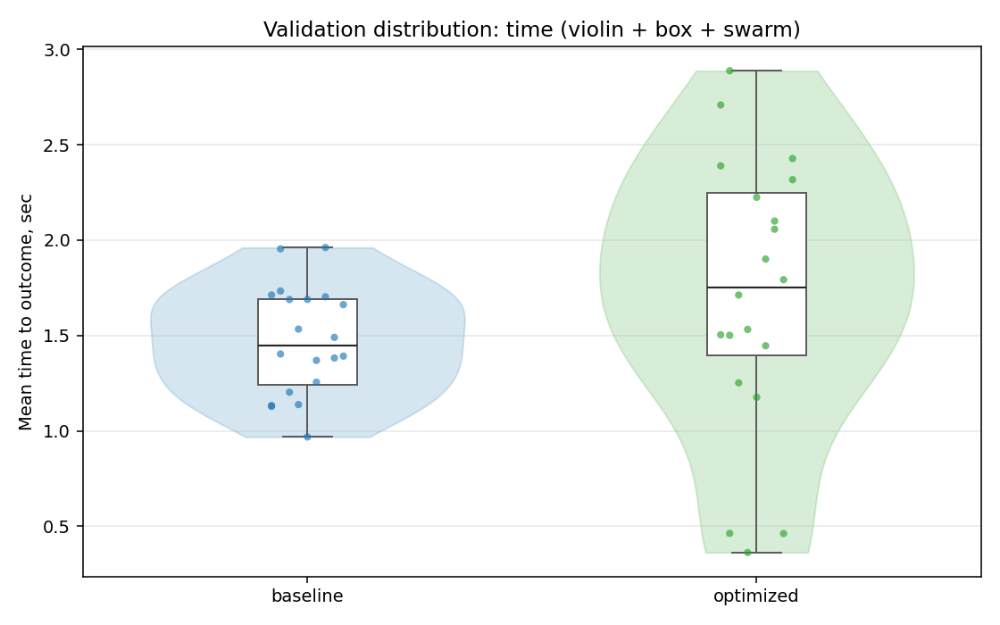
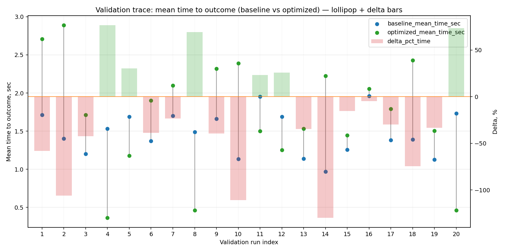

# Отчёт по оптимизации: rs_optimize_20260427T230107Z

## Метаданные
- метод: `rs`
- датасет: `data/numbers/20_dset_20260427T224546Z/train.json`
- оптимум `(B1, B2)`: `(28532, 478711)`
- objective: `270601.4731892477`
- max_curves_per_n: `100`
- repeats_per_n: `3`
- границы: `B1[100.0, 30000.0]`, `B2[100.0, 600000.0]`, `ratio_max=100.0`

## Ключевые статистики
- `best_eval`: `58`
- `best_eval_fraction`: `0.9666666666666667`
- `eval_per_sec`: `0.35504329864033907`
- `evaluation_count`: `60`
- `improvement_percent`: `74.61287566408129`
- `max_plateau_evals`: `33`
- `median_plateau_evals`: `2.0`
- `new_best_count`: `7`
- `new_best_rate`: `0.11666666666666667`
- `p90_plateau_evals`: `18.299999999999997`
- `time_to_best_sec`: `162.933457267005`
- `time_to_first_improvement_sec`: `1.6105744340020465`
- `total_runtime_sec`: `168.99347271100123`

## Флаги внимания

| Флаг | Статус | Текущее значение | Порог | Что это значит | Что делать |
|---|---|---:|---:|---|---|
| `b1_hits_boundary` | ✅ ОК | `0.016666666666666666` | `> 0.10` | Большая доля оценок проходит близко к границам B1. | Расширить диапазон B1, если упор в границу повторяется. |
| `b2_hits_boundary` | ✅ ОК | `0.016666666666666666` | `> 0.10` | Большая доля оценок проходит близко к границам B2. | Расширить диапазон B2, если упор в границу повторяется. |
| `best_b1_on_boundary` | ⚠️ ВНИМАНИЕ | `28532.0` | `within 2% of log-range [100.0, 30000.0]` | Лучший найденный B1 лежит на границе диапазона. | Проверить расширенный диапазон B1 вокруг текущей границы. |
| `best_b2_on_boundary` | ✅ ОК | `478711.0` | `within 2% of log-range [100.0, 600000.0]` | Лучший найденный B2 лежит на границе диапазона. | Проверить расширенный диапазон B2 вокруг текущей границы. |
| `best_ratio_on_boundary` | ✅ ОК | `16.778038693396887` | `within 2% of log-range up to ratio_max=100.0` | Лучшее отношение B2/B1 находится у верхней границы ratio_max. | Увеличить ratio_max и перепроверить локальный поиск в новой области. |
| `late_best` | ⚠️ ВНИМАНИЕ | `0.964140535449203` | `> 0.85` | Лучшее решение найдено слишком поздно относительно общего времени. | Усилить ранний поиск или пересмотреть бюджет/инициализацию. |
| `low_improvement` | ✅ ОК | `74.61287566408129` | `< 10%` | Итоговый прирост качества слишком мал. | Сузить границы поиска или изменить параметры метода. |
| `low_signal` | ✅ ОК | `0.11666666666666667` | `< 0.03` | Слишком низкая плотность новых best-событий (слабый сигнал оптимизации). | Перенастроить exploration и сделать переоценку top-k кандидатов. |
| `plateau_too_long` | ⚠️ ВНИМАНИЕ | `0.55` | `> 0.50` | Слишком длинное плато: улучшений почти нет на большом участке запуска. | Увеличить exploration или добавить политику рестартов. |
| `ratio_hits_boundary` | ⚠️ ВНИМАНИЕ | `0.26666666666666666` | `> 0.10` | Большая доля оценок проходит близко к границе отношения B2/B1. | Увеличить ratio_max, если хорошие точки упираются в ограничение отношения B2/B1. |

## Графики
- [`rs_optimize_20260427T230107Z_b1_b2_trajectory.png`](plots/rs_optimize_20260427T230107Z_b1_b2_trajectory.png)

- [`rs_optimize_20260427T230107Z_b1_ratio_heatmap.png`](plots/rs_optimize_20260427T230107Z_b1_ratio_heatmap.png)

- [`rs_optimize_20260427T230107Z_jump_plot.png`](plots/rs_optimize_20260427T230107Z_jump_plot.png)

- [`rs_optimize_20260427T230107Z_progress_by_phase.png`](plots/rs_optimize_20260427T230107Z_progress_by_phase.png)

- [`rs_optimize_20260427T230107Z_time_efficiency.png`](plots/rs_optimize_20260427T230107Z_time_efficiency.png)

## Таблицы

## Validation runs

### Validation run `20260427T230359Z`
- validation file: [`rs_validate_20260427T230359Z.json`](rs_validate_20260427T230359Z.json)
- dataset: `data/numbers/20_dset_20260427T224546Z/control.json`
- method: `rs`
- optimized params: `(B1, B2)=(28532, 478711)`
- baseline params: `(B1, B2)=(11000, 220000)`
- max_curves_per_n: `150`
- repeats_per_n: `5`
- curve_timeout_sec: `None`
- workers: `56`
- seed: `42`
- optimized_mean_score: `235261.7105713843`
- baseline_mean_score: `614411.474739349`
- relative_improvement_pct: `61.709421089313295`
- optimized_mean_time_sec: `1.7105713842828116`
- baseline_mean_time_sec: `1.4747393490027025`
- time_improvement_pct: `-15.991438449078565`
- optimized_mean_curves: `65.26`
- baseline_mean_curves: `104.41`
- curves_improvement_pct: `37.49640839000095`
- optimized_mean_success_rate: `0.8300000000000001`
- baseline_mean_success_rate: `0.49000000000000005`
- success_rate_delta_pp: `34.0`
- trace plots:
  - curves_distribution_plot: [`rs_validate_20260427T230359Z_curves_distribution.png`](plots/rs_validate_20260427T230359Z_curves_distribution.png)

  - curves_trace_plot: [`rs_validate_20260427T230359Z_curves_trace.png`](plots/rs_validate_20260427T230359Z_curves_trace.png)

  - score_distribution_plot: [`rs_validate_20260427T230359Z_score_distribution.png`](plots/rs_validate_20260427T230359Z_score_distribution.png)

  - score_trace_plot: [`rs_validate_20260427T230359Z_score_trace.png`](plots/rs_validate_20260427T230359Z_score_trace.png)

  - time_distribution_plot: [`rs_validate_20260427T230359Z_time_distribution.png`](plots/rs_validate_20260427T230359Z_time_distribution.png)

  - time_trace_plot: [`rs_validate_20260427T230359Z_time_trace.png`](plots/rs_validate_20260427T230359Z_time_trace.png)

---
