# Отчёт по оптимизации: bo_optimize_20260428T142408Z

## Метаданные
- метод: `bo`
- датасет: `data/numbers/20_dset_20260428T135130Z/train.json`
- оптимум `(B1, B2)`: `(8067, 184327)`
- objective: `-0.2737085931414875`
- max_curves_per_n: `100`
- repeats_per_n: `3`
- границы: `B1[100.0, 30000.0]`, `B2[100.0, 600000.0]`, `ratio_max=100.0`

## Ключевые статистики
- `best_eval`: `35`
- `best_eval_fraction`: `0.9210526315789473`
- `eval_per_sec`: `0.2924482544972853`
- `evaluation_count`: `38`
- `improvement_percent`: `103.54595457587854`
- `max_plateau_evals`: `20`
- `median_plateau_evals`: `2.5`
- `new_best_count`: `5`
- `new_best_rate`: `0.13157894736842105`
- `p90_plateau_evals`: `14.0`
- `time_to_best_sec`: `119.74740559898783`
- `time_to_first_improvement_sec`: `5.530532407996361`
- `total_runtime_sec`: `129.9376255370007`

## Флаги внимания

| Флаг | Статус | Текущее значение | Порог | Что это значит | Что делать |
|---|---|---:|---:|---|---|
| `b1_hits_boundary` | ✅ ОК | `0.02631578947368421` | `> 0.10` | Большая доля оценок проходит близко к границам B1. | Расширить диапазон B1, если упор в границу повторяется. |
| `b2_hits_boundary` | ✅ ОК | `0.02631578947368421` | `> 0.10` | Большая доля оценок проходит близко к границам B2. | Расширить диапазон B2, если упор в границу повторяется. |
| `best_b1_on_boundary` | ✅ ОК | `8067.0` | `within 2% of log-range [100.0, 30000.0]` | Лучший найденный B1 лежит на границе диапазона. | Проверить расширенный диапазон B1 вокруг текущей границы. |
| `best_b2_on_boundary` | ✅ ОК | `184327.0` | `within 2% of log-range [100.0, 600000.0]` | Лучший найденный B2 лежит на границе диапазона. | Проверить расширенный диапазон B2 вокруг текущей границы. |
| `best_ratio_on_boundary` | ✅ ОК | `22.84951035081195` | `within 2% of log-range up to ratio_max=100.0` | Лучшее отношение B2/B1 находится у верхней границы ratio_max. | Увеличить ratio_max и перепроверить локальный поиск в новой области. |
| `late_best` | ⚠️ ВНИМАНИЕ | `0.9215760647010504` | `> 0.85` | Лучшее решение найдено слишком поздно относительно общего времени. | Усилить ранний поиск или пересмотреть бюджет/инициализацию. |
| `low_improvement` | ✅ ОК | `103.54595457587854` | `< 10%` | Итоговый прирост качества слишком мал. | Сузить границы поиска или изменить параметры метода. |
| `low_signal` | ✅ ОК | `0.13157894736842105` | `< 0.03` | Слишком низкая плотность новых best-событий (слабый сигнал оптимизации). | Перенастроить exploration и сделать переоценку top-k кандидатов. |
| `plateau_too_long` | ⚠️ ВНИМАНИЕ | `0.5263157894736842` | `> 0.50` | Слишком длинное плато: улучшений почти нет на большом участке запуска. | Увеличить exploration или добавить политику рестартов. |
| `ratio_hits_boundary` | ⚠️ ВНИМАНИЕ | `0.34210526315789475` | `> 0.10` | Большая доля оценок проходит близко к границе отношения B2/B1. | Увеличить ratio_max, если хорошие точки упираются в ограничение отношения B2/B1. |

## Графики
- [`bo_optimize_20260428T142408Z_b1_b2_trajectory.png`](plots/bo_optimize_20260428T142408Z_b1_b2_trajectory.png)
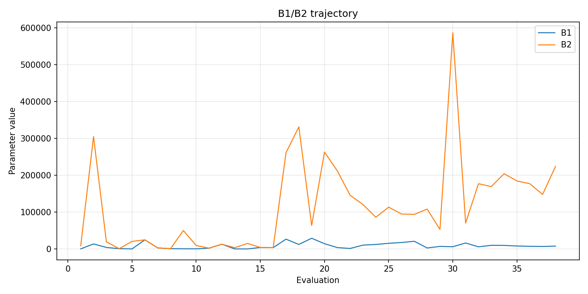
- [`bo_optimize_20260428T142408Z_b1_ratio_heatmap.png`](plots/bo_optimize_20260428T142408Z_b1_ratio_heatmap.png)
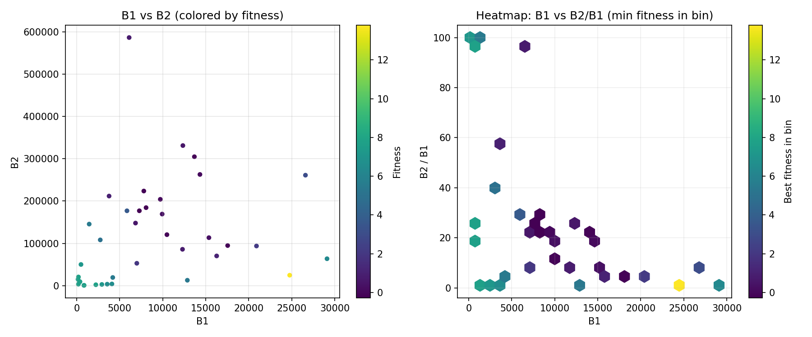
- [`bo_optimize_20260428T142408Z_jump_plot.png`](plots/bo_optimize_20260428T142408Z_jump_plot.png)
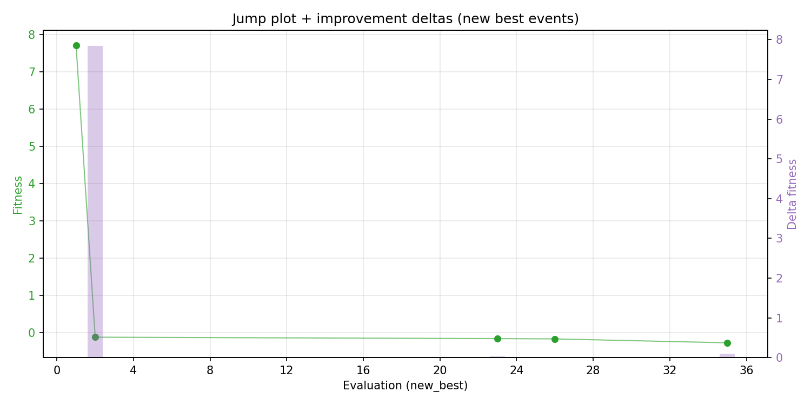
- [`bo_optimize_20260428T142408Z_progress_by_phase.png`](plots/bo_optimize_20260428T142408Z_progress_by_phase.png)
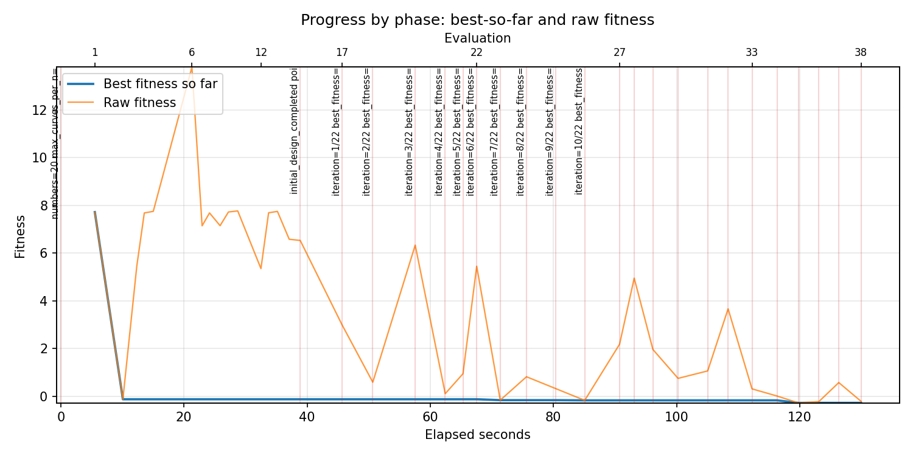
- [`bo_optimize_20260428T142408Z_time_efficiency.png`](plots/bo_optimize_20260428T142408Z_time_efficiency.png)
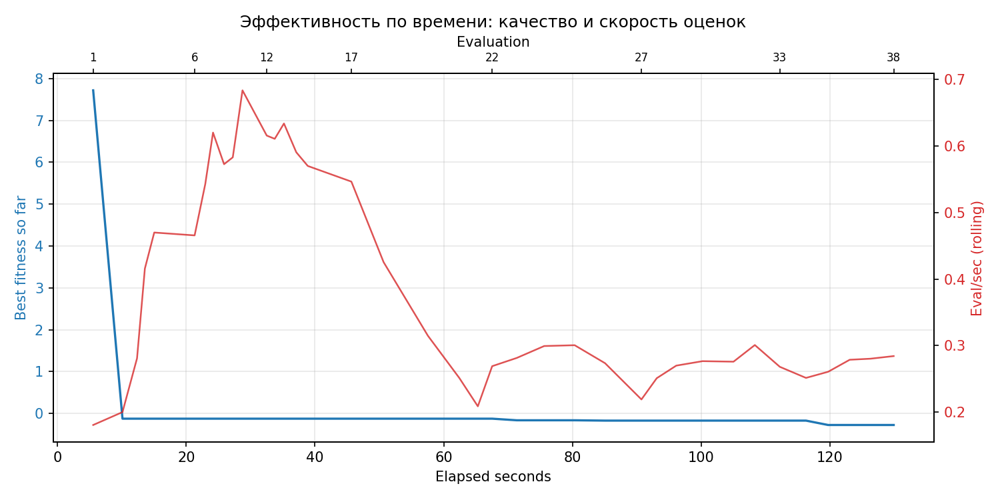

## Таблицы

## Validation runs

### Validation run `20260428T142620Z`
- validation file: [`bo_validate_20260428T142620Z.json`](bo_validate_20260428T142620Z.json)
- dataset: `data/numbers/20_dset_20260428T135130Z/control.json`
- method: `bo`
- optimized params: `(B1, B2)=(8067, 184327)`
- baseline params: `(B1, B2)=(11000, 220000)`
- max_curves_per_n: `150`
- repeats_per_n: `5`
- curve_timeout_sec: `None`
- workers: `56`
- seed: `42`
- optimized_mean_score: `5.535476883650037`
- baseline_mean_score: `7.571918716429948`
- relative_improvement_pct: `26.894660508717994`
- optimized_mean_time_sec: `1.4141890362398408`
- baseline_mean_time_sec: `1.5479100012303388`
- time_improvement_pct: `8.63880748132717`
- optimized_mean_curves: `113.17`
- baseline_mean_curves: `102.14`
- curves_improvement_pct: `-10.798903465831213`
- optimized_mean_success_rate: `0.43`
- baseline_mean_success_rate: `0.5700000000000001`
- success_rate_delta_pp: `-14.000000000000007`
- trace plots:
  - curves_distribution_plot: [`bo_validate_20260428T142620Z_curves_distribution.png`](plots/bo_validate_20260428T142620Z_curves_distribution.png)
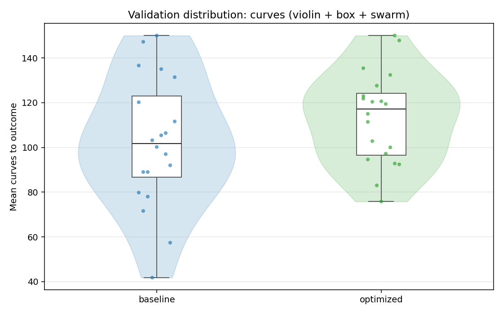
  - curves_trace_plot: [`bo_validate_20260428T142620Z_curves_trace.png`](plots/bo_validate_20260428T142620Z_curves_trace.png)
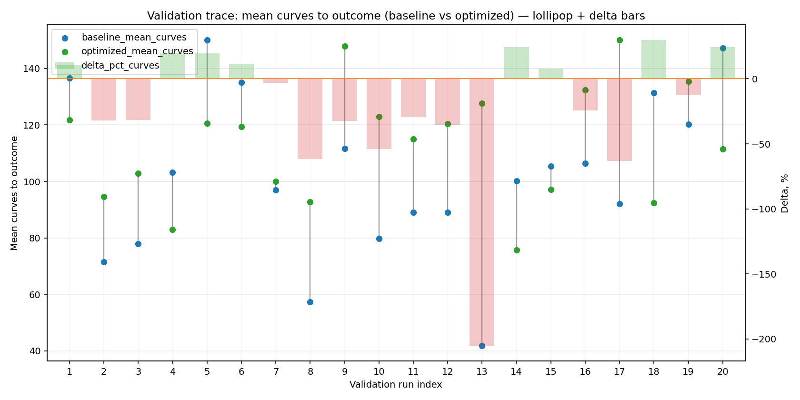
  - score_distribution_plot: [`bo_validate_20260428T142620Z_score_distribution.png`](plots/bo_validate_20260428T142620Z_score_distribution.png)
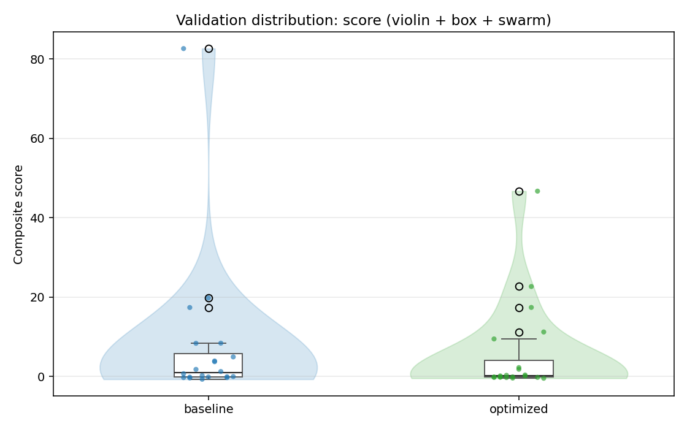
  - score_trace_plot: [`bo_validate_20260428T142620Z_score_trace.png`](plots/bo_validate_20260428T142620Z_score_trace.png)
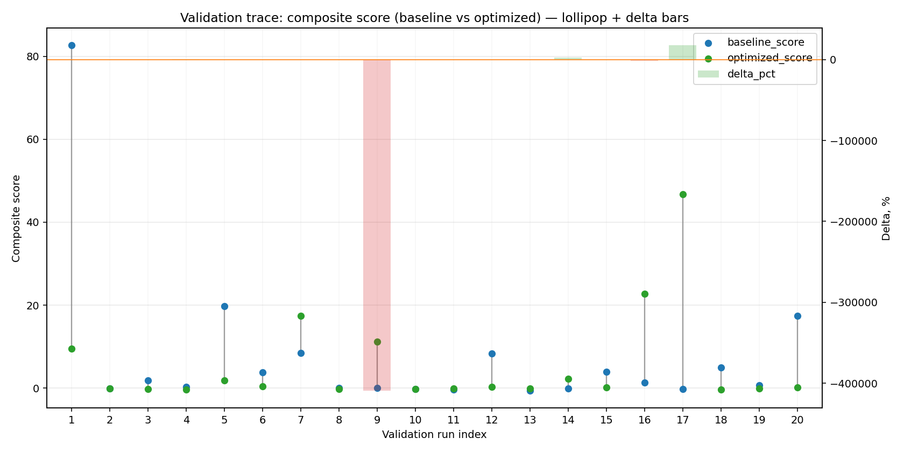
  - time_distribution_plot: [`bo_validate_20260428T142620Z_time_distribution.png`](plots/bo_validate_20260428T142620Z_time_distribution.png)
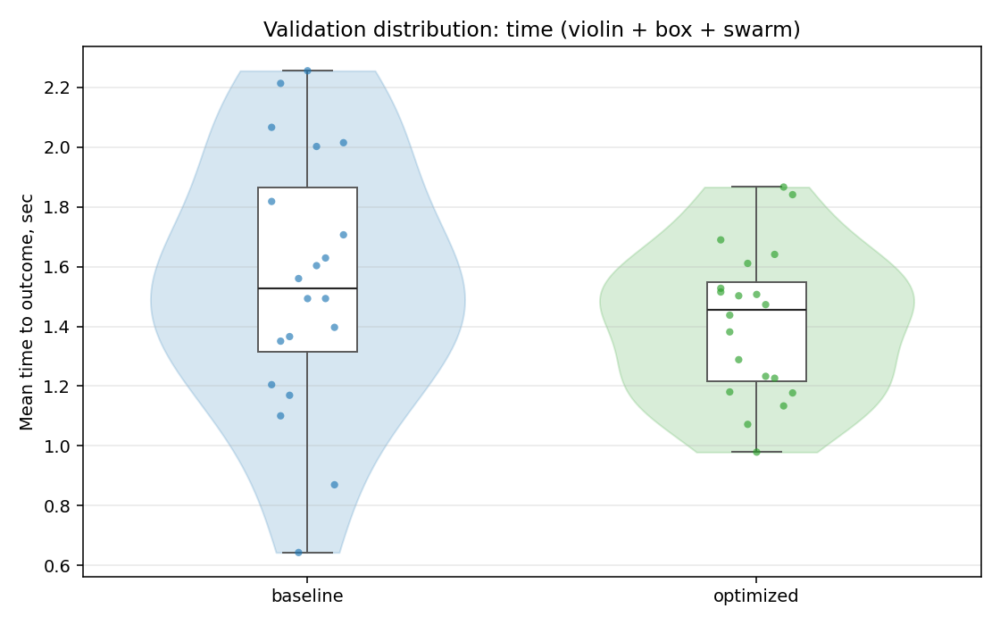
  - time_trace_plot: [`bo_validate_20260428T142620Z_time_trace.png`](plots/bo_validate_20260428T142620Z_time_trace.png)
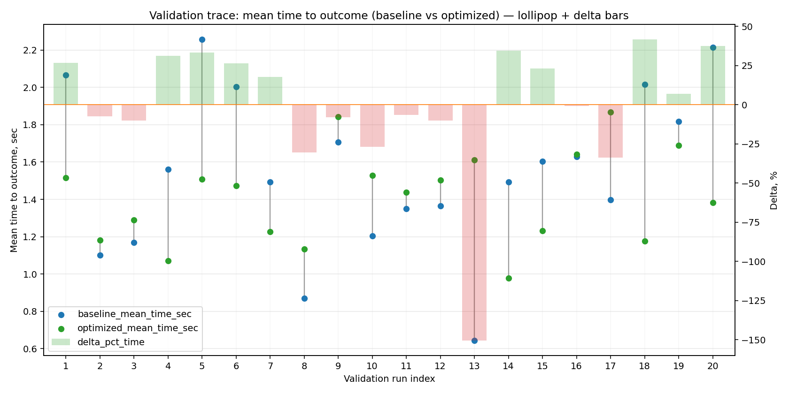

---
