# Отчёт по оптимизации: ga_optimize_20260428T142659Z

## Метаданные
- метод: `ga`
- датасет: `data/numbers/20_dset_20260428T135130Z/train.json`
- оптимум `(B1, B2)`: `(10017, 281735)`
- objective: `-0.12633045518116415`
- max_curves_per_n: `100`
- repeats_per_n: `3`
- границы: `B1[100.0, 30000.0]`, `B2[100.0, 600000.0]`, `ratio_max=100.0`

## Ключевые статистики
- `best_eval`: `229`
- `best_eval_fraction`: `0.7246835443037974`
- `eval_per_sec`: `0.24576733404742845`
- `evaluation_count`: `316`
- `improvement_percent`: `101.09499496879715`
- `max_plateau_evals`: `87`
- `median_plateau_evals`: `39.5`
- `new_best_count`: `7`
- `new_best_rate`: `0.022151898734177215`
- `p90_plateau_evals`: `63.199999999999996`
- `time_to_best_sec`: `918.4157173830026`
- `time_to_first_improvement_sec`: `68.72433520400955`
- `total_runtime_sec`: `1285.7811500660027`

## Флаги внимания

| Флаг | Статус | Текущее значение | Порог | Что это значит | Что делать |
|---|---|---:|---:|---|---|
| `b1_hits_boundary` | ✅ ОК | `0.0031645569620253164` | `> 0.10` | Большая доля оценок проходит близко к границам B1. | Расширить диапазон B1, если упор в границу повторяется. |
| `b2_hits_boundary` | ✅ ОК | `0.00949367088607595` | `> 0.10` | Большая доля оценок проходит близко к границам B2. | Расширить диапазон B2, если упор в границу повторяется. |
| `best_b1_on_boundary` | ✅ ОК | `10017.0` | `within 2% of log-range [100.0, 30000.0]` | Лучший найденный B1 лежит на границе диапазона. | Проверить расширенный диапазон B1 вокруг текущей границы. |
| `best_b2_on_boundary` | ✅ ОК | `281735.0` | `within 2% of log-range [100.0, 600000.0]` | Лучший найденный B2 лежит на границе диапазона. | Проверить расширенный диапазон B2 вокруг текущей границы. |
| `best_ratio_on_boundary` | ✅ ОК | `28.125686333233503` | `within 2% of log-range up to ratio_max=100.0` | Лучшее отношение B2/B1 находится у верхней границы ratio_max. | Увеличить ratio_max и перепроверить локальный поиск в новой области. |
| `late_best` | ✅ ОК | `0.71428618885559` | `> 0.85` | Лучшее решение найдено слишком поздно относительно общего времени. | Усилить ранний поиск или пересмотреть бюджет/инициализацию. |
| `low_improvement` | ✅ ОК | `101.09499496879715` | `< 10%` | Итоговый прирост качества слишком мал. | Сузить границы поиска или изменить параметры метода. |
| `low_signal` | ⚠️ ВНИМАНИЕ | `0.022151898734177215` | `< 0.03` | Слишком низкая плотность новых best-событий (слабый сигнал оптимизации). | Перенастроить exploration и сделать переоценку top-k кандидатов. |
| `plateau_too_long` | ✅ ОК | `0.27531645569620256` | `> 0.50` | Слишком длинное плато: улучшений почти нет на большом участке запуска. | Увеличить exploration или добавить политику рестартов. |
| `ratio_hits_boundary` | ✅ ОК | `0.05063291139240506` | `> 0.10` | Большая доля оценок проходит близко к границе отношения B2/B1. | Увеличить ratio_max, если хорошие точки упираются в ограничение отношения B2/B1. |

## Графики
- [`ga_optimize_20260428T142659Z_b1_b2_trajectory.png`](plots/ga_optimize_20260428T142659Z_b1_b2_trajectory.png)
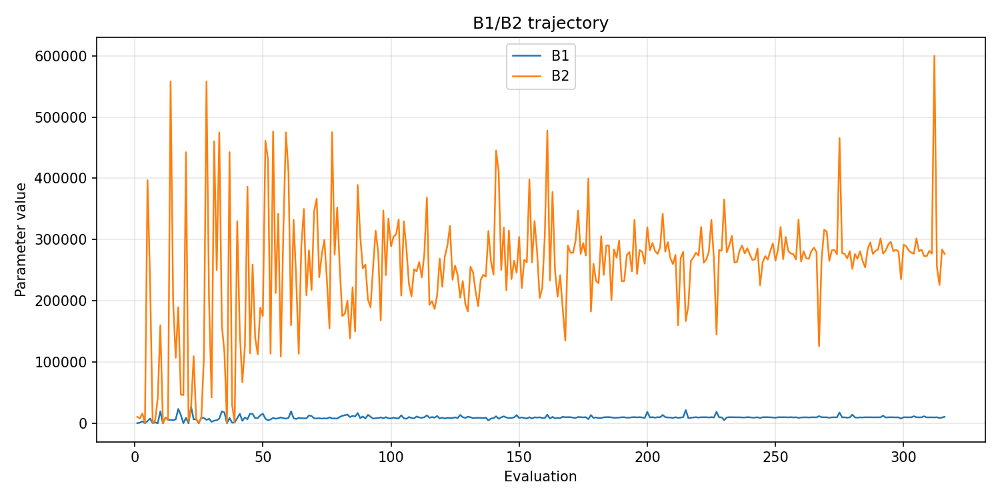
- [`ga_optimize_20260428T142659Z_b1_ratio_heatmap.png`](plots/ga_optimize_20260428T142659Z_b1_ratio_heatmap.png)
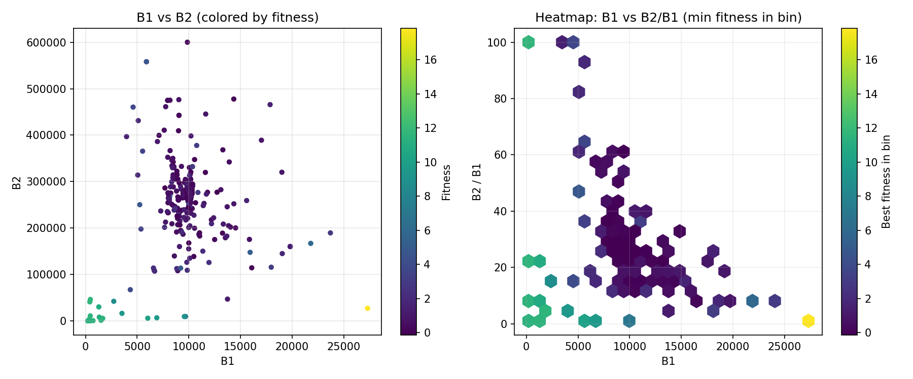
- [`ga_optimize_20260428T142659Z_jump_plot.png`](plots/ga_optimize_20260428T142659Z_jump_plot.png)
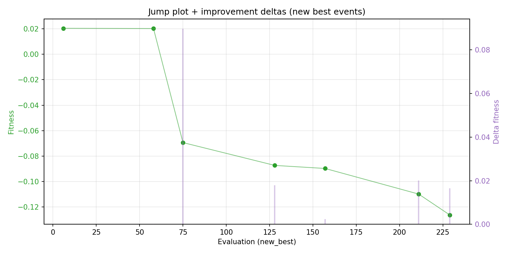
- [`ga_optimize_20260428T142659Z_progress_by_phase.png`](plots/ga_optimize_20260428T142659Z_progress_by_phase.png)
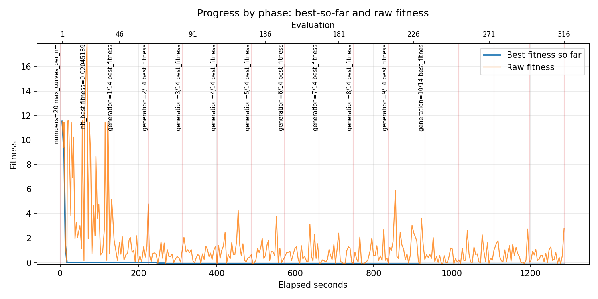
- [`ga_optimize_20260428T142659Z_time_efficiency.png`](plots/ga_optimize_20260428T142659Z_time_efficiency.png)
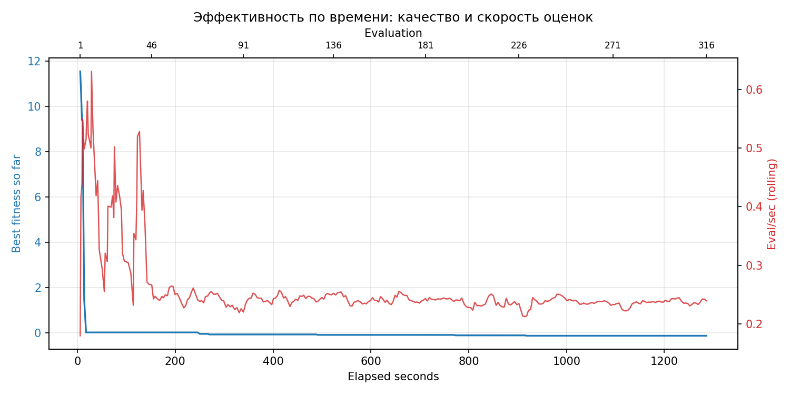

## Таблицы

## Validation runs

### Validation run `20260428T144828Z`
- validation file: [`ga_validate_20260428T144828Z.json`](ga_validate_20260428T144828Z.json)
- dataset: `data/numbers/20_dset_20260428T135130Z/control.json`
- method: `ga`
- optimized params: `(B1, B2)=(10017, 281735)`
- baseline params: `(B1, B2)=(11000, 220000)`
- max_curves_per_n: `150`
- repeats_per_n: `5`
- curve_timeout_sec: `None`
- workers: `56`
- seed: `42`
- optimized_mean_score: `8.936720088725604`
- baseline_mean_score: `1.9808169822169366`
- relative_improvement_pct: `-351.16334163914524`
- optimized_mean_time_sec: `1.5068700698716566`
- baseline_mean_time_sec: `1.4694391477742466`
- time_improvement_pct: `-2.547293105271254`
- optimized_mean_curves: `99.32000000000001`
- baseline_mean_curves: `96.47`
- curves_improvement_pct: `-2.95428630662383`
- optimized_mean_success_rate: `0.61`
- baseline_mean_success_rate: `0.64`
- success_rate_delta_pp: `-3.0000000000000027`
- trace plots:
  - curves_distribution_plot: [`ga_validate_20260428T144828Z_curves_distribution.png`](plots/ga_validate_20260428T144828Z_curves_distribution.png)
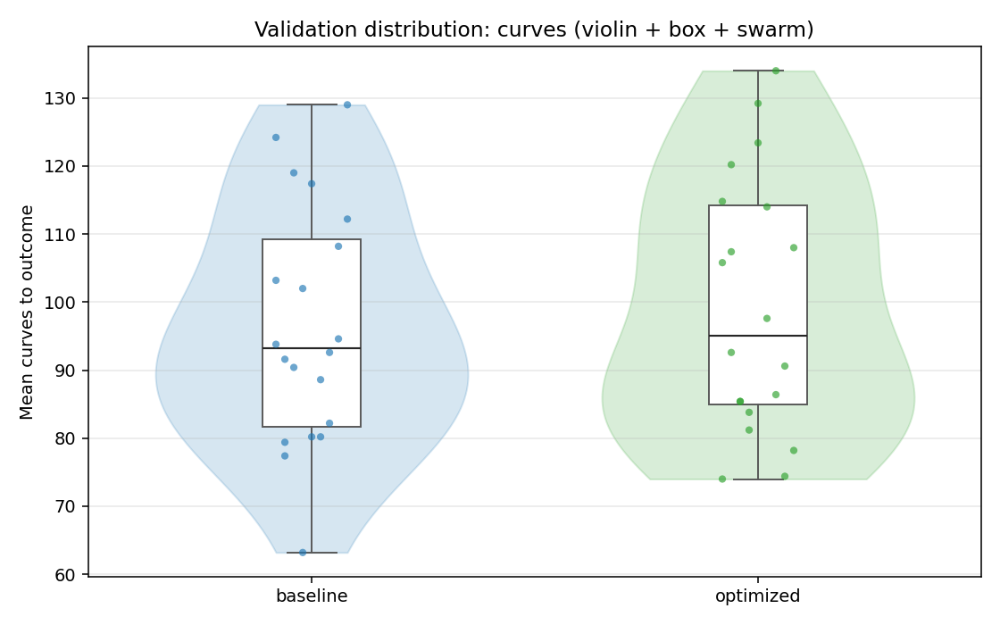
  - curves_trace_plot: [`ga_validate_20260428T144828Z_curves_trace.png`](plots/ga_validate_20260428T144828Z_curves_trace.png)
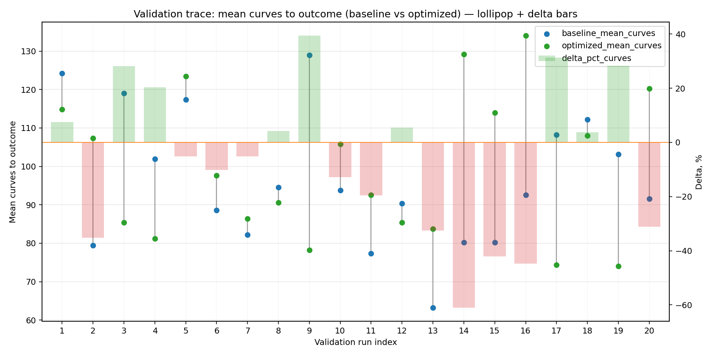
  - score_distribution_plot: [`ga_validate_20260428T144828Z_score_distribution.png`](plots/ga_validate_20260428T144828Z_score_distribution.png)
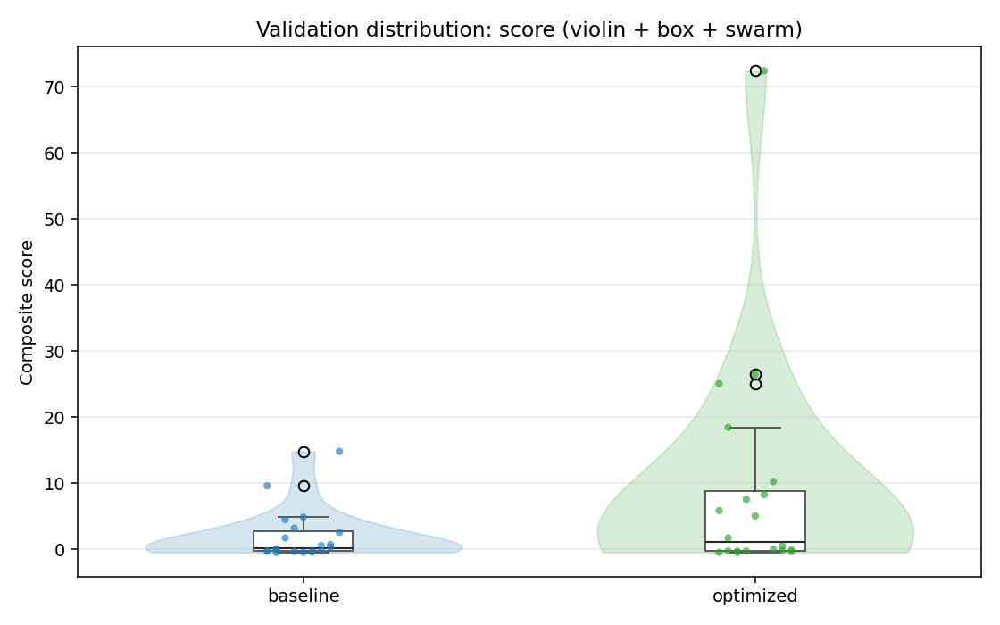
  - score_trace_plot: [`ga_validate_20260428T144828Z_score_trace.png`](plots/ga_validate_20260428T144828Z_score_trace.png)
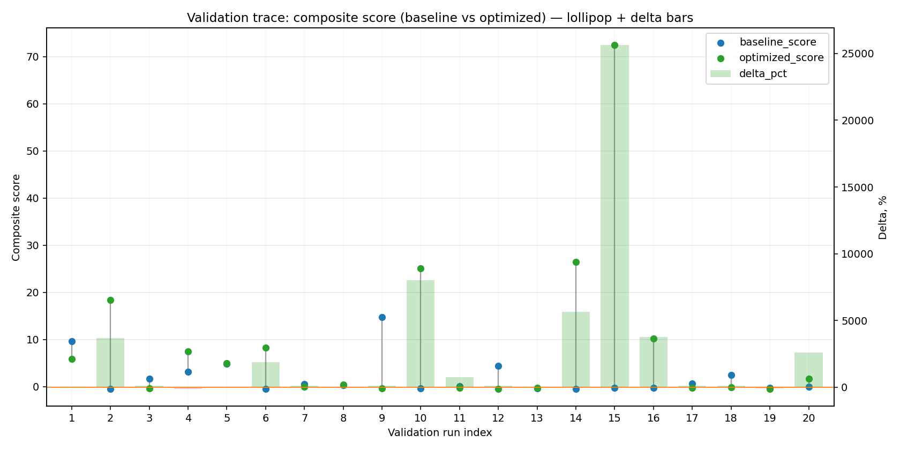
  - time_distribution_plot: [`ga_validate_20260428T144828Z_time_distribution.png`](plots/ga_validate_20260428T144828Z_time_distribution.png)
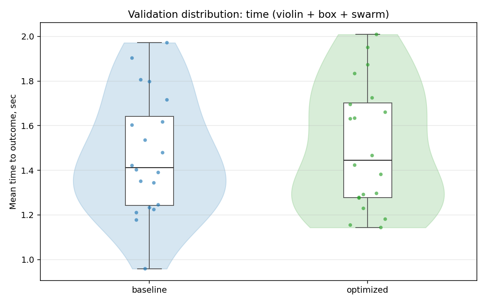
  - time_trace_plot: [`ga_validate_20260428T144828Z_time_trace.png`](plots/ga_validate_20260428T144828Z_time_trace.png)
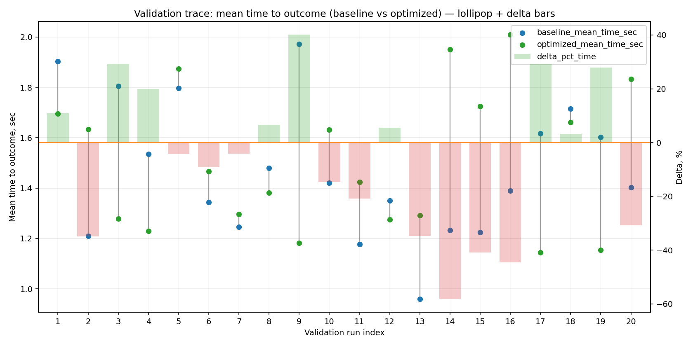

---
