# Отчёт по оптимизации: ga_optimize_20260429T112910Z

## Метаданные
- метод: `ga`
- датасет: `data/numbers/20_dset_20260429T110546Z/train.json`
- оптимум `(B1, B2)`: `(11943, 156544)`
- objective: `1.9576141868479144`
- max_curves_per_n: `100`
- repeats_per_n: `3`
- границы: `B1[100.0, 30000.0]`, `B2[100.0, 600000.0]`, `ratio_max=100.0`

## Ключевые статистики
- `best_eval`: `132`
- `best_eval_fraction`: `0.4177215189873418`
- `eval_per_sec`: `0.4600363904389936`
- `evaluation_count`: `316`
- `improvement_percent`: `13.956603658913153`
- `max_plateau_evals`: `184`
- `median_plateau_evals`: `30.0`
- `new_best_count`: `4`
- `new_best_rate`: `0.012658227848101266`
- `p90_plateau_evals`: `136.0`
- `time_to_best_sec`: `317.17267156700836`
- `time_to_first_improvement_sec`: `64.13603681401582`
- `total_runtime_sec`: `686.9022847220185`

## Флаги внимания

| Флаг | Статус | Текущее значение | Порог | Что это значит | Что делать |
|---|---|---:|---:|---|---|
| `b1_hits_boundary` | ✅ ОК | `0.0031645569620253164` | `> 0.10` | Большая доля оценок проходит близко к границам B1. | Расширить диапазон B1, если упор в границу повторяется. |
| `b2_hits_boundary` | ✅ ОК | `0.0031645569620253164` | `> 0.10` | Большая доля оценок проходит близко к границам B2. | Расширить диапазон B2, если упор в границу повторяется. |
| `best_b1_on_boundary` | ✅ ОК | `11943.0` | `within 2% of log-range [100.0, 30000.0]` | Лучший найденный B1 лежит на границе диапазона. | Проверить расширенный диапазон B1 вокруг текущей границы. |
| `best_b2_on_boundary` | ✅ ОК | `156544.0` | `within 2% of log-range [100.0, 600000.0]` | Лучший найденный B2 лежит на границе диапазона. | Проверить расширенный диапазон B2 вокруг текущей границы. |
| `best_ratio_on_boundary` | ✅ ОК | `13.10759440676547` | `within 2% of log-range up to ratio_max=100.0` | Лучшее отношение B2/B1 находится у верхней границы ratio_max. | Увеличить ratio_max и перепроверить локальный поиск в новой области. |
| `late_best` | ✅ ОК | `0.4617435094066757` | `> 0.85` | Лучшее решение найдено слишком поздно относительно общего времени. | Усилить ранний поиск или пересмотреть бюджет/инициализацию. |
| `low_improvement` | ✅ ОК | `13.956603658913153` | `< 10%` | Итоговый прирост качества слишком мал. | Сузить границы поиска или изменить параметры метода. |
| `low_signal` | ⚠️ ВНИМАНИЕ | `0.012658227848101266` | `< 0.03` | Слишком низкая плотность новых best-событий (слабый сигнал оптимизации). | Перенастроить exploration и сделать переоценку top-k кандидатов. |
| `plateau_too_long` | ⚠️ ВНИМАНИЕ | `0.5822784810126582` | `> 0.50` | Слишком длинное плато: улучшений почти нет на большом участке запуска. | Увеличить exploration или добавить политику рестартов. |
| `ratio_hits_boundary` | ⚠️ ВНИМАНИЕ | `0.24367088607594936` | `> 0.10` | Большая доля оценок проходит близко к границе отношения B2/B1. | Увеличить ratio_max, если хорошие точки упираются в ограничение отношения B2/B1. |

## Графики
- [`ga_optimize_20260429T112910Z_b1_b2_trajectory.png`](plots/ga_optimize_20260429T112910Z_b1_b2_trajectory.png)
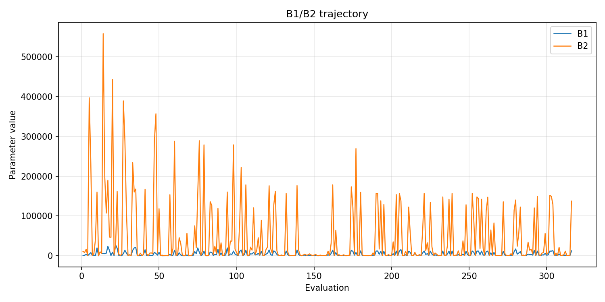
- [`ga_optimize_20260429T112910Z_b1_ratio_heatmap.png`](plots/ga_optimize_20260429T112910Z_b1_ratio_heatmap.png)
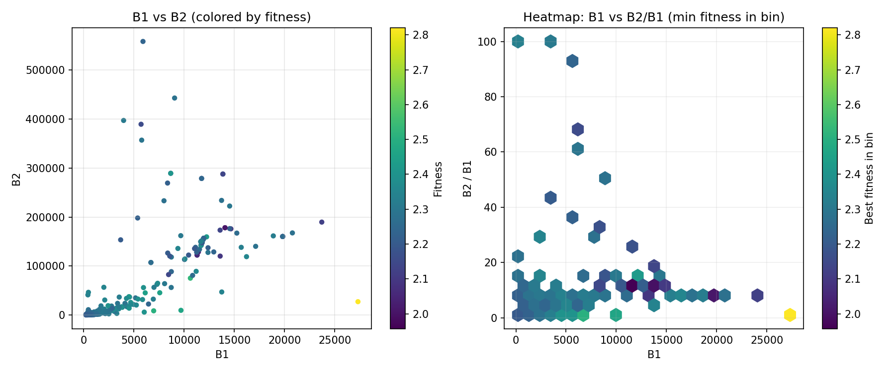
- [`ga_optimize_20260429T112910Z_jump_plot.png`](plots/ga_optimize_20260429T112910Z_jump_plot.png)
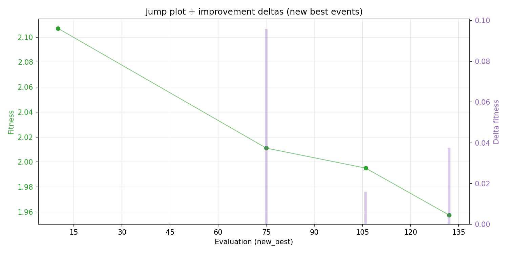
- [`ga_optimize_20260429T112910Z_progress_by_phase.png`](plots/ga_optimize_20260429T112910Z_progress_by_phase.png)
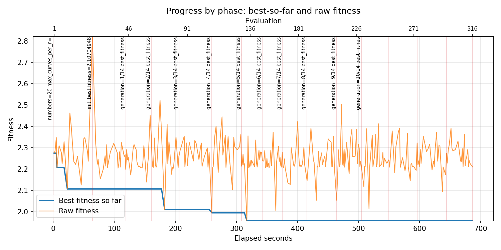
- [`ga_optimize_20260429T112910Z_time_efficiency.png`](plots/ga_optimize_20260429T112910Z_time_efficiency.png)
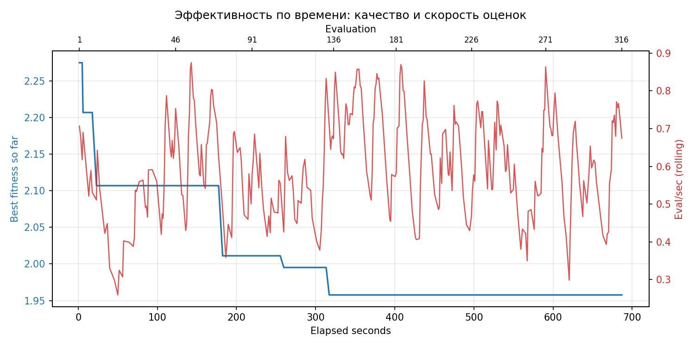

## Таблицы

## Validation runs

### Validation run `20260429T114040Z`
- validation file: [`ga_validate_20260429T114040Z.json`](ga_validate_20260429T114040Z.json)
- dataset: `data/numbers/20_dset_20260429T110546Z/control.json`
- method: `ga`
- optimized params: `(B1, B2)=(11943, 156544)`
- baseline params: `(B1, B2)=(11000, 220000)`
- max_curves_per_n: `150`
- repeats_per_n: `5`
- curve_timeout_sec: `None`
- workers: `56`
- seed: `42`
- optimized_mean_score: `2.3499491847499296`
- baseline_mean_score: `2.3179145967305774`
- relative_improvement_pct: `-1.382043499986456`
- optimized_mean_time_sec: `1.5856584896845742`
- baseline_mean_time_sec: `1.4730937695660395`
- time_improvement_pct: `-7.641381862045026`
- optimized_mean_curves: `112.49000000000001`
- baseline_mean_curves: `104.46`
- curves_improvement_pct: `-7.687152977216175`
- optimized_mean_success_rate: `0.54`
- baseline_mean_success_rate: `0.5`
- success_rate_delta_pp: `4.0000000000000036`
- trace plots:
  - curves_distribution_plot: [`ga_validate_20260429T114040Z_curves_distribution.png`](plots/ga_validate_20260429T114040Z_curves_distribution.png)
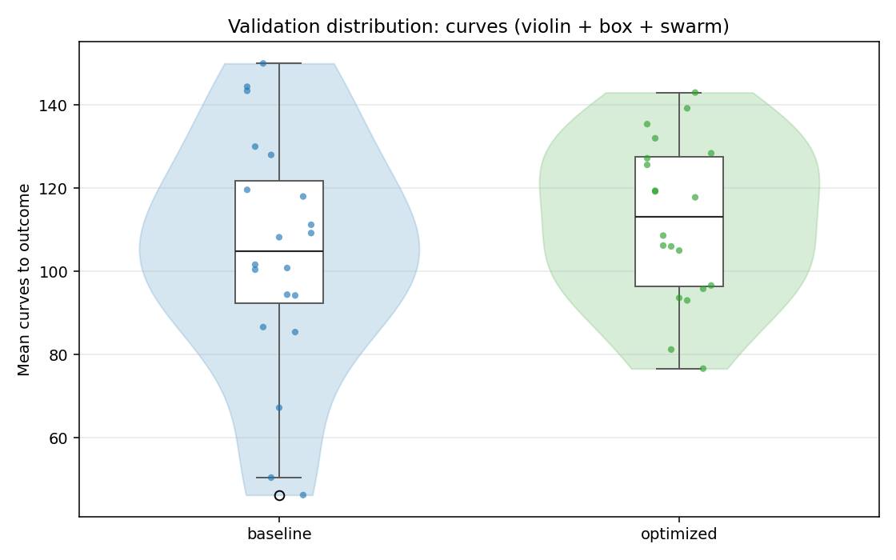
  - curves_trace_plot: [`ga_validate_20260429T114040Z_curves_trace.png`](plots/ga_validate_20260429T114040Z_curves_trace.png)
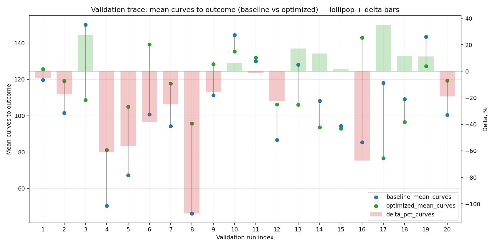
  - score_distribution_plot: [`ga_validate_20260429T114040Z_score_distribution.png`](plots/ga_validate_20260429T114040Z_score_distribution.png)
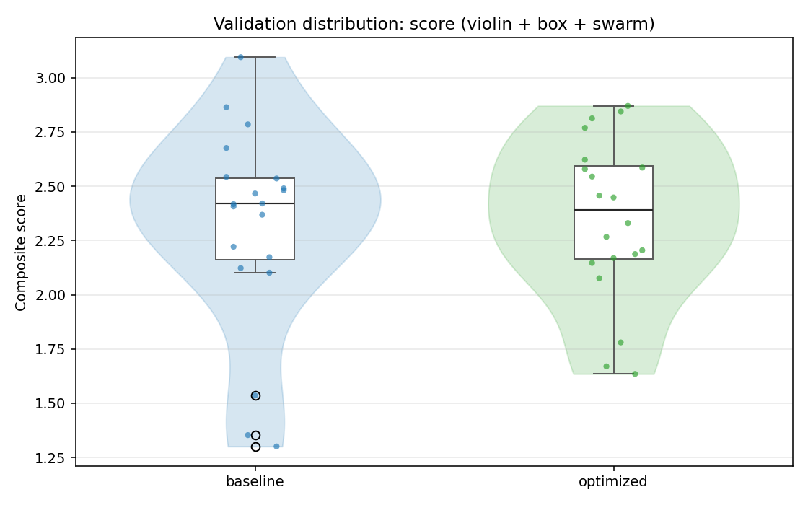
  - score_trace_plot: [`ga_validate_20260429T114040Z_score_trace.png`](plots/ga_validate_20260429T114040Z_score_trace.png)
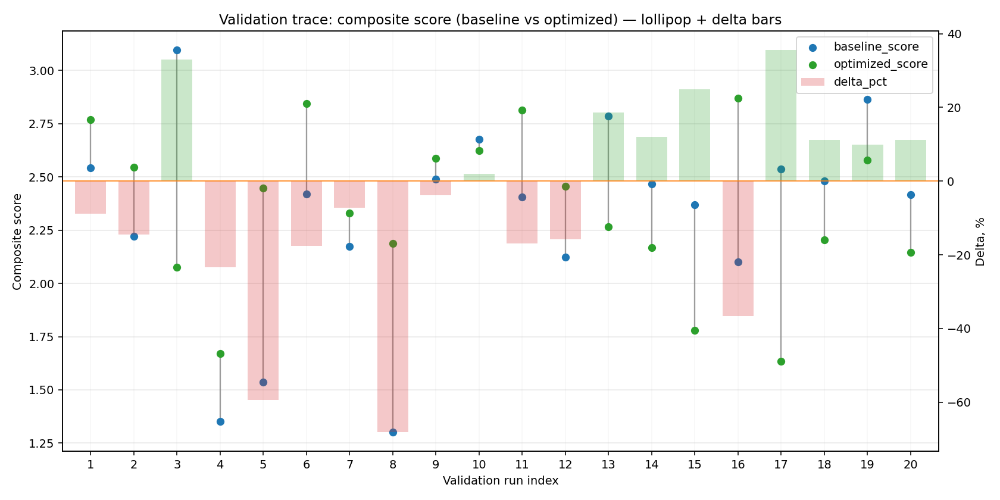
  - time_distribution_plot: [`ga_validate_20260429T114040Z_time_distribution.png`](plots/ga_validate_20260429T114040Z_time_distribution.png)
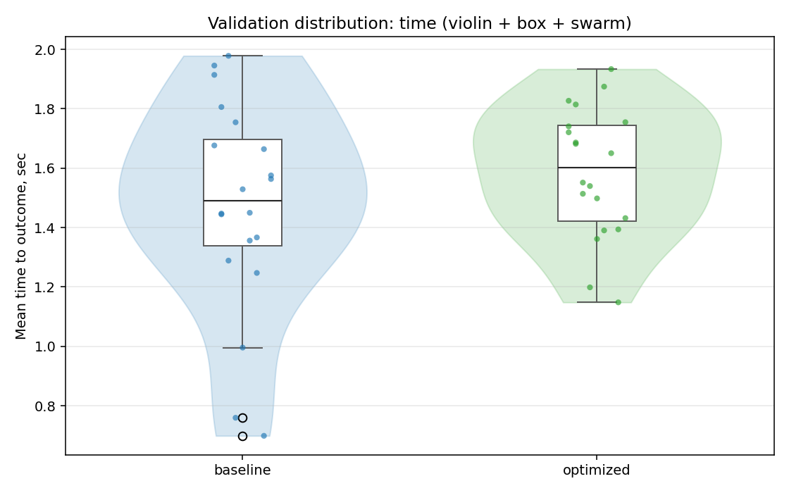
  - time_trace_plot: [`ga_validate_20260429T114040Z_time_trace.png`](plots/ga_validate_20260429T114040Z_time_trace.png)
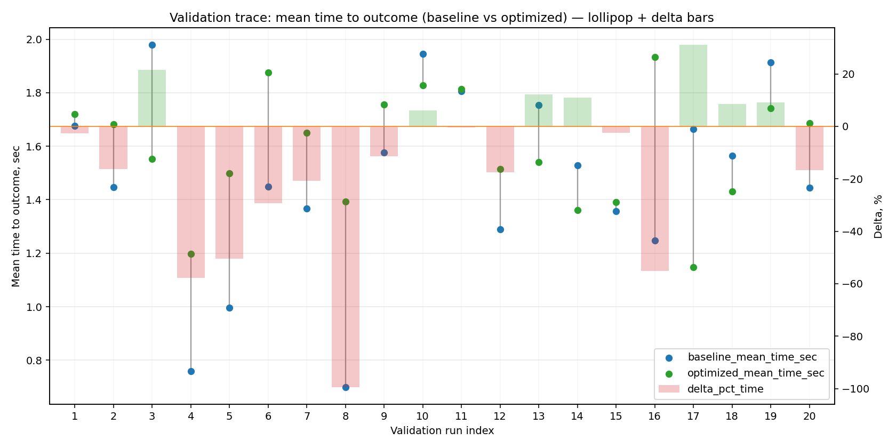

---
