# Отчёт по оптимизации: bo_optimize_20260429T140614Z

## Метаданные
- метод: `bo`
- датасет: `data/numbers/20_dset_20260429T132020Z/train.json`
- оптимум `(B1, B2)`: `(13283, 420295)`
- objective: `2.380496412479899`
- max_curves_per_n: `100`
- repeats_per_n: `3`
- границы: `B1[100.0, 30000.0]`, `B2[100.0, 600000.0]`, `ratio_max=100.0`

## Ключевые статистики
- `best_eval`: `27`
- `best_eval_fraction`: `0.7105263157894737`
- `eval_per_sec`: `0.2663553195915419`
- `evaluation_count`: `38`
- `improvement_percent`: `86.94379387184084`
- `max_plateau_evals`: `14`
- `median_plateau_evals`: `9.0`
- `new_best_count`: `4`
- `new_best_rate`: `0.10526315789473684`
- `p90_plateau_evals`: `12.8`
- `time_to_best_sec`: `84.16900717292447`
- `time_to_first_improvement_sec`: `1.370724490028806`
- `total_runtime_sec`: `142.66670614294708`

## Флаги внимания

| Флаг | Статус | Текущее значение | Порог | Что это значит | Что делать |
|---|---|---:|---:|---|---|
| `b1_hits_boundary` | ✅ ОК | `0.02631578947368421` | `> 0.10` | Большая доля оценок проходит близко к границам B1. | Расширить диапазон B1, если упор в границу повторяется. |
| `b2_hits_boundary` | ✅ ОК | `0.05263157894736842` | `> 0.10` | Большая доля оценок проходит близко к границам B2. | Расширить диапазон B2, если упор в границу повторяется. |
| `best_b1_on_boundary` | ✅ ОК | `13283.0` | `within 2% of log-range [100.0, 30000.0]` | Лучший найденный B1 лежит на границе диапазона. | Проверить расширенный диапазон B1 вокруг текущей границы. |
| `best_b2_on_boundary` | ✅ ОК | `420295.0` | `within 2% of log-range [100.0, 600000.0]` | Лучший найденный B2 лежит на границе диапазона. | Проверить расширенный диапазон B2 вокруг текущей границы. |
| `best_ratio_on_boundary` | ✅ ОК | `31.641571934051044` | `within 2% of log-range up to ratio_max=100.0` | Лучшее отношение B2/B1 находится у верхней границы ratio_max. | Увеличить ratio_max и перепроверить локальный поиск в новой области. |
| `late_best` | ✅ ОК | `0.589969513199457` | `> 0.85` | Лучшее решение найдено слишком поздно относительно общего времени. | Усилить ранний поиск или пересмотреть бюджет/инициализацию. |
| `low_improvement` | ✅ ОК | `86.94379387184084` | `< 10%` | Итоговый прирост качества слишком мал. | Сузить границы поиска или изменить параметры метода. |
| `low_signal` | ✅ ОК | `0.10526315789473684` | `< 0.03` | Слишком низкая плотность новых best-событий (слабый сигнал оптимизации). | Перенастроить exploration и сделать переоценку top-k кандидатов. |
| `plateau_too_long` | ✅ ОК | `0.3684210526315789` | `> 0.50` | Слишком длинное плато: улучшений почти нет на большом участке запуска. | Увеличить exploration или добавить политику рестартов. |
| `ratio_hits_boundary` | ⚠️ ВНИМАНИЕ | `0.3157894736842105` | `> 0.10` | Большая доля оценок проходит близко к границе отношения B2/B1. | Увеличить ratio_max, если хорошие точки упираются в ограничение отношения B2/B1. |

## Графики
- [`bo_optimize_20260429T140614Z_b1_b2_trajectory.png`](plots/bo_optimize_20260429T140614Z_b1_b2_trajectory.png)
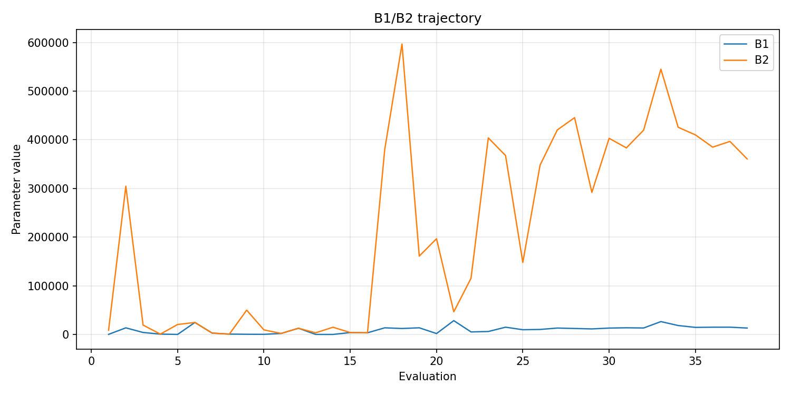
- [`bo_optimize_20260429T140614Z_b1_ratio_heatmap.png`](plots/bo_optimize_20260429T140614Z_b1_ratio_heatmap.png)
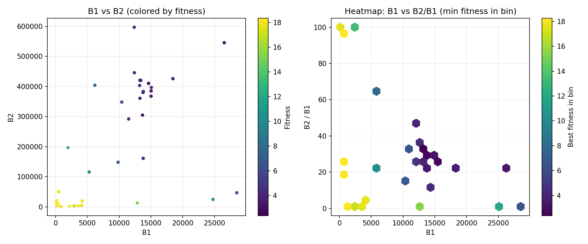
- [`bo_optimize_20260429T140614Z_jump_plot.png`](plots/bo_optimize_20260429T140614Z_jump_plot.png)
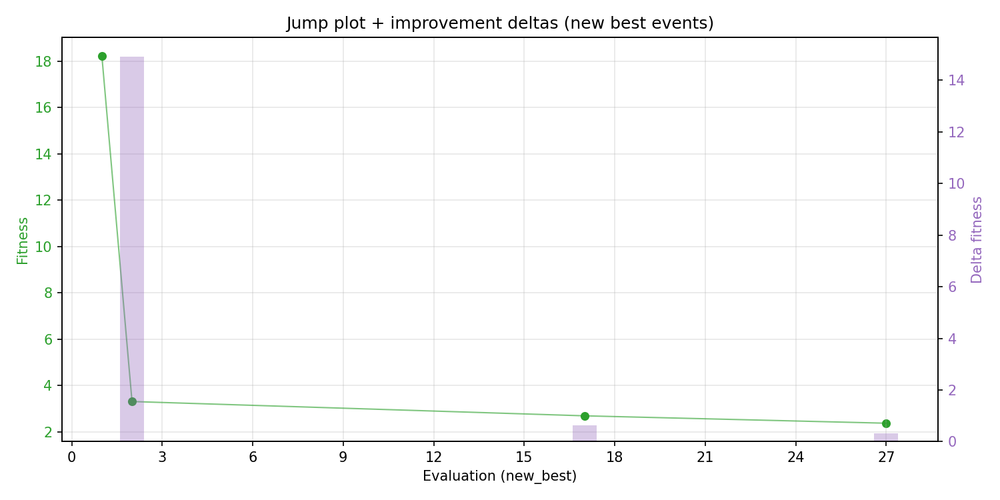
- [`bo_optimize_20260429T140614Z_progress_by_phase.png`](plots/bo_optimize_20260429T140614Z_progress_by_phase.png)
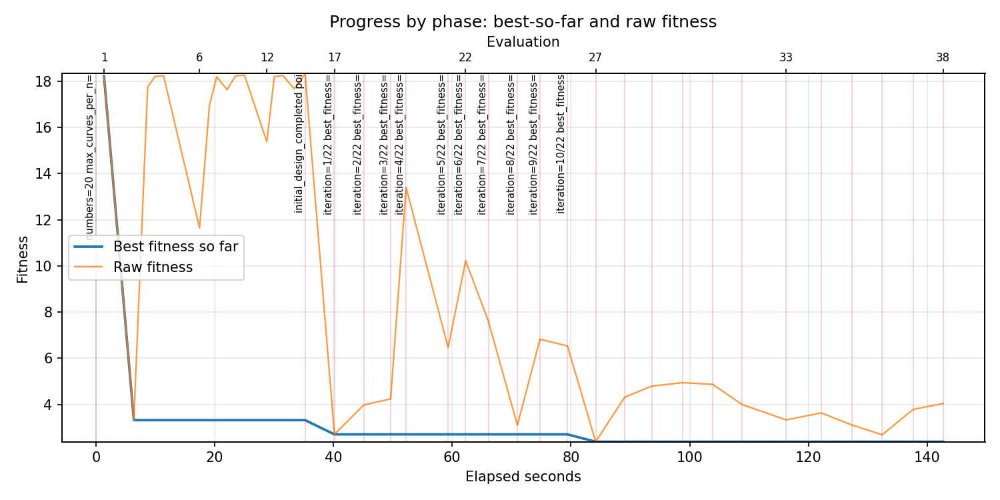
- [`bo_optimize_20260429T140614Z_time_efficiency.png`](plots/bo_optimize_20260429T140614Z_time_efficiency.png)
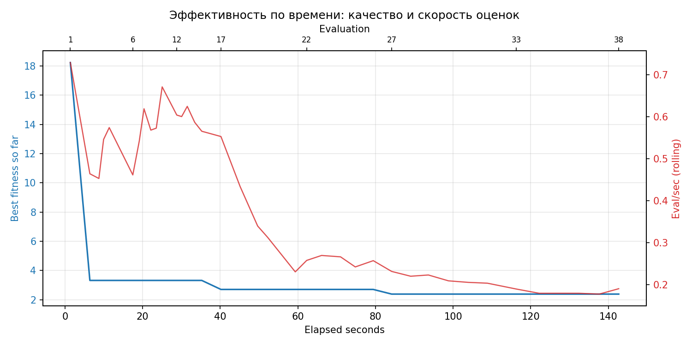

## Таблицы

## Validation runs

### Validation run `20260429T140841Z`
- validation file: [`bo_validate_20260429T140841Z.json`](bo_validate_20260429T140841Z.json)
- dataset: `data/numbers/20_dset_20260429T132020Z/control.json`
- method: `bo`
- optimized params: `(B1, B2)=(13283, 420295)`
- baseline params: `(B1, B2)=(11000, 220000)`
- max_curves_per_n: `150`
- repeats_per_n: `5`
- curve_timeout_sec: `None`
- workers: `56`
- seed: `42`
- optimized_mean_score: `3.1599094669599213`
- baseline_mean_score: `3.6827387009433856`
- relative_improvement_pct: `14.196750745566995`
- optimized_mean_time_sec: `1.5152108701539693`
- baseline_mean_time_sec: `1.4904020629345904`
- time_improvement_pct: `-1.6645714492994248`
- optimized_mean_curves: `89.06`
- baseline_mean_curves: `103.45`
- curves_improvement_pct: `13.91010149830836`
- optimized_mean_success_rate: `0.6799999999999999`
- baseline_mean_success_rate: `0.6`
- success_rate_delta_pp: `7.9999999999999964`
- trace plots:
  - curves_distribution_plot: [`bo_validate_20260429T140841Z_curves_distribution.png`](plots/bo_validate_20260429T140841Z_curves_distribution.png)
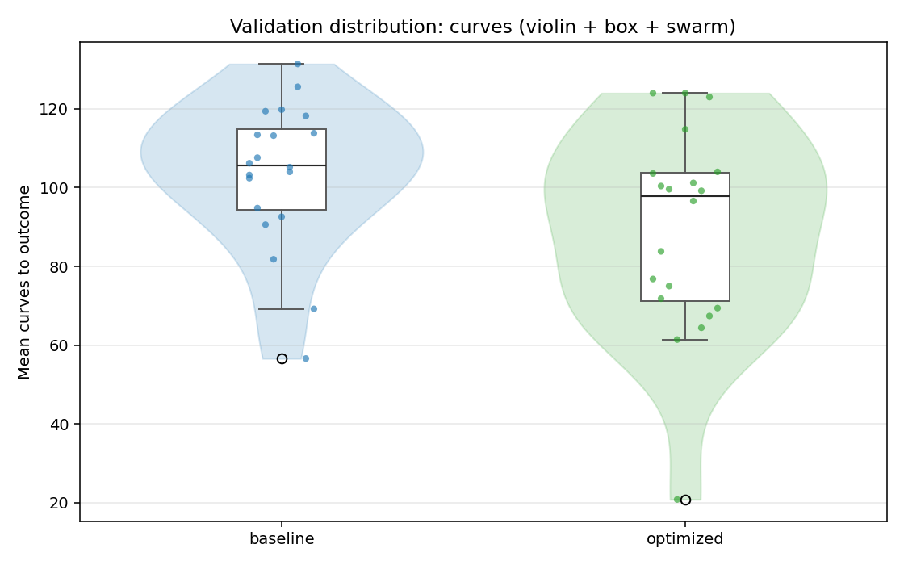
  - curves_trace_plot: [`bo_validate_20260429T140841Z_curves_trace.png`](plots/bo_validate_20260429T140841Z_curves_trace.png)
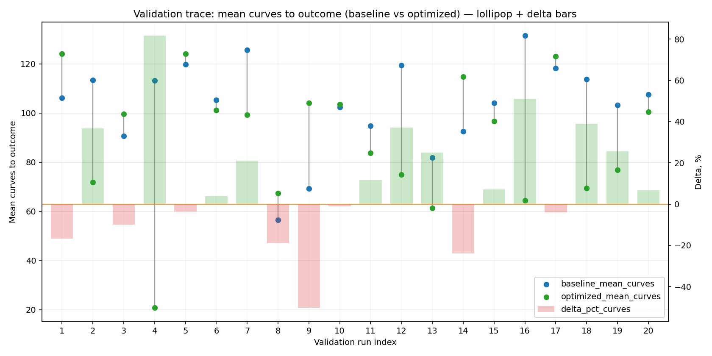
  - score_distribution_plot: [`bo_validate_20260429T140841Z_score_distribution.png`](plots/bo_validate_20260429T140841Z_score_distribution.png)
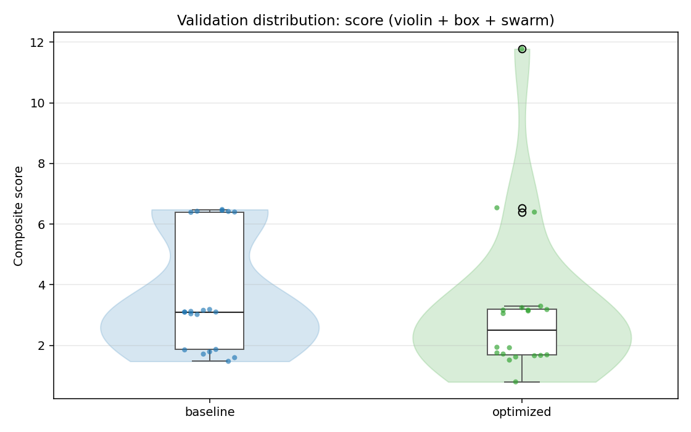
  - score_trace_plot: [`bo_validate_20260429T140841Z_score_trace.png`](plots/bo_validate_20260429T140841Z_score_trace.png)
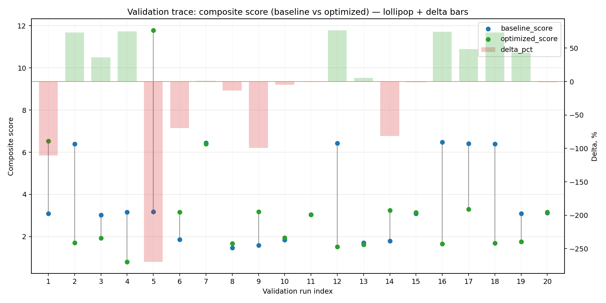
  - time_distribution_plot: [`bo_validate_20260429T140841Z_time_distribution.png`](plots/bo_validate_20260429T140841Z_time_distribution.png)
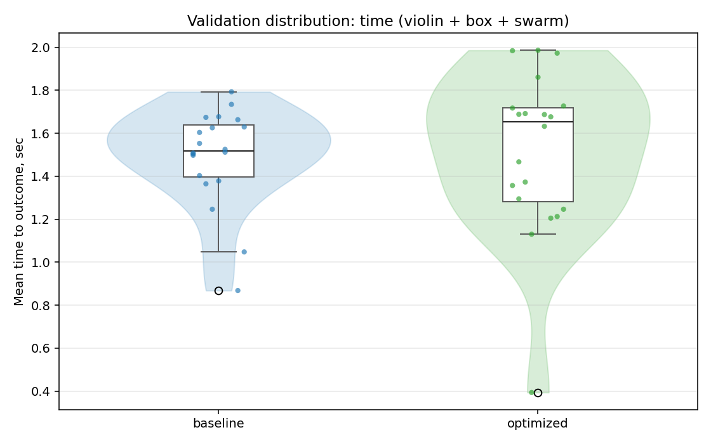
  - time_trace_plot: [`bo_validate_20260429T140841Z_time_trace.png`](plots/bo_validate_20260429T140841Z_time_trace.png)
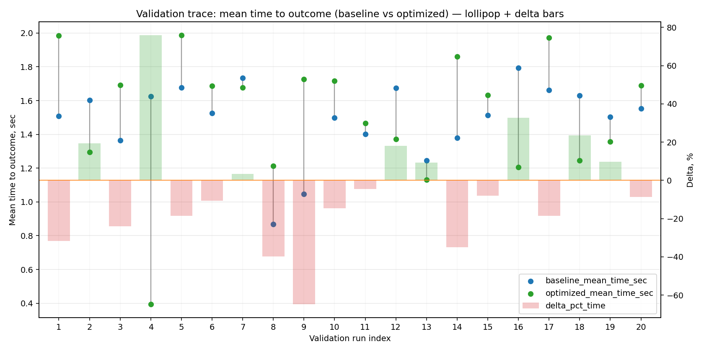

---
