# Отчёт по оптимизации: pso_optimize_20260429T133947Z

## Метаданные
- метод: `pso`
- датасет: `data/numbers/20_dset_20260429T132020Z/train.json`
- оптимум `(B1, B2)`: `(30000, 600000)`
- objective: `1.4393197966010727`
- max_curves_per_n: `100`
- repeats_per_n: `3`
- границы: `B1[100.0, 30000.0]`, `B2[100.0, 600000.0]`, `ratio_max=100.0`

## Ключевые статистики
- `best_eval`: `227`
- `best_eval_fraction`: `0.9700854700854701`
- `eval_per_sec`: `0.1503730787513734`
- `evaluation_count`: `234`
- `improvement_percent`: `92.11061710286549`
- `max_plateau_evals`: `111`
- `median_plateau_evals`: `10.0`
- `new_best_count`: `9`
- `new_best_rate`: `0.038461538461538464`
- `p90_plateau_evals`: `56.09999999999998`
- `time_to_best_sec`: `1504.7227328299778`
- `time_to_first_improvement_sec`: `44.37678337597754`
- `total_runtime_sec`: `1556.1296706410358`

## Флаги внимания

| Флаг | Статус | Текущее значение | Порог | Что это значит | Что делать |
|---|---|---:|---:|---|---|
| `b1_hits_boundary` | ⚠️ ВНИМАНИЕ | `0.8589743589743589` | `> 0.10` | Большая доля оценок проходит близко к границам B1. | Расширить диапазон B1, если упор в границу повторяется. |
| `b2_hits_boundary` | ⚠️ ВНИМАНИЕ | `0.8162393162393162` | `> 0.10` | Большая доля оценок проходит близко к границам B2. | Расширить диапазон B2, если упор в границу повторяется. |
| `best_b1_on_boundary` | ⚠️ ВНИМАНИЕ | `30000.0` | `within 2% of log-range [100.0, 30000.0]` | Лучший найденный B1 лежит на границе диапазона. | Проверить расширенный диапазон B1 вокруг текущей границы. |
| `best_b2_on_boundary` | ⚠️ ВНИМАНИЕ | `600000.0` | `within 2% of log-range [100.0, 600000.0]` | Лучший найденный B2 лежит на границе диапазона. | Проверить расширенный диапазон B2 вокруг текущей границы. |
| `best_ratio_on_boundary` | ✅ ОК | `20.0` | `within 2% of log-range up to ratio_max=100.0` | Лучшее отношение B2/B1 находится у верхней границы ratio_max. | Увеличить ratio_max и перепроверить локальный поиск в новой области. |
| `late_best` | ⚠️ ВНИМАНИЕ | `0.9669648752408395` | `> 0.85` | Лучшее решение найдено слишком поздно относительно общего времени. | Усилить ранний поиск или пересмотреть бюджет/инициализацию. |
| `low_improvement` | ✅ ОК | `92.11061710286549` | `< 10%` | Итоговый прирост качества слишком мал. | Сузить границы поиска или изменить параметры метода. |
| `low_signal` | ✅ ОК | `0.038461538461538464` | `< 0.03` | Слишком низкая плотность новых best-событий (слабый сигнал оптимизации). | Перенастроить exploration и сделать переоценку top-k кандидатов. |
| `plateau_too_long` | ✅ ОК | `0.47435897435897434` | `> 0.50` | Слишком длинное плато: улучшений почти нет на большом участке запуска. | Увеличить exploration или добавить политику рестартов. |
| `ratio_hits_boundary` | ✅ ОК | `0.06837606837606838` | `> 0.10` | Большая доля оценок проходит близко к границе отношения B2/B1. | Увеличить ratio_max, если хорошие точки упираются в ограничение отношения B2/B1. |

## Графики
- [`pso_optimize_20260429T133947Z_b1_b2_trajectory.png`](plots/pso_optimize_20260429T133947Z_b1_b2_trajectory.png)
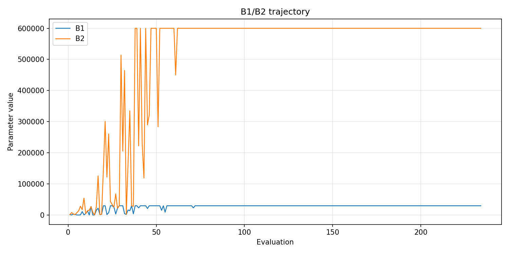
- [`pso_optimize_20260429T133947Z_b1_ratio_heatmap.png`](plots/pso_optimize_20260429T133947Z_b1_ratio_heatmap.png)
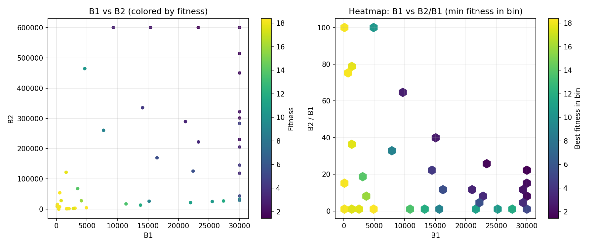
- [`pso_optimize_20260429T133947Z_jump_plot.png`](plots/pso_optimize_20260429T133947Z_jump_plot.png)
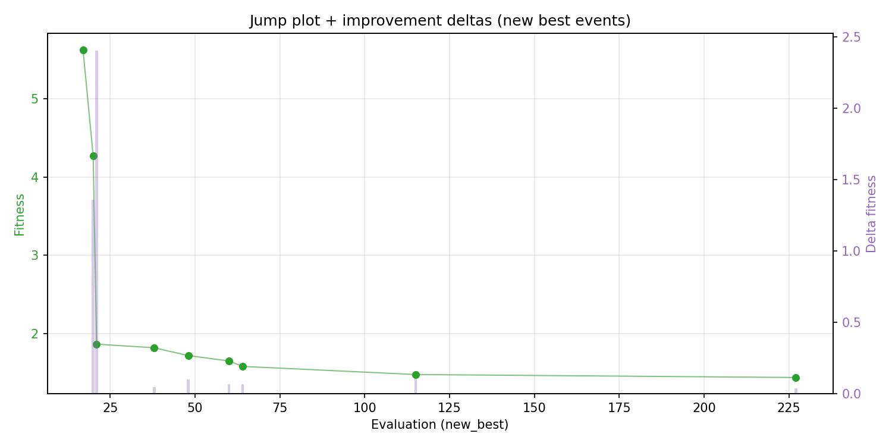
- [`pso_optimize_20260429T133947Z_progress_by_phase.png`](plots/pso_optimize_20260429T133947Z_progress_by_phase.png)
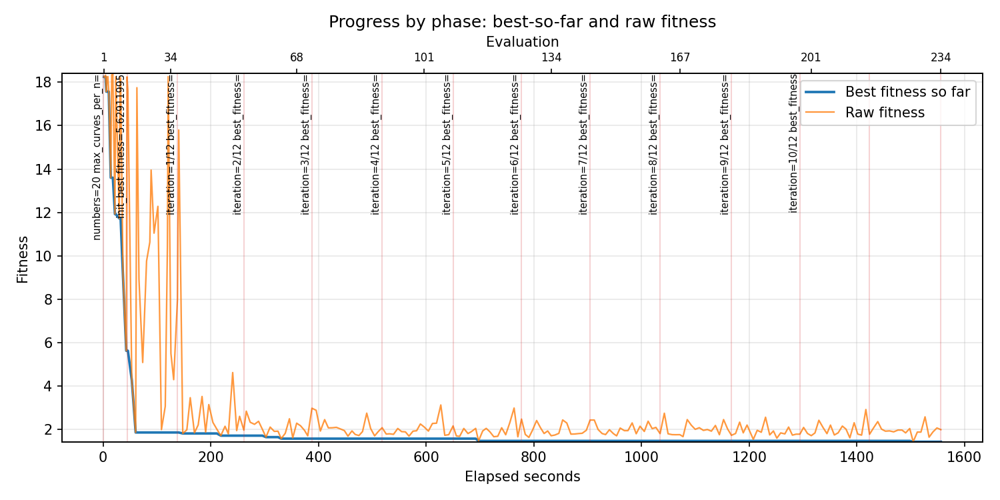
- [`pso_optimize_20260429T133947Z_time_efficiency.png`](plots/pso_optimize_20260429T133947Z_time_efficiency.png)
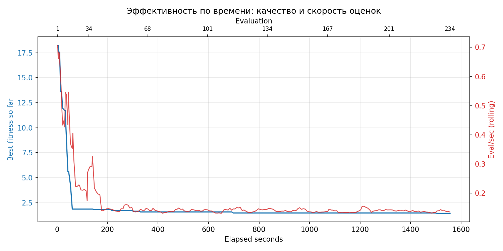

## Таблицы

## Validation runs

### Validation run `20260429T140546Z`
- validation file: [`pso_validate_20260429T140546Z.json`](pso_validate_20260429T140546Z.json)
- dataset: `data/numbers/20_dset_20260429T132020Z/control.json`
- method: `pso`
- optimized params: `(B1, B2)=(30000, 600000)`
- baseline params: `(B1, B2)=(11000, 220000)`
- max_curves_per_n: `150`
- repeats_per_n: `5`
- curve_timeout_sec: `None`
- workers: `56`
- seed: `42`
- optimized_mean_score: `2.370391126647487`
- baseline_mean_score: `5.541983756293672`
- relative_improvement_pct: `57.228472134087596`
- optimized_mean_time_sec: `2.043280020371312`
- baseline_mean_time_sec: `1.4277103754505513`
- time_improvement_pct: `-43.11586267813607`
- optimized_mean_curves: `71.16`
- baseline_mean_curves: `101.26`
- curves_improvement_pct: `29.72545921390481`
- optimized_mean_success_rate: `0.8`
- baseline_mean_success_rate: `0.52`
- success_rate_delta_pp: `28.000000000000004`
- trace plots:
  - curves_distribution_plot: [`pso_validate_20260429T140546Z_curves_distribution.png`](plots/pso_validate_20260429T140546Z_curves_distribution.png)
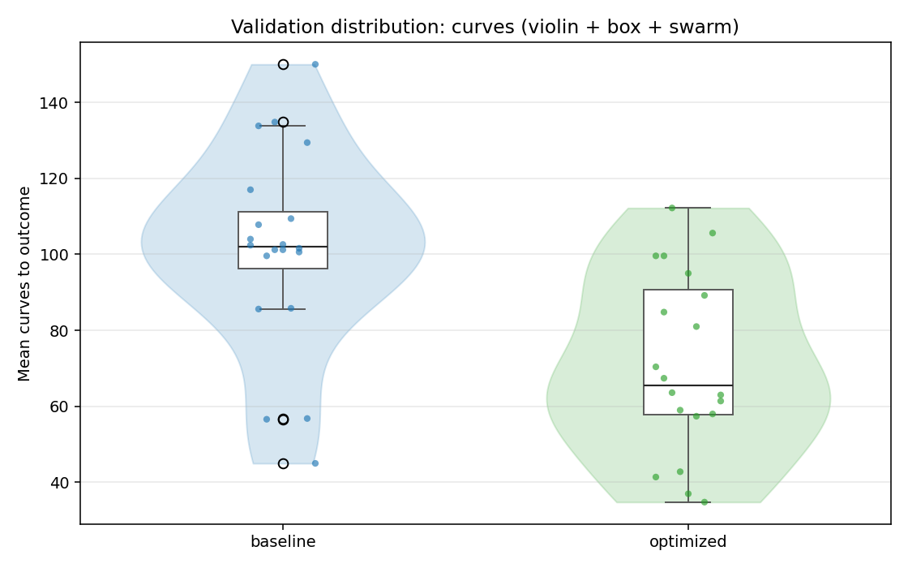
  - curves_trace_plot: [`pso_validate_20260429T140546Z_curves_trace.png`](plots/pso_validate_20260429T140546Z_curves_trace.png)
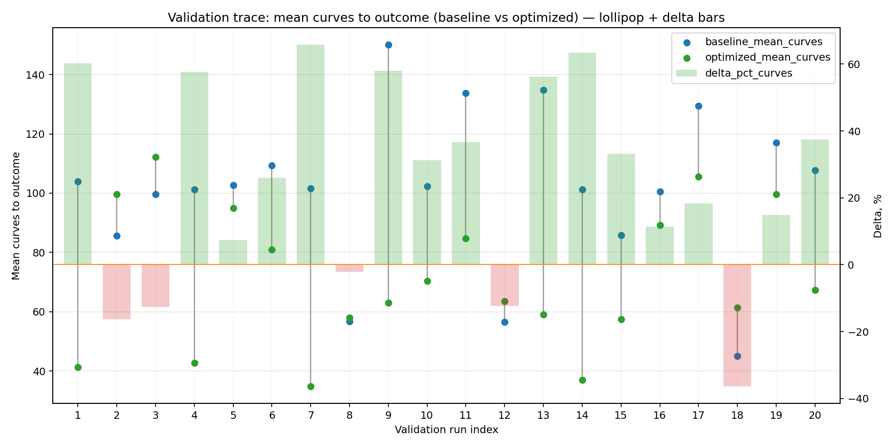
  - score_distribution_plot: [`pso_validate_20260429T140546Z_score_distribution.png`](plots/pso_validate_20260429T140546Z_score_distribution.png)
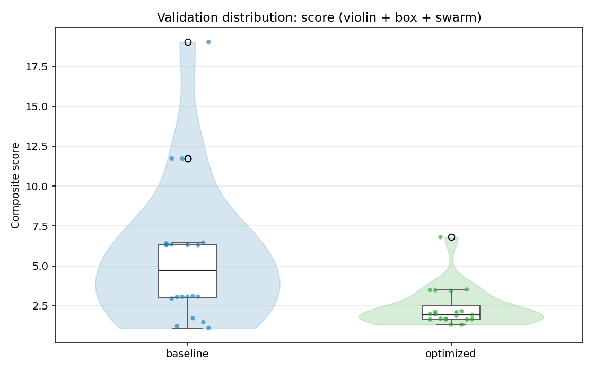
  - score_trace_plot: [`pso_validate_20260429T140546Z_score_trace.png`](plots/pso_validate_20260429T140546Z_score_trace.png)
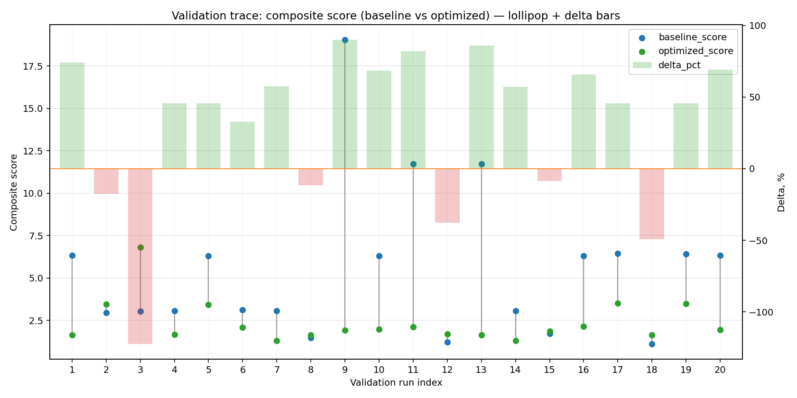
  - time_distribution_plot: [`pso_validate_20260429T140546Z_time_distribution.png`](plots/pso_validate_20260429T140546Z_time_distribution.png)
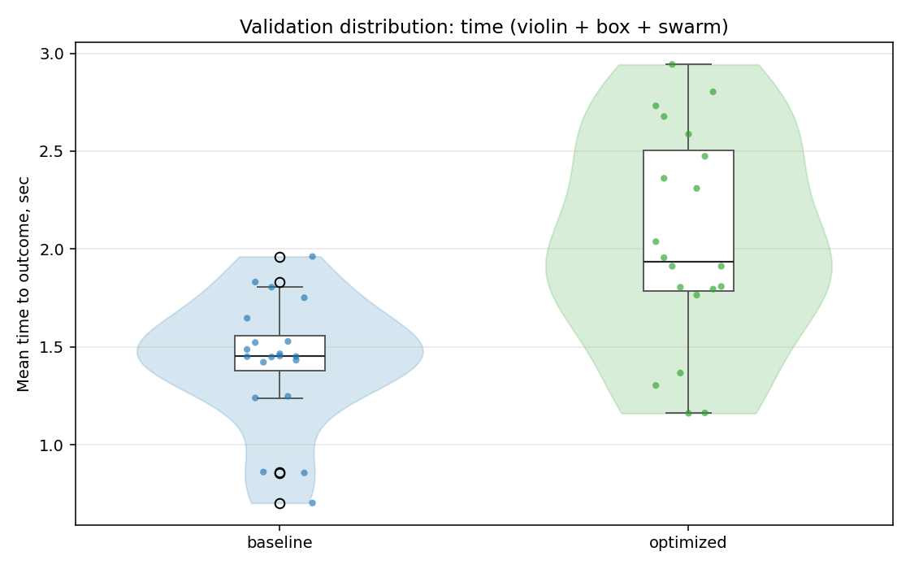
  - time_trace_plot: [`pso_validate_20260429T140546Z_time_trace.png`](plots/pso_validate_20260429T140546Z_time_trace.png)
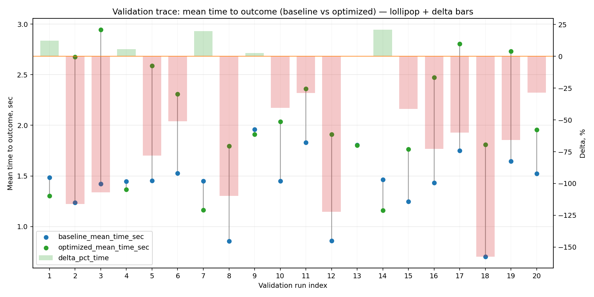

---
