# Отчёт по оптимизации: bo_optimize_20260430T205921Z_job6992133

## Метаданные
- метод: `bo`
- датасет: `data/numbers/20_dset_20260430T205915Z_job6992126/train.json`
- оптимум `(B1, B2)`: `(13763, 380230)`
- objective: `433684.25375127513`
- max_curves_per_n: `100`
- repeats_per_n: `3`
- границы: `B1[100.0, 30000.0]`, `B2[100.0, 600000.0]`, `ratio_max=100.0`

## Ключевые статистики
- `best_eval`: `17`
- `best_eval_fraction`: `0.4473684210526316`
- `eval_per_sec`: `0.30861633647758147`
- `evaluation_count`: `38`
- `improvement_percent`: `60.5741821029684`
- `max_plateau_evals`: `21`
- `median_plateau_evals`: `7.0`
- `new_best_count`: `3`
- `new_best_rate`: `0.07894736842105263`
- `p90_plateau_evals`: `18.900000000000002`
- `time_to_best_sec`: `42.946119122963864`
- `time_to_first_improvement_sec`: `2.111657381989062`
- `total_runtime_sec`: `123.13034199498361`

## Флаги внимания

| Флаг | Статус | Текущее значение | Порог | Что это значит | Что делать |
|---|---|---:|---:|---|---|
| `b1_hits_boundary` | ✅ ОК | `0.02631578947368421` | `> 0.10` | Большая доля оценок проходит близко к границам B1. | Расширить диапазон B1, если упор в границу повторяется. |
| `b2_hits_boundary` | ✅ ОК | `0.05263157894736842` | `> 0.10` | Большая доля оценок проходит близко к границам B2. | Расширить диапазон B2, если упор в границу повторяется. |
| `best_b1_on_boundary` | ✅ ОК | `13763.0` | `within 2% of log-range [100.0, 30000.0]` | Лучший найденный B1 лежит на границе диапазона. | Проверить расширенный диапазон B1 вокруг текущей границы. |
| `best_b2_on_boundary` | ✅ ОК | `380230.0` | `within 2% of log-range [100.0, 600000.0]` | Лучший найденный B2 лежит на границе диапазона. | Проверить расширенный диапазон B2 вокруг текущей границы. |
| `best_ratio_on_boundary` | ✅ ОК | `27.626970863910486` | `within 2% of log-range up to ratio_max=100.0` | Лучшее отношение B2/B1 находится у верхней границы ratio_max. | Увеличить ratio_max и перепроверить локальный поиск в новой области. |
| `late_best` | ✅ ОК | `0.3487858348083977` | `> 0.85` | Лучшее решение найдено слишком поздно относительно общего времени. | Усилить ранний поиск или пересмотреть бюджет/инициализацию. |
| `low_improvement` | ✅ ОК | `60.5741821029684` | `< 10%` | Итоговый прирост качества слишком мал. | Сузить границы поиска или изменить параметры метода. |
| `low_signal` | ✅ ОК | `0.07894736842105263` | `< 0.03` | Слишком низкая плотность новых best-событий (слабый сигнал оптимизации). | Перенастроить exploration и сделать переоценку top-k кандидатов. |
| `plateau_too_long` | ⚠️ ВНИМАНИЕ | `0.5526315789473685` | `> 0.50` | Слишком длинное плато: улучшений почти нет на большом участке запуска. | Увеличить exploration или добавить политику рестартов. |
| `ratio_hits_boundary` | ⚠️ ВНИМАНИЕ | `0.34210526315789475` | `> 0.10` | Большая доля оценок проходит близко к границе отношения B2/B1. | Увеличить ratio_max, если хорошие точки упираются в ограничение отношения B2/B1. |

## Графики
- [`bo_optimize_20260430T205921Z_job6992133_b1_b2_trajectory.png`](plots/bo_optimize_20260430T205921Z_job6992133_b1_b2_trajectory.png)
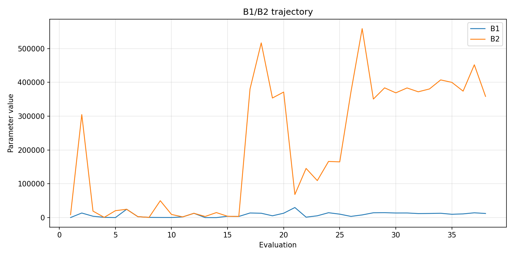
- [`bo_optimize_20260430T205921Z_job6992133_b1_ratio_heatmap.png`](plots/bo_optimize_20260430T205921Z_job6992133_b1_ratio_heatmap.png)
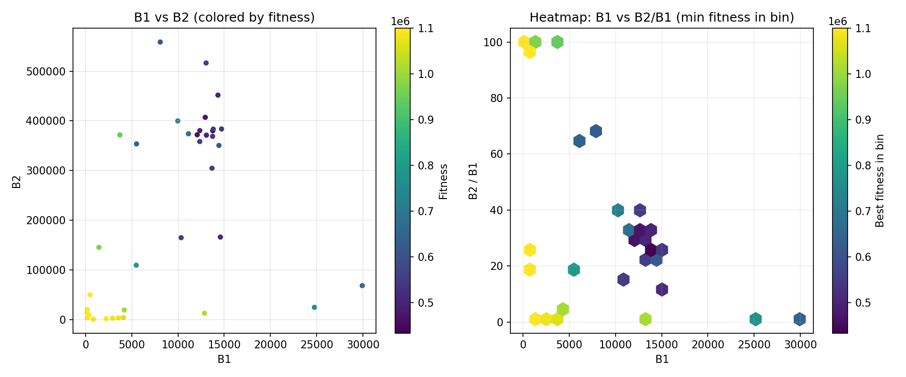
- [`bo_optimize_20260430T205921Z_job6992133_jump_plot.png`](plots/bo_optimize_20260430T205921Z_job6992133_jump_plot.png)
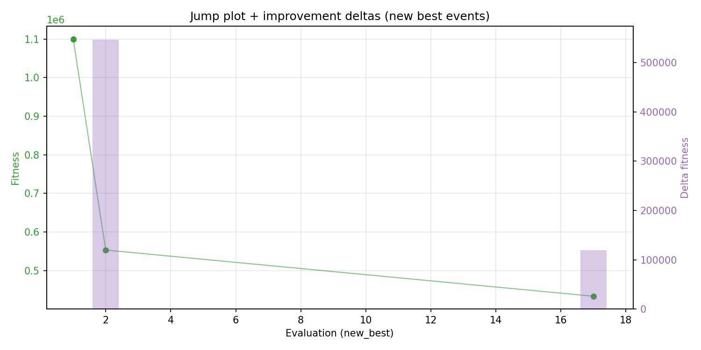
- [`bo_optimize_20260430T205921Z_job6992133_progress_by_phase.png`](plots/bo_optimize_20260430T205921Z_job6992133_progress_by_phase.png)
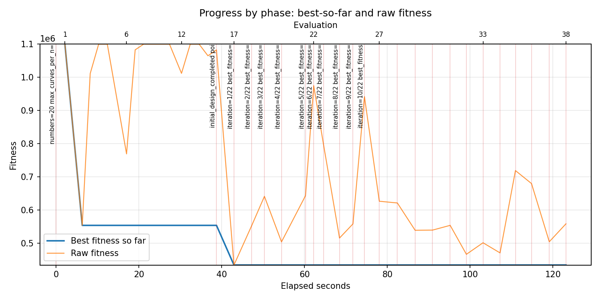
- [`bo_optimize_20260430T205921Z_job6992133_time_efficiency.png`](plots/bo_optimize_20260430T205921Z_job6992133_time_efficiency.png)
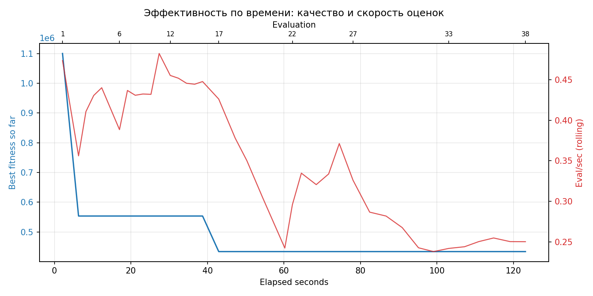

## Таблицы

## Validation runs

### Validation run `20260430T210145Z`
- validation file: [`bo_validate_20260430T210145Z_job6992134.json`](bo_validate_20260430T210145Z_job6992134.json)
- dataset: `data/numbers/20_dset_20260430T205915Z_job6992126/control.json`
- method: `bo`
- optimized params: `(B1, B2)=(13763, 380230)`
- baseline params: `(B1, B2)=(11000, 220000)`
- max_curves_per_n: `150`
- repeats_per_n: `5`
- curve_timeout_sec: `None`
- workers: `56`
- seed: `42`
- optimized_mean_score: `376541.2724854778`
- baseline_mean_score: `522161.1322547003`
- relative_improvement_pct: `27.887916348816233`
- optimized_mean_time_sec: `1.272485477848677`
- baseline_mean_time_sec: `1.1322547003097134`
- time_improvement_pct: `-12.38509122555245`
- optimized_mean_curves: `86.53999999999999`
- baseline_mean_curves: `102.16`
- curves_improvement_pct: `15.289741581832425`
- optimized_mean_success_rate: `0.7100000000000001`
- baseline_mean_success_rate: `0.58`
- success_rate_delta_pp: `13.00000000000001`
- trace plots:
  - curves_distribution_plot: [`bo_validate_20260430T210145Z_job6992134_curves_distribution.png`](plots/bo_validate_20260430T210145Z_job6992134_curves_distribution.png)
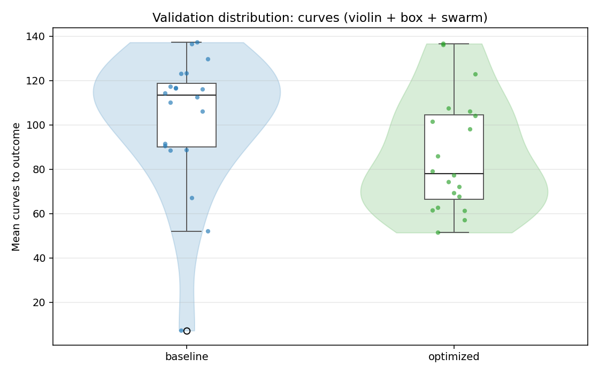
  - curves_trace_plot: [`bo_validate_20260430T210145Z_job6992134_curves_trace.png`](plots/bo_validate_20260430T210145Z_job6992134_curves_trace.png)
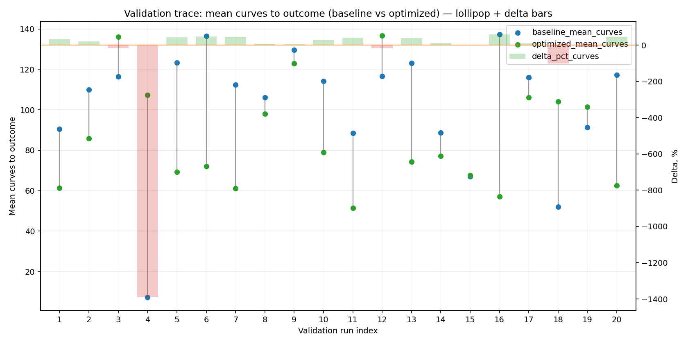
  - score_distribution_plot: [`bo_validate_20260430T210145Z_job6992134_score_distribution.png`](plots/bo_validate_20260430T210145Z_job6992134_score_distribution.png)
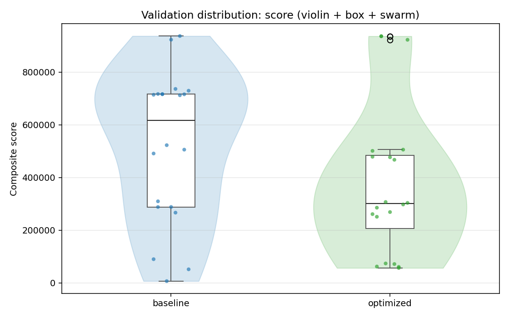
  - score_trace_plot: [`bo_validate_20260430T210145Z_job6992134_score_trace.png`](plots/bo_validate_20260430T210145Z_job6992134_score_trace.png)
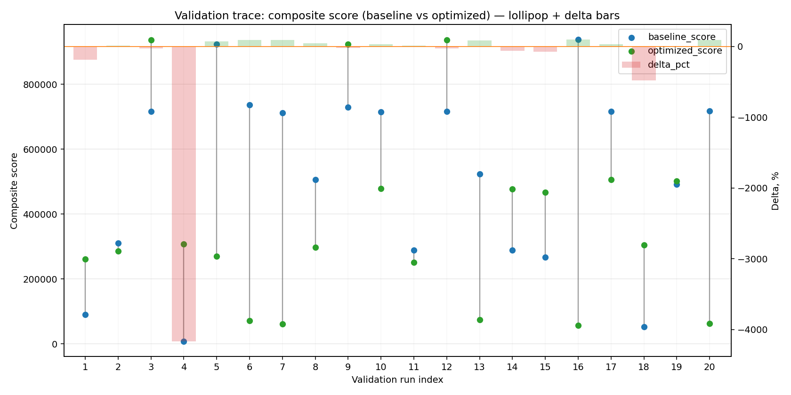
  - time_distribution_plot: [`bo_validate_20260430T210145Z_job6992134_time_distribution.png`](plots/bo_validate_20260430T210145Z_job6992134_time_distribution.png)
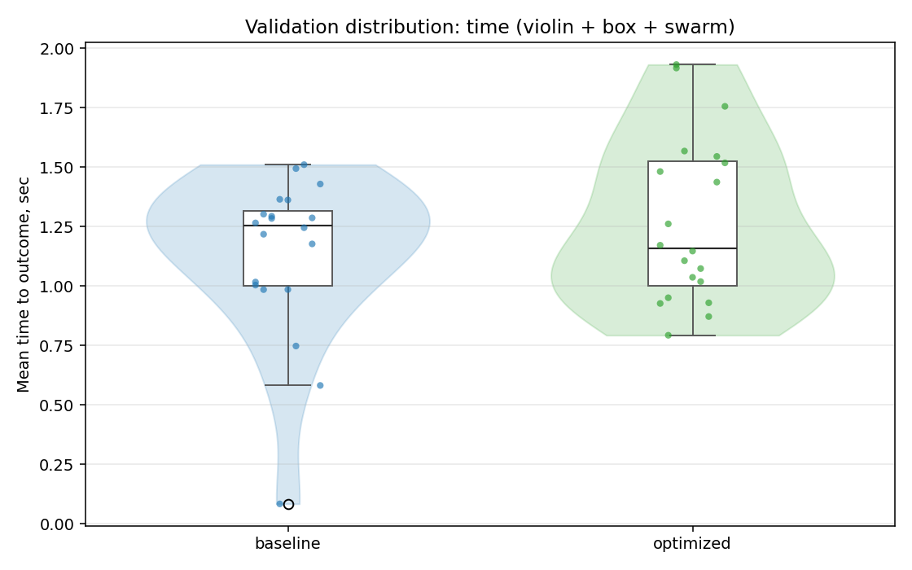
  - time_trace_plot: [`bo_validate_20260430T210145Z_job6992134_time_trace.png`](plots/bo_validate_20260430T210145Z_job6992134_time_trace.png)
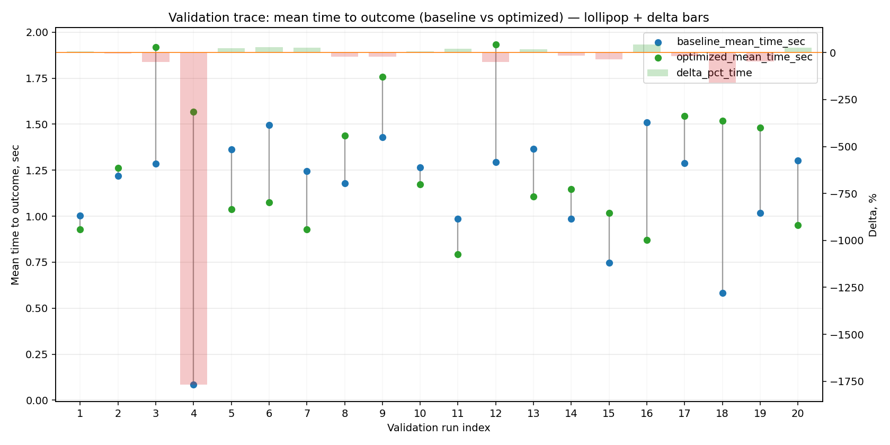

---
