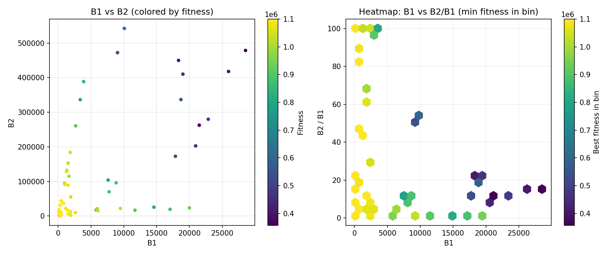
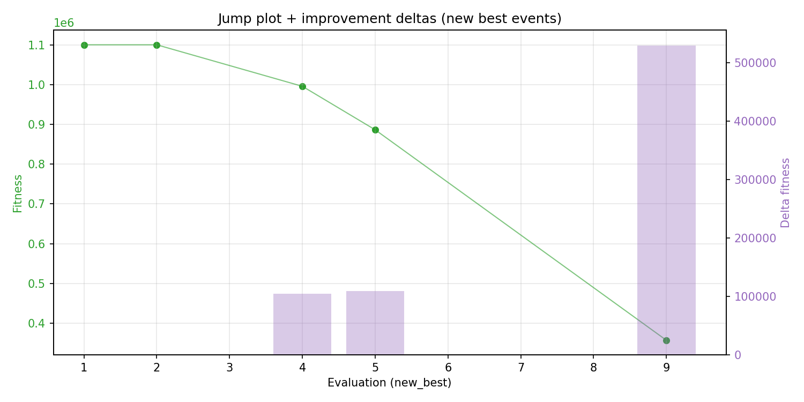
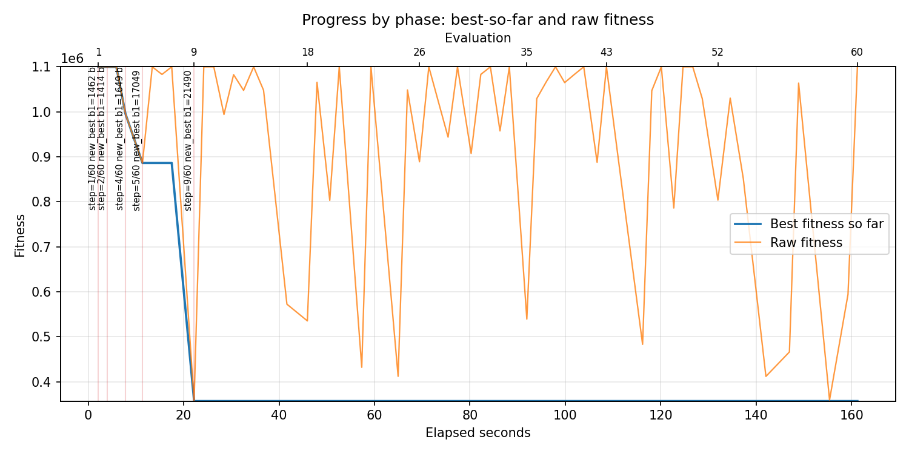
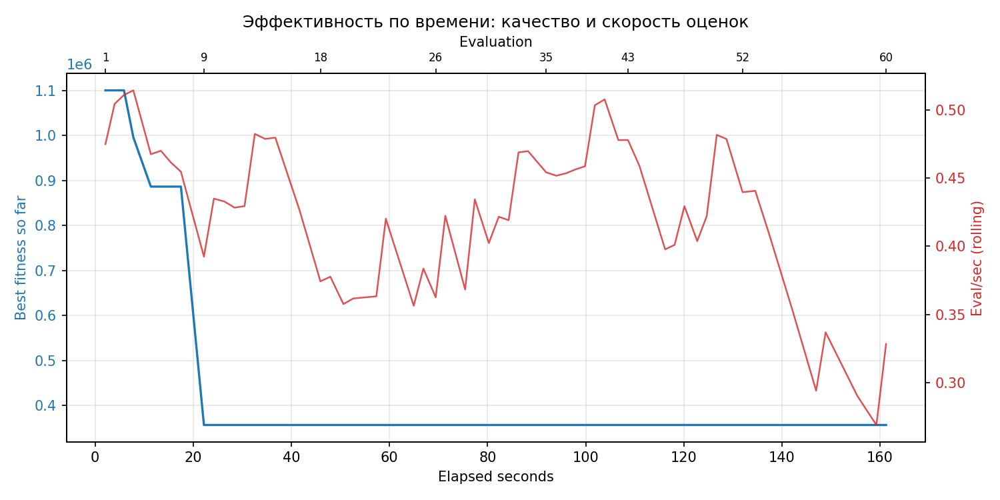

# Отчёт по оптимизации: rs_optimize_20260430T205921Z_job6992129

## Метаданные
- метод: `rs`
- датасет: `data/numbers/20_dset_20260430T205915Z_job6992126/train.json`
- оптимум `(B1, B2)`: `(21490, 262634)`
- objective: `357067.62214237684`
- max_curves_per_n: `100`
- repeats_per_n: `3`
- границы: `B1[100.0, 30000.0]`, `B2[100.0, 600000.0]`, `ratio_max=100.0`

## Ключевые статистики
- `best_eval`: `9`
- `best_eval_fraction`: `0.15`
- `eval_per_sec`: `0.37213238865692233`
- `evaluation_count`: `60`
- `improvement_percent`: `67.5393266678091`
- `max_plateau_evals`: `51`
- `median_plateau_evals`: `0.5`
- `new_best_count`: `5`
- `new_best_rate`: `0.08333333333333333`
- `p90_plateau_evals`: `27.0`
- `time_to_best_sec`: `22.185738963948097`
- `time_to_first_improvement_sec`: `2.109004217956681`
- `total_runtime_sec`: `161.23294243897544`

## Флаги внимания

| Флаг | Статус | Текущее значение | Порог | Что это значит | Что делать |
|---|---|---:|---:|---|---|
| `b1_hits_boundary` | ✅ ОК | `0.016666666666666666` | `> 0.10` | Большая доля оценок проходит близко к границам B1. | Расширить диапазон B1, если упор в границу повторяется. |
| `b2_hits_boundary` | ✅ ОК | `0.016666666666666666` | `> 0.10` | Большая доля оценок проходит близко к границам B2. | Расширить диапазон B2, если упор в границу повторяется. |
| `best_b1_on_boundary` | ✅ ОК | `21490.0` | `within 2% of log-range [100.0, 30000.0]` | Лучший найденный B1 лежит на границе диапазона. | Проверить расширенный диапазон B1 вокруг текущей границы. |
| `best_b2_on_boundary` | ✅ ОК | `262634.0` | `within 2% of log-range [100.0, 600000.0]` | Лучший найденный B2 лежит на границе диапазона. | Проверить расширенный диапазон B2 вокруг текущей границы. |
| `best_ratio_on_boundary` | ✅ ОК | `12.221219171707771` | `within 2% of log-range up to ratio_max=100.0` | Лучшее отношение B2/B1 находится у верхней границы ratio_max. | Увеличить ratio_max и перепроверить локальный поиск в новой области. |
| `late_best` | ✅ ОК | `0.13760053391288266` | `> 0.85` | Лучшее решение найдено слишком поздно относительно общего времени. | Усилить ранний поиск или пересмотреть бюджет/инициализацию. |
| `low_improvement` | ✅ ОК | `67.5393266678091` | `< 10%` | Итоговый прирост качества слишком мал. | Сузить границы поиска или изменить параметры метода. |
| `low_signal` | ✅ ОК | `0.08333333333333333` | `< 0.03` | Слишком низкая плотность новых best-событий (слабый сигнал оптимизации). | Перенастроить exploration и сделать переоценку top-k кандидатов. |
| `plateau_too_long` | ⚠️ ВНИМАНИЕ | `0.85` | `> 0.50` | Слишком длинное плато: улучшений почти нет на большом участке запуска. | Увеличить exploration или добавить политику рестартов. |
| `ratio_hits_boundary` | ⚠️ ВНИМАНИЕ | `0.26666666666666666` | `> 0.10` | Большая доля оценок проходит близко к границе отношения B2/B1. | Увеличить ratio_max, если хорошие точки упираются в ограничение отношения B2/B1. |

## Графики
- [`rs_optimize_20260430T205921Z_job6992129_b1_b2_trajectory.png`](plots/rs_optimize_20260430T205921Z_job6992129_b1_b2_trajectory.png)

- [`rs_optimize_20260430T205921Z_job6992129_b1_ratio_heatmap.png`](plots/rs_optimize_20260430T205921Z_job6992129_b1_ratio_heatmap.png)

- [`rs_optimize_20260430T205921Z_job6992129_jump_plot.png`](plots/rs_optimize_20260430T205921Z_job6992129_jump_plot.png)

- [`rs_optimize_20260430T205921Z_job6992129_progress_by_phase.png`](plots/rs_optimize_20260430T205921Z_job6992129_progress_by_phase.png)

- [`rs_optimize_20260430T205921Z_job6992129_time_efficiency.png`](plots/rs_optimize_20260430T205921Z_job6992129_time_efficiency.png)

## Таблицы

