# Отчёт по оптимизации: de_optimize_20260430T220610Z_job6992344

## Метаданные
- метод: `de`
- датасет: `data/numbers/20_dset_20260430T220555Z_job6992343/train.json`
- оптимум `(B1, B2)`: `(29691, 306275)`
- objective: `235684.4189362649`
- max_curves_per_n: `100`
- repeats_per_n: `3`
- границы: `B1[100.0, 30000.0]`, `B2[100.0, 600000.0]`, `ratio_max=100.0`

## Ключевые статистики
- `best_eval`: `88`
- `best_eval_fraction`: `0.4`
- `eval_per_sec`: `0.25708053873377873`
- `evaluation_count`: `220`
- `improvement_percent`: `63.46079214216842`
- `max_plateau_evals`: `132`
- `median_plateau_evals`: `11.0`
- `new_best_count`: `8`
- `new_best_rate`: `0.03636363636363636`
- `p90_plateau_evals`: `51.20000000000002`
- `time_to_best_sec`: `287.23534351699345`
- `time_to_first_improvement_sec`: `4.654975172001286`
- `total_runtime_sec`: `855.7705220679927`

## Флаги внимания

| Флаг | Статус | Текущее значение | Порог | Что это значит | Что делать |
|---|---|---:|---:|---|---|
| `b1_hits_boundary` | ⚠️ ВНИМАНИЕ | `0.20909090909090908` | `> 0.10` | Большая доля оценок проходит близко к границам B1. | Расширить диапазон B1, если упор в границу повторяется. |
| `b2_hits_boundary` | ✅ ОК | `0.01818181818181818` | `> 0.10` | Большая доля оценок проходит близко к границам B2. | Расширить диапазон B2, если упор в границу повторяется. |
| `best_b1_on_boundary` | ⚠️ ВНИМАНИЕ | `29691.0` | `within 2% of log-range [100.0, 30000.0]` | Лучший найденный B1 лежит на границе диапазона. | Проверить расширенный диапазон B1 вокруг текущей границы. |
| `best_b2_on_boundary` | ✅ ОК | `306275.0` | `within 2% of log-range [100.0, 600000.0]` | Лучший найденный B2 лежит на границе диапазона. | Проверить расширенный диапазон B2 вокруг текущей границы. |
| `best_ratio_on_boundary` | ✅ ОК | `10.315415445757974` | `within 2% of log-range up to ratio_max=100.0` | Лучшее отношение B2/B1 находится у верхней границы ratio_max. | Увеличить ratio_max и перепроверить локальный поиск в новой области. |
| `late_best` | ✅ ОК | `0.3356452882051621` | `> 0.85` | Лучшее решение найдено слишком поздно относительно общего времени. | Усилить ранний поиск или пересмотреть бюджет/инициализацию. |
| `low_improvement` | ✅ ОК | `63.46079214216842` | `< 10%` | Итоговый прирост качества слишком мал. | Сузить границы поиска или изменить параметры метода. |
| `low_signal` | ✅ ОК | `0.03636363636363636` | `< 0.03` | Слишком низкая плотность новых best-событий (слабый сигнал оптимизации). | Перенастроить exploration и сделать переоценку top-k кандидатов. |
| `plateau_too_long` | ⚠️ ВНИМАНИЕ | `0.6` | `> 0.50` | Слишком длинное плато: улучшений почти нет на большом участке запуска. | Увеличить exploration или добавить политику рестартов. |
| `ratio_hits_boundary` | ⚠️ ВНИМАНИЕ | `0.2636363636363636` | `> 0.10` | Большая доля оценок проходит близко к границе отношения B2/B1. | Увеличить ratio_max, если хорошие точки упираются в ограничение отношения B2/B1. |

## Графики
- [`de_optimize_20260430T220610Z_job6992344_b1_b2_trajectory.png`](plots/de_optimize_20260430T220610Z_job6992344_b1_b2_trajectory.png)
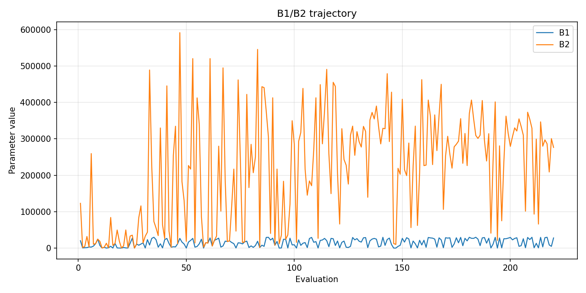
- [`de_optimize_20260430T220610Z_job6992344_b1_ratio_heatmap.png`](plots/de_optimize_20260430T220610Z_job6992344_b1_ratio_heatmap.png)
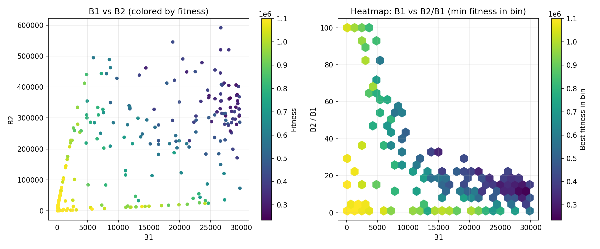
- [`de_optimize_20260430T220610Z_job6992344_jump_plot.png`](plots/de_optimize_20260430T220610Z_job6992344_jump_plot.png)
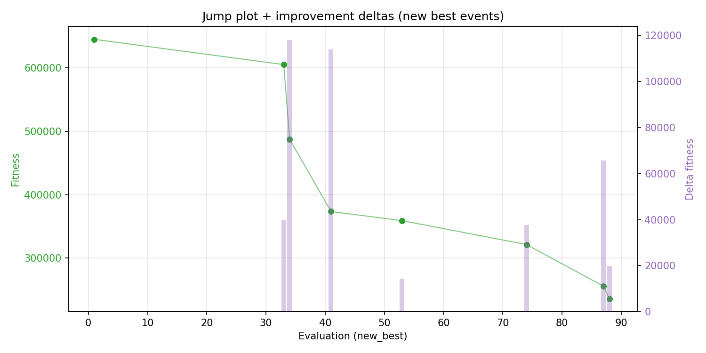
- [`de_optimize_20260430T220610Z_job6992344_progress_by_phase.png`](plots/de_optimize_20260430T220610Z_job6992344_progress_by_phase.png)
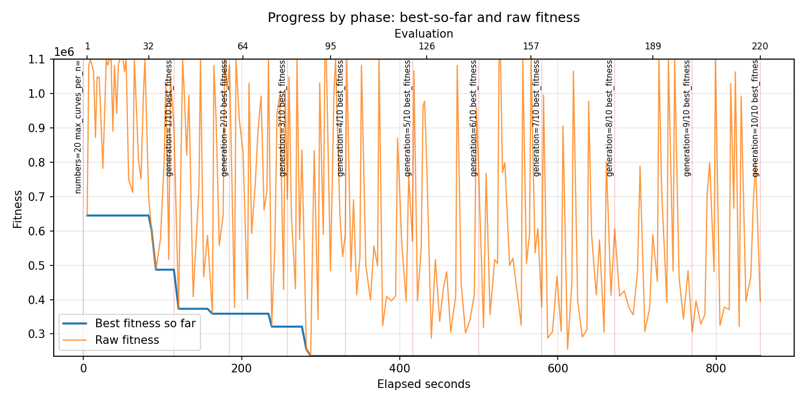
- [`de_optimize_20260430T220610Z_job6992344_time_efficiency.png`](plots/de_optimize_20260430T220610Z_job6992344_time_efficiency.png)
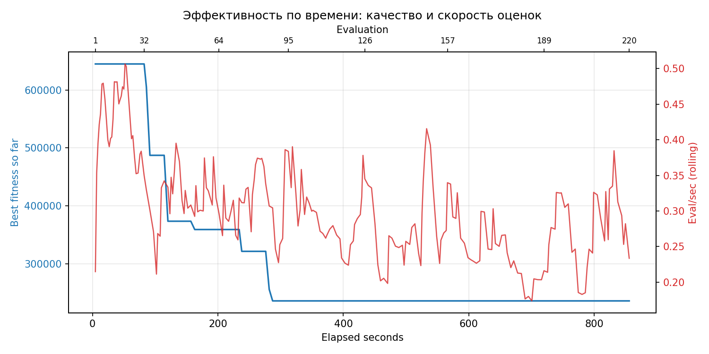

## Таблицы

## Validation runs

### Validation run `20260430T222109Z`
- validation file: [`de_validate_20260430T222109Z_job6992345.json`](de_validate_20260430T222109Z_job6992345.json)
- dataset: `data/numbers/20_dset_20260430T220555Z_job6992343/control.json`
- method: `de`
- optimized params: `(B1, B2)=(29691, 306275)`
- baseline params: `(B1, B2)=(11000, 220000)`
- max_curves_per_n: `150`
- repeats_per_n: `5`
- curve_timeout_sec: `None`
- workers: `56`
- seed: `42`
- optimized_mean_score: `272121.56436236517`
- baseline_mean_score: `550221.1057572283`
- relative_improvement_pct: `50.54323407171658`
- optimized_mean_time_sec: `1.5643623651738745`
- baseline_mean_time_sec: `1.105757228294824`
- time_improvement_pct: `-41.47430603607813`
- optimized_mean_curves: `72.12`
- baseline_mean_curves: `100.22`
- curves_improvement_pct: `28.038315705448007`
- optimized_mean_success_rate: `0.8`
- baseline_mean_success_rate: `0.55`
- success_rate_delta_pp: `25.0`
- trace plots:
  - curves_distribution_plot: [`de_validate_20260430T222109Z_job6992345_curves_distribution.png`](plots/de_validate_20260430T222109Z_job6992345_curves_distribution.png)
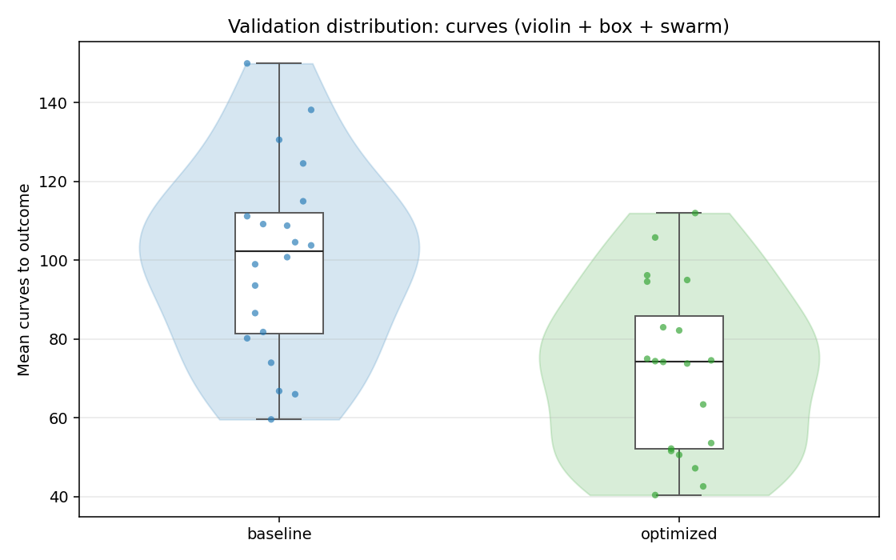
  - curves_trace_plot: [`de_validate_20260430T222109Z_job6992345_curves_trace.png`](plots/de_validate_20260430T222109Z_job6992345_curves_trace.png)
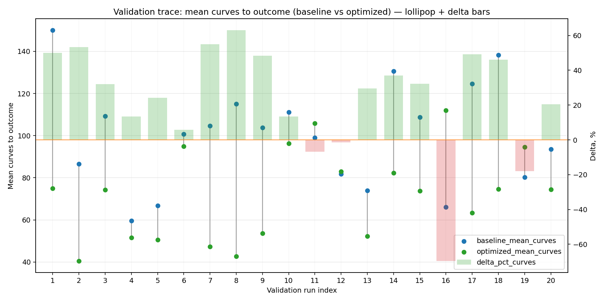
  - score_distribution_plot: [`de_validate_20260430T222109Z_job6992345_score_distribution.png`](plots/de_validate_20260430T222109Z_job6992345_score_distribution.png)
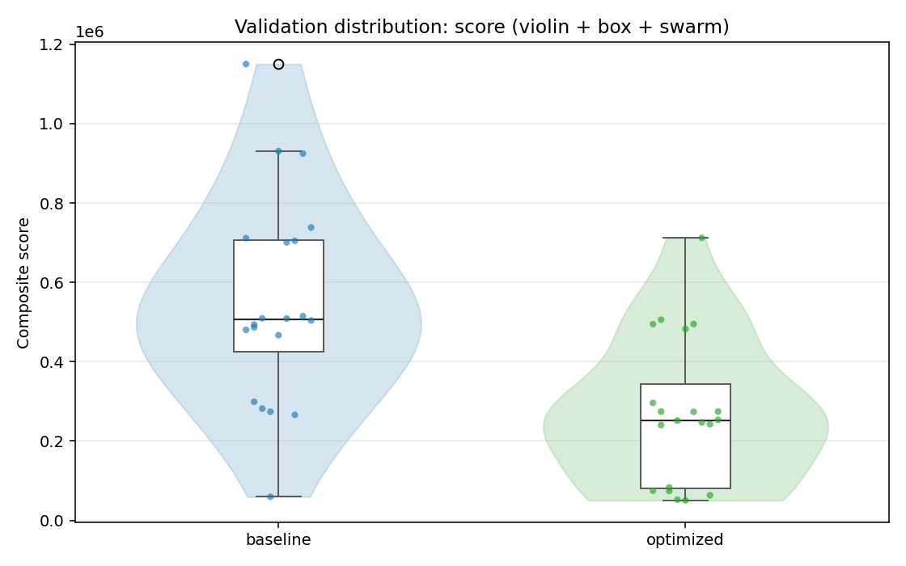
  - score_trace_plot: [`de_validate_20260430T222109Z_job6992345_score_trace.png`](plots/de_validate_20260430T222109Z_job6992345_score_trace.png)
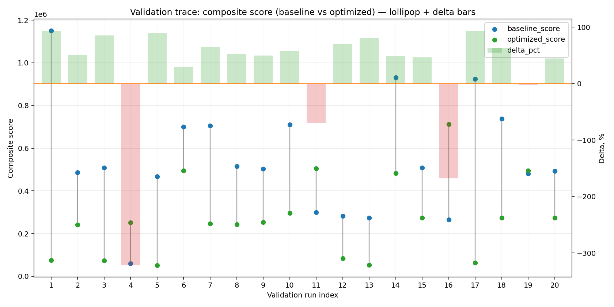
  - time_distribution_plot: [`de_validate_20260430T222109Z_job6992345_time_distribution.png`](plots/de_validate_20260430T222109Z_job6992345_time_distribution.png)
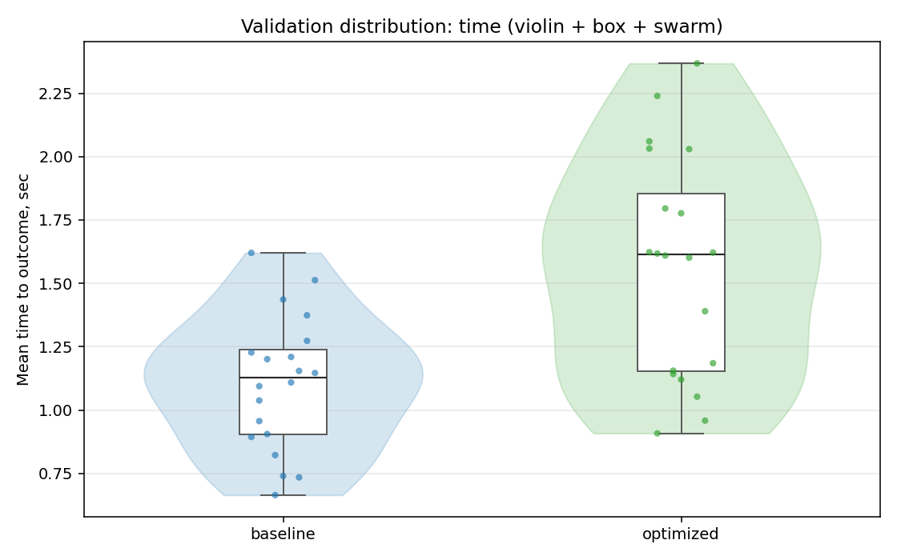
  - time_trace_plot: [`de_validate_20260430T222109Z_job6992345_time_trace.png`](plots/de_validate_20260430T222109Z_job6992345_time_trace.png)
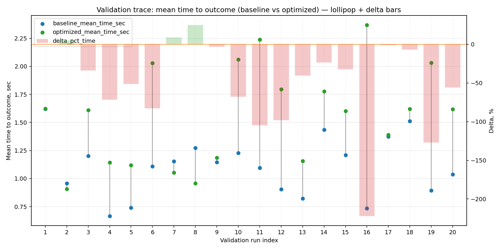

---

### Validation run `20260504T205447Z`
- validation file: [`de_validate_20260504T205447Z.json`](de_validate_20260504T205447Z.json)
- dataset: `data/numbers/20_dset_20260430T220555Z_job6992343/control.json`
- method: `de`
- optimized params: `(B1, B2)=(29691, 306275)`
- baseline params: `(B1, B2)=(11000, 1900000)`
- max_curves_per_n: `150`
- repeats_per_n: `5`
- curve_timeout_sec: `None`
- workers: `12`
- seed: `42`
- optimized_mean_score: `49387.956190309174`
- baseline_mean_score: `44285.052080100555`
- relative_improvement_pct: `-11.522859002127277`
- optimized_mean_time_sec: `2.3684456190309175`
- baseline_mean_time_sec: `1.8664052080100553`
- time_improvement_pct: `-26.898789655443224`
- optimized_mean_curves: `74.07000000000001`
- baseline_mean_curves: `72.42`
- curves_improvement_pct: `-2.2783761391880772`
- optimized_mean_success_rate: `0.82`
- baseline_mean_success_rate: `0.8300000000000001`
- success_rate_delta_pp: `-1.000000000000012`
- trace plots:
  - score_trace_plot: [`de_validate_20260504T205447Z_score_trace.png`](plots/de_validate_20260504T205447Z_score_trace.png)
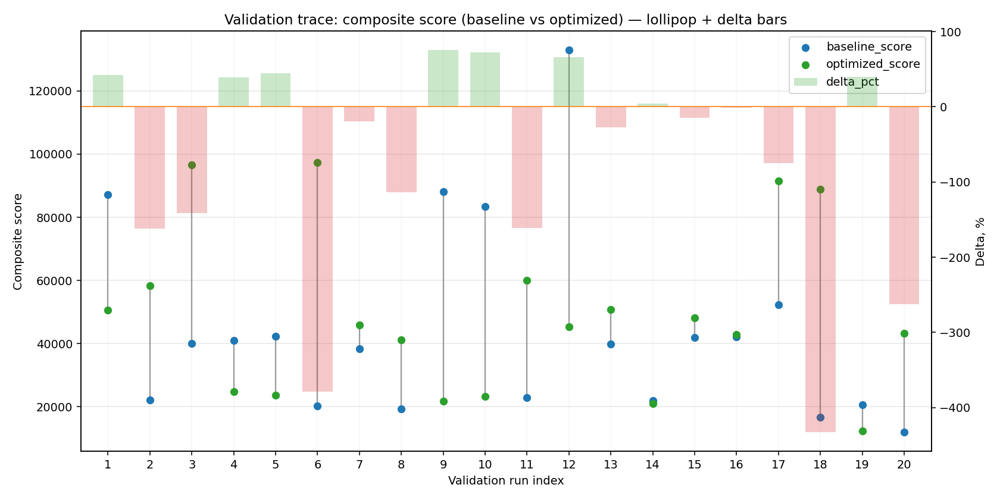
  - score_distribution_plot: [`de_validate_20260504T205447Z_score_distribution.png`](plots/de_validate_20260504T205447Z_score_distribution.png)
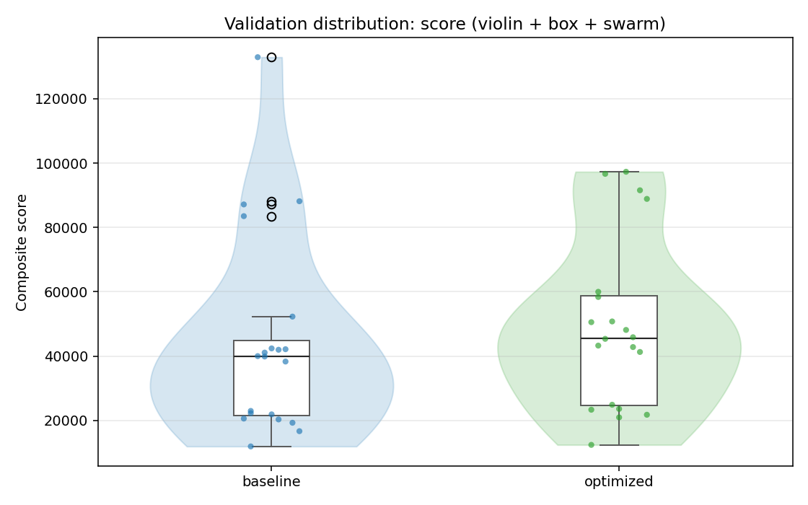
  - success_trace_plot: [`de_validate_20260504T205447Z_success_trace.png`](plots/de_validate_20260504T205447Z_success_trace.png)
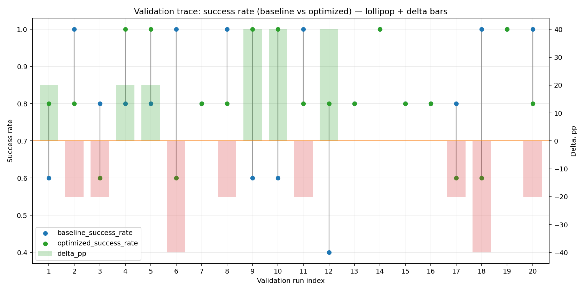
  - success_distribution_plot: [`de_validate_20260504T205447Z_success_distribution.png`](plots/de_validate_20260504T205447Z_success_distribution.png)
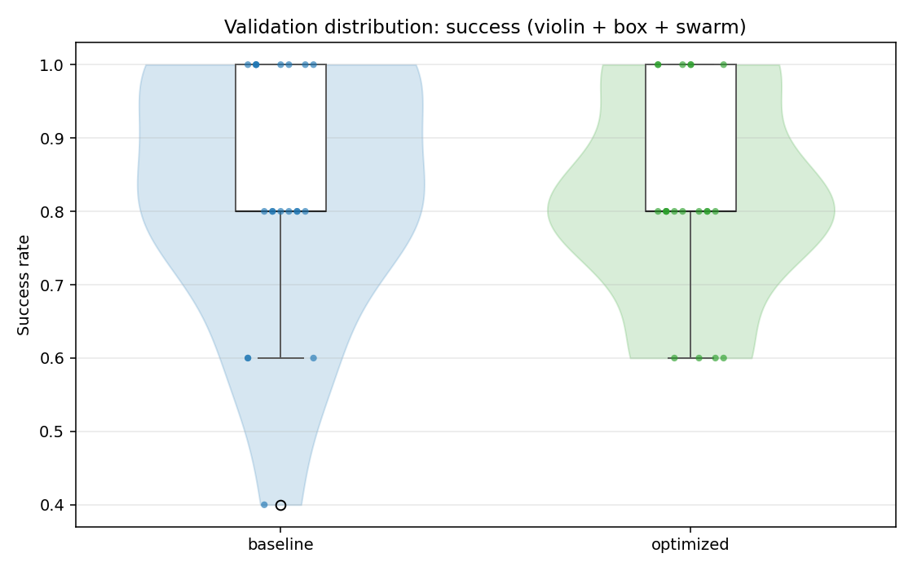
  - time_trace_plot: [`de_validate_20260504T205447Z_time_trace.png`](plots/de_validate_20260504T205447Z_time_trace.png)
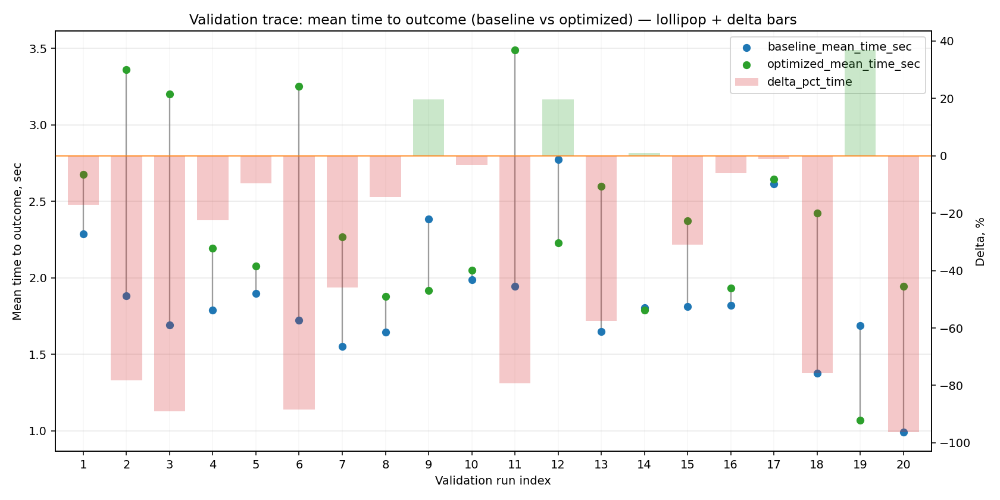
  - time_distribution_plot: [`de_validate_20260504T205447Z_time_distribution.png`](plots/de_validate_20260504T205447Z_time_distribution.png)
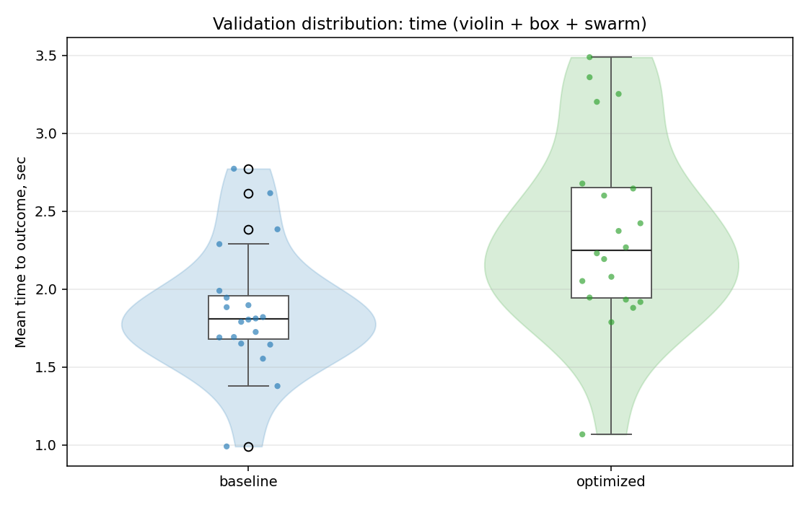
  - curves_trace_plot: [`de_validate_20260504T205447Z_curves_trace.png`](plots/de_validate_20260504T205447Z_curves_trace.png)
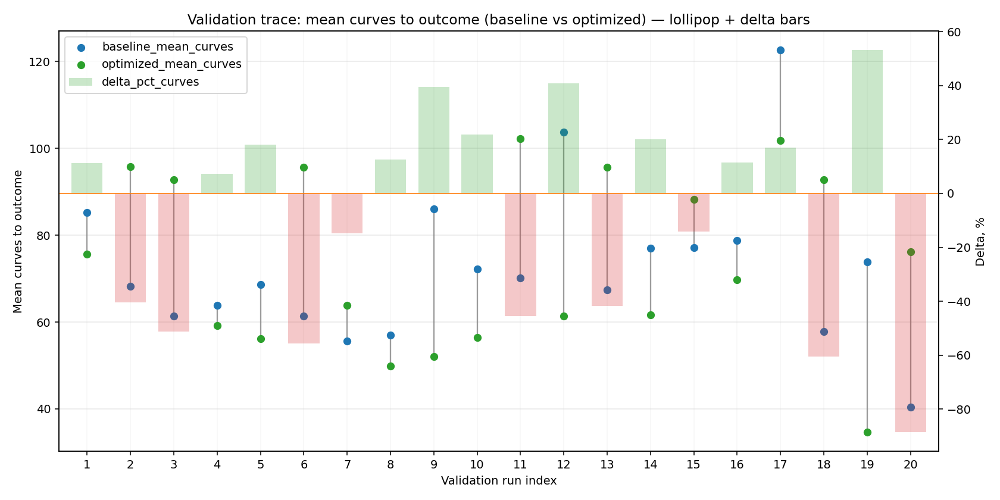
  - curves_distribution_plot: [`de_validate_20260504T205447Z_curves_distribution.png`](plots/de_validate_20260504T205447Z_curves_distribution.png)
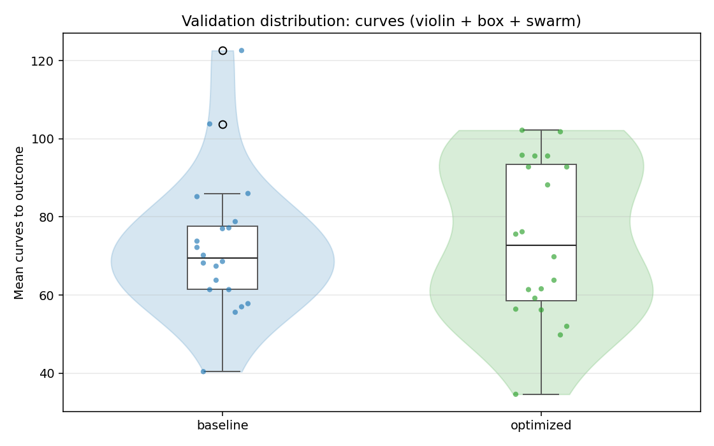

---
