# Отчёт по оптимизации: pso_optimize_20260430T220611Z_job6992348

## Метаданные
- метод: `pso`
- датасет: `data/numbers/20_dset_20260430T220555Z_job6992343/train.json`
- оптимум `(B1, B2)`: `(30000, 600000)`
- objective: `147701.06822080756`
- max_curves_per_n: `100`
- repeats_per_n: `3`
- границы: `B1[100.0, 30000.0]`, `B2[100.0, 600000.0]`, `ratio_max=100.0`

## Ключевые статистики
- `best_eval`: `207`
- `best_eval_fraction`: `0.8846153846153846`
- `eval_per_sec`: `0.17685524976783984`
- `evaluation_count`: `234`
- `improvement_percent`: `86.57263884578286`
- `max_plateau_evals`: `108`
- `median_plateau_evals`: `20.0`
- `new_best_count`: `7`
- `new_best_rate`: `0.029914529914529916`
- `p90_plateau_evals`: `52.69999999999999`
- `time_to_best_sec`: `1157.2591524829622`
- `time_to_first_improvement_sec`: `45.65085898095276`
- `total_runtime_sec`: `1323.1225171020487`

## Флаги внимания

| Флаг | Статус | Текущее значение | Порог | Что это значит | Что делать |
|---|---|---:|---:|---|---|
| `b1_hits_boundary` | ⚠️ ВНИМАНИЕ | `0.8589743589743589` | `> 0.10` | Большая доля оценок проходит близко к границам B1. | Расширить диапазон B1, если упор в границу повторяется. |
| `b2_hits_boundary` | ⚠️ ВНИМАНИЕ | `0.811965811965812` | `> 0.10` | Большая доля оценок проходит близко к границам B2. | Расширить диапазон B2, если упор в границу повторяется. |
| `best_b1_on_boundary` | ⚠️ ВНИМАНИЕ | `30000.0` | `within 2% of log-range [100.0, 30000.0]` | Лучший найденный B1 лежит на границе диапазона. | Проверить расширенный диапазон B1 вокруг текущей границы. |
| `best_b2_on_boundary` | ⚠️ ВНИМАНИЕ | `600000.0` | `within 2% of log-range [100.0, 600000.0]` | Лучший найденный B2 лежит на границе диапазона. | Проверить расширенный диапазон B2 вокруг текущей границы. |
| `best_ratio_on_boundary` | ✅ ОК | `20.0` | `within 2% of log-range up to ratio_max=100.0` | Лучшее отношение B2/B1 находится у верхней границы ratio_max. | Увеличить ratio_max и перепроверить локальный поиск в новой области. |
| `late_best` | ⚠️ ВНИМАНИЕ | `0.8746424745439549` | `> 0.85` | Лучшее решение найдено слишком поздно относительно общего времени. | Усилить ранний поиск или пересмотреть бюджет/инициализацию. |
| `low_improvement` | ✅ ОК | `86.57263884578286` | `< 10%` | Итоговый прирост качества слишком мал. | Сузить границы поиска или изменить параметры метода. |
| `low_signal` | ⚠️ ВНИМАНИЕ | `0.029914529914529916` | `< 0.03` | Слишком низкая плотность новых best-событий (слабый сигнал оптимизации). | Перенастроить exploration и сделать переоценку top-k кандидатов. |
| `plateau_too_long` | ✅ ОК | `0.46153846153846156` | `> 0.50` | Слишком длинное плато: улучшений почти нет на большом участке запуска. | Увеличить exploration или добавить политику рестартов. |
| `ratio_hits_boundary` | ✅ ОК | `0.07264957264957266` | `> 0.10` | Большая доля оценок проходит близко к границе отношения B2/B1. | Увеличить ratio_max, если хорошие точки упираются в ограничение отношения B2/B1. |

## Графики
- [`pso_optimize_20260430T220611Z_job6992348_b1_b2_trajectory.png`](plots/pso_optimize_20260430T220611Z_job6992348_b1_b2_trajectory.png)
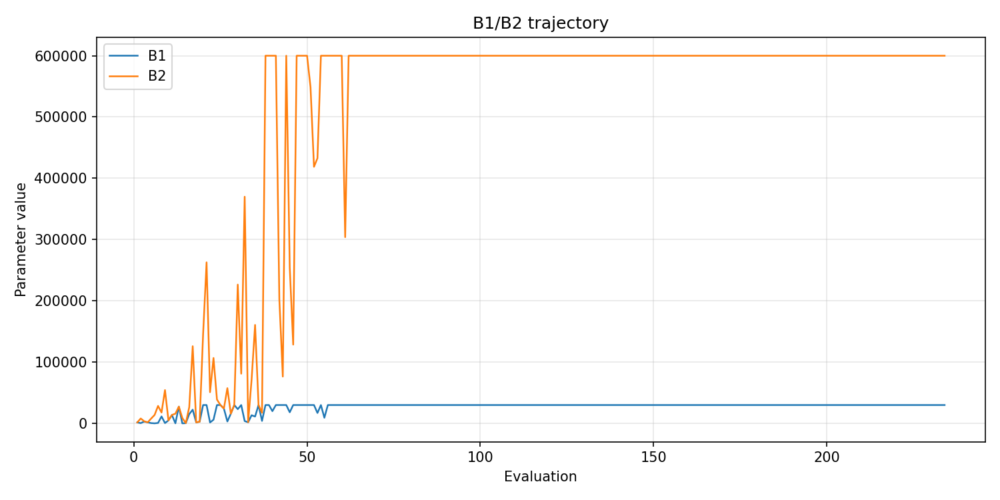
- [`pso_optimize_20260430T220611Z_job6992348_b1_ratio_heatmap.png`](plots/pso_optimize_20260430T220611Z_job6992348_b1_ratio_heatmap.png)
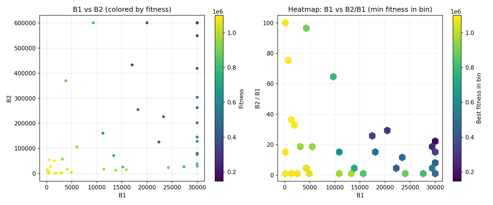
- [`pso_optimize_20260430T220611Z_job6992348_jump_plot.png`](plots/pso_optimize_20260430T220611Z_job6992348_jump_plot.png)
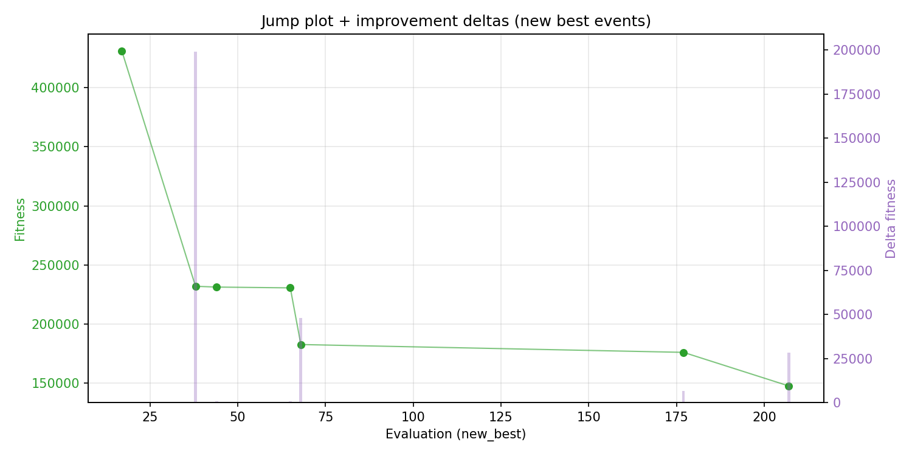
- [`pso_optimize_20260430T220611Z_job6992348_progress_by_phase.png`](plots/pso_optimize_20260430T220611Z_job6992348_progress_by_phase.png)
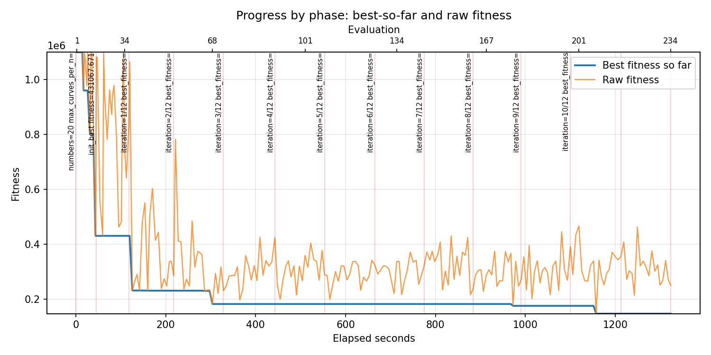
- [`pso_optimize_20260430T220611Z_job6992348_time_efficiency.png`](plots/pso_optimize_20260430T220611Z_job6992348_time_efficiency.png)
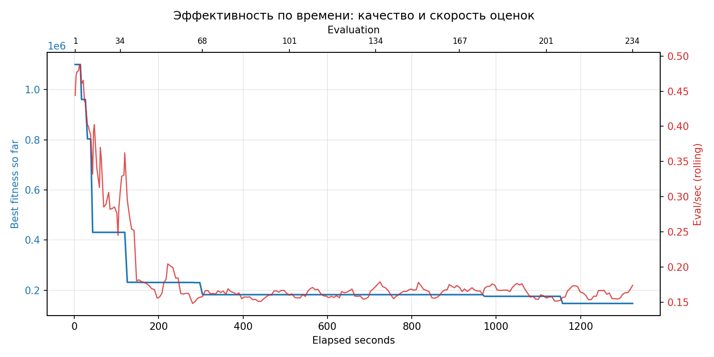

## Таблицы

## Validation runs

### Validation run `20260430T222845Z`
- validation file: [`pso_validate_20260430T222845Z_job6992349.json`](pso_validate_20260430T222845Z_job6992349.json)
- dataset: `data/numbers/20_dset_20260430T220555Z_job6992343/control.json`
- method: `pso`
- optimized params: `(B1, B2)=(30000, 600000)`
- baseline params: `(B1, B2)=(11000, 220000)`
- max_curves_per_n: `150`
- repeats_per_n: `5`
- curve_timeout_sec: `None`
- workers: `56`
- seed: `42`
- optimized_mean_score: `170411.4499876016`
- baseline_mean_score: `565311.1639494809`
- relative_improvement_pct: `69.85528309806554`
- optimized_mean_time_sec: `1.44998760163493`
- baseline_mean_time_sec: `1.1639494808611925`
- time_improvement_pct: `-24.574788294256656`
- optimized_mean_curves: `60.410000000000004`
- baseline_mean_curves: `105.30999999999999`
- curves_improvement_pct: `42.63602696799923`
- optimized_mean_success_rate: `0.89`
- baseline_mean_success_rate: `0.54`
- success_rate_delta_pp: `35.0`
- trace plots:
  - curves_distribution_plot: [`pso_validate_20260430T222845Z_job6992349_curves_distribution.png`](plots/pso_validate_20260430T222845Z_job6992349_curves_distribution.png)
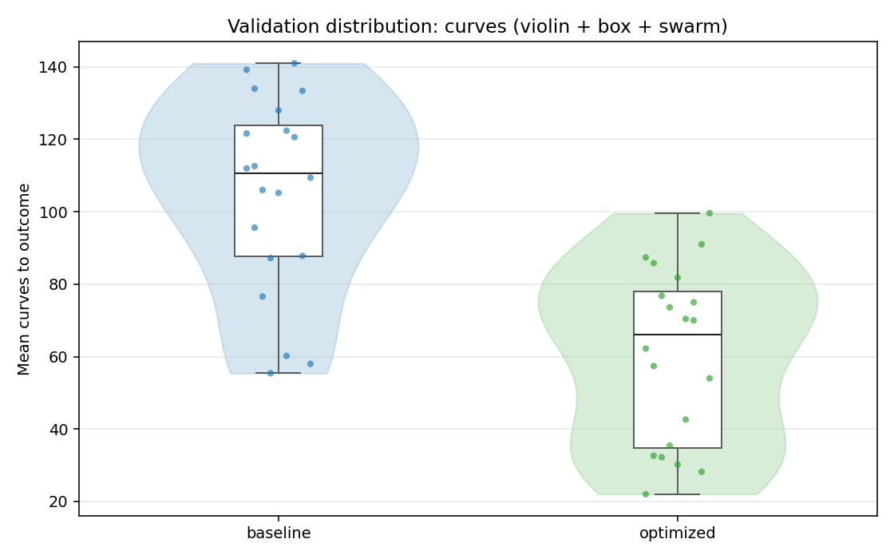
  - curves_trace_plot: [`pso_validate_20260430T222845Z_job6992349_curves_trace.png`](plots/pso_validate_20260430T222845Z_job6992349_curves_trace.png)
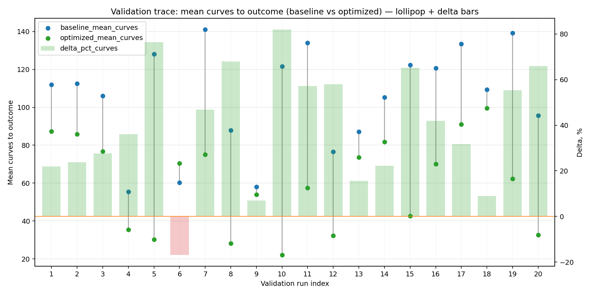
  - score_distribution_plot: [`pso_validate_20260430T222845Z_job6992349_score_distribution.png`](plots/pso_validate_20260430T222845Z_job6992349_score_distribution.png)
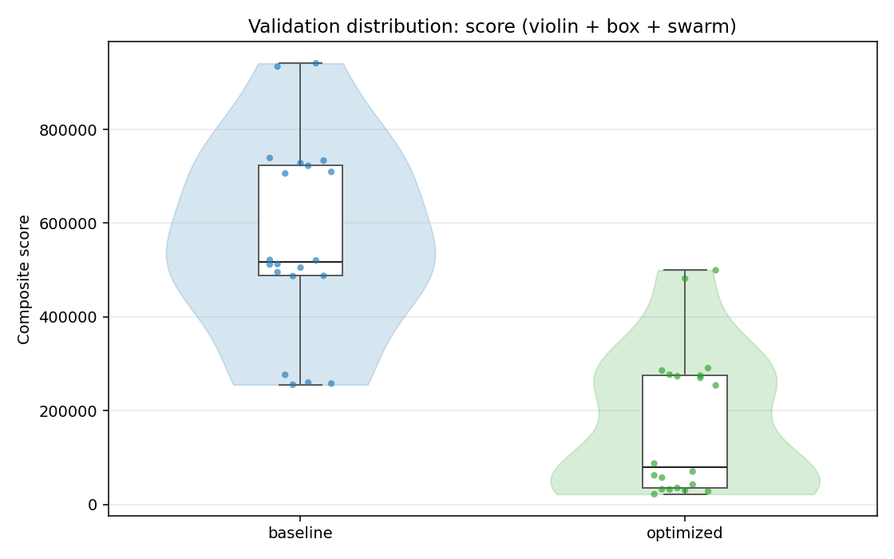
  - score_trace_plot: [`pso_validate_20260430T222845Z_job6992349_score_trace.png`](plots/pso_validate_20260430T222845Z_job6992349_score_trace.png)
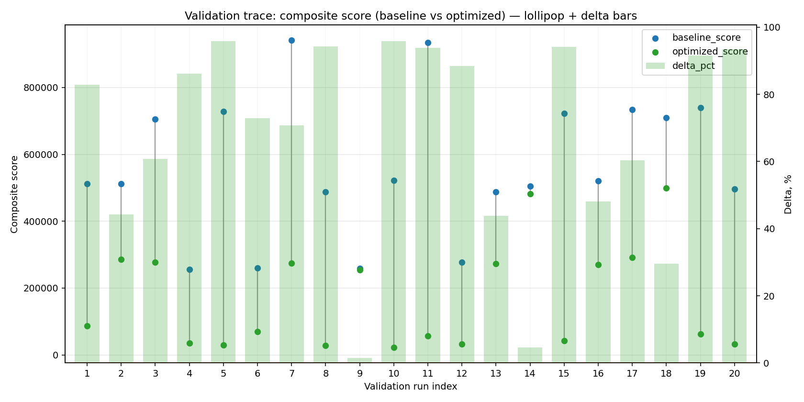
  - time_distribution_plot: [`pso_validate_20260430T222845Z_job6992349_time_distribution.png`](plots/pso_validate_20260430T222845Z_job6992349_time_distribution.png)
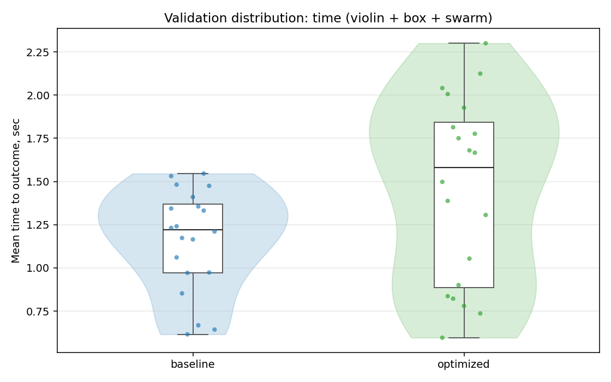
  - time_trace_plot: [`pso_validate_20260430T222845Z_job6992349_time_trace.png`](plots/pso_validate_20260430T222845Z_job6992349_time_trace.png)
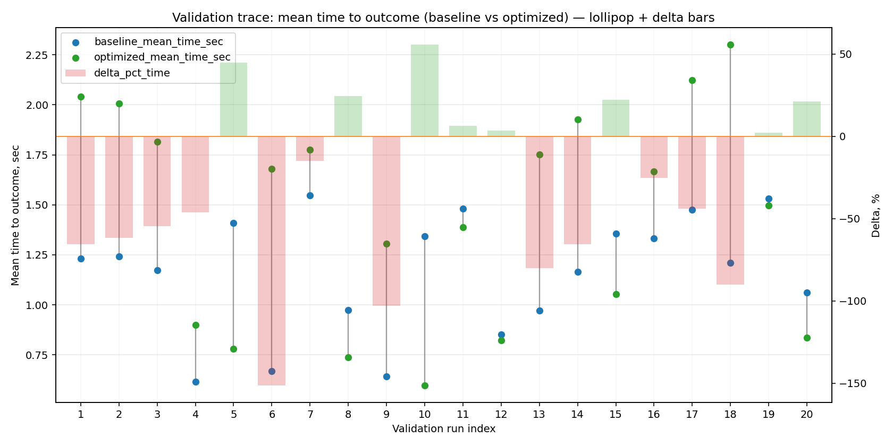

---
