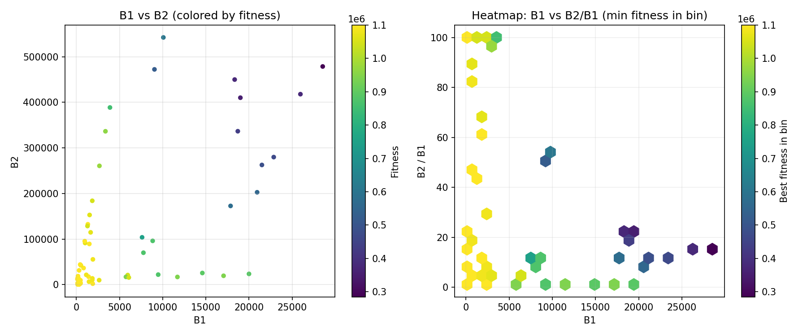
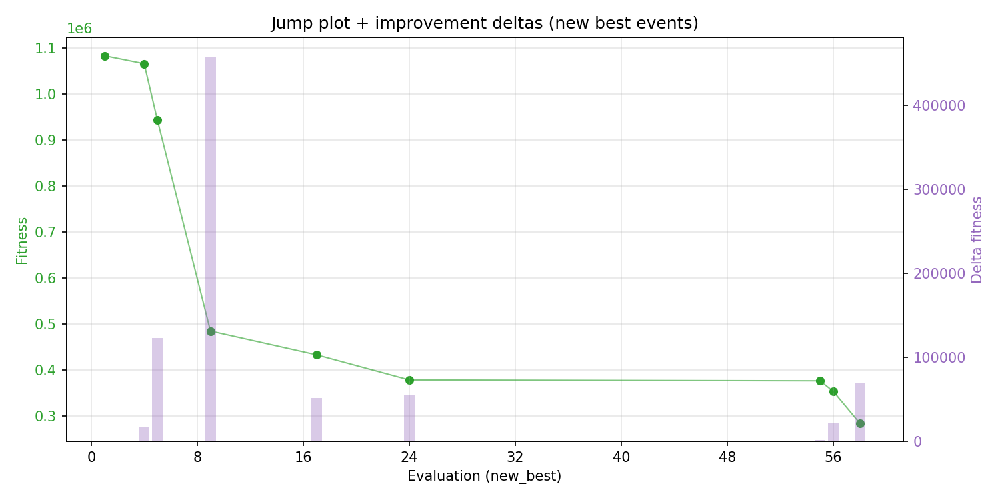
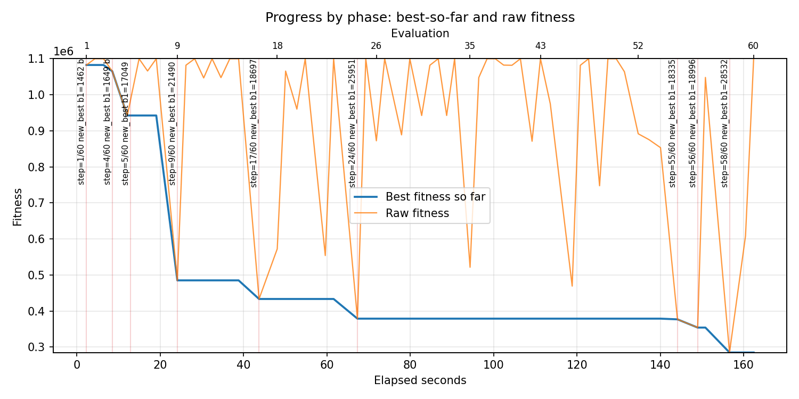
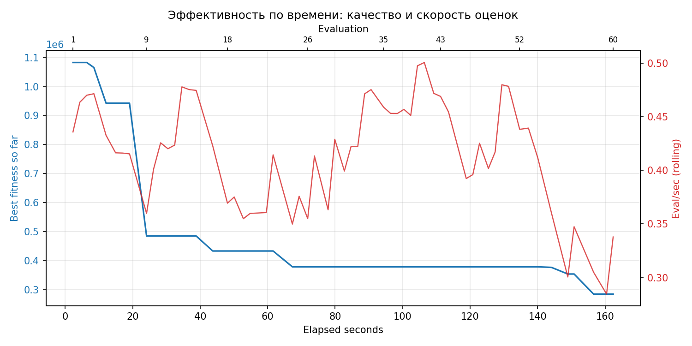
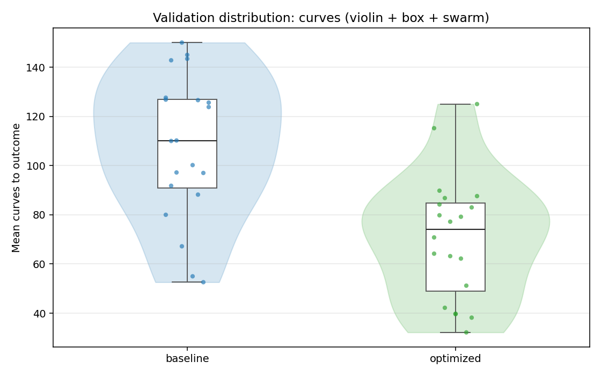
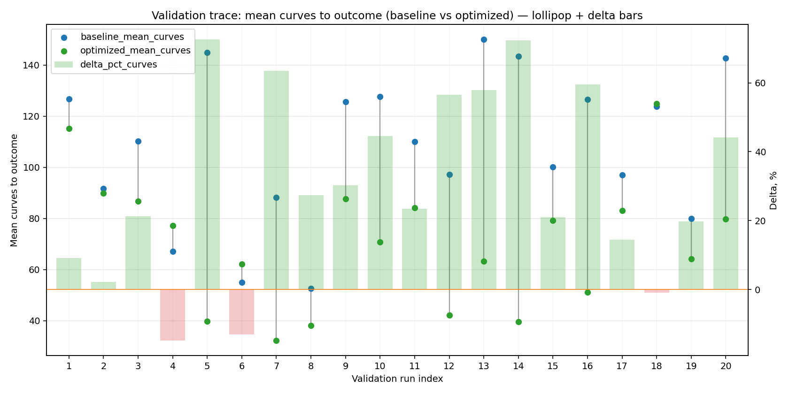
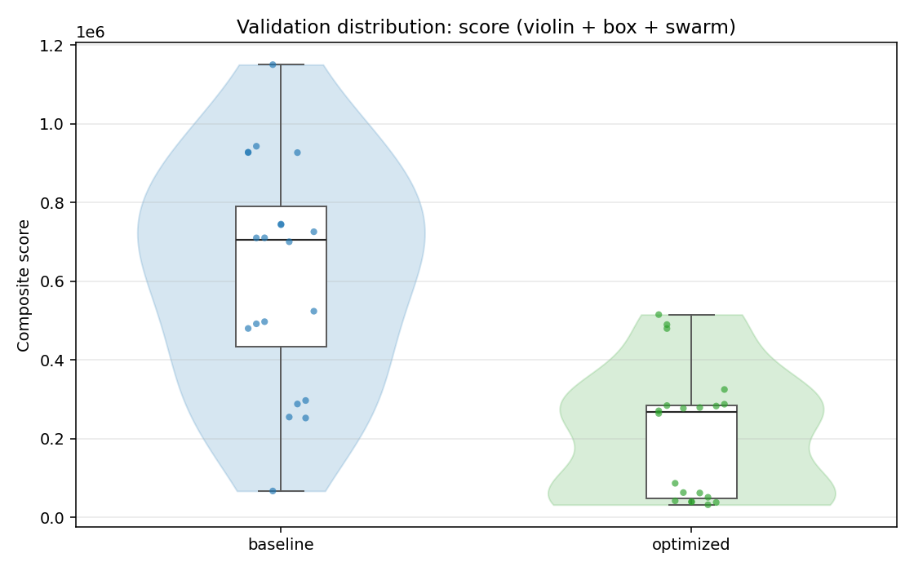
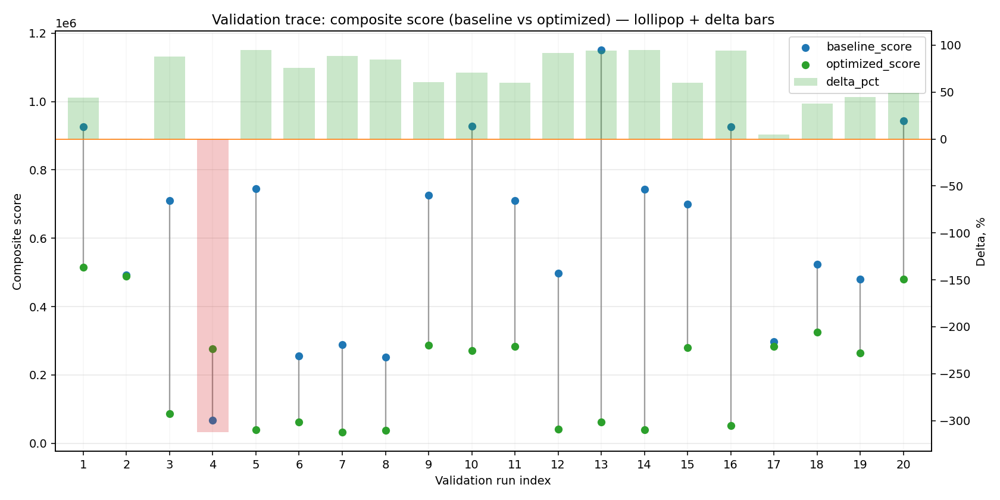
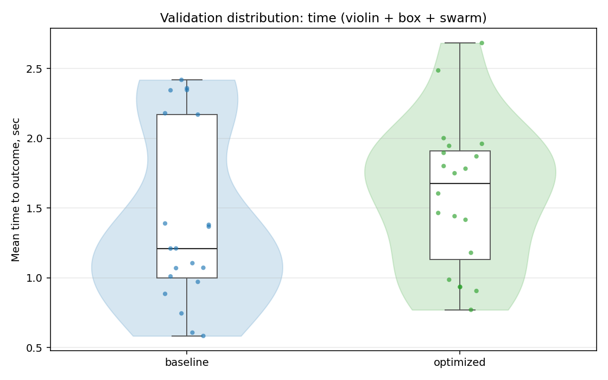
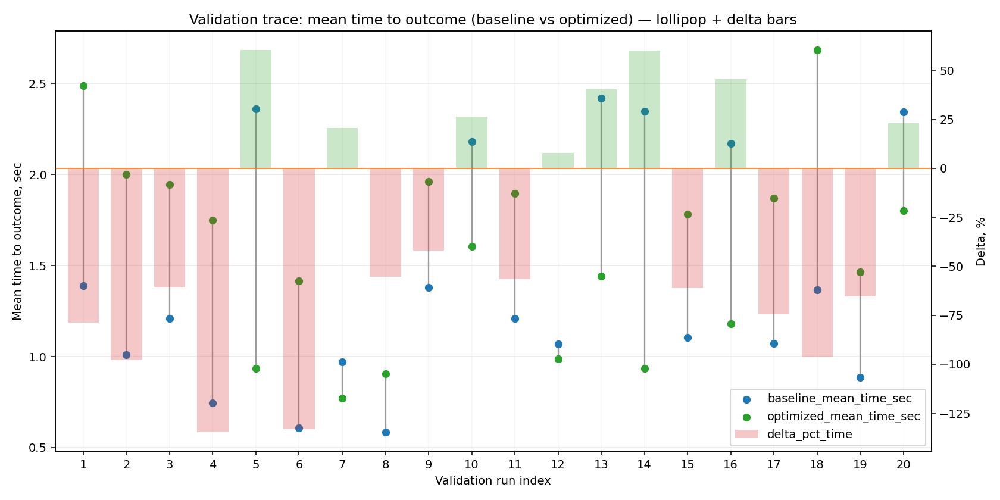

# Отчёт по оптимизации: rs_optimize_20260430T220610Z_job6992346

## Метаданные
- метод: `rs`
- датасет: `data/numbers/20_dset_20260430T220555Z_job6992343/train.json`
- оптимум `(B1, B2)`: `(28532, 478711)`
- objective: `284767.78117983596`
- max_curves_per_n: `100`
- repeats_per_n: `3`
- границы: `B1[100.0, 30000.0]`, `B2[100.0, 600000.0]`, `ratio_max=100.0`

## Ключевые статистики
- `best_eval`: `58`
- `best_eval_fraction`: `0.9666666666666667`
- `eval_per_sec`: `0.36946245624046475`
- `evaluation_count`: `60`
- `improvement_percent`: `73.69716944470248`
- `max_plateau_evals`: `30`
- `median_plateau_evals`: `2.0`
- `new_best_count`: `9`
- `new_best_rate`: `0.15`
- `p90_plateau_evals`: `9.299999999999992`
- `time_to_best_sec`: `156.60621555702528`
- `time_to_first_improvement_sec`: `2.297683915006928`
- `total_runtime_sec`: `162.39809752401197`

## Флаги внимания

| Флаг | Статус | Текущее значение | Порог | Что это значит | Что делать |
|---|---|---:|---:|---|---|
| `b1_hits_boundary` | ✅ ОК | `0.016666666666666666` | `> 0.10` | Большая доля оценок проходит близко к границам B1. | Расширить диапазон B1, если упор в границу повторяется. |
| `b2_hits_boundary` | ✅ ОК | `0.016666666666666666` | `> 0.10` | Большая доля оценок проходит близко к границам B2. | Расширить диапазон B2, если упор в границу повторяется. |
| `best_b1_on_boundary` | ⚠️ ВНИМАНИЕ | `28532.0` | `within 2% of log-range [100.0, 30000.0]` | Лучший найденный B1 лежит на границе диапазона. | Проверить расширенный диапазон B1 вокруг текущей границы. |
| `best_b2_on_boundary` | ✅ ОК | `478711.0` | `within 2% of log-range [100.0, 600000.0]` | Лучший найденный B2 лежит на границе диапазона. | Проверить расширенный диапазон B2 вокруг текущей границы. |
| `best_ratio_on_boundary` | ✅ ОК | `16.778038693396887` | `within 2% of log-range up to ratio_max=100.0` | Лучшее отношение B2/B1 находится у верхней границы ratio_max. | Увеличить ratio_max и перепроверить локальный поиск в новой области. |
| `late_best` | ⚠️ ВНИМАНИЕ | `0.9643352843703707` | `> 0.85` | Лучшее решение найдено слишком поздно относительно общего времени. | Усилить ранний поиск или пересмотреть бюджет/инициализацию. |
| `low_improvement` | ✅ ОК | `73.69716944470248` | `< 10%` | Итоговый прирост качества слишком мал. | Сузить границы поиска или изменить параметры метода. |
| `low_signal` | ✅ ОК | `0.15` | `< 0.03` | Слишком низкая плотность новых best-событий (слабый сигнал оптимизации). | Перенастроить exploration и сделать переоценку top-k кандидатов. |
| `plateau_too_long` | ✅ ОК | `0.5` | `> 0.50` | Слишком длинное плато: улучшений почти нет на большом участке запуска. | Увеличить exploration или добавить политику рестартов. |
| `ratio_hits_boundary` | ⚠️ ВНИМАНИЕ | `0.26666666666666666` | `> 0.10` | Большая доля оценок проходит близко к границе отношения B2/B1. | Увеличить ratio_max, если хорошие точки упираются в ограничение отношения B2/B1. |

## Графики
- [`rs_optimize_20260430T220610Z_job6992346_b1_b2_trajectory.png`](plots/rs_optimize_20260430T220610Z_job6992346_b1_b2_trajectory.png)

- [`rs_optimize_20260430T220610Z_job6992346_b1_ratio_heatmap.png`](plots/rs_optimize_20260430T220610Z_job6992346_b1_ratio_heatmap.png)

- [`rs_optimize_20260430T220610Z_job6992346_jump_plot.png`](plots/rs_optimize_20260430T220610Z_job6992346_jump_plot.png)

- [`rs_optimize_20260430T220610Z_job6992346_progress_by_phase.png`](plots/rs_optimize_20260430T220610Z_job6992346_progress_by_phase.png)

- [`rs_optimize_20260430T220610Z_job6992346_time_efficiency.png`](plots/rs_optimize_20260430T220610Z_job6992346_time_efficiency.png)

## Таблицы

## Validation runs

### Validation run `20260430T220912Z`
- validation file: [`rs_validate_20260430T220912Z_job6992347.json`](rs_validate_20260430T220912Z_job6992347.json)
- dataset: `data/numbers/20_dset_20260430T220555Z_job6992343/control.json`
- method: `rs`
- optimized params: `(B1, B2)=(28532, 478711)`
- baseline params: `(B1, B2)=(11000, 220000)`
- max_curves_per_n: `150`
- repeats_per_n: `5`
- curve_timeout_sec: `None`
- workers: `56`
- seed: `42`
- optimized_mean_score: `210571.59091339665`
- baseline_mean_score: `618051.4213122053`
- relative_improvement_pct: `65.92976188513163`
- optimized_mean_time_sec: `1.590913396672113`
- baseline_mean_time_sec: `1.4213122052157996`
- time_improvement_pct: `-11.93271899262714`
- optimized_mean_curves: `70.57000000000001`
- baseline_mean_curves: `108.05`
- curves_improvement_pct: `34.68764460897732`
- optimized_mean_success_rate: `0.86`
- baseline_mean_success_rate: `0.49000000000000005`
- success_rate_delta_pp: `36.99999999999999`
- trace plots:
  - curves_distribution_plot: [`rs_validate_20260430T220912Z_job6992347_curves_distribution.png`](plots/rs_validate_20260430T220912Z_job6992347_curves_distribution.png)

  - curves_trace_plot: [`rs_validate_20260430T220912Z_job6992347_curves_trace.png`](plots/rs_validate_20260430T220912Z_job6992347_curves_trace.png)

  - score_distribution_plot: [`rs_validate_20260430T220912Z_job6992347_score_distribution.png`](plots/rs_validate_20260430T220912Z_job6992347_score_distribution.png)

  - score_trace_plot: [`rs_validate_20260430T220912Z_job6992347_score_trace.png`](plots/rs_validate_20260430T220912Z_job6992347_score_trace.png)

  - time_distribution_plot: [`rs_validate_20260430T220912Z_job6992347_time_distribution.png`](plots/rs_validate_20260430T220912Z_job6992347_time_distribution.png)

  - time_trace_plot: [`rs_validate_20260430T220912Z_job6992347_time_trace.png`](plots/rs_validate_20260430T220912Z_job6992347_time_trace.png)

---
