# Отчёт по оптимизации: bo_optimize_20260503T102059Z_job6993106

## Метаданные
- метод: `bo`
- датасет: `data/numbers/20_dset_20260503T101749Z_job6993099/train.json`
- оптимум `(B1, B2)`: `(27899, 570211)`
- objective: `84837.79996068416`
- max_curves_per_n: `100`
- repeats_per_n: `3`
- границы: `B1[100.0, 30000.0]`, `B2[100.0, 600000.0]`, `ratio_max=100.0`

## Ключевые статистики
- `best_eval`: `34`
- `best_eval_fraction`: `0.8947368421052632`
- `eval_per_sec`: `0.2844968707840399`
- `evaluation_count`: `38`
- `improvement_percent`: `90.59196045777884`
- `max_plateau_evals`: `14`
- `median_plateau_evals`: `0.5`
- `new_best_count`: `7`
- `new_best_rate`: `0.18421052631578946`
- `p90_plateau_evals`: `12.6`
- `time_to_best_sec`: `111.09283448299902`
- `time_to_first_improvement_sec`: `2.3973965479999606`
- `total_runtime_sec`: `133.5692539369993`

## Флаги внимания

| Флаг | Статус | Текущее значение | Порог | Что это значит | Что делать |
|---|---|---:|---:|---|---|
| `b1_hits_boundary` | ⚠️ ВНИМАНИЕ | `0.10526315789473684` | `> 0.10` | Большая доля оценок проходит близко к границам B1. | Расширить диапазон B1, если упор в границу повторяется. |
| `b2_hits_boundary` | ⚠️ ВНИМАНИЕ | `0.42105263157894735` | `> 0.10` | Большая доля оценок проходит близко к границам B2. | Расширить диапазон B2, если упор в границу повторяется. |
| `best_b1_on_boundary` | ⚠️ ВНИМАНИЕ | `27899.0` | `within 2% of log-range [100.0, 30000.0]` | Лучший найденный B1 лежит на границе диапазона. | Проверить расширенный диапазон B1 вокруг текущей границы. |
| `best_b2_on_boundary` | ⚠️ ВНИМАНИЕ | `570211.0` | `within 2% of log-range [100.0, 600000.0]` | Лучший найденный B2 лежит на границе диапазона. | Проверить расширенный диапазон B2 вокруг текущей границы. |
| `best_ratio_on_boundary` | ✅ ОК | `20.438402810136566` | `within 2% of log-range up to ratio_max=100.0` | Лучшее отношение B2/B1 находится у верхней границы ratio_max. | Увеличить ratio_max и перепроверить локальный поиск в новой области. |
| `late_best` | ✅ ОК | `0.8317246013472401` | `> 0.85` | Лучшее решение найдено слишком поздно относительно общего времени. | Усилить ранний поиск или пересмотреть бюджет/инициализацию. |
| `low_improvement` | ✅ ОК | `90.59196045777884` | `< 10%` | Итоговый прирост качества слишком мал. | Сузить границы поиска или изменить параметры метода. |
| `low_signal` | ✅ ОК | `0.18421052631578946` | `< 0.03` | Слишком низкая плотность новых best-событий (слабый сигнал оптимизации). | Перенастроить exploration и сделать переоценку top-k кандидатов. |
| `plateau_too_long` | ✅ ОК | `0.3684210526315789` | `> 0.50` | Слишком длинное плато: улучшений почти нет на большом участке запуска. | Увеличить exploration или добавить политику рестартов. |
| `ratio_hits_boundary` | ⚠️ ВНИМАНИЕ | `0.3157894736842105` | `> 0.10` | Большая доля оценок проходит близко к границе отношения B2/B1. | Увеличить ratio_max, если хорошие точки упираются в ограничение отношения B2/B1. |

## Графики
- [`bo_optimize_20260503T102059Z_job6993106_b1_b2_trajectory.png`](plots/bo_optimize_20260503T102059Z_job6993106_b1_b2_trajectory.png)
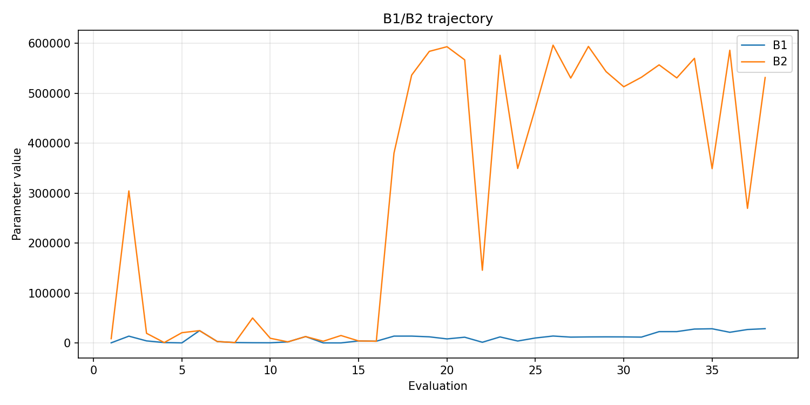
- [`bo_optimize_20260503T102059Z_job6993106_b1_ratio_heatmap.png`](plots/bo_optimize_20260503T102059Z_job6993106_b1_ratio_heatmap.png)
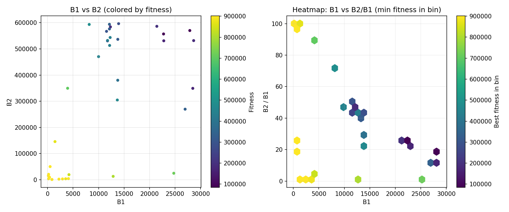
- [`bo_optimize_20260503T102059Z_job6993106_jump_plot.png`](plots/bo_optimize_20260503T102059Z_job6993106_jump_plot.png)
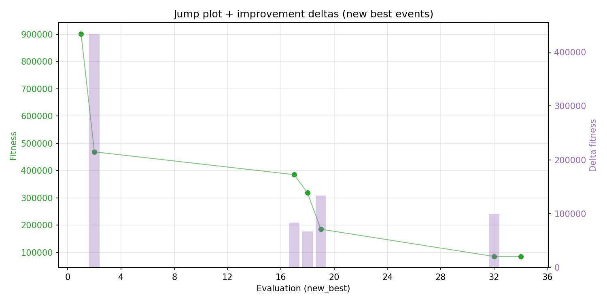
- [`bo_optimize_20260503T102059Z_job6993106_progress_by_phase.png`](plots/bo_optimize_20260503T102059Z_job6993106_progress_by_phase.png)
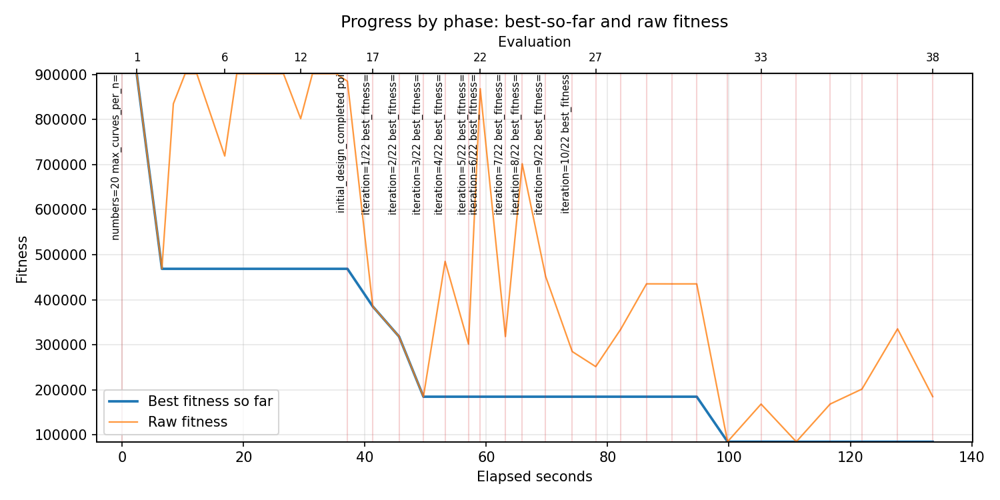
- [`bo_optimize_20260503T102059Z_job6993106_time_efficiency.png`](plots/bo_optimize_20260503T102059Z_job6993106_time_efficiency.png)
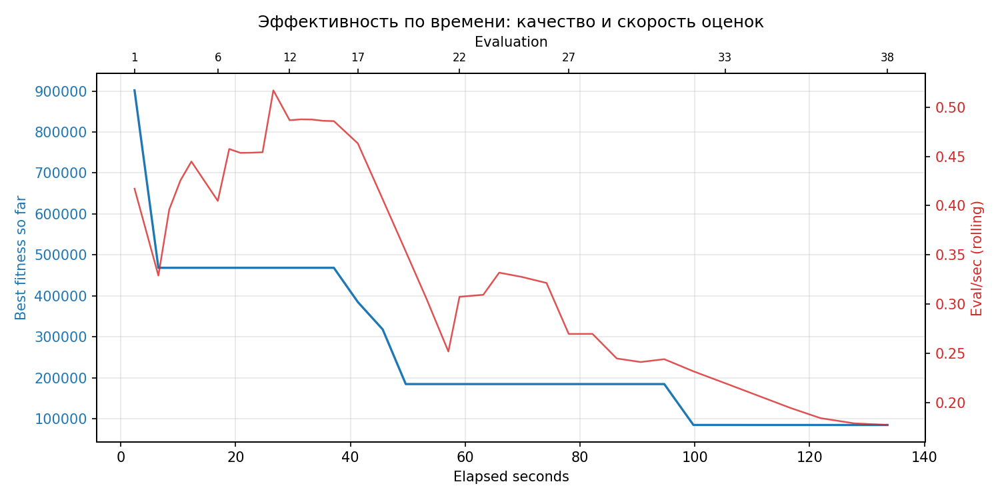

## Таблицы

## Validation runs

### Validation run `20260503T102330Z`
- validation file: [`bo_validate_20260503T102330Z_job6993107.json`](bo_validate_20260503T102330Z_job6993107.json)
- dataset: `data/numbers/20_dset_20260503T101749Z_job6993099/control.json`
- method: `bo`
- optimized params: `(B1, B2)=(27899, 570211)`
- baseline params: `(B1, B2)=(11000, 220000)`
- max_curves_per_n: `150`
- repeats_per_n: `5`
- curve_timeout_sec: `None`
- workers: `56`
- seed: `42`
- optimized_mean_score: `97112.32307229927`
- baseline_mean_score: `367241.49108563043`
- relative_improvement_pct: `73.5562768833069`
- optimized_mean_time_sec: `1.4567230722992828`
- baseline_mean_time_sec: `1.1768910856303956`
- time_improvement_pct: `-23.777220346519716`
- optimized_mean_curves: `65.56`
- baseline_mean_curves: `106.46`
- curves_improvement_pct: `38.418185233890654`
- optimized_mean_success_rate: `0.85`
- baseline_mean_success_rate: `0.54`
- success_rate_delta_pp: `30.999999999999993`
- trace plots:
  - curves_distribution_plot: [`bo_validate_20260503T102330Z_job6993107_curves_distribution.png`](plots/bo_validate_20260503T102330Z_job6993107_curves_distribution.png)
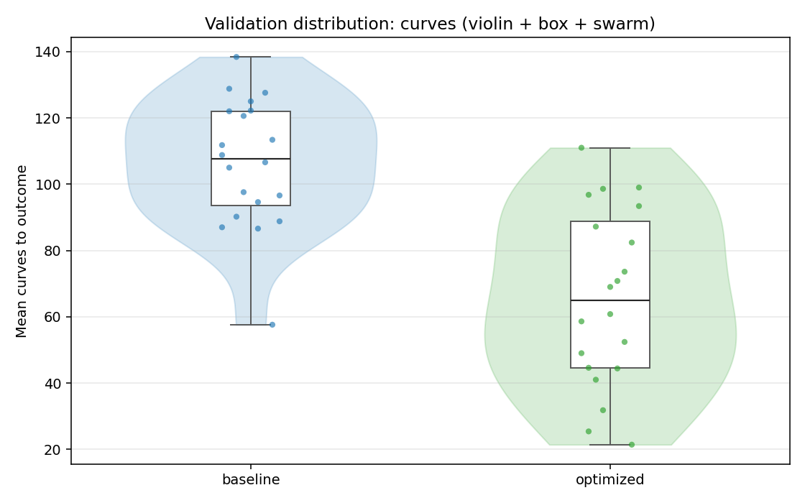
  - curves_trace_plot: [`bo_validate_20260503T102330Z_job6993107_curves_trace.png`](plots/bo_validate_20260503T102330Z_job6993107_curves_trace.png)
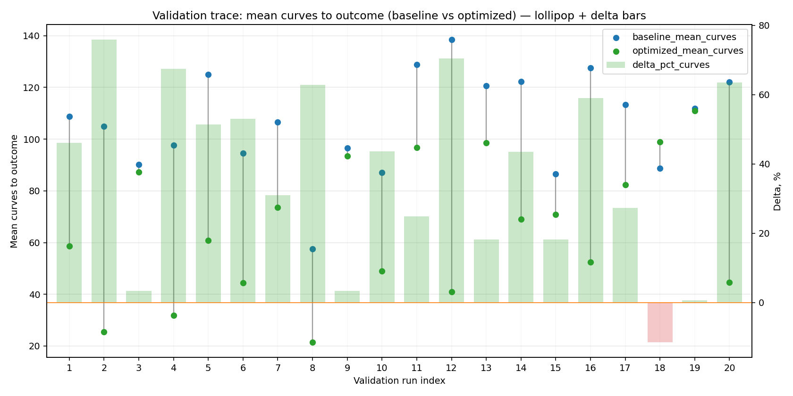
  - score_distribution_plot: [`bo_validate_20260503T102330Z_job6993107_score_distribution.png`](plots/bo_validate_20260503T102330Z_job6993107_score_distribution.png)
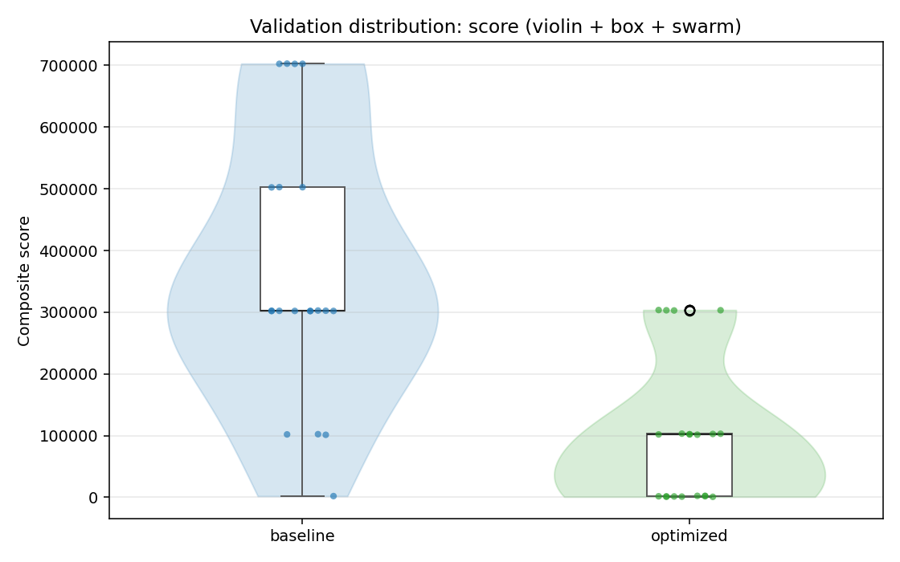
  - score_trace_plot: [`bo_validate_20260503T102330Z_job6993107_score_trace.png`](plots/bo_validate_20260503T102330Z_job6993107_score_trace.png)
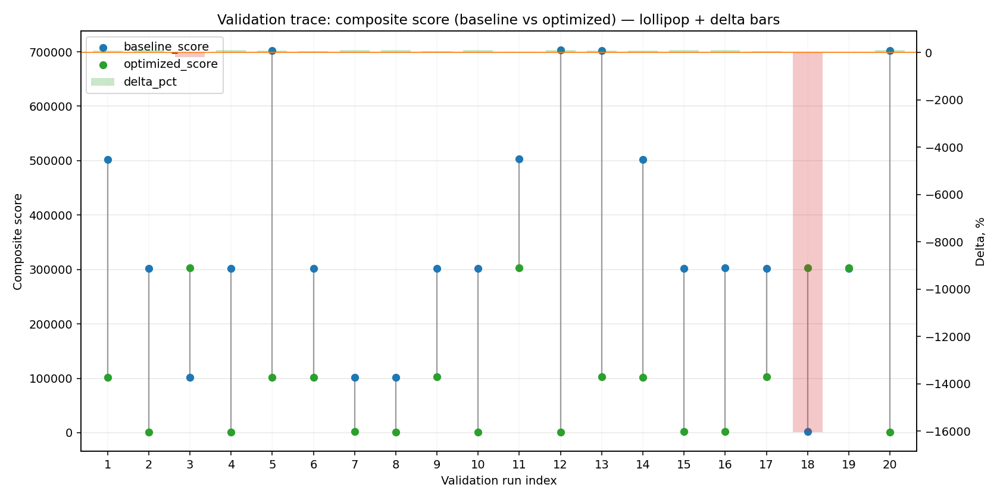
  - time_distribution_plot: [`bo_validate_20260503T102330Z_job6993107_time_distribution.png`](plots/bo_validate_20260503T102330Z_job6993107_time_distribution.png)
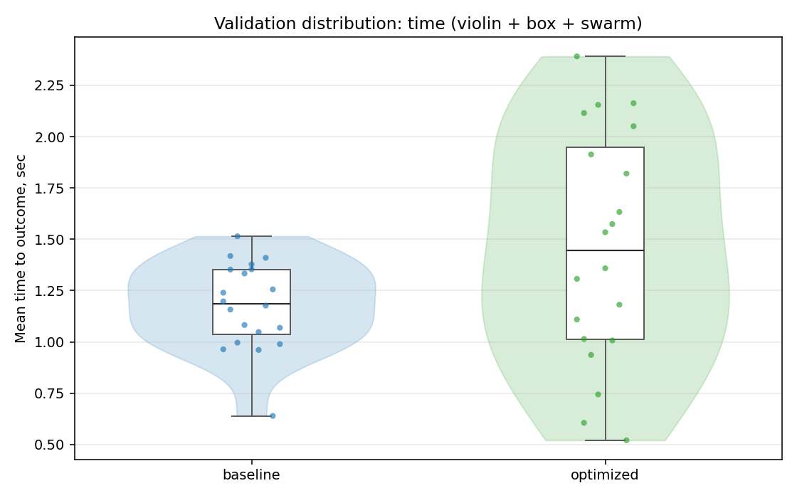
  - time_trace_plot: [`bo_validate_20260503T102330Z_job6993107_time_trace.png`](plots/bo_validate_20260503T102330Z_job6993107_time_trace.png)
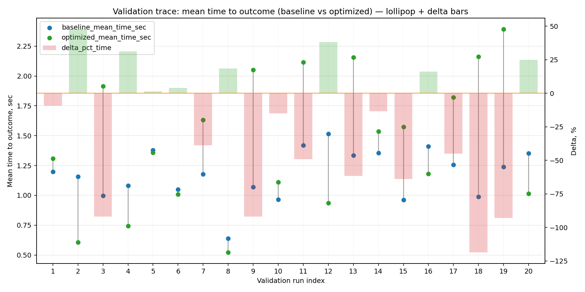

---
