# Отчёт по оптимизации: pso_optimize_20260503T103128Z_job6993104

## Метаданные
- метод: `pso`
- датасет: `data/numbers/20_dset_20260503T101749Z_job6993099/train.json`
- оптимум `(B1, B2)`: `(30000, 600000)`
- objective: `18129.460202528306`
- max_curves_per_n: `100`
- repeats_per_n: `3`
- границы: `B1[100.0, 30000.0]`, `B2[100.0, 600000.0]`, `ratio_max=100.0`

## Ключевые статистики
- `best_eval`: `158`
- `best_eval_fraction`: `0.6752136752136753`
- `eval_per_sec`: `0.17688003043240935`
- `evaluation_count`: `234`
- `improvement_percent`: `97.98936921372949`
- `max_plateau_evals`: `101`
- `median_plateau_evals`: `8.0`
- `new_best_count`: `8`
- `new_best_rate`: `0.03418803418803419`
- `p90_plateau_evals`: `81.0`
- `time_to_best_sec`: `864.7685863639927`
- `time_to_first_improvement_sec`: `43.810809488000814`
- `total_runtime_sec`: `1322.9378558669996`

## Флаги внимания

| Флаг | Статус | Текущее значение | Порог | Что это значит | Что делать |
|---|---|---:|---:|---|---|
| `b1_hits_boundary` | ⚠️ ВНИМАНИЕ | `0.8589743589743589` | `> 0.10` | Большая доля оценок проходит близко к границам B1. | Расширить диапазон B1, если упор в границу повторяется. |
| `b2_hits_boundary` | ⚠️ ВНИМАНИЕ | `0.8290598290598291` | `> 0.10` | Большая доля оценок проходит близко к границам B2. | Расширить диапазон B2, если упор в границу повторяется. |
| `best_b1_on_boundary` | ⚠️ ВНИМАНИЕ | `30000.0` | `within 2% of log-range [100.0, 30000.0]` | Лучший найденный B1 лежит на границе диапазона. | Проверить расширенный диапазон B1 вокруг текущей границы. |
| `best_b2_on_boundary` | ⚠️ ВНИМАНИЕ | `600000.0` | `within 2% of log-range [100.0, 600000.0]` | Лучший найденный B2 лежит на границе диапазона. | Проверить расширенный диапазон B2 вокруг текущей границы. |
| `best_ratio_on_boundary` | ✅ ОК | `20.0` | `within 2% of log-range up to ratio_max=100.0` | Лучшее отношение B2/B1 находится у верхней границы ratio_max. | Увеличить ratio_max и перепроверить локальный поиск в новой области. |
| `late_best` | ✅ ОК | `0.6536728709734129` | `> 0.85` | Лучшее решение найдено слишком поздно относительно общего времени. | Усилить ранний поиск или пересмотреть бюджет/инициализацию. |
| `low_improvement` | ✅ ОК | `97.98936921372949` | `< 10%` | Итоговый прирост качества слишком мал. | Сузить границы поиска или изменить параметры метода. |
| `low_signal` | ✅ ОК | `0.03418803418803419` | `< 0.03` | Слишком низкая плотность новых best-событий (слабый сигнал оптимизации). | Перенастроить exploration и сделать переоценку top-k кандидатов. |
| `plateau_too_long` | ✅ ОК | `0.43162393162393164` | `> 0.50` | Слишком длинное плато: улучшений почти нет на большом участке запуска. | Увеличить exploration или добавить политику рестартов. |
| `ratio_hits_boundary` | ✅ ОК | `0.0641025641025641` | `> 0.10` | Большая доля оценок проходит близко к границе отношения B2/B1. | Увеличить ratio_max, если хорошие точки упираются в ограничение отношения B2/B1. |

## Графики
- [`pso_optimize_20260503T103128Z_job6993104_b1_b2_trajectory.png`](plots/pso_optimize_20260503T103128Z_job6993104_b1_b2_trajectory.png)
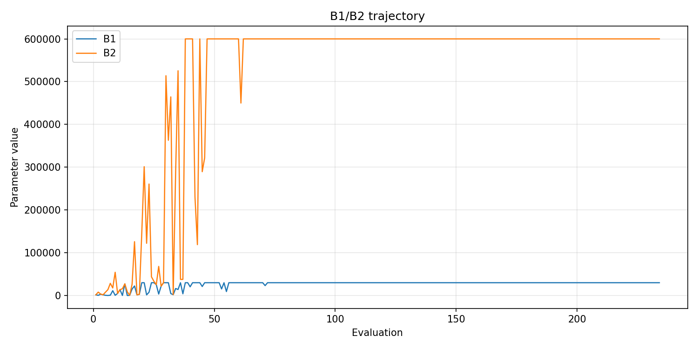
- [`pso_optimize_20260503T103128Z_job6993104_b1_ratio_heatmap.png`](plots/pso_optimize_20260503T103128Z_job6993104_b1_ratio_heatmap.png)
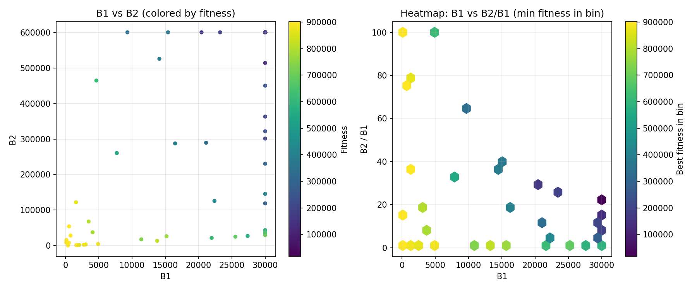
- [`pso_optimize_20260503T103128Z_job6993104_jump_plot.png`](plots/pso_optimize_20260503T103128Z_job6993104_jump_plot.png)
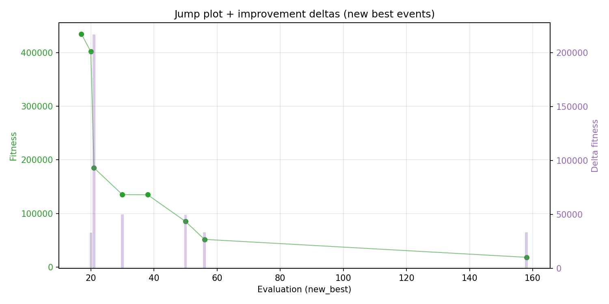
- [`pso_optimize_20260503T103128Z_job6993104_progress_by_phase.png`](plots/pso_optimize_20260503T103128Z_job6993104_progress_by_phase.png)
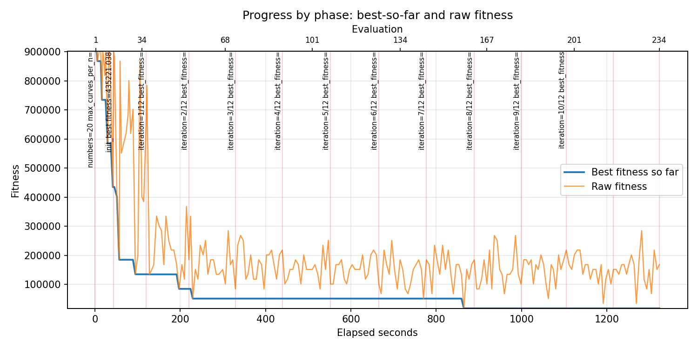
- [`pso_optimize_20260503T103128Z_job6993104_time_efficiency.png`](plots/pso_optimize_20260503T103128Z_job6993104_time_efficiency.png)
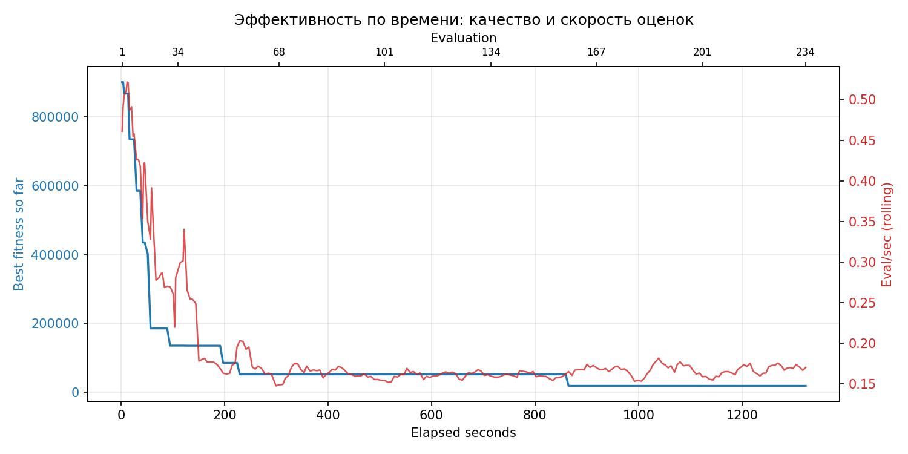

## Таблицы

## Validation runs

### Validation run `20260503T105359Z`
- validation file: [`pso_validate_20260503T105359Z_job6993105.json`](pso_validate_20260503T105359Z_job6993105.json)
- dataset: `data/numbers/20_dset_20260503T101749Z_job6993099/control.json`
- method: `pso`
- optimized params: `(B1, B2)=(30000, 600000)`
- baseline params: `(B1, B2)=(11000, 220000)`
- max_curves_per_n: `150`
- repeats_per_n: `5`
- curve_timeout_sec: `None`
- workers: `56`
- seed: `42`
- optimized_mean_score: `142277.65820384378`
- baseline_mean_score: `407411.6332816222`
- relative_improvement_pct: `65.07766431266957`
- optimized_mean_time_sec: `1.59735820384376`
- baseline_mean_time_sec: `1.26633328162221`
- time_improvement_pct: `-26.140426617983014`
- optimized_mean_curves: `68.03`
- baseline_mean_curves: `114.53`
- curves_improvement_pct: `40.600715969614946`
- optimized_mean_success_rate: `0.8`
- baseline_mean_success_rate: `0.5`
- success_rate_delta_pp: `30.000000000000004`
- trace plots:
  - curves_distribution_plot: [`pso_validate_20260503T105359Z_job6993105_curves_distribution.png`](plots/pso_validate_20260503T105359Z_job6993105_curves_distribution.png)
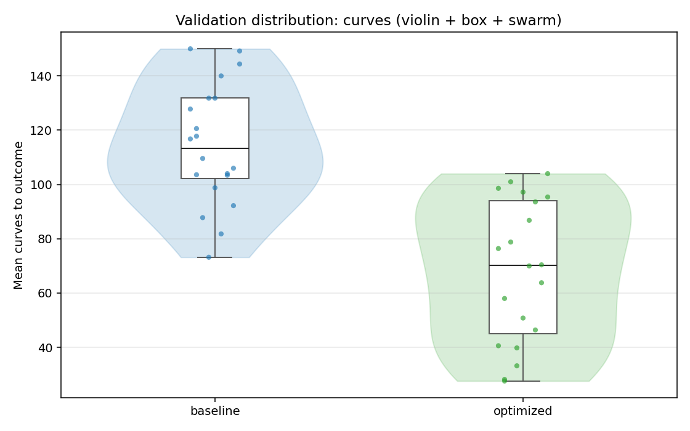
  - curves_trace_plot: [`pso_validate_20260503T105359Z_job6993105_curves_trace.png`](plots/pso_validate_20260503T105359Z_job6993105_curves_trace.png)
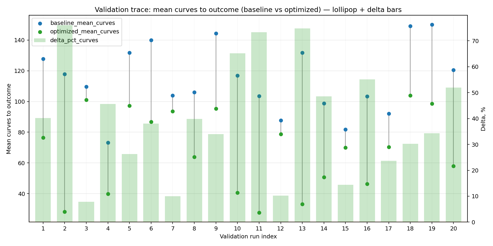
  - score_distribution_plot: [`pso_validate_20260503T105359Z_job6993105_score_distribution.png`](plots/pso_validate_20260503T105359Z_job6993105_score_distribution.png)
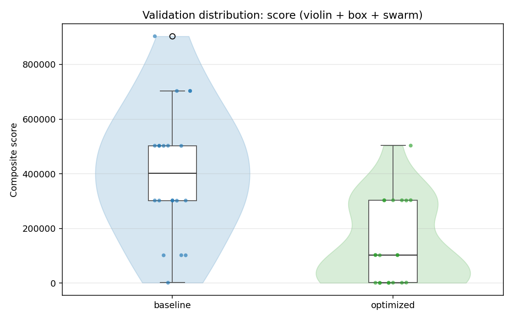
  - score_trace_plot: [`pso_validate_20260503T105359Z_job6993105_score_trace.png`](plots/pso_validate_20260503T105359Z_job6993105_score_trace.png)
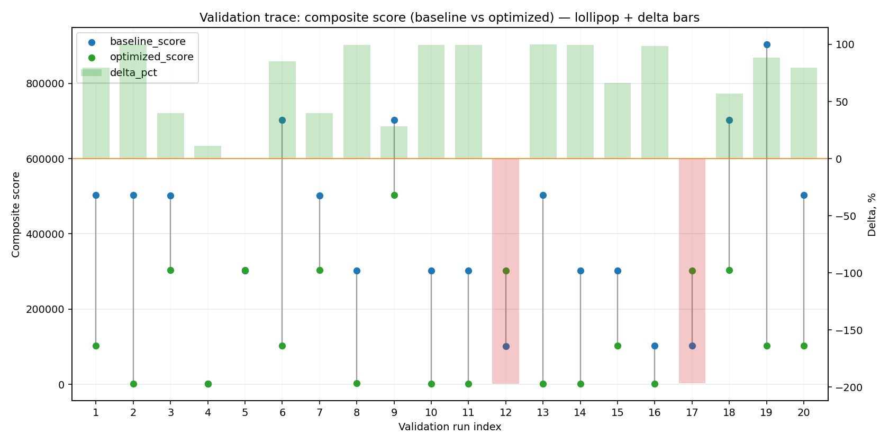
  - time_distribution_plot: [`pso_validate_20260503T105359Z_job6993105_time_distribution.png`](plots/pso_validate_20260503T105359Z_job6993105_time_distribution.png)
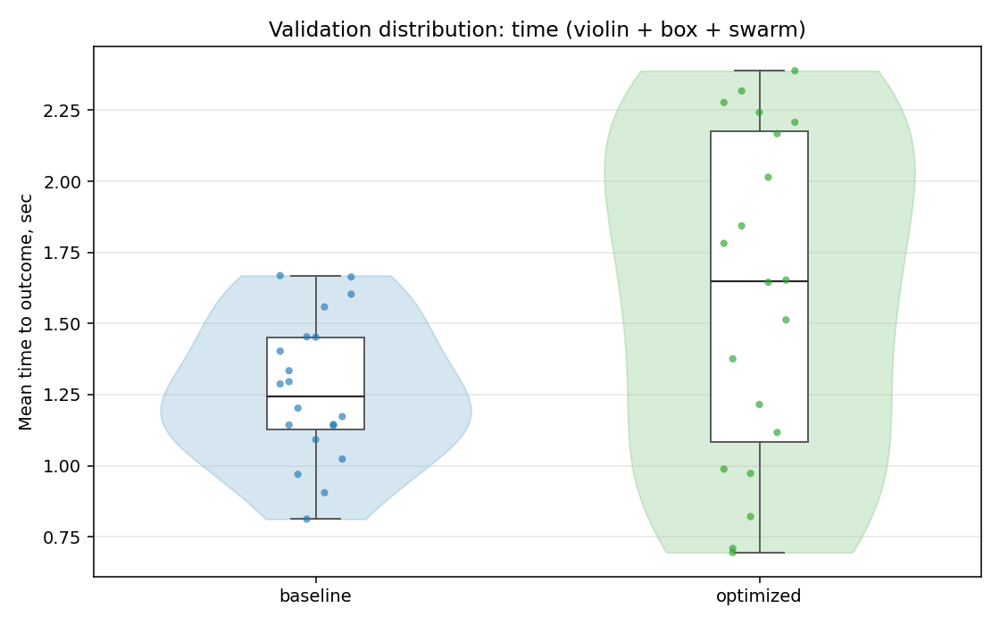
  - time_trace_plot: [`pso_validate_20260503T105359Z_job6993105_time_trace.png`](plots/pso_validate_20260503T105359Z_job6993105_time_trace.png)
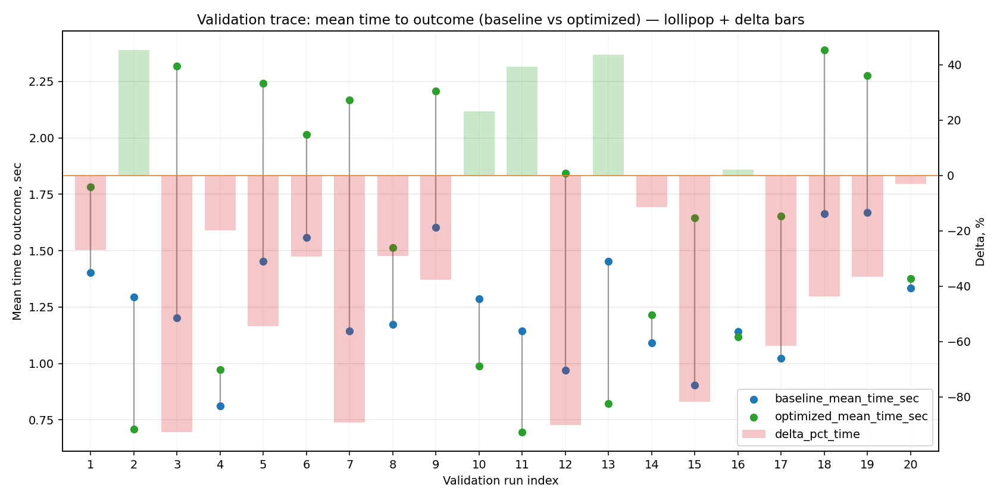

---
