# Отчёт по оптимизации: de_optimize_20260503T223515Z_job6993843

## Метаданные
- метод: `de`
- датасет: `data/numbers/20_dset_20260503T223444Z_job6993842/train.json`
- оптимум `(B1, B2)`: `(28096, 354209)`
- objective: `27480.769063438052`
- max_curves_per_n: `100`
- repeats_per_n: `3`
- границы: `B1[100.0, 30000.0]`, `B2[100.0, 600000.0]`, `ratio_max=100.0`

## Ключевые статистики
- `best_eval`: `176`
- `best_eval_fraction`: `0.8`
- `eval_per_sec`: `0.2544431108528799`
- `evaluation_count`: `220`
- `improvement_percent`: `68.6766574423978`
- `max_plateau_evals`: `60`
- `median_plateau_evals`: `23.0`
- `new_best_count`: `7`
- `new_best_rate`: `0.031818181818181815`
- `p90_plateau_evals`: `53.699999999999996`
- `time_to_best_sec`: `639.1808634860063`
- `time_to_first_improvement_sec`: `4.639282775999163`
- `total_runtime_sec`: `864.6338375170017`

## Флаги внимания

| Флаг | Статус | Текущее значение | Порог | Что это значит | Что делать |
|---|---|---:|---:|---|---|
| `b1_hits_boundary` | ⚠️ ВНИМАНИЕ | `0.2` | `> 0.10` | Большая доля оценок проходит близко к границам B1. | Расширить диапазон B1, если упор в границу повторяется. |
| `b2_hits_boundary` | ✅ ОК | `0.06818181818181818` | `> 0.10` | Большая доля оценок проходит близко к границам B2. | Расширить диапазон B2, если упор в границу повторяется. |
| `best_b1_on_boundary` | ⚠️ ВНИМАНИЕ | `28096.0` | `within 2% of log-range [100.0, 30000.0]` | Лучший найденный B1 лежит на границе диапазона. | Проверить расширенный диапазон B1 вокруг текущей границы. |
| `best_b2_on_boundary` | ✅ ОК | `354209.0` | `within 2% of log-range [100.0, 600000.0]` | Лучший найденный B2 лежит на границе диапазона. | Проверить расширенный диапазон B2 вокруг текущей границы. |
| `best_ratio_on_boundary` | ✅ ОК | `12.607097095671982` | `within 2% of log-range up to ratio_max=100.0` | Лучшее отношение B2/B1 находится у верхней границы ratio_max. | Увеличить ratio_max и перепроверить локальный поиск в новой области. |
| `late_best` | ✅ ОК | `0.7392503459285883` | `> 0.85` | Лучшее решение найдено слишком поздно относительно общего времени. | Усилить ранний поиск или пересмотреть бюджет/инициализацию. |
| `low_improvement` | ✅ ОК | `68.6766574423978` | `< 10%` | Итоговый прирост качества слишком мал. | Сузить границы поиска или изменить параметры метода. |
| `low_signal` | ✅ ОК | `0.031818181818181815` | `< 0.03` | Слишком низкая плотность новых best-событий (слабый сигнал оптимизации). | Перенастроить exploration и сделать переоценку top-k кандидатов. |
| `plateau_too_long` | ✅ ОК | `0.2727272727272727` | `> 0.50` | Слишком длинное плато: улучшений почти нет на большом участке запуска. | Увеличить exploration или добавить политику рестартов. |
| `ratio_hits_boundary` | ⚠️ ВНИМАНИЕ | `0.2681818181818182` | `> 0.10` | Большая доля оценок проходит близко к границе отношения B2/B1. | Увеличить ratio_max, если хорошие точки упираются в ограничение отношения B2/B1. |

## Графики
- [`de_optimize_20260503T223515Z_job6993843_b1_b2_trajectory.png`](plots/de_optimize_20260503T223515Z_job6993843_b1_b2_trajectory.png)
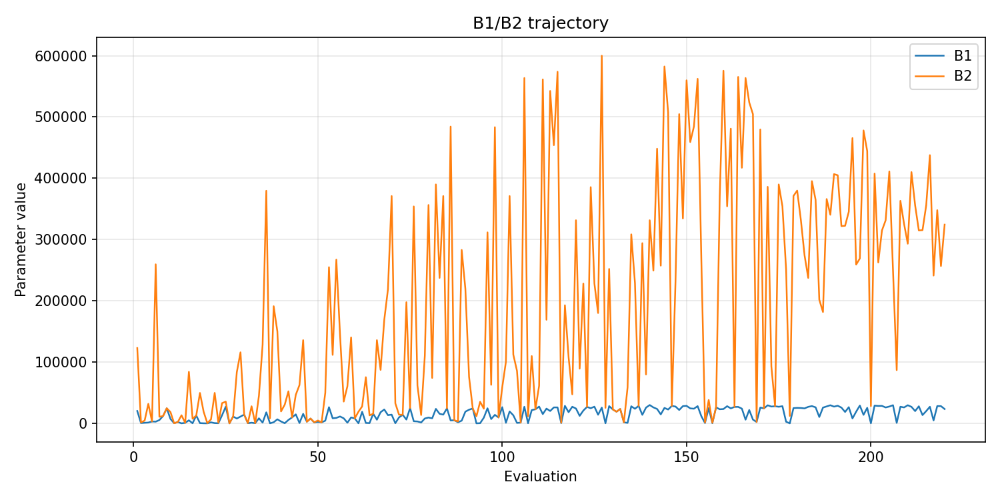
- [`de_optimize_20260503T223515Z_job6993843_b1_ratio_heatmap.png`](plots/de_optimize_20260503T223515Z_job6993843_b1_ratio_heatmap.png)
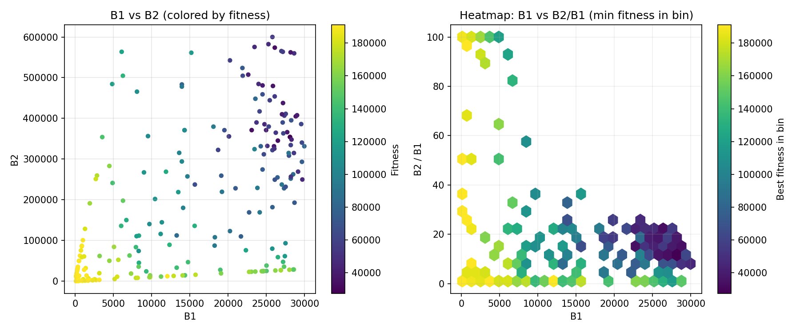
- [`de_optimize_20260503T223515Z_job6993843_jump_plot.png`](plots/de_optimize_20260503T223515Z_job6993843_jump_plot.png)
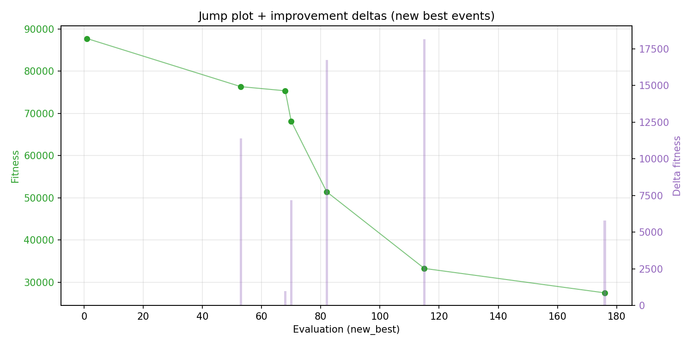
- [`de_optimize_20260503T223515Z_job6993843_progress_by_phase.png`](plots/de_optimize_20260503T223515Z_job6993843_progress_by_phase.png)
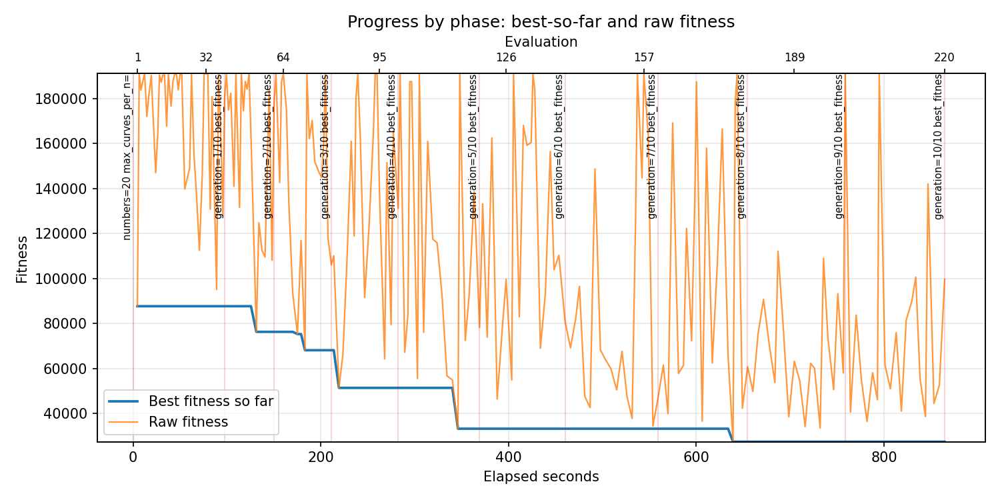
- [`de_optimize_20260503T223515Z_job6993843_time_efficiency.png`](plots/de_optimize_20260503T223515Z_job6993843_time_efficiency.png)
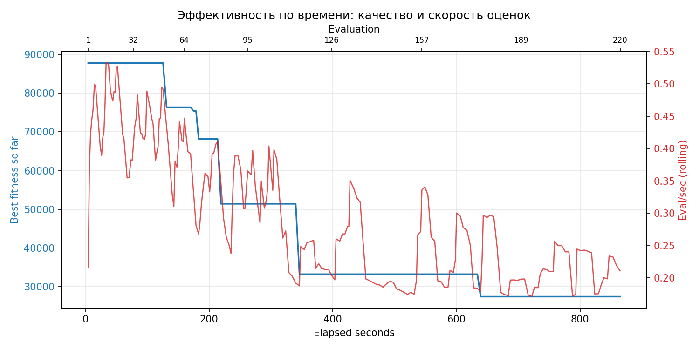

## Таблицы

## Validation runs

### Validation run `20260503T225017Z`
- validation file: [`de_validate_20260503T225017Z_job6993844.json`](de_validate_20260503T225017Z_job6993844.json)
- dataset: `data/numbers/20_dset_20260503T223444Z_job6993842/control.json`
- method: `de`
- optimized params: `(B1, B2)=(28096, 354209)`
- baseline params: `(B1, B2)=(11000, 220000)`
- max_curves_per_n: `150`
- repeats_per_n: `5`
- curve_timeout_sec: `None`
- workers: `56`
- seed: `42`
- optimized_mean_score: `42930.66105368483`
- baseline_mean_score: `88665.61043035012`
- relative_improvement_pct: `51.58138443381232`
- optimized_mean_time_sec: `1.5344661053684832`
- baseline_mean_time_sec: `1.147161043035012`
- time_improvement_pct: `-33.76204803022153`
- optimized_mean_curves: `71.72`
- baseline_mean_curves: `103.88`
- curves_improvement_pct: `30.95879861378513`
- optimized_mean_success_rate: `0.82`
- baseline_mean_success_rate: `0.54`
- success_rate_delta_pp: `27.999999999999993`
- trace plots:
  - curves_distribution_plot: [`de_validate_20260503T225017Z_job6993844_curves_distribution.png`](plots/de_validate_20260503T225017Z_job6993844_curves_distribution.png)
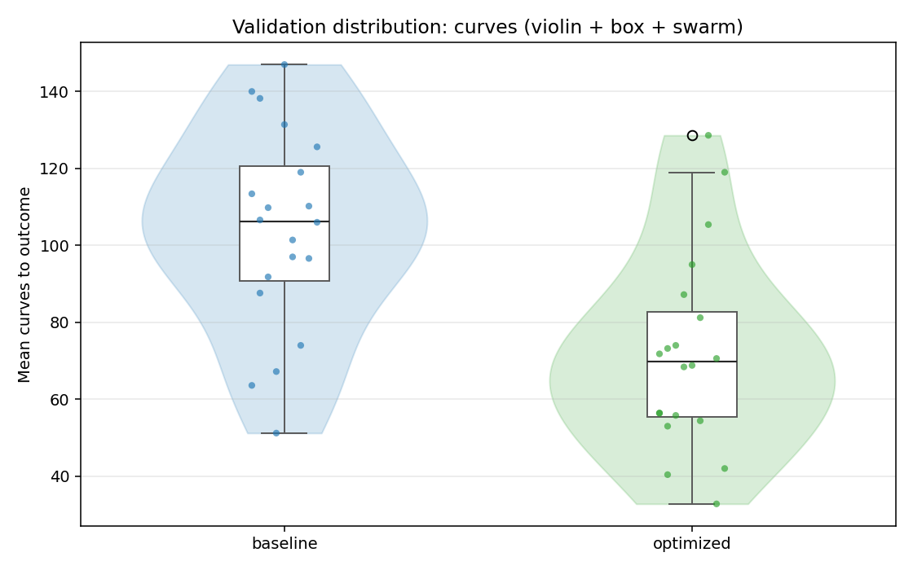
  - curves_trace_plot: [`de_validate_20260503T225017Z_job6993844_curves_trace.png`](plots/de_validate_20260503T225017Z_job6993844_curves_trace.png)
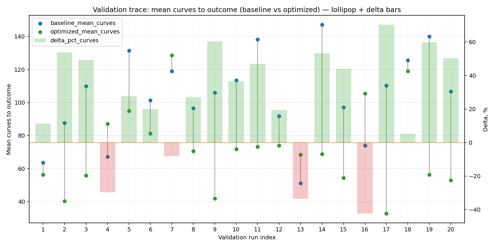
  - score_distribution_plot: [`de_validate_20260503T225017Z_job6993844_score_distribution.png`](plots/de_validate_20260503T225017Z_job6993844_score_distribution.png)
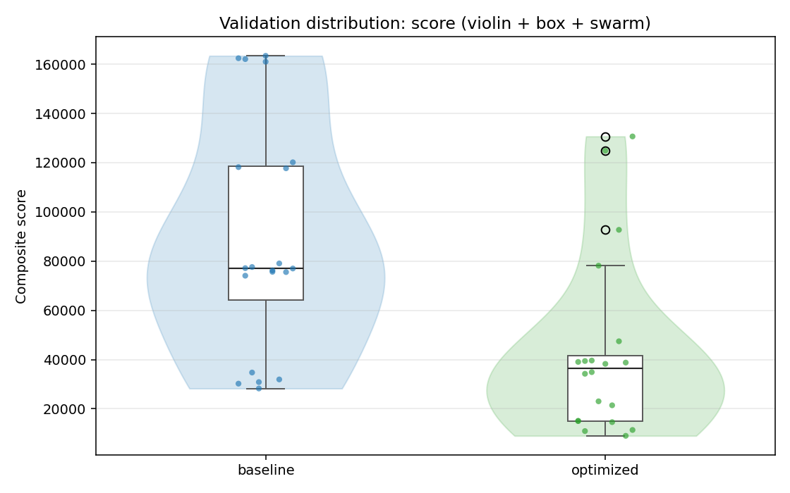
  - score_trace_plot: [`de_validate_20260503T225017Z_job6993844_score_trace.png`](plots/de_validate_20260503T225017Z_job6993844_score_trace.png)
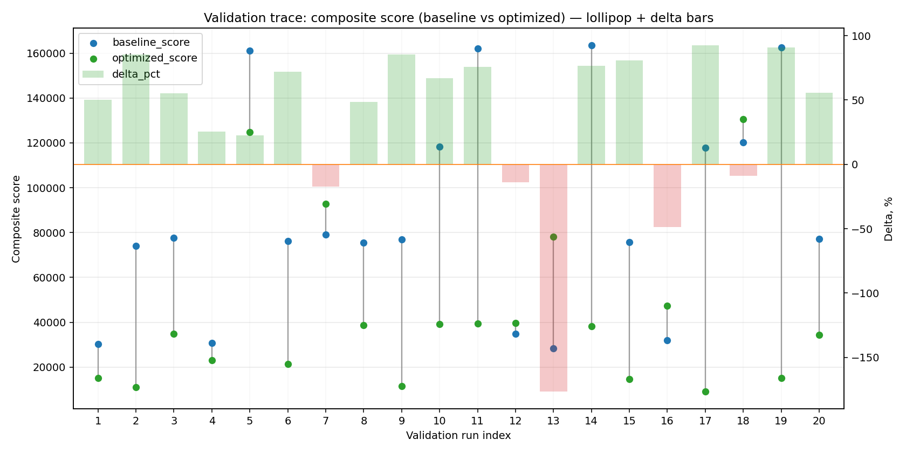
  - time_distribution_plot: [`de_validate_20260503T225017Z_job6993844_time_distribution.png`](plots/de_validate_20260503T225017Z_job6993844_time_distribution.png)
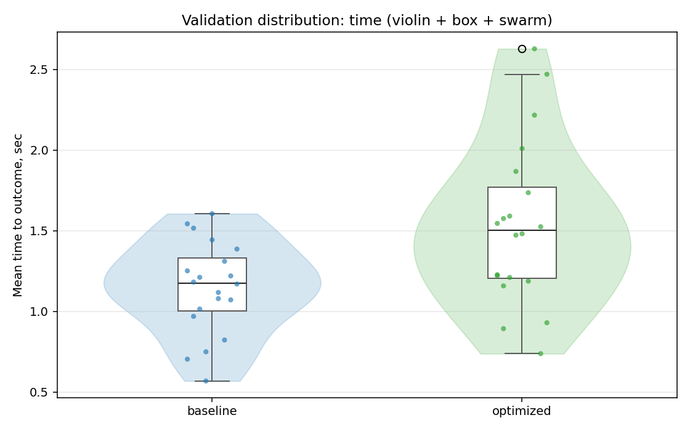
  - time_trace_plot: [`de_validate_20260503T225017Z_job6993844_time_trace.png`](plots/de_validate_20260503T225017Z_job6993844_time_trace.png)
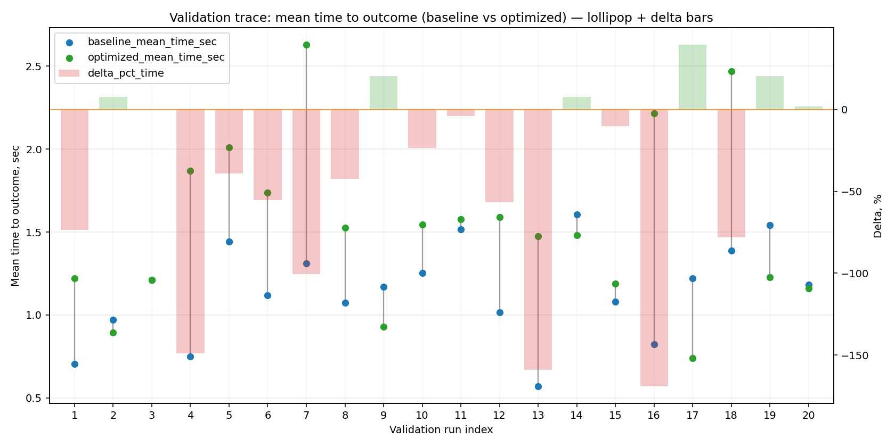

---

### Validation run `20260504T210246Z`
- validation file: [`de_validate_20260504T210246Z.json`](de_validate_20260504T210246Z.json)
- dataset: `data/numbers/20_dset_20260503T223444Z_job6993842/control.json`
- method: `de`
- optimized params: `(B1, B2)=(28096, 354209)`
- baseline params: `(B1, B2)=(11000, 1900000)`
- max_curves_per_n: `150`
- repeats_per_n: `5`
- curve_timeout_sec: `None`
- workers: `12`
- seed: `42`
- optimized_mean_score: `58816.551849096824`
- baseline_mean_score: `48087.35228089714`
- relative_improvement_pct: `-22.31189503952351`
- optimized_mean_time_sec: `2.301905184909683`
- baseline_mean_time_sec: `1.9327352280897139`
- time_improvement_pct: `-19.10090691443811`
- optimized_mean_curves: `75.95`
- baseline_mean_curves: `75.2`
- curves_improvement_pct: `-0.9973404255319148`
- optimized_mean_success_rate: `0.78`
- baseline_mean_success_rate: `0.8099999999999999`
- success_rate_delta_pp: `-2.9999999999999916`
- trace plots:
  - score_trace_plot: [`de_validate_20260504T210246Z_score_trace.png`](plots/de_validate_20260504T210246Z_score_trace.png)
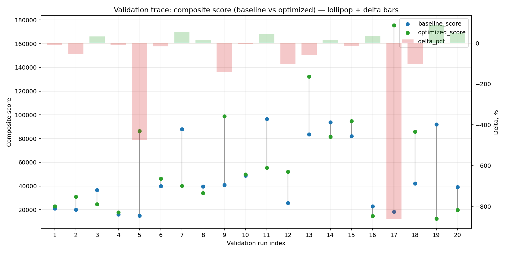
  - score_distribution_plot: [`de_validate_20260504T210246Z_score_distribution.png`](plots/de_validate_20260504T210246Z_score_distribution.png)
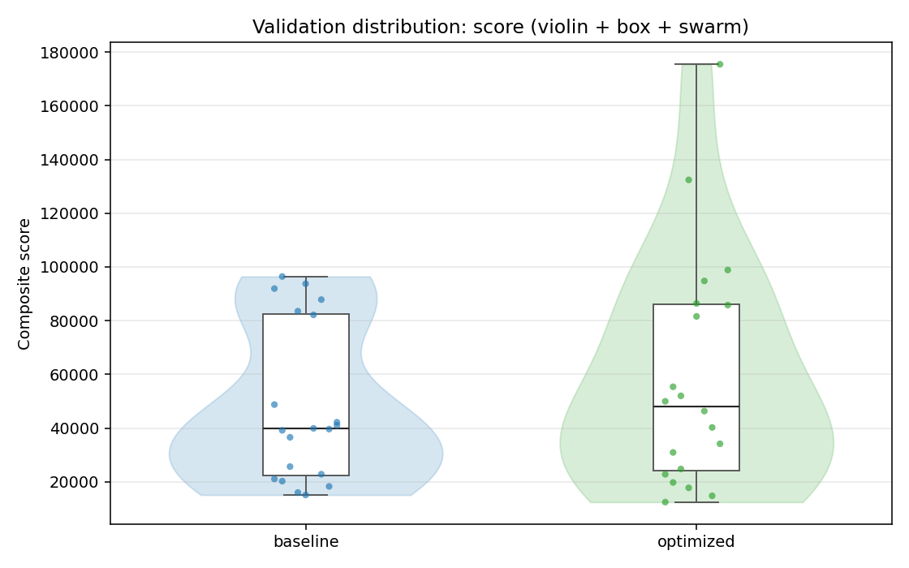
  - success_trace_plot: [`de_validate_20260504T210246Z_success_trace.png`](plots/de_validate_20260504T210246Z_success_trace.png)
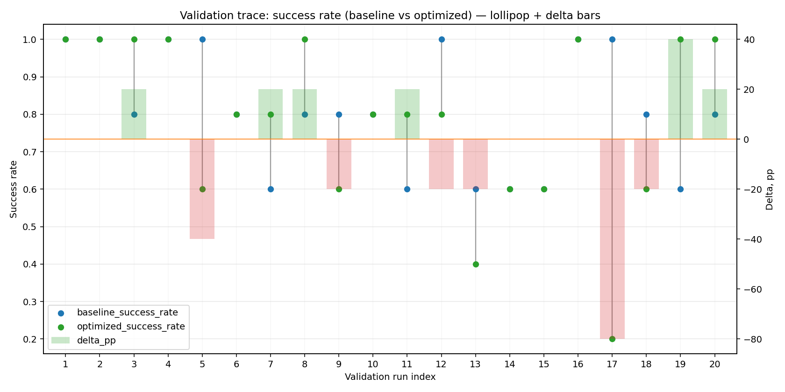
  - success_distribution_plot: [`de_validate_20260504T210246Z_success_distribution.png`](plots/de_validate_20260504T210246Z_success_distribution.png)
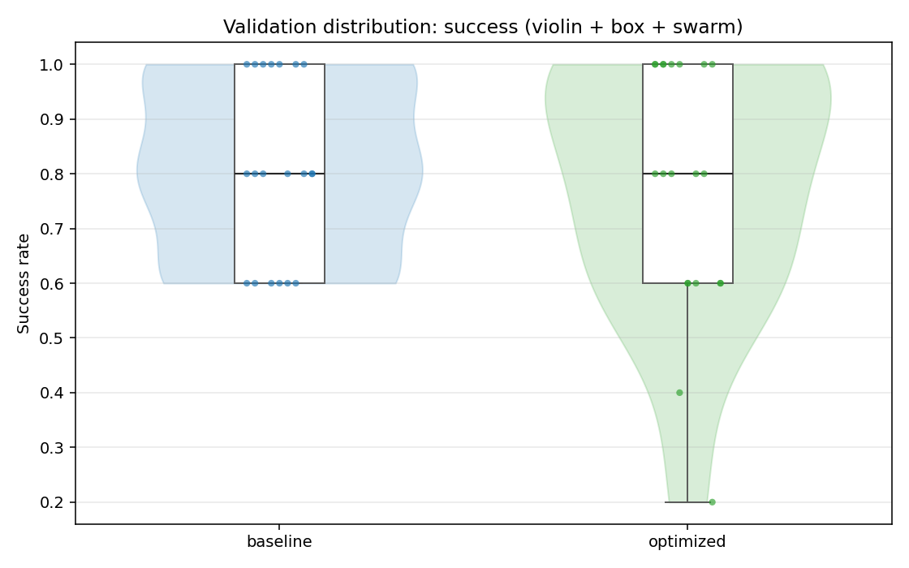
  - time_trace_plot: [`de_validate_20260504T210246Z_time_trace.png`](plots/de_validate_20260504T210246Z_time_trace.png)
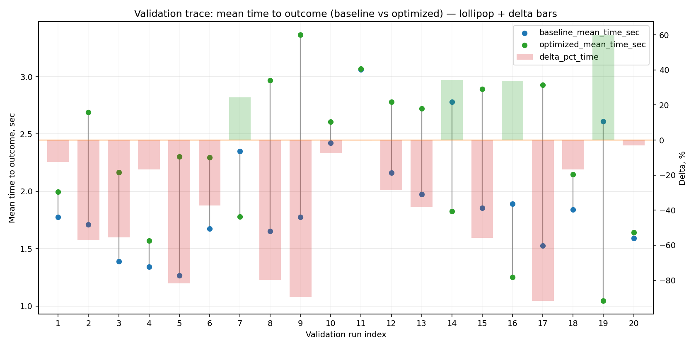
  - time_distribution_plot: [`de_validate_20260504T210246Z_time_distribution.png`](plots/de_validate_20260504T210246Z_time_distribution.png)
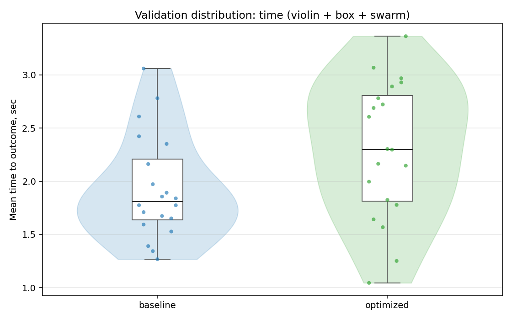
  - curves_trace_plot: [`de_validate_20260504T210246Z_curves_trace.png`](plots/de_validate_20260504T210246Z_curves_trace.png)
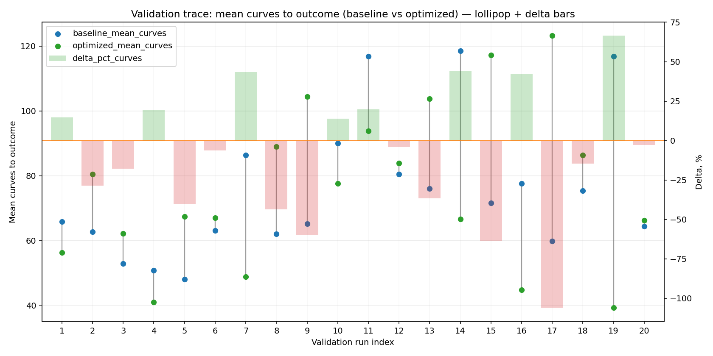
  - curves_distribution_plot: [`de_validate_20260504T210246Z_curves_distribution.png`](plots/de_validate_20260504T210246Z_curves_distribution.png)
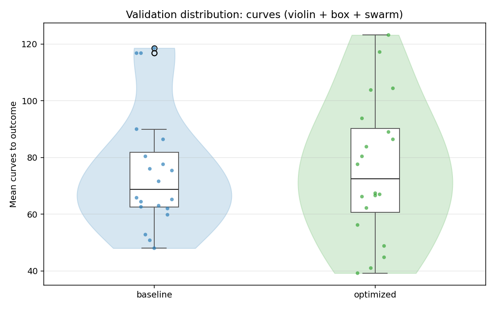

---

### Validation run `20260504T210711Z`
- validation file: [`de_validate_20260504T210711Z.json`](de_validate_20260504T210711Z.json)
- dataset: `data/numbers/20_dset_20260503T223444Z_job6993842/control.json`
- method: `de`
- optimized params: `(B1, B2)=(28096, 354209)`
- baseline params: `(B1, B2)=(11000, 1900000)`
- max_curves_per_n: `150`
- repeats_per_n: `5`
- curve_timeout_sec: `None`
- workers: `12`
- seed: `42`
- optimized_mean_score: `55289.32708069987`
- baseline_mean_score: `59533.42386671256`
- relative_improvement_pct: `7.128931128696143`
- optimized_mean_time_sec: `2.3626827080699875`
- baseline_mean_time_sec: `2.1607923866712553`
- time_improvement_pct: `-9.343346572492713`
- optimized_mean_curves: `73.25`
- baseline_mean_curves: `78.51`
- curves_improvement_pct: `6.699783467074265`
- optimized_mean_success_rate: `0.8`
- baseline_mean_success_rate: `0.76`
- success_rate_delta_pp: `4.0000000000000036`
- trace plots:
  - score_trace_plot: [`de_validate_20260504T210711Z_score_trace.png`](plots/de_validate_20260504T210711Z_score_trace.png)
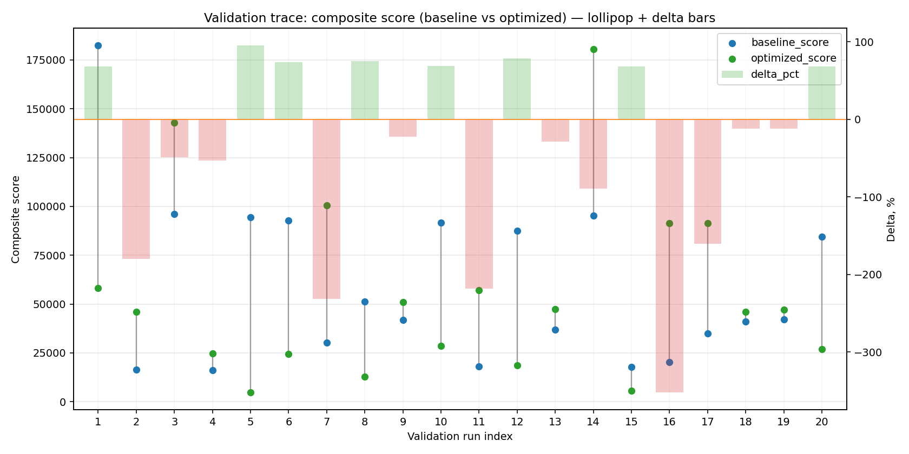
  - score_distribution_plot: [`de_validate_20260504T210711Z_score_distribution.png`](plots/de_validate_20260504T210711Z_score_distribution.png)
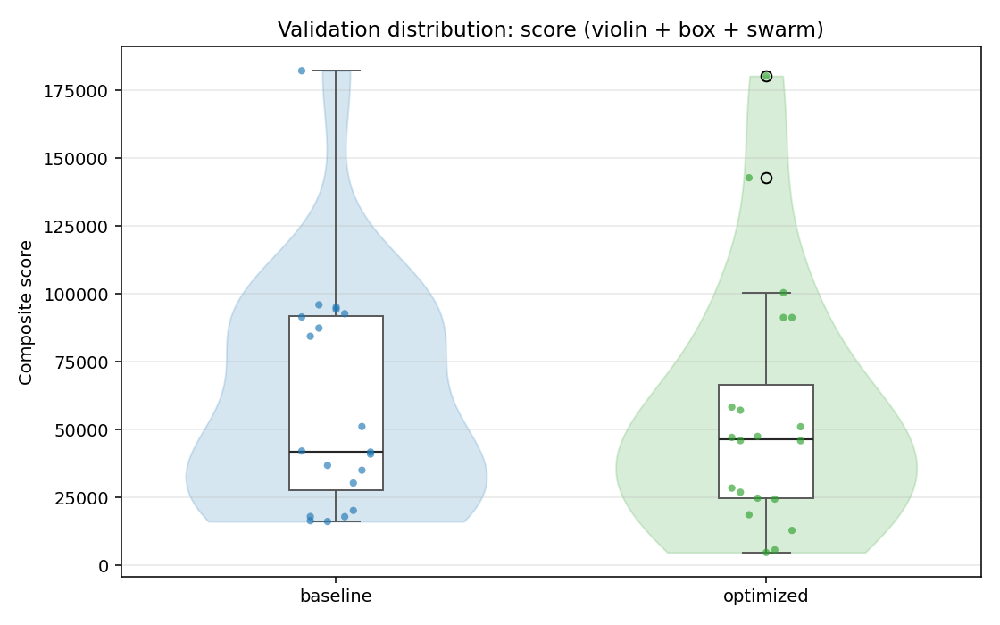
  - success_trace_plot: [`de_validate_20260504T210711Z_success_trace.png`](plots/de_validate_20260504T210711Z_success_trace.png)
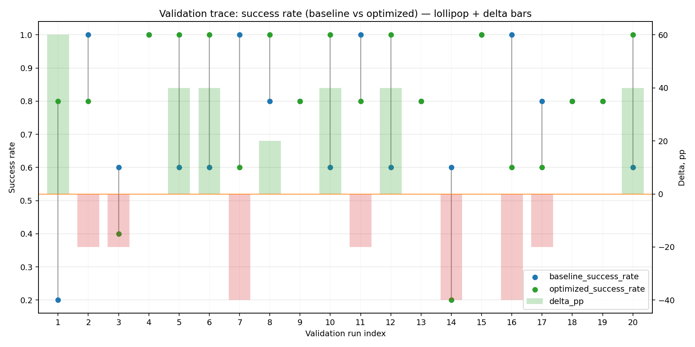
  - success_distribution_plot: [`de_validate_20260504T210711Z_success_distribution.png`](plots/de_validate_20260504T210711Z_success_distribution.png)
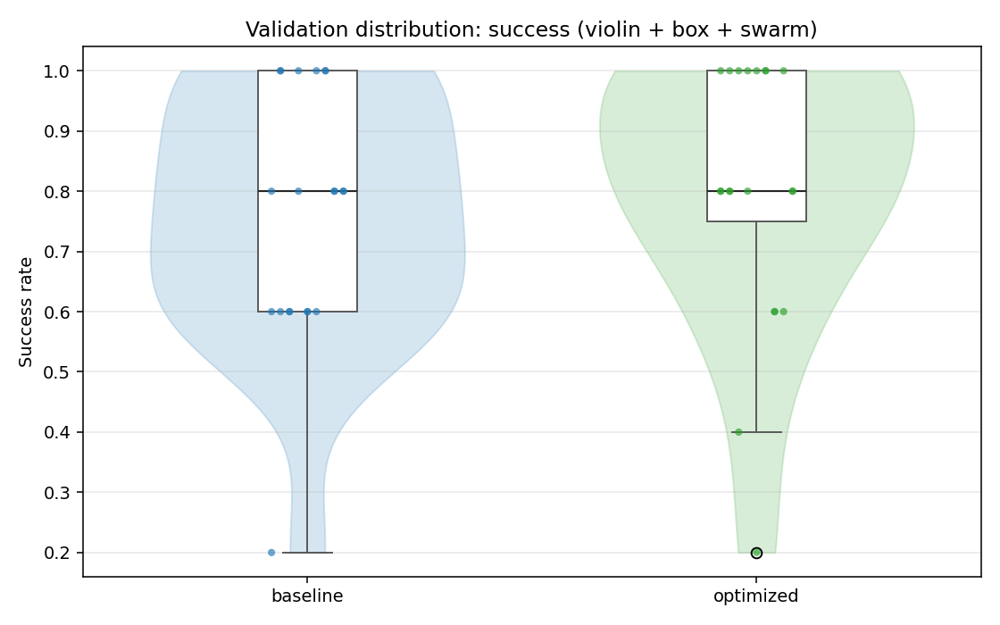
  - time_trace_plot: [`de_validate_20260504T210711Z_time_trace.png`](plots/de_validate_20260504T210711Z_time_trace.png)
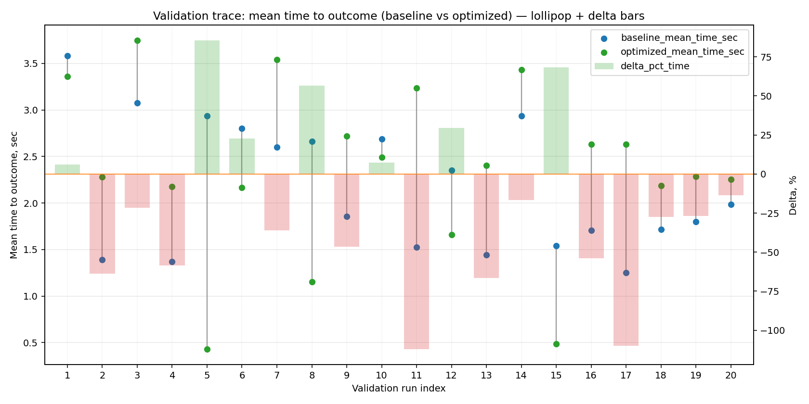
  - time_distribution_plot: [`de_validate_20260504T210711Z_time_distribution.png`](plots/de_validate_20260504T210711Z_time_distribution.png)
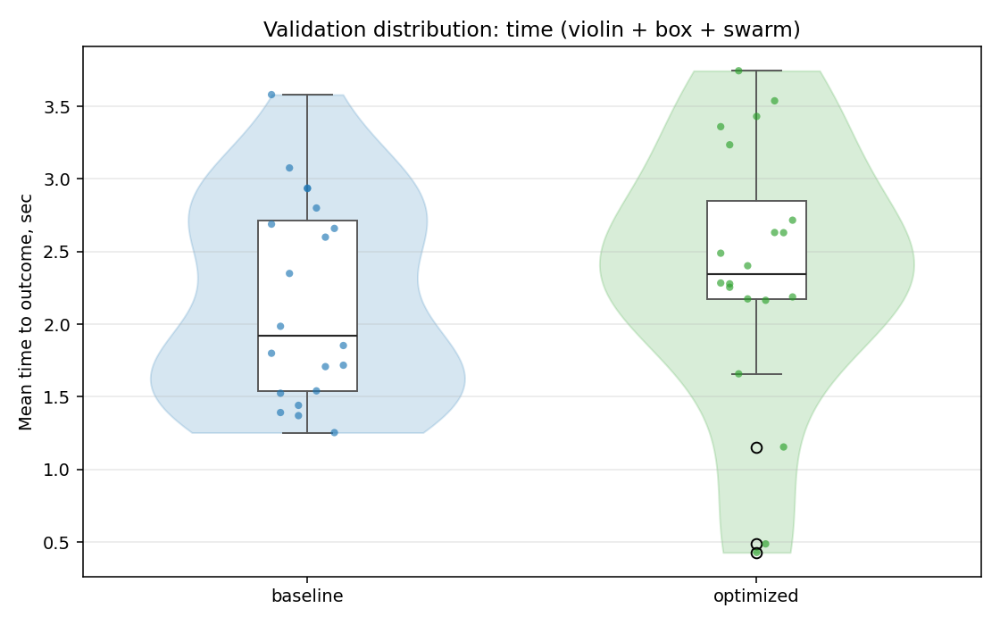
  - curves_trace_plot: [`de_validate_20260504T210711Z_curves_trace.png`](plots/de_validate_20260504T210711Z_curves_trace.png)
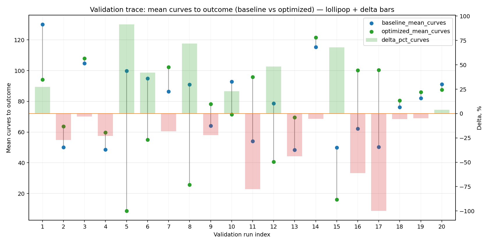
  - curves_distribution_plot: [`de_validate_20260504T210711Z_curves_distribution.png`](plots/de_validate_20260504T210711Z_curves_distribution.png)
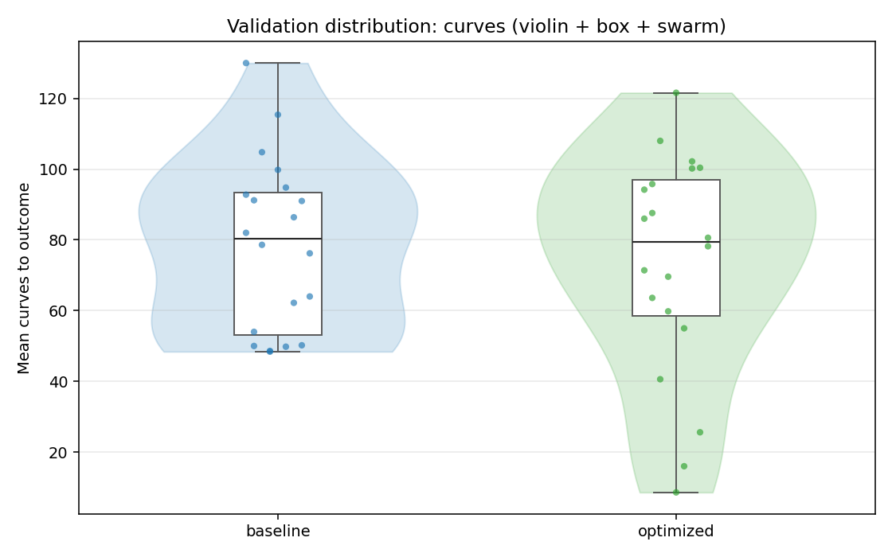

---

### Validation run `20260504T210916Z`
- validation file: [`de_validate_20260504T210916Z.json`](de_validate_20260504T210916Z.json)
- dataset: `data/numbers/20_dset_20260503T223444Z_job6993842/control.json`
- method: `de`
- optimized params: `(B1, B2)=(28096, 354209)`
- baseline params: `(B1, B2)=(11000, 1900000)`
- max_curves_per_n: `150`
- repeats_per_n: `5`
- curve_timeout_sec: `None`
- workers: `12`
- seed: `42`
- optimized_mean_score: `46384.83690500262`
- baseline_mean_score: `48901.09151000299`
- relative_improvement_pct: `5.1456000823328285`
- optimized_mean_time_sec: `2.383533690500262`
- baseline_mean_time_sec: `2.301859151000299`
- time_improvement_pct: `-3.548198831560602`
- optimized_mean_curves: `70.99`
- baseline_mean_curves: `77.65`
- curves_improvement_pct: `8.576947842884753`
- optimized_mean_success_rate: `0.85`
- baseline_mean_success_rate: `0.8300000000000001`
- success_rate_delta_pp: `1.9999999999999907`
- trace plots:
  - score_trace_plot: [`de_validate_20260504T210916Z_score_trace.png`](plots/de_validate_20260504T210916Z_score_trace.png)
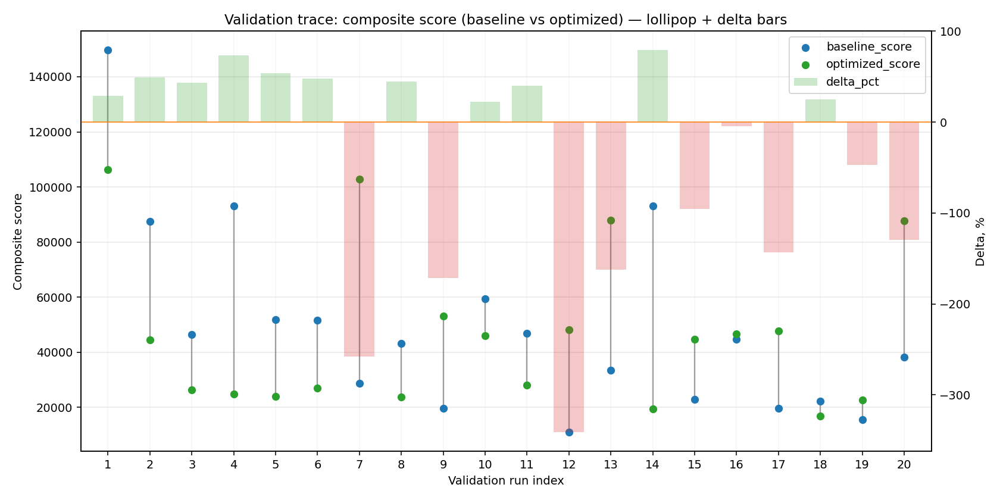
  - score_distribution_plot: [`de_validate_20260504T210916Z_score_distribution.png`](plots/de_validate_20260504T210916Z_score_distribution.png)
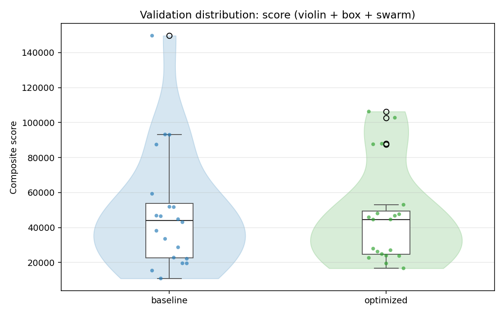
  - success_trace_plot: [`de_validate_20260504T210916Z_success_trace.png`](plots/de_validate_20260504T210916Z_success_trace.png)
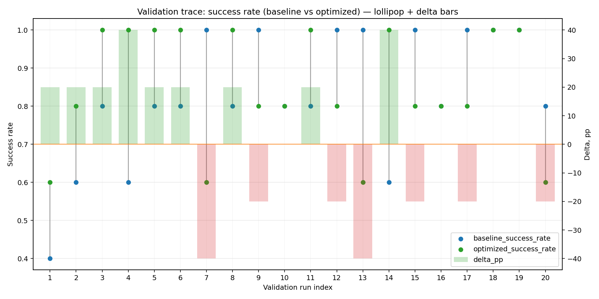
  - success_distribution_plot: [`de_validate_20260504T210916Z_success_distribution.png`](plots/de_validate_20260504T210916Z_success_distribution.png)
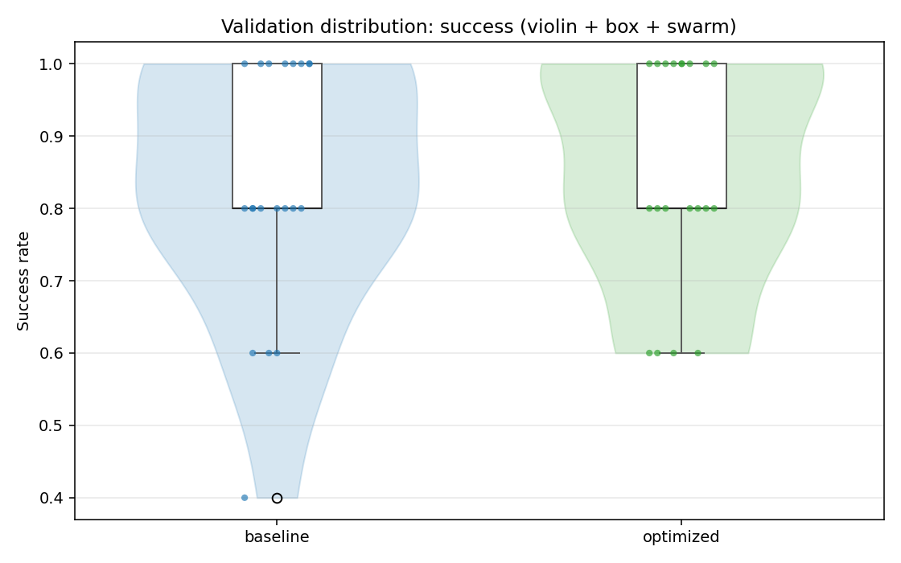
  - time_trace_plot: [`de_validate_20260504T210916Z_time_trace.png`](plots/de_validate_20260504T210916Z_time_trace.png)
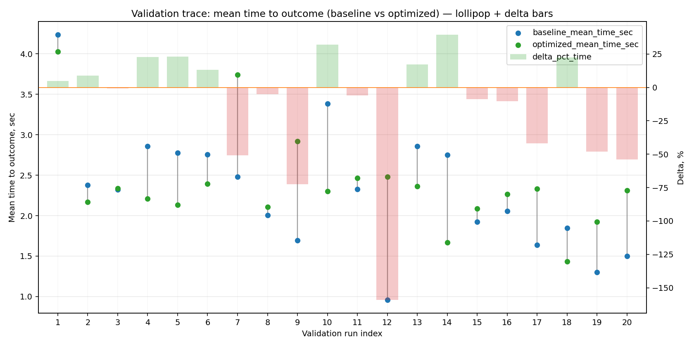
  - time_distribution_plot: [`de_validate_20260504T210916Z_time_distribution.png`](plots/de_validate_20260504T210916Z_time_distribution.png)
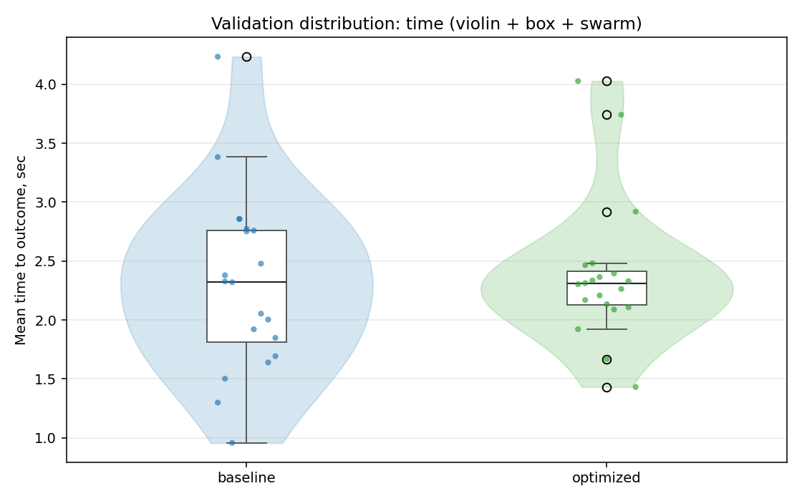
  - curves_trace_plot: [`de_validate_20260504T210916Z_curves_trace.png`](plots/de_validate_20260504T210916Z_curves_trace.png)
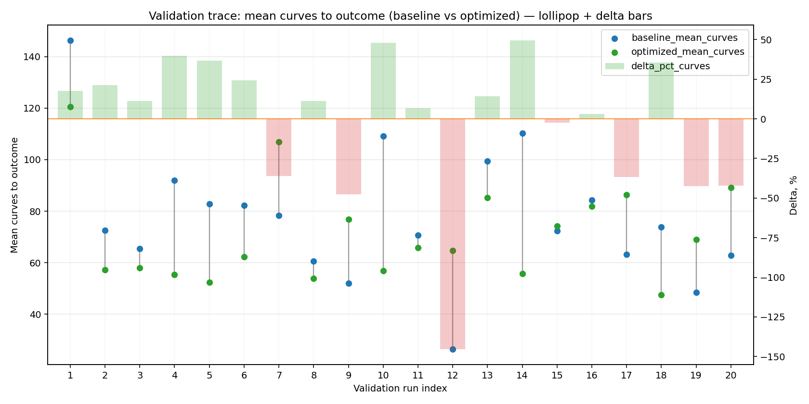
  - curves_distribution_plot: [`de_validate_20260504T210916Z_curves_distribution.png`](plots/de_validate_20260504T210916Z_curves_distribution.png)
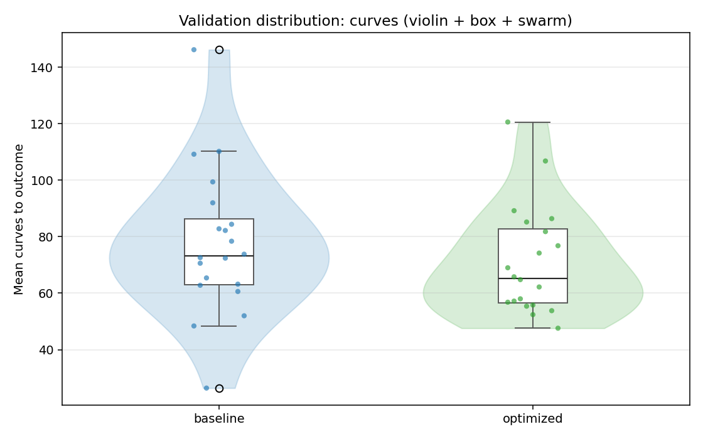

---

### Validation run `20260504T211520Z`
- validation file: [`de_validate_20260504T211520Z.json`](de_validate_20260504T211520Z.json)
- dataset: `data/numbers/20_dset_20260503T223444Z_job6993842/control.json`
- method: `de`
- optimized params: `(B1, B2)=(28096, 354209)`
- baseline params: `(B1, B2)=(11000, 1900000)`
- max_curves_per_n: `150`
- repeats_per_n: `5`
- curve_timeout_sec: `None`
- workers: `12`
- seed: `42`
- optimized_mean_score: `50871.65168410635`
- baseline_mean_score: `56298.85182850526`
- relative_improvement_pct: `9.639983708603825`
- optimized_mean_time_sec: `2.238265168410635`
- baseline_mean_time_sec: `1.9600851828505257`
- time_improvement_pct: `-14.192239602339926`
- optimized_mean_curves: `69.78`
- baseline_mean_curves: `73.96000000000001`
- curves_improvement_pct: `5.651703623580322`
- optimized_mean_success_rate: `0.8099999999999999`
- baseline_mean_success_rate: `0.75`
- success_rate_delta_pp: `5.999999999999995`
- trace plots:
  - score_trace_plot: [`de_validate_20260504T211520Z_score_trace.png`](plots/de_validate_20260504T211520Z_score_trace.png)
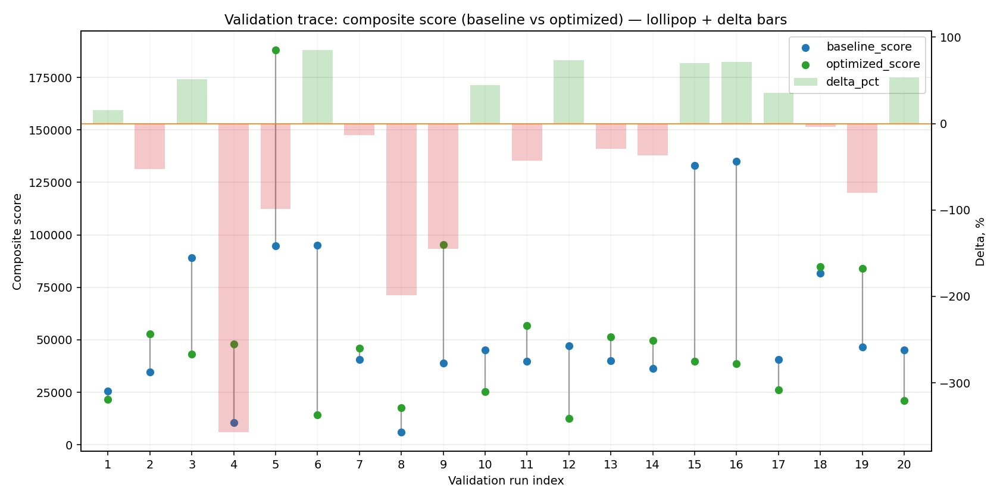
  - score_distribution_plot: [`de_validate_20260504T211520Z_score_distribution.png`](plots/de_validate_20260504T211520Z_score_distribution.png)
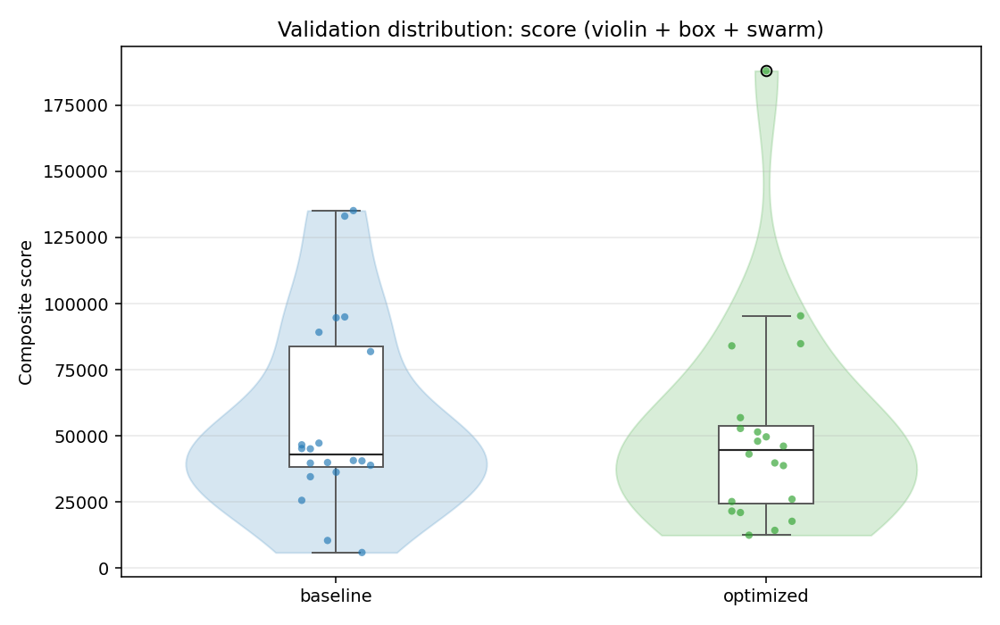
  - success_trace_plot: [`de_validate_20260504T211520Z_success_trace.png`](plots/de_validate_20260504T211520Z_success_trace.png)
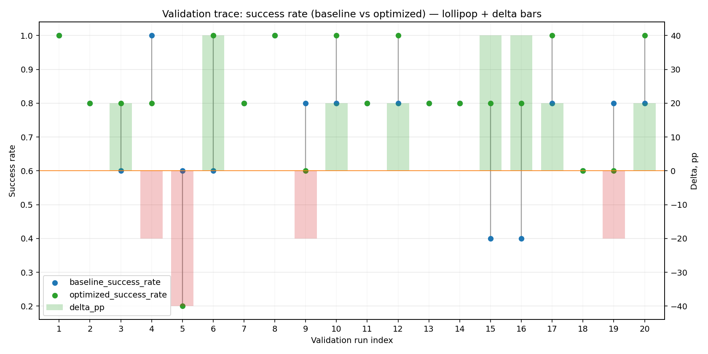
  - success_distribution_plot: [`de_validate_20260504T211520Z_success_distribution.png`](plots/de_validate_20260504T211520Z_success_distribution.png)
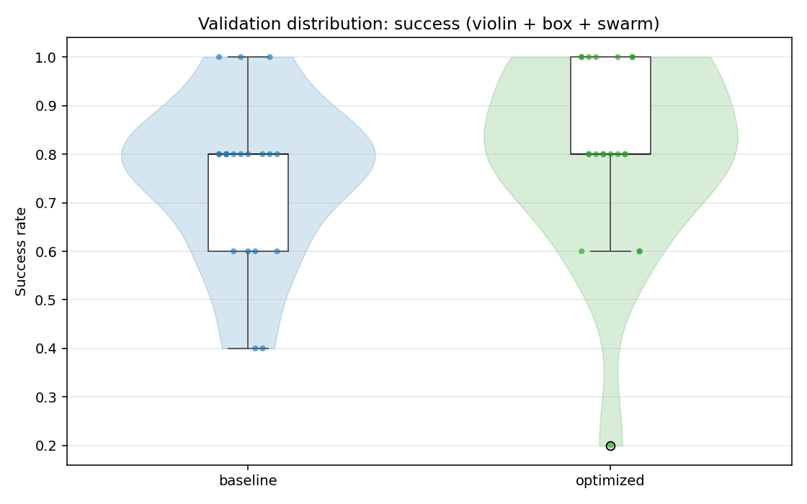
  - time_trace_plot: [`de_validate_20260504T211520Z_time_trace.png`](plots/de_validate_20260504T211520Z_time_trace.png)
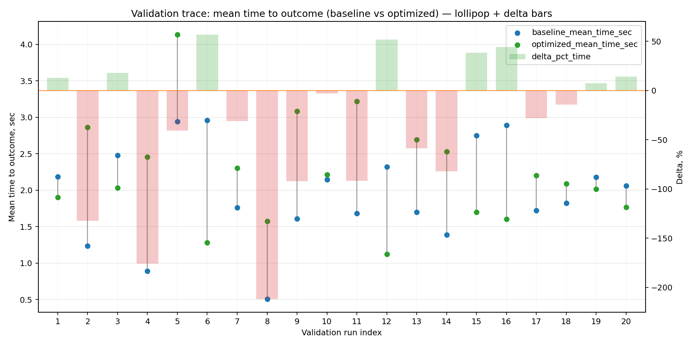
  - time_distribution_plot: [`de_validate_20260504T211520Z_time_distribution.png`](plots/de_validate_20260504T211520Z_time_distribution.png)
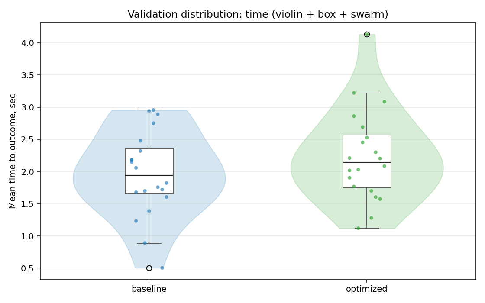
  - curves_trace_plot: [`de_validate_20260504T211520Z_curves_trace.png`](plots/de_validate_20260504T211520Z_curves_trace.png)
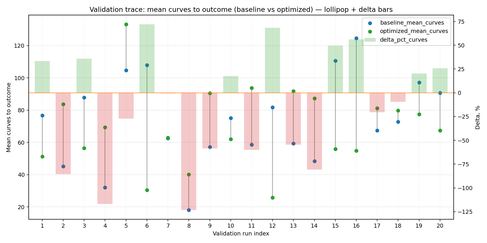
  - curves_distribution_plot: [`de_validate_20260504T211520Z_curves_distribution.png`](plots/de_validate_20260504T211520Z_curves_distribution.png)
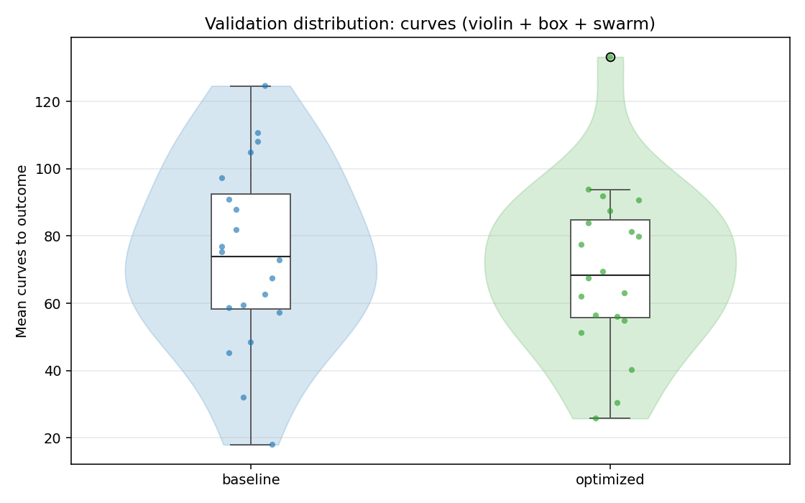

---

### Validation run `20260504T211615Z`
- validation file: [`de_validate_20260504T211615Z.json`](de_validate_20260504T211615Z.json)
- dataset: `data/numbers/20_dset_20260503T223444Z_job6993842/control.json`
- method: `de`
- optimized params: `(B1, B2)=(28096, 354209)`
- baseline params: `(B1, B2)=(11000, 1900000)`
- max_curves_per_n: `150`
- repeats_per_n: `5`
- curve_timeout_sec: `None`
- workers: `12`
- seed: `42`
- optimized_mean_score: `44517.65593049159`
- baseline_mean_score: `45285.72212029555`
- relative_improvement_pct: `1.6960449206566426`
- optimized_mean_time_sec: `2.4143155930491593`
- baseline_mean_time_sec: `2.0530222120295547`
- time_improvement_pct: `-17.59812333751816`
- optimized_mean_curves: `67.49`
- baseline_mean_curves: `75.11`
- curves_improvement_pct: `10.145120489948082`
- optimized_mean_success_rate: `0.86`
- baseline_mean_success_rate: `0.8300000000000001`
- success_rate_delta_pp: `2.9999999999999916`
- trace plots:
  - score_trace_plot: [`de_validate_20260504T211615Z_score_trace.png`](plots/de_validate_20260504T211615Z_score_trace.png)
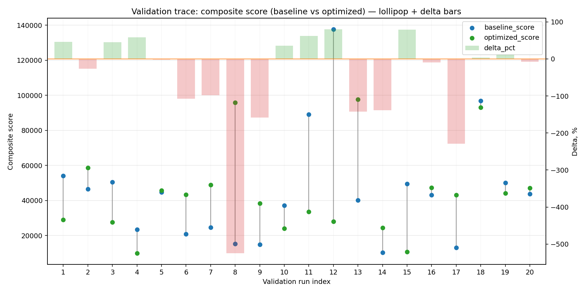
  - score_distribution_plot: [`de_validate_20260504T211615Z_score_distribution.png`](plots/de_validate_20260504T211615Z_score_distribution.png)
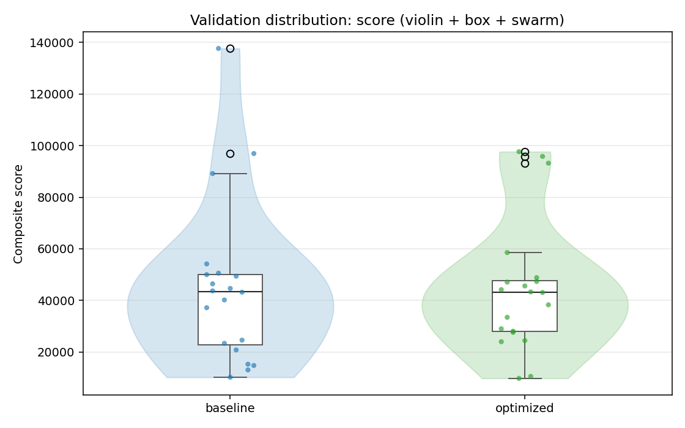
  - success_trace_plot: [`de_validate_20260504T211615Z_success_trace.png`](plots/de_validate_20260504T211615Z_success_trace.png)
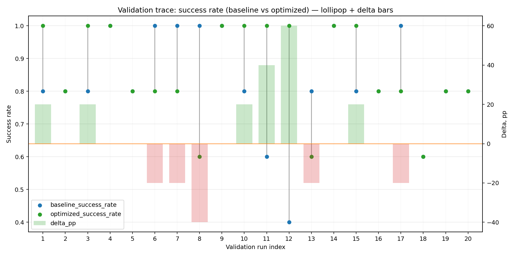
  - success_distribution_plot: [`de_validate_20260504T211615Z_success_distribution.png`](plots/de_validate_20260504T211615Z_success_distribution.png)
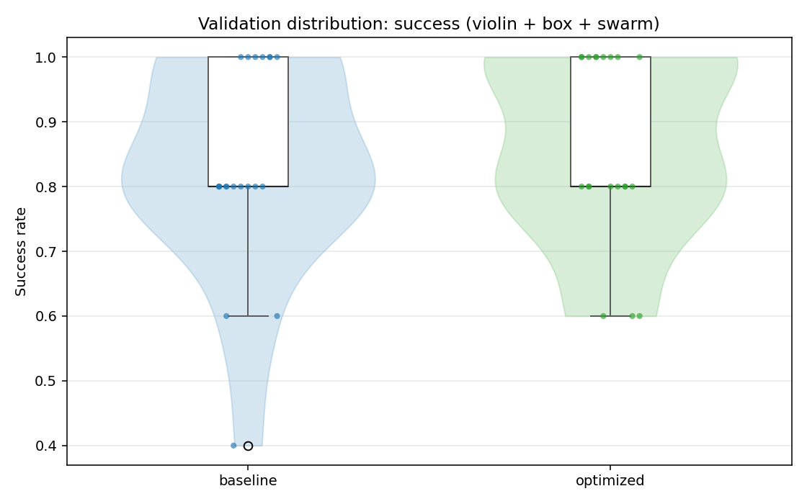
  - time_trace_plot: [`de_validate_20260504T211615Z_time_trace.png`](plots/de_validate_20260504T211615Z_time_trace.png)
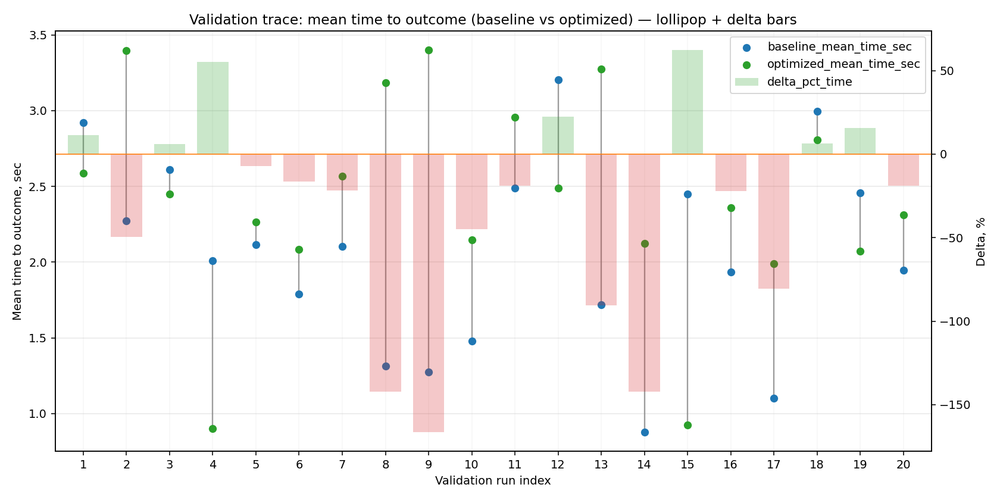
  - time_distribution_plot: [`de_validate_20260504T211615Z_time_distribution.png`](plots/de_validate_20260504T211615Z_time_distribution.png)
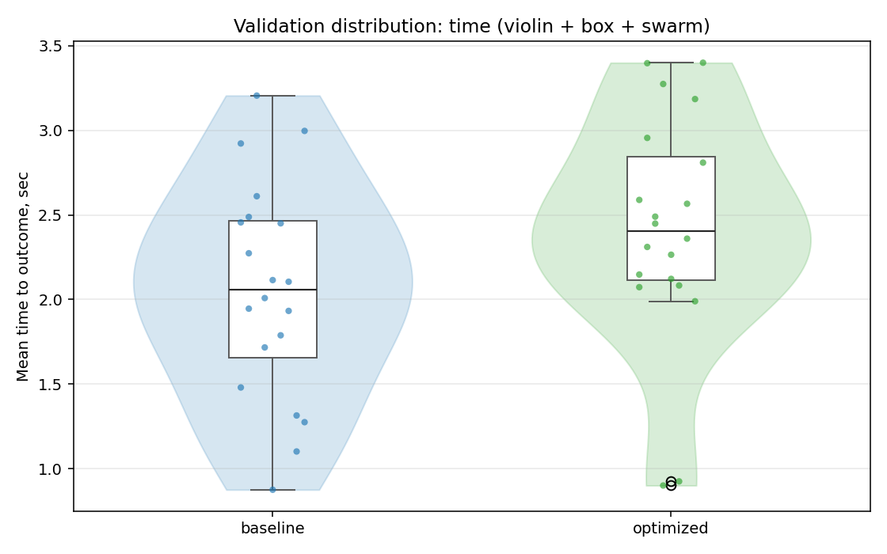
  - curves_trace_plot: [`de_validate_20260504T211615Z_curves_trace.png`](plots/de_validate_20260504T211615Z_curves_trace.png)
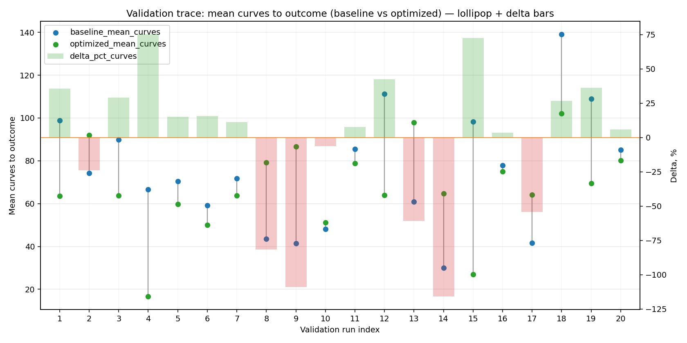
  - curves_distribution_plot: [`de_validate_20260504T211615Z_curves_distribution.png`](plots/de_validate_20260504T211615Z_curves_distribution.png)
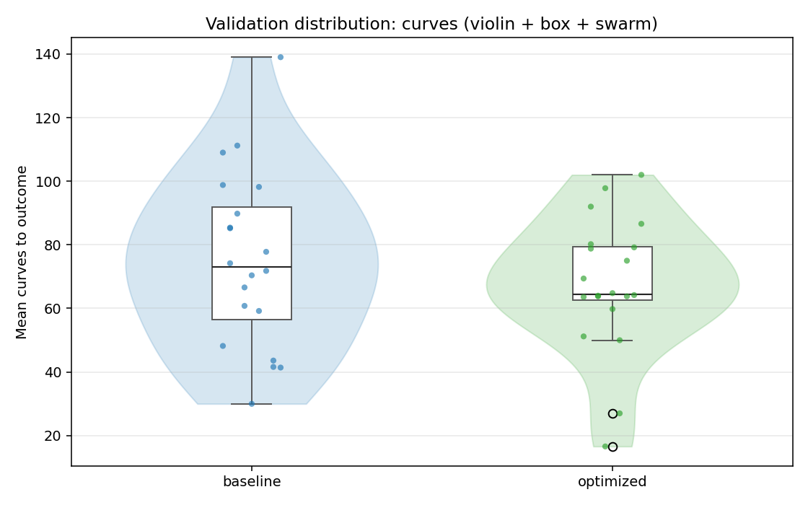

---
