# Отчёт по оптимизации: bo_optimize_20260504T131751Z_job6996709

## Метаданные
- метод: `bo`
- датасет: `data/numbers/20_dset_20260504T131739Z_job6996702/train.json`
- оптимум `(B1, B2)`: `(13766, 291165)`
- objective: `230874.68540608961`
- max_curves_per_n: `100`
- repeats_per_n: `3`
- границы: `B1[100.0, 30000.0]`, `B2[100.0, 600000.0]`, `ratio_max=100.0`

## Ключевые статистики
- `best_eval`: `29`
- `best_eval_fraction`: `0.7631578947368421`
- `eval_per_sec`: `0.2982083207978298`
- `evaluation_count`: `38`
- `improvement_percent`: `73.38039862048686`
- `max_plateau_evals`: `14`
- `median_plateau_evals`: `5.0`
- `new_best_count`: `5`
- `new_best_rate`: `0.13157894736842105`
- `p90_plateau_evals`: `11.5`
- `time_to_best_sec`: `89.3134740270907`
- `time_to_first_improvement_sec`: `2.3471393790096045`
- `total_runtime_sec`: `127.4278157640947`

## Флаги внимания

| Флаг | Статус | Текущее значение | Порог | Что это значит | Что делать |
|---|---|---:|---:|---|---|
| `b1_hits_boundary` | ✅ ОК | `0.02631578947368421` | `> 0.10` | Большая доля оценок проходит близко к границам B1. | Расширить диапазон B1, если упор в границу повторяется. |
| `b2_hits_boundary` | ✅ ОК | `0.02631578947368421` | `> 0.10` | Большая доля оценок проходит близко к границам B2. | Расширить диапазон B2, если упор в границу повторяется. |
| `best_b1_on_boundary` | ✅ ОК | `13766.0` | `within 2% of log-range [100.0, 30000.0]` | Лучший найденный B1 лежит на границе диапазона. | Проверить расширенный диапазон B1 вокруг текущей границы. |
| `best_b2_on_boundary` | ✅ ОК | `291165.0` | `within 2% of log-range [100.0, 600000.0]` | Лучший найденный B2 лежит на границе диапазона. | Проверить расширенный диапазон B2 вокруг текущей границы. |
| `best_ratio_on_boundary` | ✅ ОК | `21.15102426267616` | `within 2% of log-range up to ratio_max=100.0` | Лучшее отношение B2/B1 находится у верхней границы ratio_max. | Увеличить ratio_max и перепроверить локальный поиск в новой области. |
| `late_best` | ✅ ОК | `0.7008946476210144` | `> 0.85` | Лучшее решение найдено слишком поздно относительно общего времени. | Усилить ранний поиск или пересмотреть бюджет/инициализацию. |
| `low_improvement` | ✅ ОК | `73.38039862048686` | `< 10%` | Итоговый прирост качества слишком мал. | Сузить границы поиска или изменить параметры метода. |
| `low_signal` | ✅ ОК | `0.13157894736842105` | `< 0.03` | Слишком низкая плотность новых best-событий (слабый сигнал оптимизации). | Перенастроить exploration и сделать переоценку top-k кандидатов. |
| `plateau_too_long` | ✅ ОК | `0.3684210526315789` | `> 0.50` | Слишком длинное плато: улучшений почти нет на большом участке запуска. | Увеличить exploration или добавить политику рестартов. |
| `ratio_hits_boundary` | ⚠️ ВНИМАНИЕ | `0.2894736842105263` | `> 0.10` | Большая доля оценок проходит близко к границе отношения B2/B1. | Увеличить ratio_max, если хорошие точки упираются в ограничение отношения B2/B1. |

## Графики
- [`bo_optimize_20260504T131751Z_job6996709_b1_b2_trajectory.png`](plots/bo_optimize_20260504T131751Z_job6996709_b1_b2_trajectory.png)
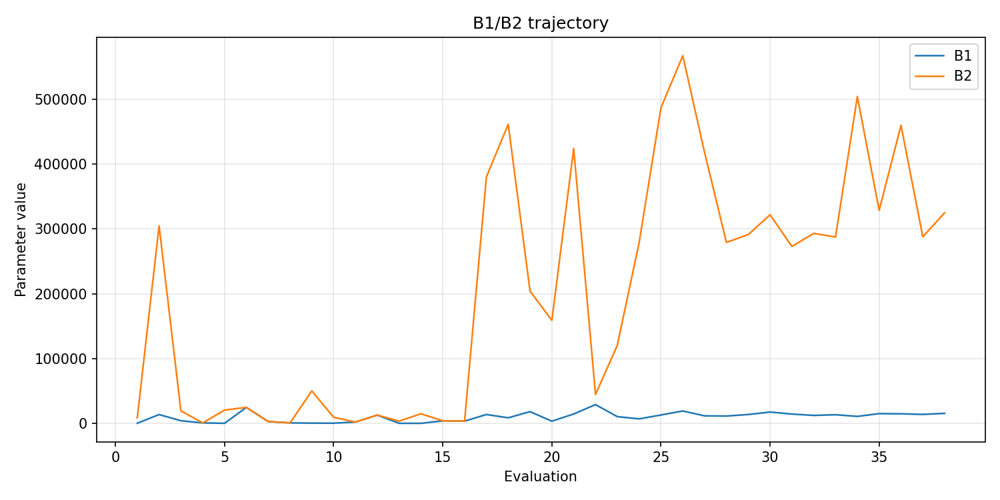
- [`bo_optimize_20260504T131751Z_job6996709_b1_ratio_heatmap.png`](plots/bo_optimize_20260504T131751Z_job6996709_b1_ratio_heatmap.png)
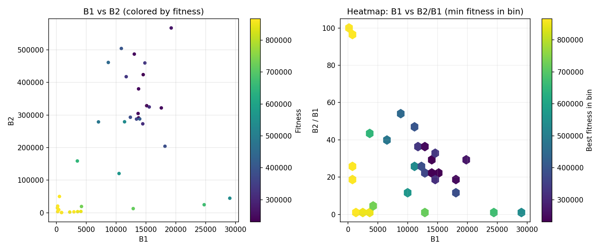
- [`bo_optimize_20260504T131751Z_job6996709_jump_plot.png`](plots/bo_optimize_20260504T131751Z_job6996709_jump_plot.png)
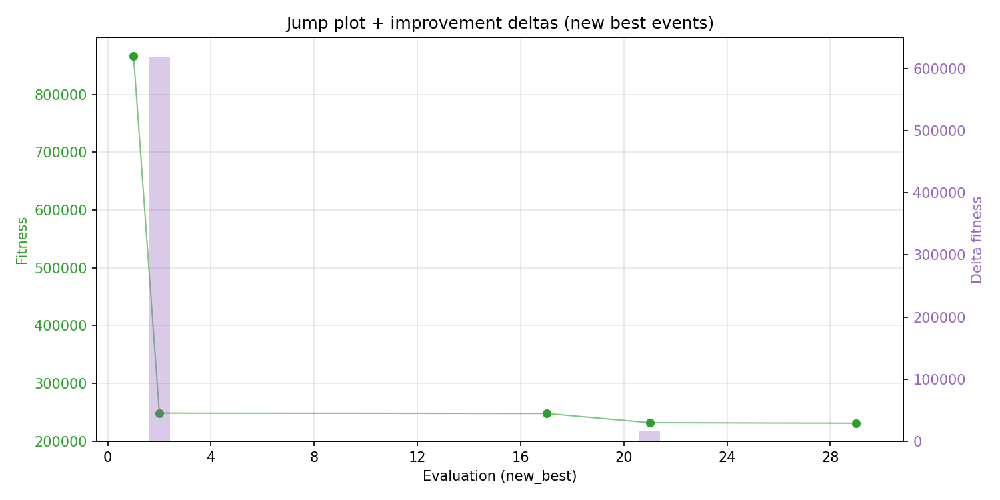
- [`bo_optimize_20260504T131751Z_job6996709_progress_by_phase.png`](plots/bo_optimize_20260504T131751Z_job6996709_progress_by_phase.png)
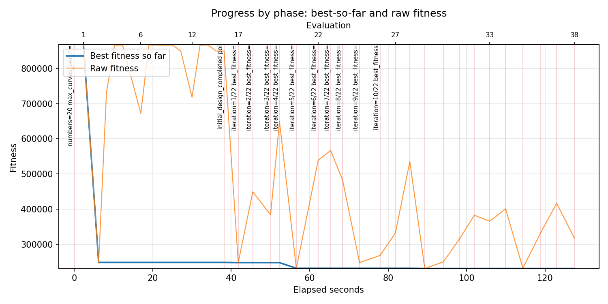
- [`bo_optimize_20260504T131751Z_job6996709_time_efficiency.png`](plots/bo_optimize_20260504T131751Z_job6996709_time_efficiency.png)
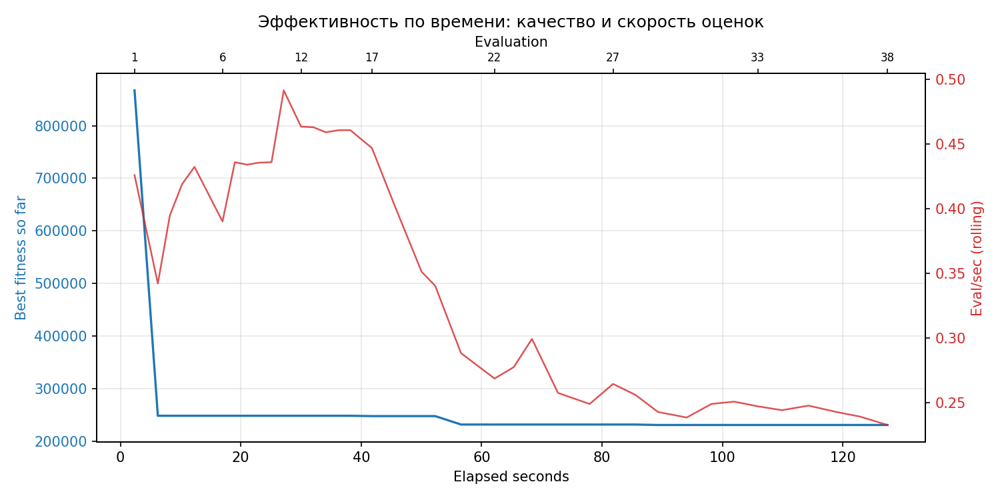

## Таблицы

## Validation runs

### Validation run `20260504T132017Z`
- validation file: [`bo_validate_20260504T132017Z_job6996710.json`](bo_validate_20260504T132017Z_job6996710.json)
- dataset: `data/numbers/20_dset_20260504T131739Z_job6996702/control.json`
- method: `bo`
- optimized params: `(B1, B2)=(13766, 291165)`
- baseline params: `(B1, B2)=(11000, 220000)`
- max_curves_per_n: `150`
- repeats_per_n: `5`
- curve_timeout_sec: `None`
- workers: `56`
- seed: `42`
- optimized_mean_score: `328214.5503581664`
- baseline_mean_score: `400266.56605980726`
- relative_improvement_pct: `18.001007781118282`
- optimized_mean_time_sec: `1.3344550358166454`
- baseline_mean_time_sec: `1.1965566059807315`
- time_improvement_pct: `-11.52460561804248`
- optimized_mean_curves: `98.7`
- baseline_mean_curves: `108.00999999999999`
- curves_improvement_pct: `8.6195722618276`
- optimized_mean_success_rate: `0.56`
- baseline_mean_success_rate: `0.48`
- success_rate_delta_pp: `8.000000000000007`
- trace plots:
  - curves_distribution_plot: [`bo_validate_20260504T132017Z_job6996710_curves_distribution.png`](plots/bo_validate_20260504T132017Z_job6996710_curves_distribution.png)
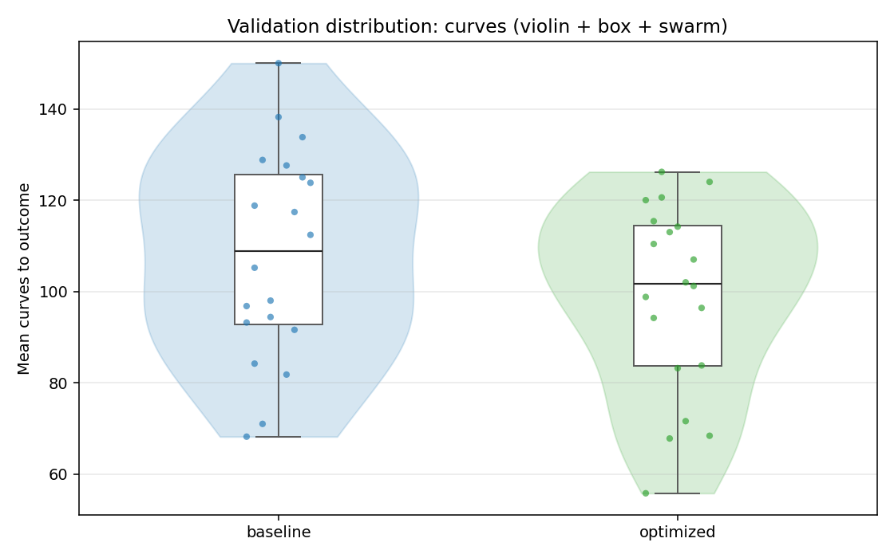
  - curves_trace_plot: [`bo_validate_20260504T132017Z_job6996710_curves_trace.png`](plots/bo_validate_20260504T132017Z_job6996710_curves_trace.png)
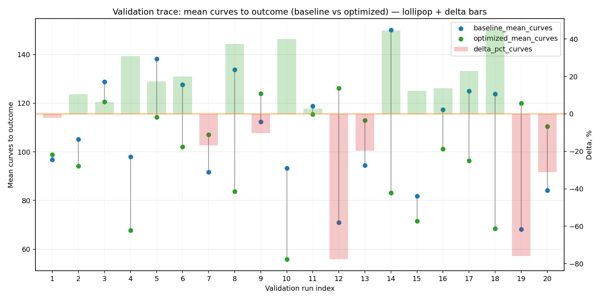
  - score_distribution_plot: [`bo_validate_20260504T132017Z_job6996710_score_distribution.png`](plots/bo_validate_20260504T132017Z_job6996710_score_distribution.png)
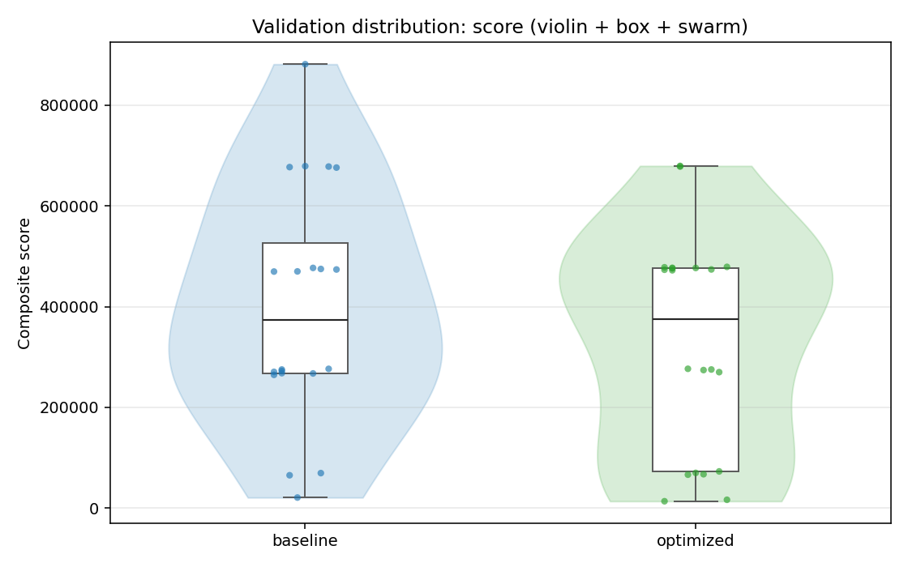
  - score_trace_plot: [`bo_validate_20260504T132017Z_job6996710_score_trace.png`](plots/bo_validate_20260504T132017Z_job6996710_score_trace.png)
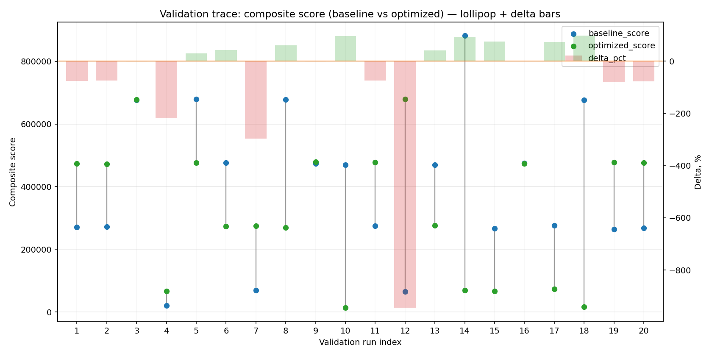
  - time_distribution_plot: [`bo_validate_20260504T132017Z_job6996710_time_distribution.png`](plots/bo_validate_20260504T132017Z_job6996710_time_distribution.png)
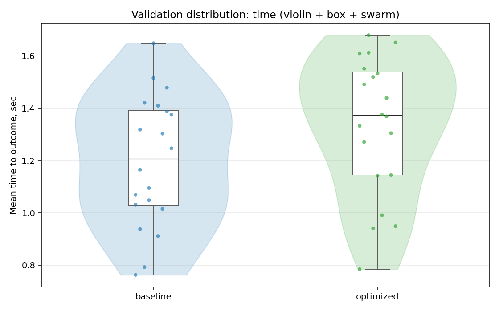
  - time_trace_plot: [`bo_validate_20260504T132017Z_job6996710_time_trace.png`](plots/bo_validate_20260504T132017Z_job6996710_time_trace.png)
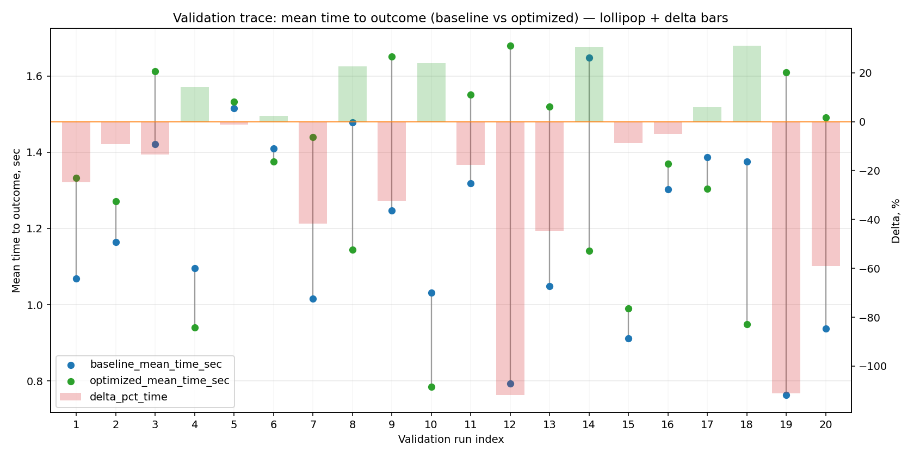

---
