# Отчёт по оптимизации: de_optimize_20260504T131753Z_job6996703

## Метаданные
- метод: `de`
- датасет: `data/numbers/20_dset_20260504T131739Z_job6996702/train.json`
- оптимум `(B1, B2)`: `(27347, 407678)`
- objective: `15734.194379945595`
- max_curves_per_n: `100`
- repeats_per_n: `3`
- границы: `B1[100.0, 30000.0]`, `B2[100.0, 600000.0]`, `ratio_max=100.0`

## Ключевые статистики
- `best_eval`: `202`
- `best_eval_fraction`: `0.9181818181818182`
- `eval_per_sec`: `0.2786281169327286`
- `evaluation_count`: `220`
- `improvement_percent`: `96.51424209871357`
- `max_plateau_evals`: `34`
- `median_plateau_evals`: `18.0`
- `new_best_count`: `10`
- `new_best_rate`: `0.045454545454545456`
- `p90_plateau_evals`: `33.0`
- `time_to_best_sec`: `693.0109474250348`
- `time_to_first_improvement_sec`: `4.598526104004122`
- `total_runtime_sec`: `789.5833934930852`

## Флаги внимания

| Флаг | Статус | Текущее значение | Порог | Что это значит | Что делать |
|---|---|---:|---:|---|---|
| `b1_hits_boundary` | ⚠️ ВНИМАНИЕ | `0.10909090909090909` | `> 0.10` | Большая доля оценок проходит близко к границам B1. | Расширить диапазон B1, если упор в границу повторяется. |
| `b2_hits_boundary` | ✅ ОК | `0.031818181818181815` | `> 0.10` | Большая доля оценок проходит близко к границам B2. | Расширить диапазон B2, если упор в границу повторяется. |
| `best_b1_on_boundary` | ⚠️ ВНИМАНИЕ | `27347.0` | `within 2% of log-range [100.0, 30000.0]` | Лучший найденный B1 лежит на границе диапазона. | Проверить расширенный диапазон B1 вокруг текущей границы. |
| `best_b2_on_boundary` | ✅ ОК | `407678.0` | `within 2% of log-range [100.0, 600000.0]` | Лучший найденный B2 лежит на границе диапазона. | Проверить расширенный диапазон B2 вокруг текущей границы. |
| `best_ratio_on_boundary` | ✅ ОК | `14.907594982996306` | `within 2% of log-range up to ratio_max=100.0` | Лучшее отношение B2/B1 находится у верхней границы ratio_max. | Увеличить ratio_max и перепроверить локальный поиск в новой области. |
| `late_best` | ⚠️ ВНИМАНИЕ | `0.8776918982036619` | `> 0.85` | Лучшее решение найдено слишком поздно относительно общего времени. | Усилить ранний поиск или пересмотреть бюджет/инициализацию. |
| `low_improvement` | ✅ ОК | `96.51424209871357` | `< 10%` | Итоговый прирост качества слишком мал. | Сузить границы поиска или изменить параметры метода. |
| `low_signal` | ✅ ОК | `0.045454545454545456` | `< 0.03` | Слишком низкая плотность новых best-событий (слабый сигнал оптимизации). | Перенастроить exploration и сделать переоценку top-k кандидатов. |
| `plateau_too_long` | ✅ ОК | `0.15454545454545454` | `> 0.50` | Слишком длинное плато: улучшений почти нет на большом участке запуска. | Увеличить exploration или добавить политику рестартов. |
| `ratio_hits_boundary` | ⚠️ ВНИМАНИЕ | `0.34545454545454546` | `> 0.10` | Большая доля оценок проходит близко к границе отношения B2/B1. | Увеличить ratio_max, если хорошие точки упираются в ограничение отношения B2/B1. |

## Графики
- [`de_optimize_20260504T131753Z_job6996703_b1_b2_trajectory.png`](plots/de_optimize_20260504T131753Z_job6996703_b1_b2_trajectory.png)
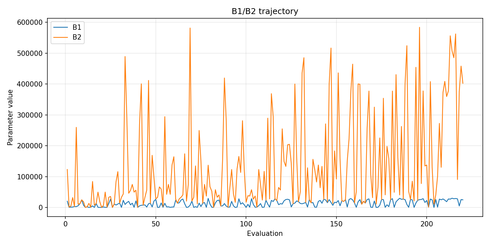
- [`de_optimize_20260504T131753Z_job6996703_b1_ratio_heatmap.png`](plots/de_optimize_20260504T131753Z_job6996703_b1_ratio_heatmap.png)
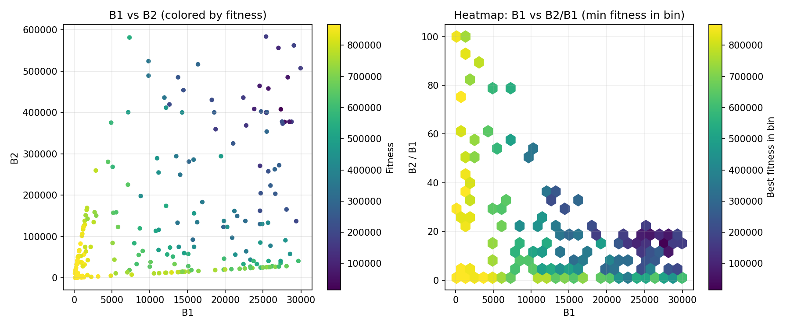
- [`de_optimize_20260504T131753Z_job6996703_jump_plot.png`](plots/de_optimize_20260504T131753Z_job6996703_jump_plot.png)
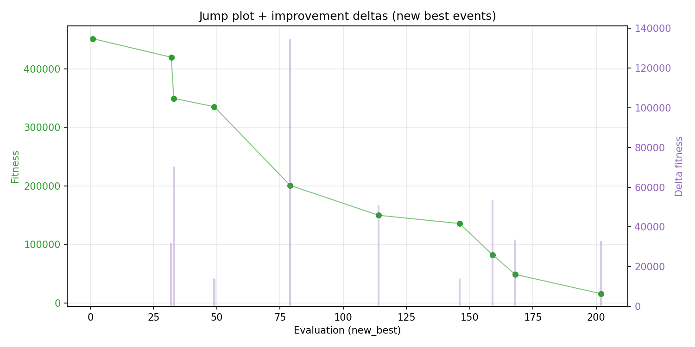
- [`de_optimize_20260504T131753Z_job6996703_progress_by_phase.png`](plots/de_optimize_20260504T131753Z_job6996703_progress_by_phase.png)
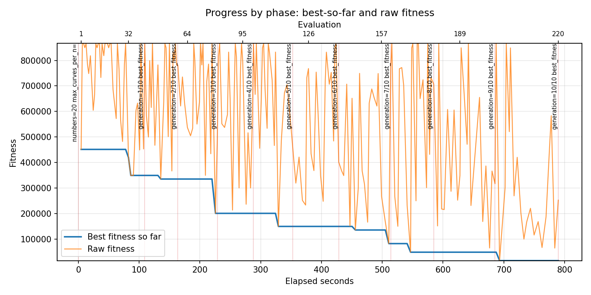
- [`de_optimize_20260504T131753Z_job6996703_time_efficiency.png`](plots/de_optimize_20260504T131753Z_job6996703_time_efficiency.png)
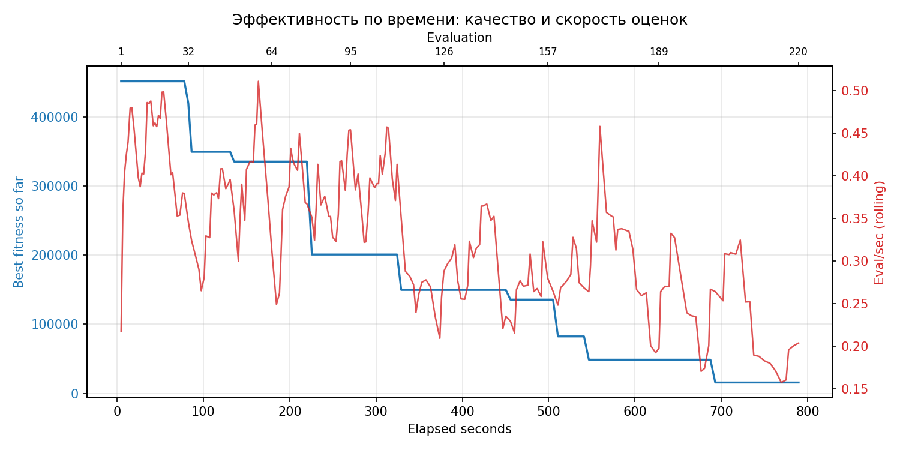

## Таблицы

## Validation runs

### Validation run `20260504T133119Z`
- validation file: [`de_validate_20260504T133119Z_job6996704.json`](de_validate_20260504T133119Z_job6996704.json)
- dataset: `data/numbers/20_dset_20260504T131739Z_job6996702/control.json`
- method: `de`
- optimized params: `(B1, B2)=(27347, 407678)`
- baseline params: `(B1, B2)=(11000, 220000)`
- max_curves_per_n: `150`
- repeats_per_n: `5`
- curve_timeout_sec: `None`
- workers: `56`
- seed: `42`
- optimized_mean_score: `136754.91874451094`
- baseline_mean_score: `380476.83447913866`
- relative_improvement_pct: `64.05696579879184`
- optimized_mean_time_sec: `1.6407918744510972`
- baseline_mean_time_sec: `1.206583447913872`
- time_improvement_pct: `-35.98660559184298`
- optimized_mean_curves: `78.47`
- baseline_mean_curves: `109.10999999999999`
- curves_improvement_pct: `28.08175236000366`
- optimized_mean_success_rate: `0.79`
- baseline_mean_success_rate: `0.5`
- success_rate_delta_pp: `29.000000000000004`
- trace plots:
  - curves_distribution_plot: [`de_validate_20260504T133119Z_job6996704_curves_distribution.png`](plots/de_validate_20260504T133119Z_job6996704_curves_distribution.png)
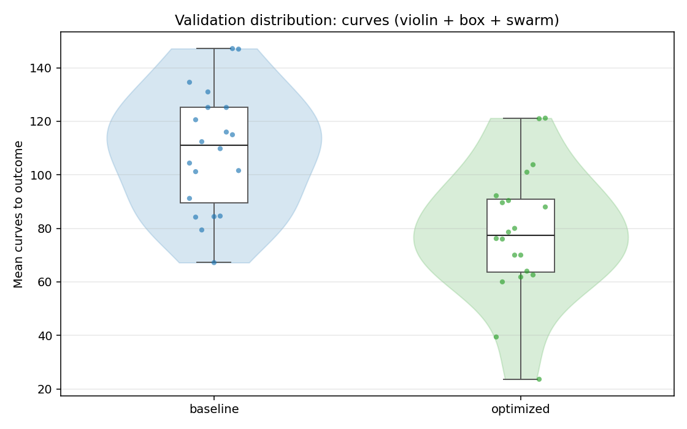
  - curves_trace_plot: [`de_validate_20260504T133119Z_job6996704_curves_trace.png`](plots/de_validate_20260504T133119Z_job6996704_curves_trace.png)
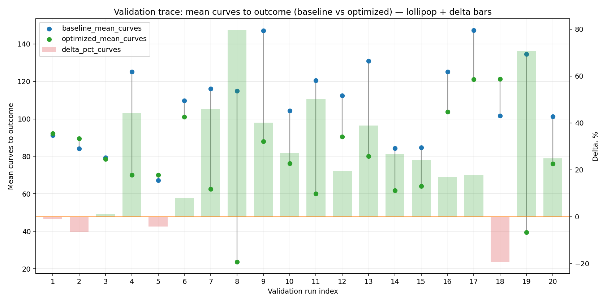
  - score_distribution_plot: [`de_validate_20260504T133119Z_job6996704_score_distribution.png`](plots/de_validate_20260504T133119Z_job6996704_score_distribution.png)
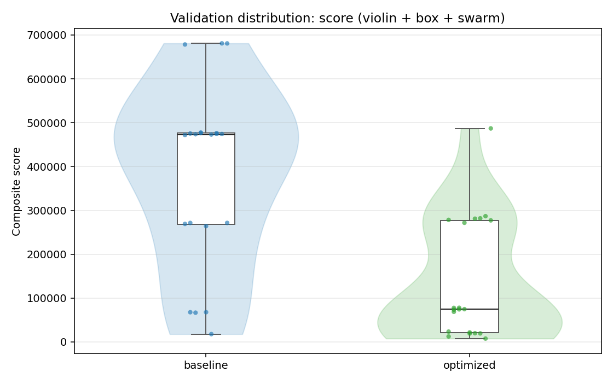
  - score_trace_plot: [`de_validate_20260504T133119Z_job6996704_score_trace.png`](plots/de_validate_20260504T133119Z_job6996704_score_trace.png)
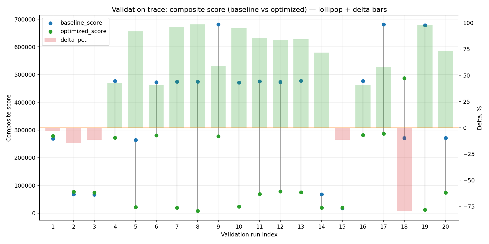
  - time_distribution_plot: [`de_validate_20260504T133119Z_job6996704_time_distribution.png`](plots/de_validate_20260504T133119Z_job6996704_time_distribution.png)
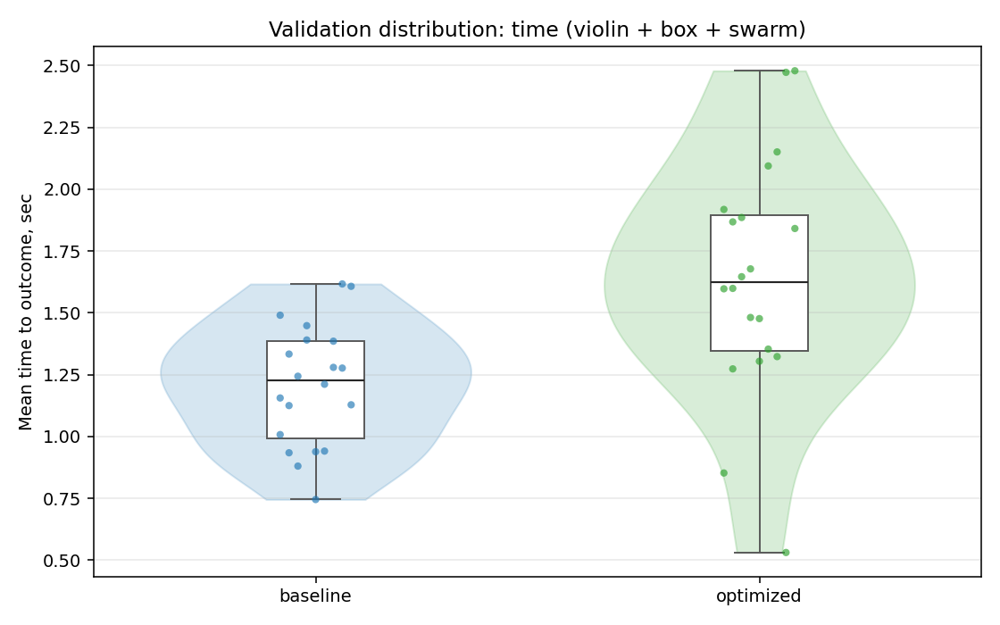
  - time_trace_plot: [`de_validate_20260504T133119Z_job6996704_time_trace.png`](plots/de_validate_20260504T133119Z_job6996704_time_trace.png)
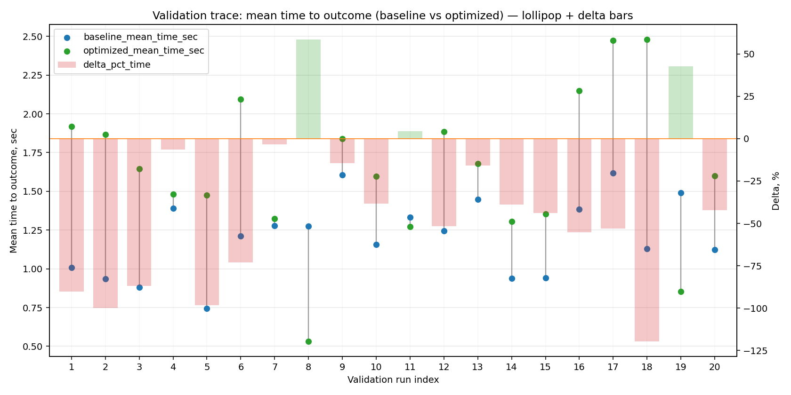

---
