# Отчёт по оптимизации: ga_optimize_20260504T133118Z_job6996711

## Метаданные
- метод: `ga`
- датасет: `data/numbers/20_dset_20260504T131739Z_job6996702/train.json`
- оптимум `(B1, B2)`: `(29649, 399412)`
- objective: `16535.58311749793`
- max_curves_per_n: `100`
- repeats_per_n: `3`
- границы: `B1[100.0, 30000.0]`, `B2[100.0, 600000.0]`, `ratio_max=100.0`

## Ключевые статистики
- `best_eval`: `265`
- `best_eval_fraction`: `0.8386075949367089`
- `eval_per_sec`: `0.1969395529175879`
- `evaluation_count`: `316`
- `improvement_percent`: `98.09296486984896`
- `max_plateau_evals`: `137`
- `median_plateau_evals`: `29.0`
- `new_best_count`: `6`
- `new_best_rate`: `0.0189873417721519`
- `p90_plateau_evals`: `85.40000000000003`
- `time_to_best_sec`: `1297.4414698469918`
- `time_to_first_improvement_sec`: `59.76458371395711`
- `total_runtime_sec`: `1604.553354899981`

## Флаги внимания

| Флаг | Статус | Текущее значение | Порог | Что это значит | Что делать |
|---|---|---:|---:|---|---|
| `b1_hits_boundary` | ⚠️ ВНИМАНИЕ | `0.4272151898734177` | `> 0.10` | Большая доля оценок проходит близко к границам B1. | Расширить диапазон B1, если упор в границу повторяется. |
| `b2_hits_boundary` | ✅ ОК | `0.03164556962025317` | `> 0.10` | Большая доля оценок проходит близко к границам B2. | Расширить диапазон B2, если упор в границу повторяется. |
| `best_b1_on_boundary` | ⚠️ ВНИМАНИЕ | `29649.0` | `within 2% of log-range [100.0, 30000.0]` | Лучший найденный B1 лежит на границе диапазона. | Проверить расширенный диапазон B1 вокруг текущей границы. |
| `best_b2_on_boundary` | ✅ ОК | `399412.0` | `within 2% of log-range [100.0, 600000.0]` | Лучший найденный B2 лежит на границе диапазона. | Проверить расширенный диапазон B2 вокруг текущей границы. |
| `best_ratio_on_boundary` | ✅ ОК | `13.471348106175588` | `within 2% of log-range up to ratio_max=100.0` | Лучшее отношение B2/B1 находится у верхней границы ratio_max. | Увеличить ratio_max и перепроверить локальный поиск в новой области. |
| `late_best` | ✅ ОК | `0.8085997675832145` | `> 0.85` | Лучшее решение найдено слишком поздно относительно общего времени. | Усилить ранний поиск или пересмотреть бюджет/инициализацию. |
| `low_improvement` | ✅ ОК | `98.09296486984896` | `< 10%` | Итоговый прирост качества слишком мал. | Сузить границы поиска или изменить параметры метода. |
| `low_signal` | ⚠️ ВНИМАНИЕ | `0.0189873417721519` | `< 0.03` | Слишком низкая плотность новых best-событий (слабый сигнал оптимизации). | Перенастроить exploration и сделать переоценку top-k кандидатов. |
| `plateau_too_long` | ✅ ОК | `0.43354430379746833` | `> 0.50` | Слишком длинное плато: улучшений почти нет на большом участке запуска. | Увеличить exploration или добавить политику рестартов. |
| `ratio_hits_boundary` | ✅ ОК | `0.05379746835443038` | `> 0.10` | Большая доля оценок проходит близко к границе отношения B2/B1. | Увеличить ratio_max, если хорошие точки упираются в ограничение отношения B2/B1. |

## Графики
- [`ga_optimize_20260504T133118Z_job6996711_b1_b2_trajectory.png`](plots/ga_optimize_20260504T133118Z_job6996711_b1_b2_trajectory.png)
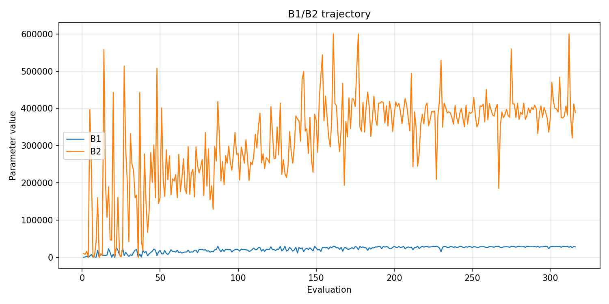
- [`ga_optimize_20260504T133118Z_job6996711_b1_ratio_heatmap.png`](plots/ga_optimize_20260504T133118Z_job6996711_b1_ratio_heatmap.png)
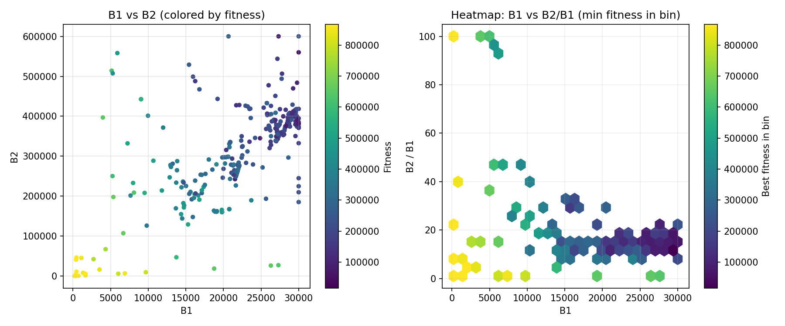
- [`ga_optimize_20260504T133118Z_job6996711_jump_plot.png`](plots/ga_optimize_20260504T133118Z_job6996711_jump_plot.png)
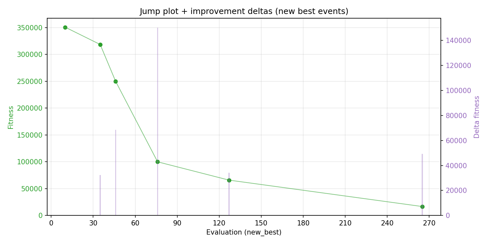
- [`ga_optimize_20260504T133118Z_job6996711_progress_by_phase.png`](plots/ga_optimize_20260504T133118Z_job6996711_progress_by_phase.png)
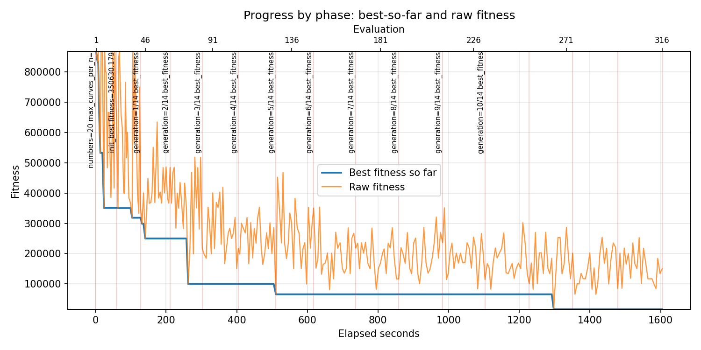
- [`ga_optimize_20260504T133118Z_job6996711_time_efficiency.png`](plots/ga_optimize_20260504T133118Z_job6996711_time_efficiency.png)
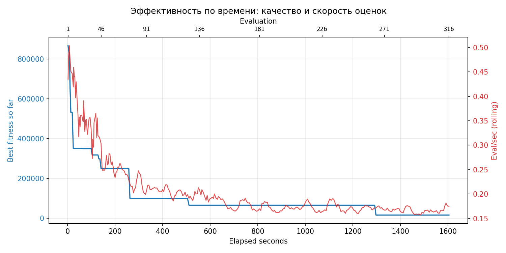

## Таблицы

## Validation runs

### Validation run `20260504T135824Z`
- validation file: [`ga_validate_20260504T135824Z_job6996712.json`](ga_validate_20260504T135824Z_job6996712.json)
- dataset: `data/numbers/20_dset_20260504T131739Z_job6996702/control.json`
- method: `ga`
- optimized params: `(B1, B2)=(29649, 399412)`
- baseline params: `(B1, B2)=(11000, 220000)`
- max_curves_per_n: `150`
- repeats_per_n: `5`
- curve_timeout_sec: `None`
- workers: `56`
- seed: `42`
- optimized_mean_score: `105960.22745541061`
- baseline_mean_score: `287027.4373315863`
- relative_improvement_pct: `63.083589345850285`
- optimized_mean_time_sec: `1.622522745541064`
- baseline_mean_time_sec: `1.1559437331586377`
- time_improvement_pct: `-40.363470902471214`
- optimized_mean_curves: `72.35`
- baseline_mean_curves: `104.67999999999999`
- curves_improvement_pct: `30.88460068781047`
- optimized_mean_success_rate: `0.82`
- baseline_mean_success_rate: `0.6`
- success_rate_delta_pp: `21.999999999999996`
- trace plots:
  - curves_distribution_plot: [`ga_validate_20260504T135824Z_job6996712_curves_distribution.png`](plots/ga_validate_20260504T135824Z_job6996712_curves_distribution.png)
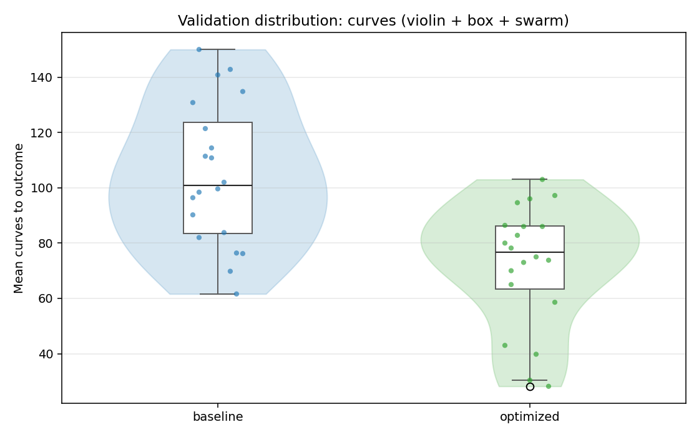
  - curves_trace_plot: [`ga_validate_20260504T135824Z_job6996712_curves_trace.png`](plots/ga_validate_20260504T135824Z_job6996712_curves_trace.png)
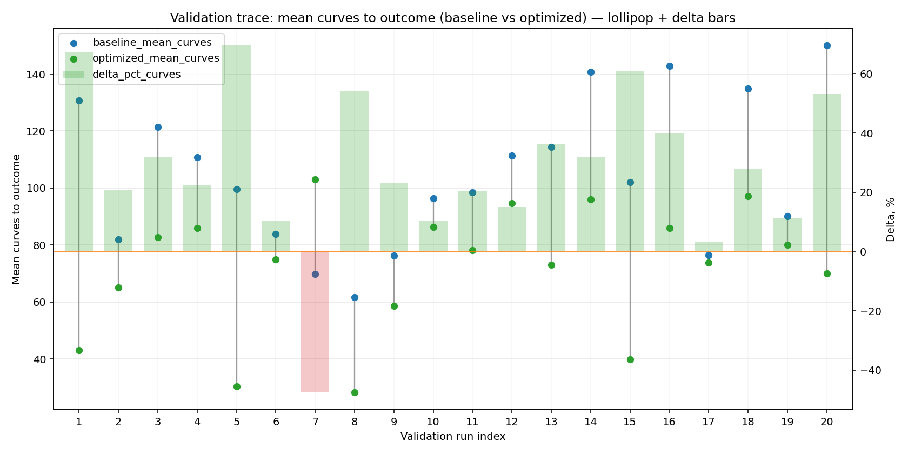
  - score_distribution_plot: [`ga_validate_20260504T135824Z_job6996712_score_distribution.png`](plots/ga_validate_20260504T135824Z_job6996712_score_distribution.png)
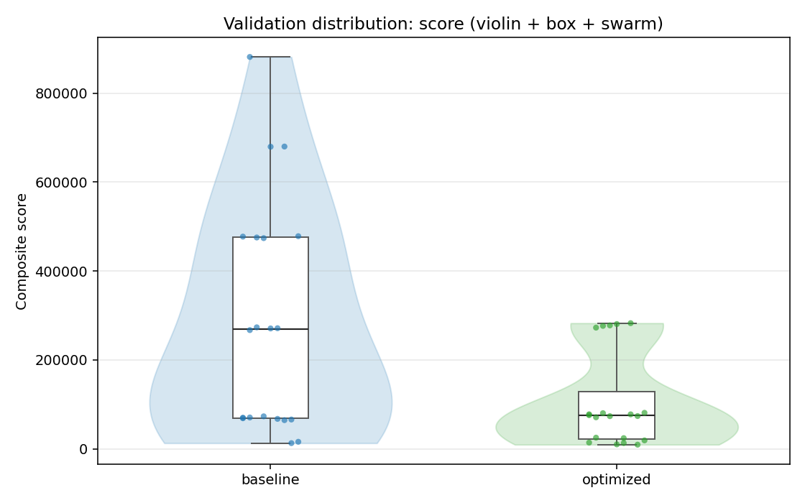
  - score_trace_plot: [`ga_validate_20260504T135824Z_job6996712_score_trace.png`](plots/ga_validate_20260504T135824Z_job6996712_score_trace.png)
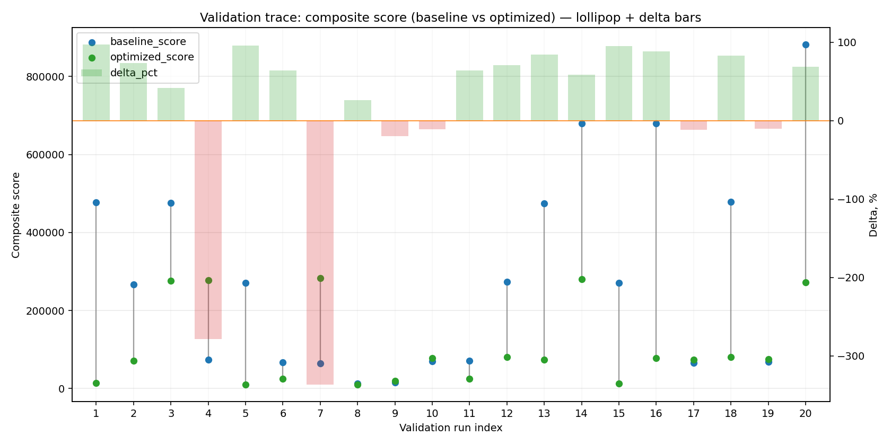
  - time_distribution_plot: [`ga_validate_20260504T135824Z_job6996712_time_distribution.png`](plots/ga_validate_20260504T135824Z_job6996712_time_distribution.png)
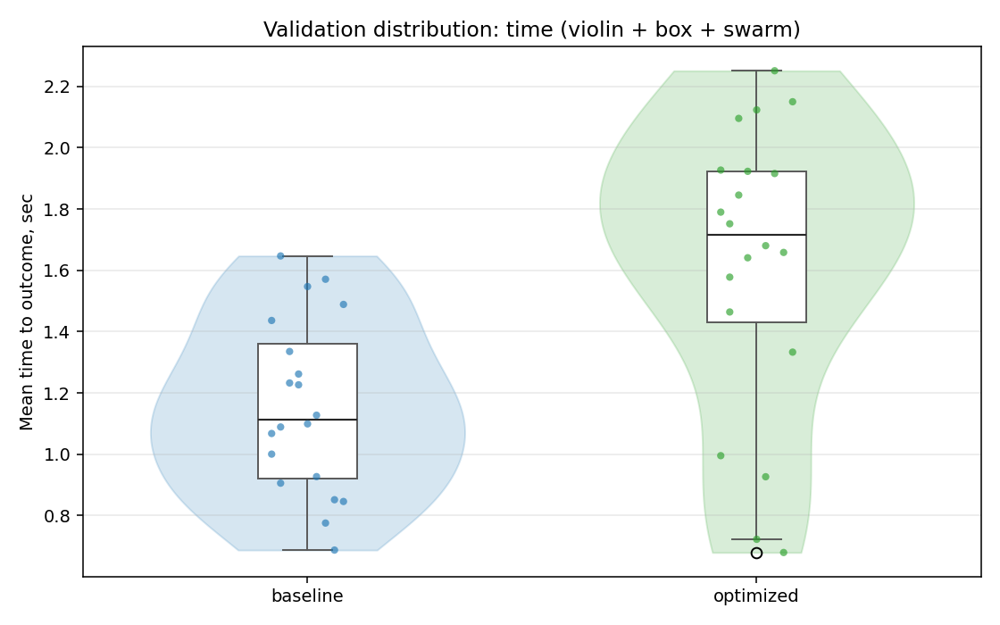
  - time_trace_plot: [`ga_validate_20260504T135824Z_job6996712_time_trace.png`](plots/ga_validate_20260504T135824Z_job6996712_time_trace.png)
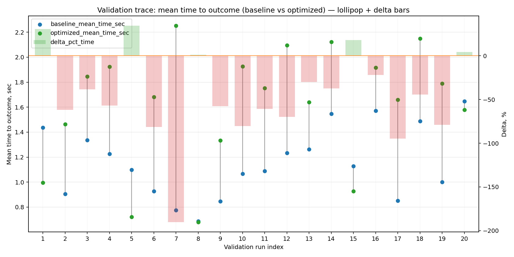

---
