# Отчёт по оптимизации: bo_optimize_20260505T012155Z_job7000547

## Метаданные
- метод: `bo`
- датасет: `data/numbers/20_dset_20260505T012126Z_job7000540/train.json`
- оптимум `(B1, B2)`: `(28945, 525796)`
- objective: `28997.16119754434`
- max_curves_per_n: `130`
- repeats_per_n: `4`
- границы: `B1[100.0, 30000.0]`, `B2[100.0, 600000.0]`, `ratio_max=100.0`

## Ключевые статистики
- `best_eval`: `43`
- `best_eval_fraction`: `0.9772727272727273`
- `eval_per_sec`: `0.11612787697550356`
- `evaluation_count`: `44`
- `improvement_percent`: `85.74660844576763`
- `max_plateau_evals`: `21`
- `median_plateau_evals`: `1.5`
- `new_best_count`: `7`
- `new_best_rate`: `0.1590909090909091`
- `p90_plateau_evals`: `11.199999999999998`
- `time_to_best_sec`: `367.47798735799734`
- `time_to_first_improvement_sec`: `6.973484306014143`
- `total_runtime_sec`: `378.89712742803385`

## Флаги внимания

| Флаг | Статус | Текущее значение | Порог | Что это значит | Что делать |
|---|---|---:|---:|---|---|
| `b1_hits_boundary` | ✅ ОК | `0.06818181818181818` | `> 0.10` | Большая доля оценок проходит близко к границам B1. | Расширить диапазон B1, если упор в границу повторяется. |
| `b2_hits_boundary` | ⚠️ ВНИМАНИЕ | `0.29545454545454547` | `> 0.10` | Большая доля оценок проходит близко к границам B2. | Расширить диапазон B2, если упор в границу повторяется. |
| `best_b1_on_boundary` | ⚠️ ВНИМАНИЕ | `28945.0` | `within 2% of log-range [100.0, 30000.0]` | Лучший найденный B1 лежит на границе диапазона. | Проверить расширенный диапазон B1 вокруг текущей границы. |
| `best_b2_on_boundary` | ⚠️ ВНИМАНИЕ | `525796.0` | `within 2% of log-range [100.0, 600000.0]` | Лучший найденный B2 лежит на границе диапазона. | Проверить расширенный диапазон B2 вокруг текущей границы. |
| `best_ratio_on_boundary` | ✅ ОК | `18.165348073933323` | `within 2% of log-range up to ratio_max=100.0` | Лучшее отношение B2/B1 находится у верхней границы ratio_max. | Увеличить ratio_max и перепроверить локальный поиск в новой области. |
| `late_best` | ⚠️ ВНИМАНИЕ | `0.9698621624620117` | `> 0.85` | Лучшее решение найдено слишком поздно относительно общего времени. | Усилить ранний поиск или пересмотреть бюджет/инициализацию. |
| `low_improvement` | ✅ ОК | `85.74660844576763` | `< 10%` | Итоговый прирост качества слишком мал. | Сузить границы поиска или изменить параметры метода. |
| `low_signal` | ✅ ОК | `0.1590909090909091` | `< 0.03` | Слишком низкая плотность новых best-событий (слабый сигнал оптимизации). | Перенастроить exploration и сделать переоценку top-k кандидатов. |
| `plateau_too_long` | ✅ ОК | `0.4772727272727273` | `> 0.50` | Слишком длинное плато: улучшений почти нет на большом участке запуска. | Увеличить exploration или добавить политику рестартов. |
| `ratio_hits_boundary` | ⚠️ ВНИМАНИЕ | `0.2727272727272727` | `> 0.10` | Большая доля оценок проходит близко к границе отношения B2/B1. | Увеличить ratio_max, если хорошие точки упираются в ограничение отношения B2/B1. |

## Графики
- [`bo_optimize_20260505T012155Z_job7000547_b1_b2_trajectory.png`](plots/bo_optimize_20260505T012155Z_job7000547_b1_b2_trajectory.png)
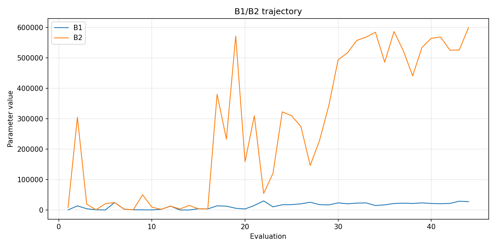
- [`bo_optimize_20260505T012155Z_job7000547_b1_ratio_heatmap.png`](plots/bo_optimize_20260505T012155Z_job7000547_b1_ratio_heatmap.png)
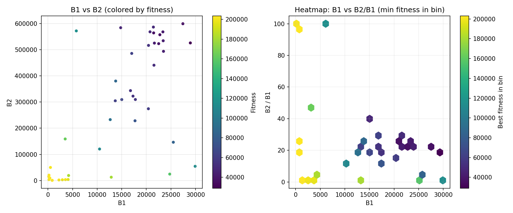
- [`bo_optimize_20260505T012155Z_job7000547_jump_plot.png`](plots/bo_optimize_20260505T012155Z_job7000547_jump_plot.png)
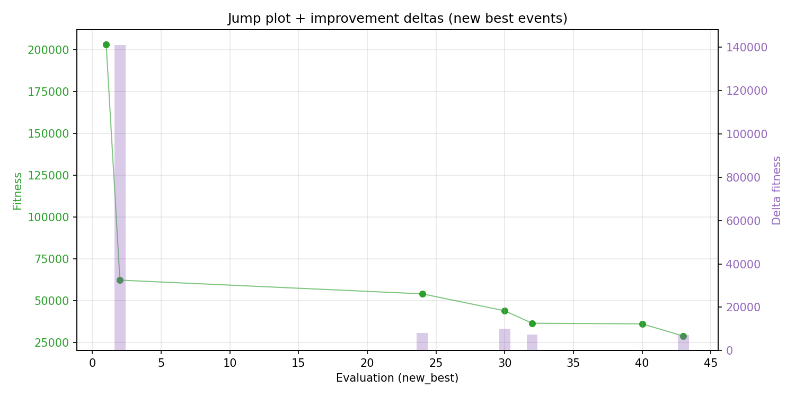
- [`bo_optimize_20260505T012155Z_job7000547_progress_by_phase.png`](plots/bo_optimize_20260505T012155Z_job7000547_progress_by_phase.png)
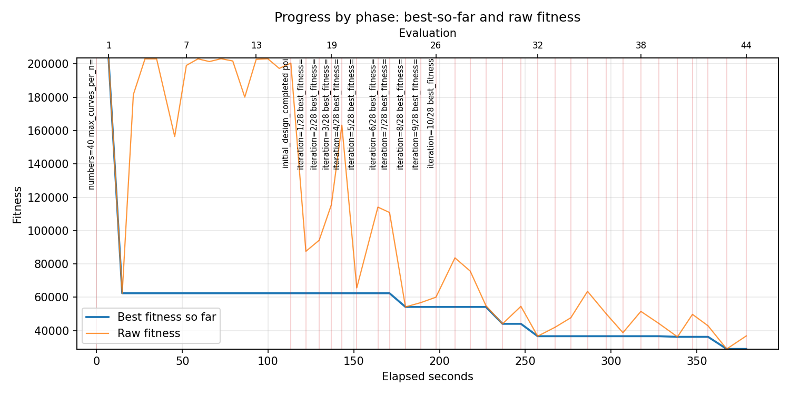
- [`bo_optimize_20260505T012155Z_job7000547_time_efficiency.png`](plots/bo_optimize_20260505T012155Z_job7000547_time_efficiency.png)
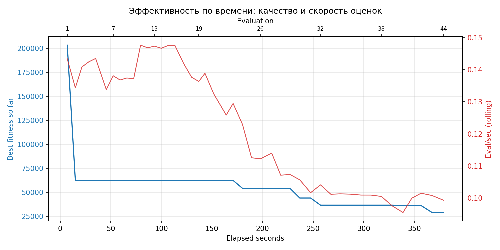

## Таблицы

## Validation runs

### Validation run `20260505T013622Z`
- validation file: [`bo_validate_20260505T013622Z_job7000548.json`](bo_validate_20260505T013622Z_job7000548.json)
- dataset: `data/numbers/20_dset_20260505T012126Z_job7000540/control.json`
- method: `bo`
- optimized params: `(B1, B2)=(28945, 525796)`
- baseline params: `(B1, B2)=(11000, 1900000)`
- max_curves_per_n: `300`
- repeats_per_n: `40`
- curve_timeout_sec: `None`
- workers: `56`
- seed: `42`
- optimized_mean_score: `27508.617649649474`
- baseline_mean_score: `29679.45322389796`
- relative_improvement_pct: `7.314270778076612`
- optimized_mean_time_sec: `2.3571211399649474`
- baseline_mean_time_sec: `2.4138921973897958`
- time_improvement_pct: `2.351847256734843`
- optimized_mean_curves: `78.748125`
- baseline_mean_curves: `90.810625`
- curves_improvement_pct: `13.28313729808599`
- optimized_mean_success_rate: `0.971875`
- baseline_mean_success_rate: `0.959375`
- success_rate_delta_pp: `1.2500000000000067`
- trace plots:
  - score_trace_plot: [`bo_validate_20260505T013622Z_job7000548_score_trace.png`](plots/bo_validate_20260505T013622Z_job7000548_score_trace.png)
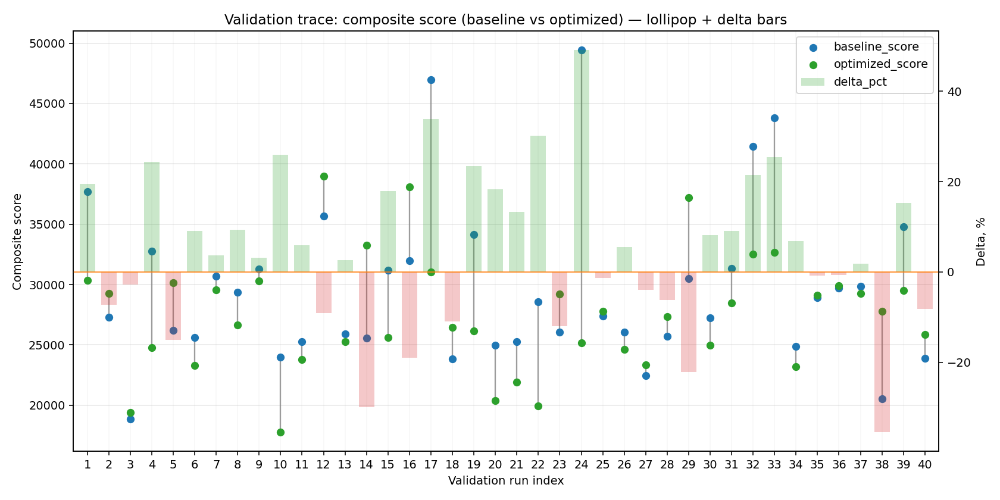
  - score_distribution_plot: [`bo_validate_20260505T013622Z_job7000548_score_distribution.png`](plots/bo_validate_20260505T013622Z_job7000548_score_distribution.png)
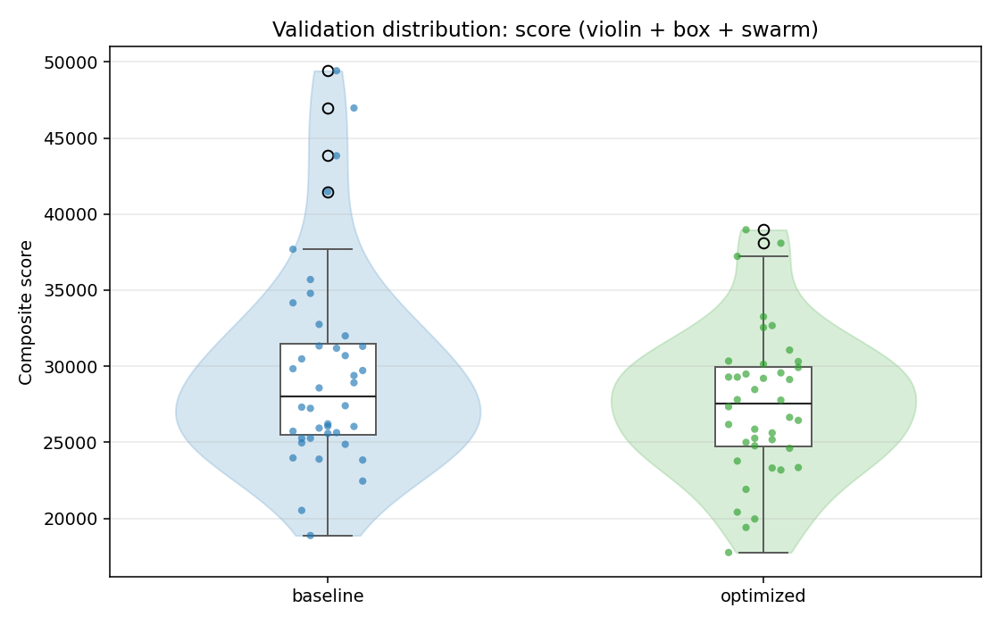
  - success_trace_plot: [`bo_validate_20260505T013622Z_job7000548_success_trace.png`](plots/bo_validate_20260505T013622Z_job7000548_success_trace.png)
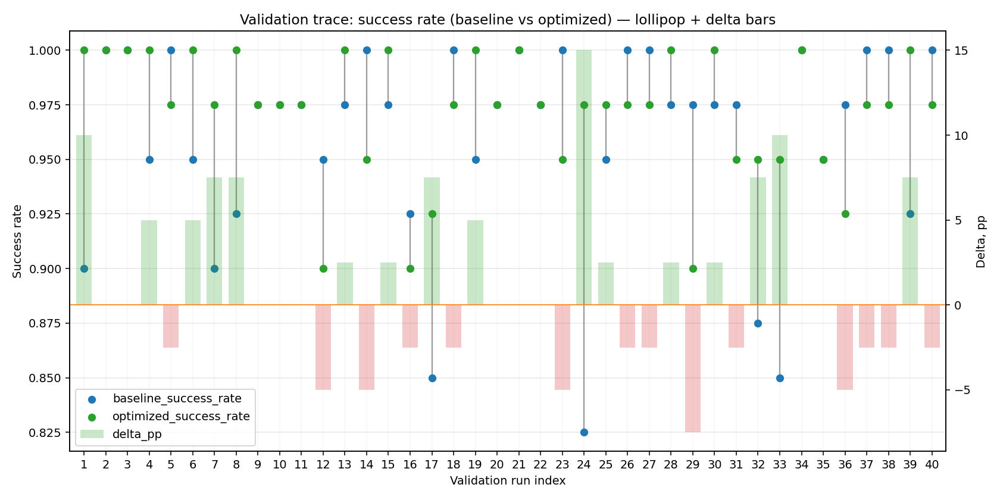
  - success_distribution_plot: [`bo_validate_20260505T013622Z_job7000548_success_distribution.png`](plots/bo_validate_20260505T013622Z_job7000548_success_distribution.png)
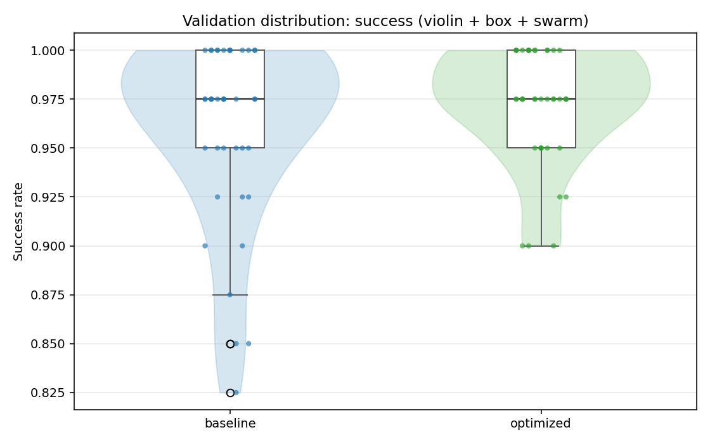
  - time_trace_plot: [`bo_validate_20260505T013622Z_job7000548_time_trace.png`](plots/bo_validate_20260505T013622Z_job7000548_time_trace.png)
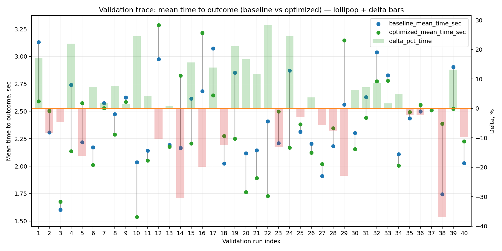
  - time_distribution_plot: [`bo_validate_20260505T013622Z_job7000548_time_distribution.png`](plots/bo_validate_20260505T013622Z_job7000548_time_distribution.png)
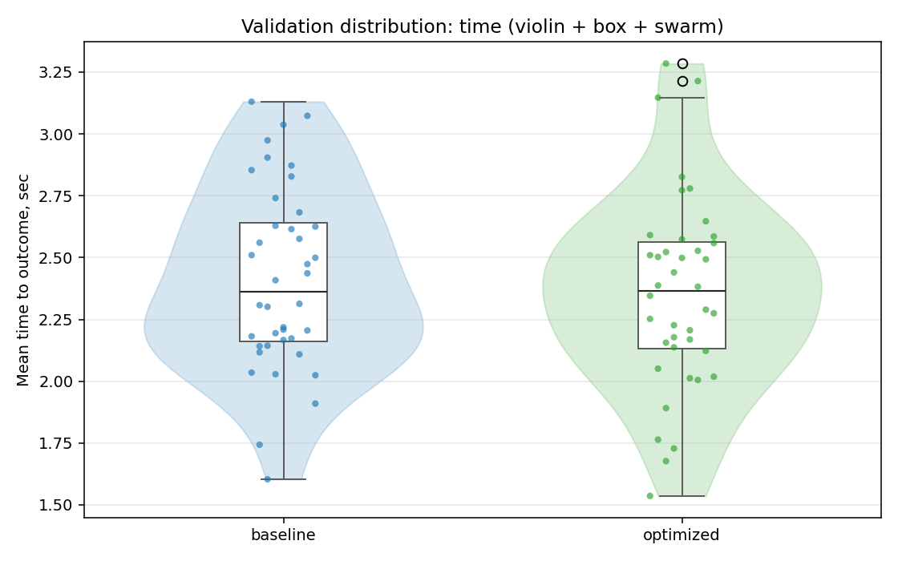
  - curves_trace_plot: [`bo_validate_20260505T013622Z_job7000548_curves_trace.png`](plots/bo_validate_20260505T013622Z_job7000548_curves_trace.png)
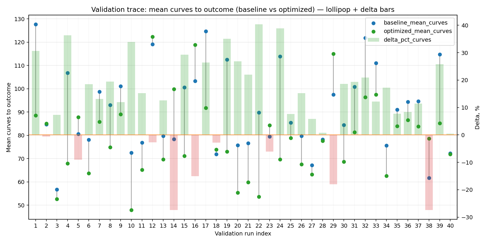
  - curves_distribution_plot: [`bo_validate_20260505T013622Z_job7000548_curves_distribution.png`](plots/bo_validate_20260505T013622Z_job7000548_curves_distribution.png)
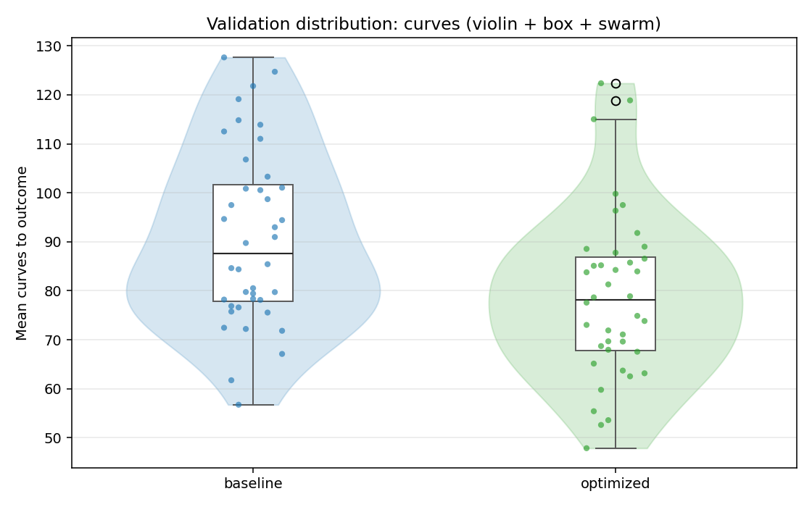

---
