# Отчёт по оптимизации: ga_optimize_20260505T012856Z_job7000549

## Метаданные
- метод: `ga`
- датасет: `data/numbers/20_dset_20260505T012126Z_job7000540/train.json`
- оптимум `(B1, B2)`: `(28090, 479272)`
- objective: `20569.120578234284`
- max_curves_per_n: `130`
- repeats_per_n: `4`
- границы: `B1[100.0, 30000.0]`, `B2[100.0, 600000.0]`, `ratio_max=100.0`

## Ключевые статистики
- `best_eval`: `297`
- `best_eval_fraction`: `0.7425`
- `eval_per_sec`: `0.09546350278390046`
- `evaluation_count`: `400`
- `improvement_percent`: `89.88518247858242`
- `max_plateau_evals`: `103`
- `median_plateau_evals`: `28.5`
- `new_best_count`: `9`
- `new_best_rate`: `0.0225`
- `p90_plateau_evals`: `88.6`
- `time_to_best_sec`: `3004.923039458983`
- `time_to_first_improvement_sec`: `158.1818302620086`
- `total_runtime_sec`: `4190.093187881983`

## Флаги внимания

| Флаг | Статус | Текущее значение | Порог | Что это значит | Что делать |
|---|---|---:|---:|---|---|
| `b1_hits_boundary` | ⚠️ ВНИМАНИЕ | `0.5325` | `> 0.10` | Большая доля оценок проходит близко к границам B1. | Расширить диапазон B1, если упор в границу повторяется. |
| `b2_hits_boundary` | ⚠️ ВНИМАНИЕ | `0.1225` | `> 0.10` | Большая доля оценок проходит близко к границам B2. | Расширить диапазон B2, если упор в границу повторяется. |
| `best_b1_on_boundary` | ⚠️ ВНИМАНИЕ | `28090.0` | `within 2% of log-range [100.0, 30000.0]` | Лучший найденный B1 лежит на границе диапазона. | Проверить расширенный диапазон B1 вокруг текущей границы. |
| `best_b2_on_boundary` | ✅ ОК | `479272.0` | `within 2% of log-range [100.0, 600000.0]` | Лучший найденный B2 лежит на границе диапазона. | Проверить расширенный диапазон B2 вокруг текущей границы. |
| `best_ratio_on_boundary` | ✅ ОК | `17.062014951940192` | `within 2% of log-range up to ratio_max=100.0` | Лучшее отношение B2/B1 находится у верхней границы ratio_max. | Увеличить ratio_max и перепроверить локальный поиск в новой области. |
| `late_best` | ✅ ОК | `0.7171494534177456` | `> 0.85` | Лучшее решение найдено слишком поздно относительно общего времени. | Усилить ранний поиск или пересмотреть бюджет/инициализацию. |
| `low_improvement` | ✅ ОК | `89.88518247858242` | `< 10%` | Итоговый прирост качества слишком мал. | Сузить границы поиска или изменить параметры метода. |
| `low_signal` | ⚠️ ВНИМАНИЕ | `0.0225` | `< 0.03` | Слишком низкая плотность новых best-событий (слабый сигнал оптимизации). | Перенастроить exploration и сделать переоценку top-k кандидатов. |
| `plateau_too_long` | ✅ ОК | `0.2575` | `> 0.50` | Слишком длинное плато: улучшений почти нет на большом участке запуска. | Увеличить exploration или добавить политику рестартов. |
| `ratio_hits_boundary` | ✅ ОК | `0.0375` | `> 0.10` | Большая доля оценок проходит близко к границе отношения B2/B1. | Увеличить ratio_max, если хорошие точки упираются в ограничение отношения B2/B1. |

## Графики
- [`ga_optimize_20260505T012856Z_job7000549_b1_b2_trajectory.png`](plots/ga_optimize_20260505T012856Z_job7000549_b1_b2_trajectory.png)
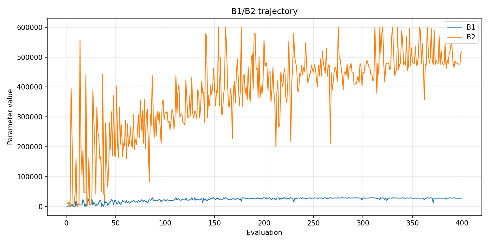
- [`ga_optimize_20260505T012856Z_job7000549_b1_ratio_heatmap.png`](plots/ga_optimize_20260505T012856Z_job7000549_b1_ratio_heatmap.png)
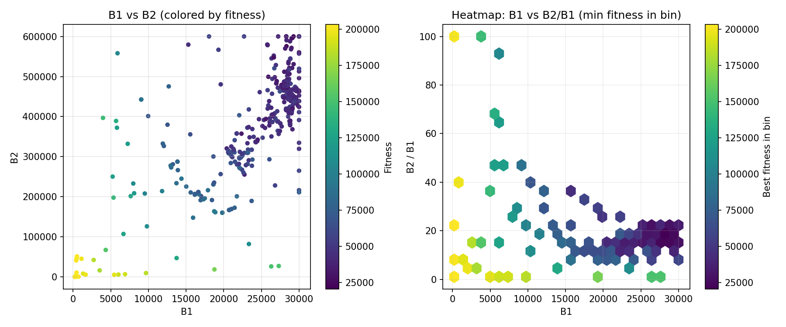
- [`ga_optimize_20260505T012856Z_job7000549_jump_plot.png`](plots/ga_optimize_20260505T012856Z_job7000549_jump_plot.png)
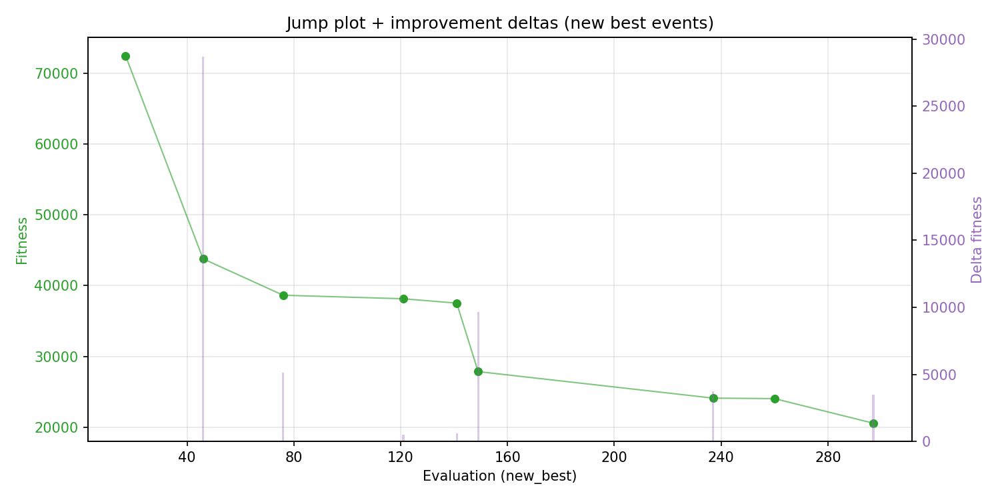
- [`ga_optimize_20260505T012856Z_job7000549_progress_by_phase.png`](plots/ga_optimize_20260505T012856Z_job7000549_progress_by_phase.png)
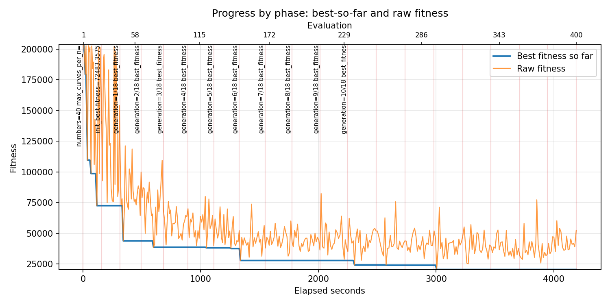
- [`ga_optimize_20260505T012856Z_job7000549_time_efficiency.png`](plots/ga_optimize_20260505T012856Z_job7000549_time_efficiency.png)
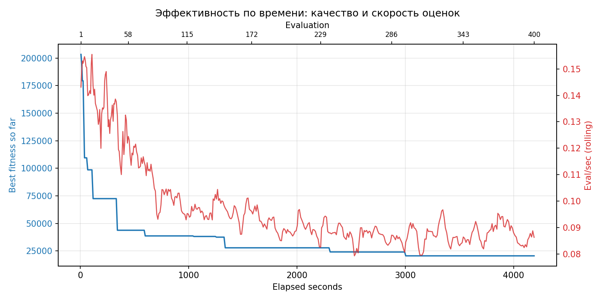

## Таблицы

## Validation runs

### Validation run `20260505T023906Z`
- validation file: [`ga_validate_20260505T023906Z_job7000550.json`](ga_validate_20260505T023906Z_job7000550.json)
- dataset: `data/numbers/20_dset_20260505T012126Z_job7000540/control.json`
- method: `ga`
- optimized params: `(B1, B2)=(28090, 479272)`
- baseline params: `(B1, B2)=(11000, 1900000)`
- max_curves_per_n: `300`
- repeats_per_n: `40`
- curve_timeout_sec: `None`
- workers: `56`
- seed: `42`
- optimized_mean_score: `26382.771390183705`
- baseline_mean_score: `28538.767452717642`
- relative_improvement_pct: `7.554622203309728`
- optimized_mean_time_sec: `2.2535865140183704`
- baseline_mean_time_sec: `2.3349048702717643`
- time_improvement_pct: `3.4827267392666448`
- optimized_mean_curves: `76.938125`
- baseline_mean_curves: `88.794375`
- curves_improvement_pct: `13.352478690232353`
- optimized_mean_success_rate: `0.9824999999999999`
- baseline_mean_success_rate: `0.954375`
- success_rate_delta_pp: `2.8124999999999956`
- trace plots:
  - score_trace_plot: [`ga_validate_20260505T023906Z_job7000550_score_trace.png`](plots/ga_validate_20260505T023906Z_job7000550_score_trace.png)
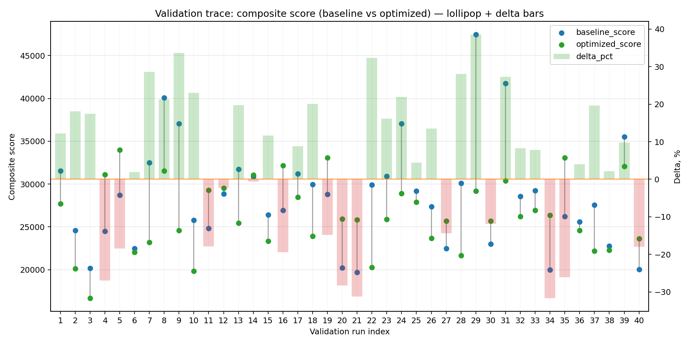
  - score_distribution_plot: [`ga_validate_20260505T023906Z_job7000550_score_distribution.png`](plots/ga_validate_20260505T023906Z_job7000550_score_distribution.png)
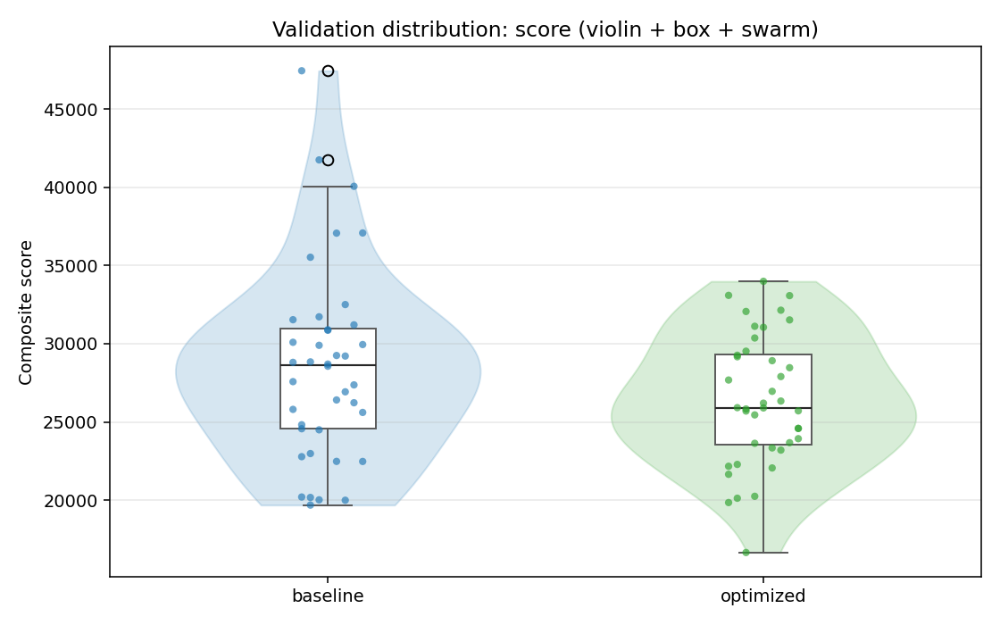
  - success_trace_plot: [`ga_validate_20260505T023906Z_job7000550_success_trace.png`](plots/ga_validate_20260505T023906Z_job7000550_success_trace.png)
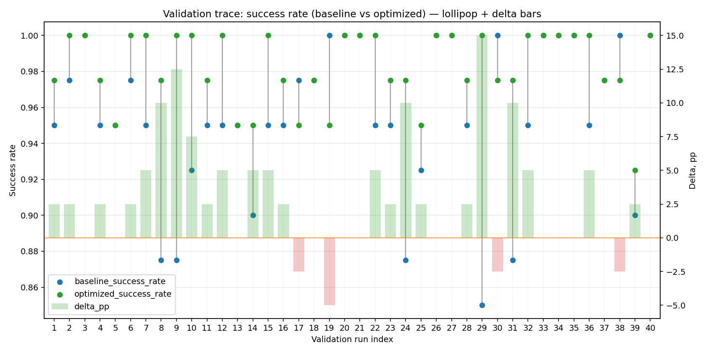
  - success_distribution_plot: [`ga_validate_20260505T023906Z_job7000550_success_distribution.png`](plots/ga_validate_20260505T023906Z_job7000550_success_distribution.png)
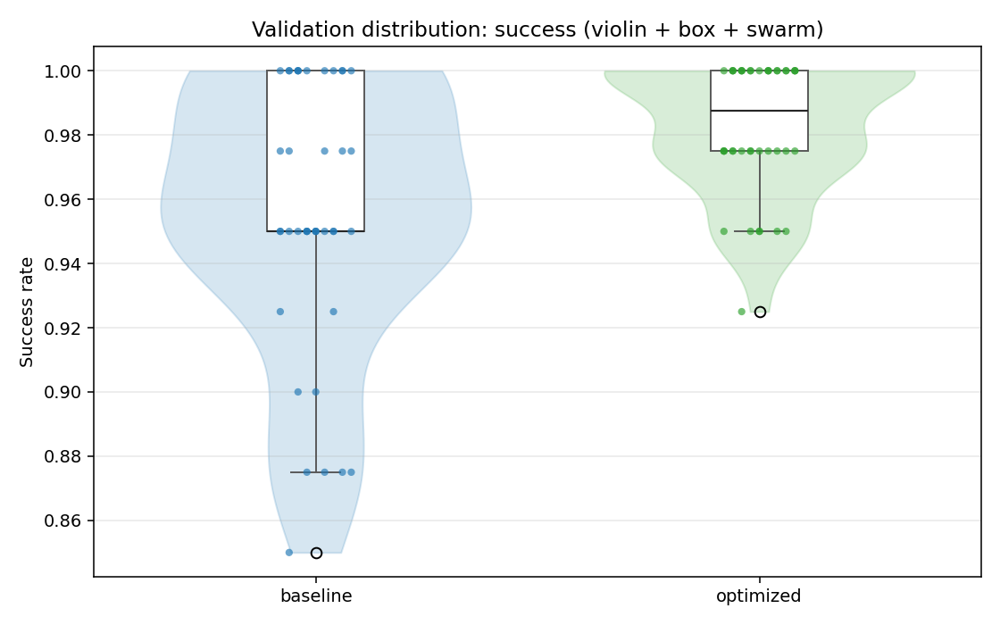
  - time_trace_plot: [`ga_validate_20260505T023906Z_job7000550_time_trace.png`](plots/ga_validate_20260505T023906Z_job7000550_time_trace.png)
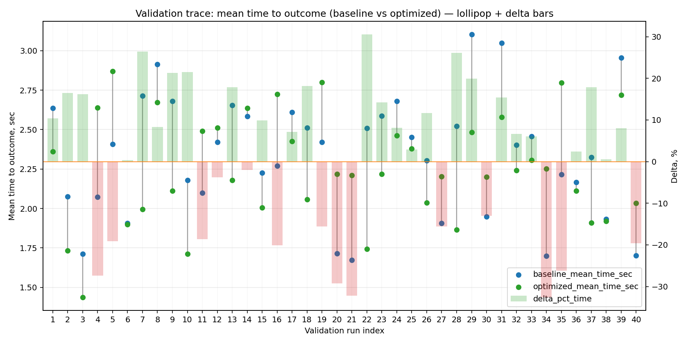
  - time_distribution_plot: [`ga_validate_20260505T023906Z_job7000550_time_distribution.png`](plots/ga_validate_20260505T023906Z_job7000550_time_distribution.png)
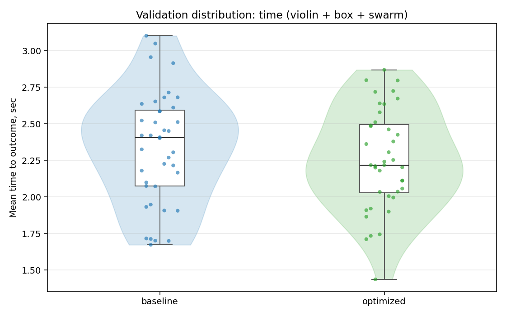
  - curves_trace_plot: [`ga_validate_20260505T023906Z_job7000550_curves_trace.png`](plots/ga_validate_20260505T023906Z_job7000550_curves_trace.png)
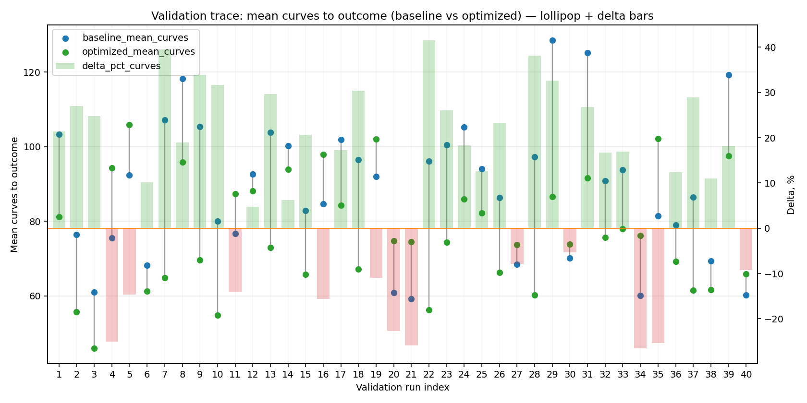
  - curves_distribution_plot: [`ga_validate_20260505T023906Z_job7000550_curves_distribution.png`](plots/ga_validate_20260505T023906Z_job7000550_curves_distribution.png)
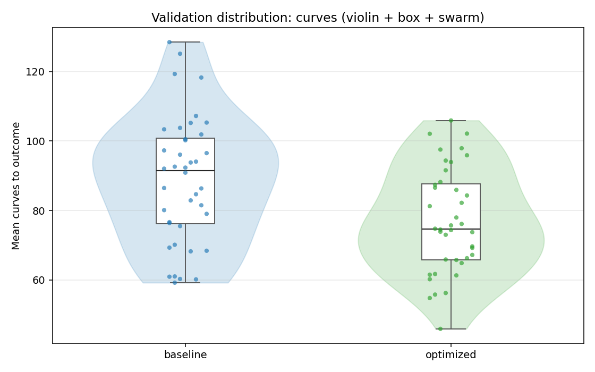

---
