# Отчёт по оптимизации: pso_optimize_20260505T012155Z_job7000545

## Метаданные
- метод: `pso`
- датасет: `data/numbers/20_dset_20260505T012126Z_job7000540/train.json`
- оптимум `(B1, B2)`: `(30000, 600000)`
- objective: `21844.778768193697`
- max_curves_per_n: `130`
- repeats_per_n: `4`
- границы: `B1[100.0, 30000.0]`, `B2[100.0, 600000.0]`, `ratio_max=100.0`

## Ключевые статистики
- `best_eval`: `165`
- `best_eval_fraction`: `0.5392156862745098`
- `eval_per_sec`: `0.08996704027417317`
- `evaluation_count`: `306`
- `improvement_percent`: `89.19612214593931`
- `max_plateau_evals`: `141`
- `median_plateau_evals`: `6.0`
- `new_best_count`: `13`
- `new_best_rate`: `0.042483660130718956`
- `p90_plateau_evals`: `59.40000000000006`
- `time_to_best_sec`: `1776.8039530009992`
- `time_to_first_improvement_sec`: `130.25911866201204`
- `total_runtime_sec`: `3401.2539144559996`

## Флаги внимания

| Флаг | Статус | Текущее значение | Порог | Что это значит | Что делать |
|---|---|---:|---:|---|---|
| `b1_hits_boundary` | ⚠️ ВНИМАНИЕ | `0.8921568627450981` | `> 0.10` | Большая доля оценок проходит близко к границам B1. | Расширить диапазон B1, если упор в границу повторяется. |
| `b2_hits_boundary` | ⚠️ ВНИМАНИЕ | `0.869281045751634` | `> 0.10` | Большая доля оценок проходит близко к границам B2. | Расширить диапазон B2, если упор в границу повторяется. |
| `best_b1_on_boundary` | ⚠️ ВНИМАНИЕ | `30000.0` | `within 2% of log-range [100.0, 30000.0]` | Лучший найденный B1 лежит на границе диапазона. | Проверить расширенный диапазон B1 вокруг текущей границы. |
| `best_b2_on_boundary` | ⚠️ ВНИМАНИЕ | `600000.0` | `within 2% of log-range [100.0, 600000.0]` | Лучший найденный B2 лежит на границе диапазона. | Проверить расширенный диапазон B2 вокруг текущей границы. |
| `best_ratio_on_boundary` | ✅ ОК | `20.0` | `within 2% of log-range up to ratio_max=100.0` | Лучшее отношение B2/B1 находится у верхней границы ratio_max. | Увеличить ratio_max и перепроверить локальный поиск в новой области. |
| `late_best` | ✅ ОК | `0.5223967388759869` | `> 0.85` | Лучшее решение найдено слишком поздно относительно общего времени. | Усилить ранний поиск или пересмотреть бюджет/инициализацию. |
| `low_improvement` | ✅ ОК | `89.19612214593931` | `< 10%` | Итоговый прирост качества слишком мал. | Сузить границы поиска или изменить параметры метода. |
| `low_signal` | ✅ ОК | `0.042483660130718956` | `< 0.03` | Слишком низкая плотность новых best-событий (слабый сигнал оптимизации). | Перенастроить exploration и сделать переоценку top-k кандидатов. |
| `plateau_too_long` | ✅ ОК | `0.46078431372549017` | `> 0.50` | Слишком длинное плато: улучшений почти нет на большом участке запуска. | Увеличить exploration или добавить политику рестартов. |
| `ratio_hits_boundary` | ✅ ОК | `0.05228758169934641` | `> 0.10` | Большая доля оценок проходит близко к границе отношения B2/B1. | Увеличить ratio_max, если хорошие точки упираются в ограничение отношения B2/B1. |

## Графики
- [`pso_optimize_20260505T012155Z_job7000545_b1_b2_trajectory.png`](plots/pso_optimize_20260505T012155Z_job7000545_b1_b2_trajectory.png)
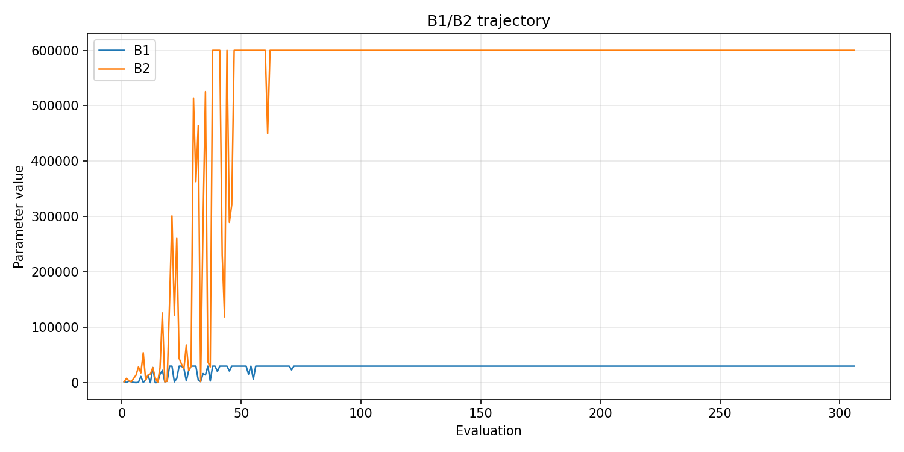
- [`pso_optimize_20260505T012155Z_job7000545_b1_ratio_heatmap.png`](plots/pso_optimize_20260505T012155Z_job7000545_b1_ratio_heatmap.png)
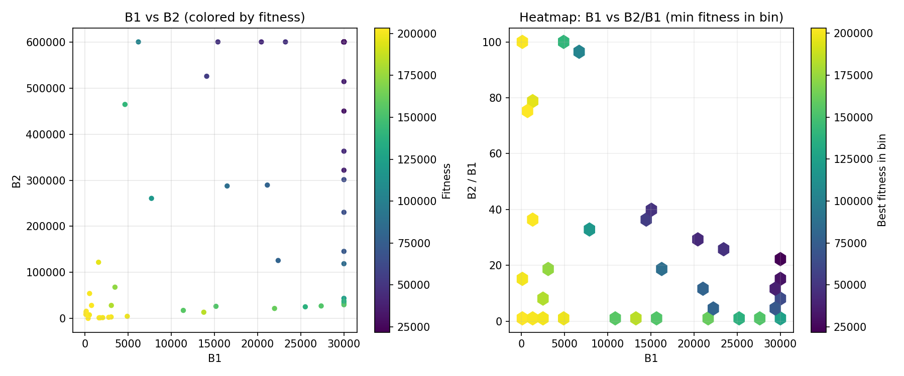
- [`pso_optimize_20260505T012155Z_job7000545_jump_plot.png`](plots/pso_optimize_20260505T012155Z_job7000545_jump_plot.png)
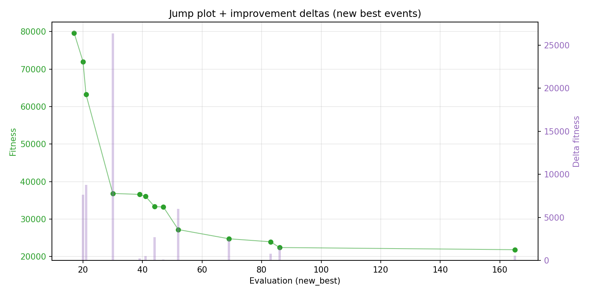
- [`pso_optimize_20260505T012155Z_job7000545_progress_by_phase.png`](plots/pso_optimize_20260505T012155Z_job7000545_progress_by_phase.png)
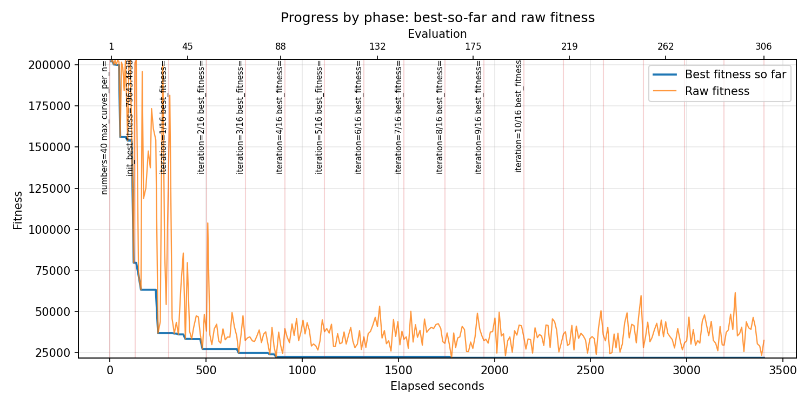
- [`pso_optimize_20260505T012155Z_job7000545_time_efficiency.png`](plots/pso_optimize_20260505T012155Z_job7000545_time_efficiency.png)
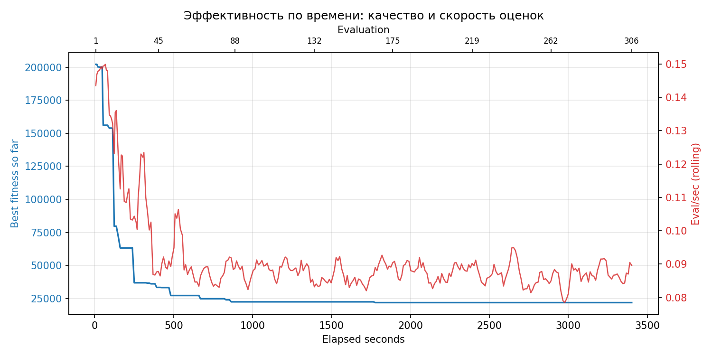

## Таблицы

## Validation runs

### Validation run `20260505T021904Z`
- validation file: [`pso_validate_20260505T021904Z_job7000546.json`](pso_validate_20260505T021904Z_job7000546.json)
- dataset: `data/numbers/20_dset_20260505T012126Z_job7000540/control.json`
- method: `pso`
- optimized params: `(B1, B2)=(30000, 600000)`
- baseline params: `(B1, B2)=(11000, 1900000)`
- max_curves_per_n: `300`
- repeats_per_n: `40`
- curve_timeout_sec: `None`
- workers: `56`
- seed: `42`
- optimized_mean_score: `27496.825925019064`
- baseline_mean_score: `29422.025486709143`
- relative_improvement_pct: `6.543395737862276`
- optimized_mean_time_sec: `2.3635450925019064`
- baseline_mean_time_sec: `2.479793173670914`
- time_improvement_pct: `4.687813580715767`
- optimized_mean_curves: `77.22749999999999`
- baseline_mean_curves: `92.481875`
- curves_improvement_pct: `16.49444823647878`
- optimized_mean_success_rate: `0.975`
- baseline_mean_success_rate: `0.96`
- success_rate_delta_pp: `1.5000000000000013`
- trace plots:
  - score_trace_plot: [`pso_validate_20260505T021904Z_job7000546_score_trace.png`](plots/pso_validate_20260505T021904Z_job7000546_score_trace.png)
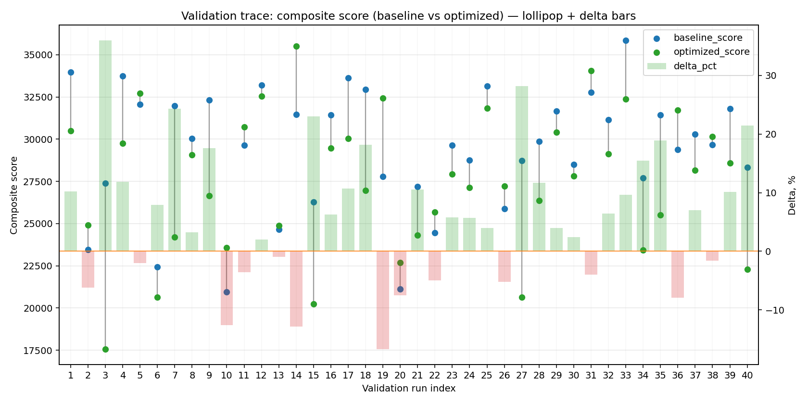
  - score_distribution_plot: [`pso_validate_20260505T021904Z_job7000546_score_distribution.png`](plots/pso_validate_20260505T021904Z_job7000546_score_distribution.png)
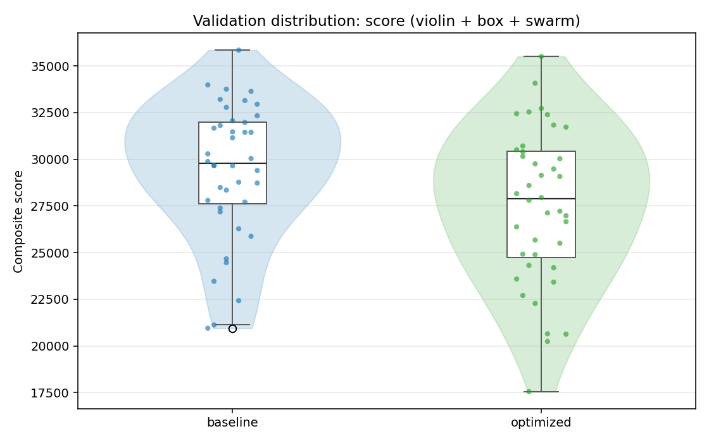
  - success_trace_plot: [`pso_validate_20260505T021904Z_job7000546_success_trace.png`](plots/pso_validate_20260505T021904Z_job7000546_success_trace.png)
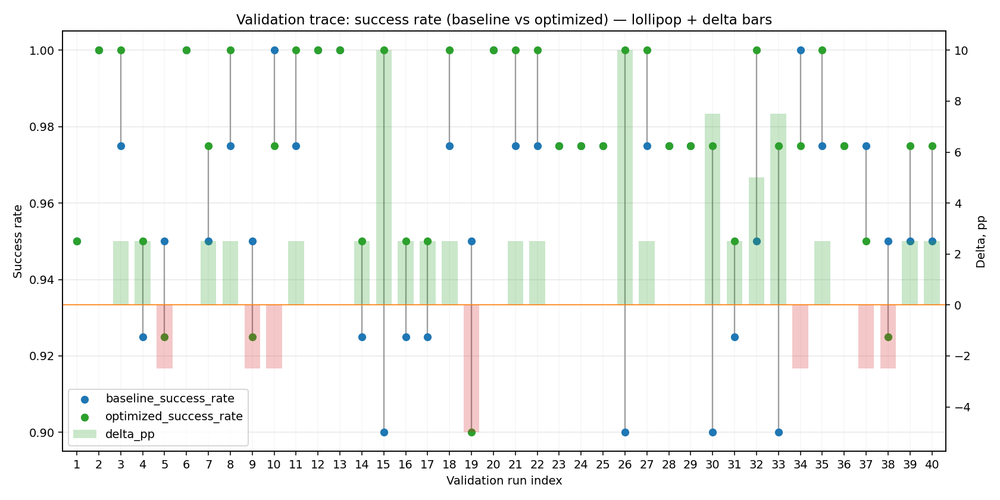
  - success_distribution_plot: [`pso_validate_20260505T021904Z_job7000546_success_distribution.png`](plots/pso_validate_20260505T021904Z_job7000546_success_distribution.png)
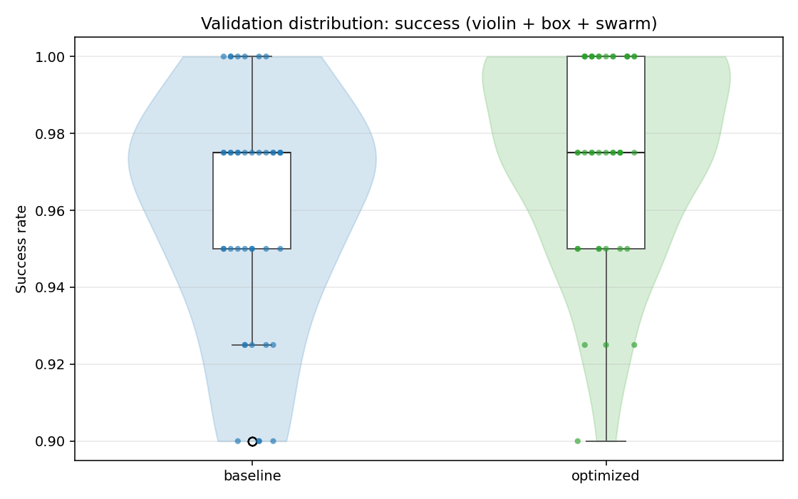
  - time_trace_plot: [`pso_validate_20260505T021904Z_job7000546_time_trace.png`](plots/pso_validate_20260505T021904Z_job7000546_time_trace.png)
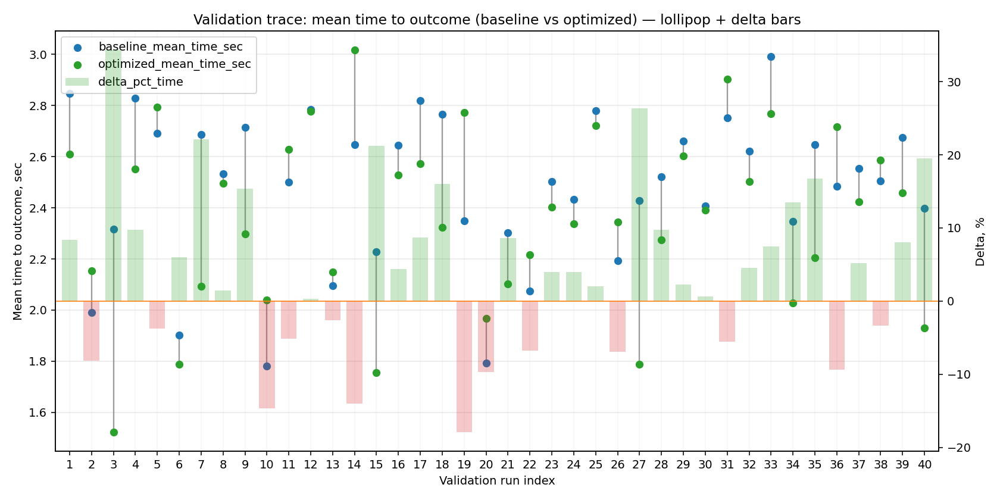
  - time_distribution_plot: [`pso_validate_20260505T021904Z_job7000546_time_distribution.png`](plots/pso_validate_20260505T021904Z_job7000546_time_distribution.png)
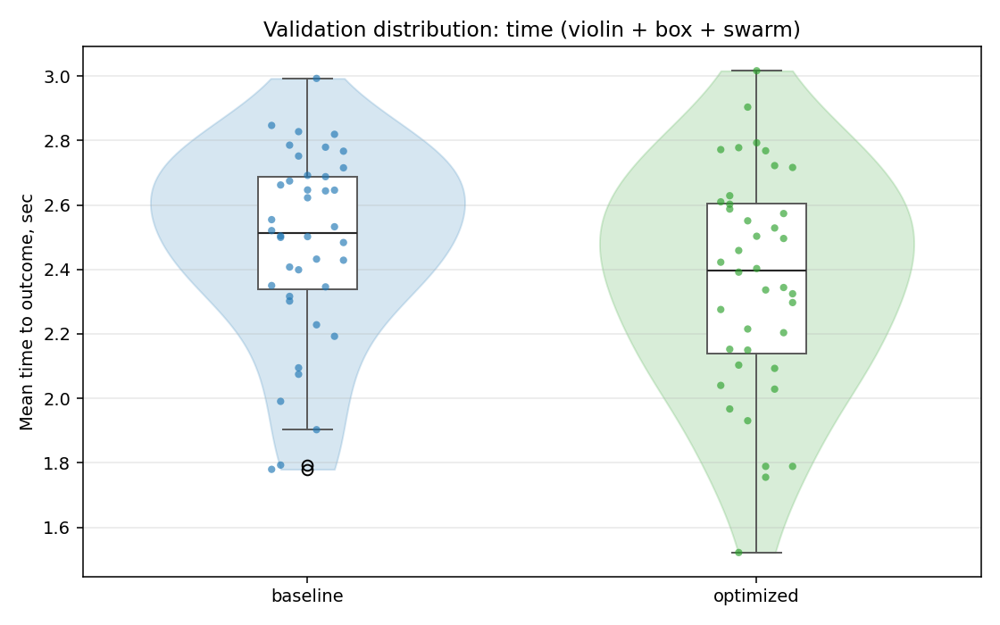
  - curves_trace_plot: [`pso_validate_20260505T021904Z_job7000546_curves_trace.png`](plots/pso_validate_20260505T021904Z_job7000546_curves_trace.png)
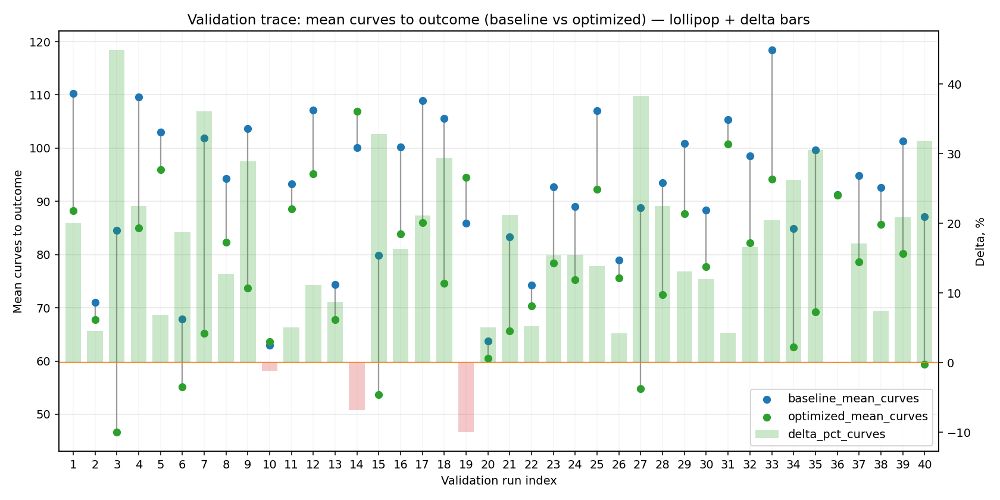
  - curves_distribution_plot: [`pso_validate_20260505T021904Z_job7000546_curves_distribution.png`](plots/pso_validate_20260505T021904Z_job7000546_curves_distribution.png)
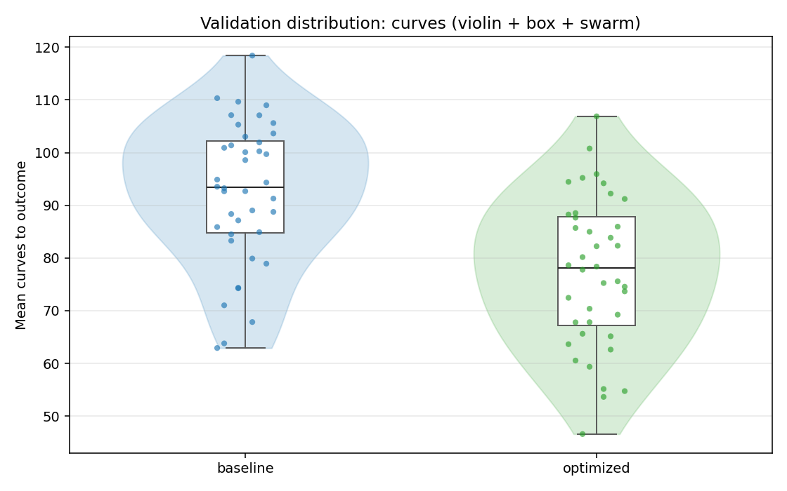

---
