# Отчёт по оптимизации: bo_optimize_20260505T214714Z_job7012261

## Метаданные
- метод: `bo`
- датасет: `data/numbers/20_dset_20260505T214657Z_job7012254/train.json`
- оптимум `(B1, B2)`: `(26729, 2126731)`
- objective: `26367.209333595383`
- max_curves_per_n: `260`
- repeats_per_n: `8`
- границы: `B1[500.0, 50000.0]`, `B2[5000.0, 3000000.0]`, `ratio_max=1000.0`

## Ключевые статистики
- `best_eval`: `63`
- `best_eval_fraction`: `0.875`
- `eval_per_sec`: `0.020588432551113627`
- `evaluation_count`: `72`
- `improvement_percent`: `87.51409260526775`
- `max_plateau_evals`: `36`
- `median_plateau_evals`: `5.0`
- `new_best_count`: `6`
- `new_best_rate`: `0.08333333333333333`
- `p90_plateau_evals`: `22.800000000000008`
- `time_to_best_sec`: `3124.777216112998`
- `time_to_first_improvement_sec`: `52.99116270800005`
- `total_runtime_sec`: `3497.114017107`

## Флаги внимания

| Флаг | Статус | Текущее значение | Порог | Что это значит | Что делать |
|---|---|---:|---:|---|---|
| `b1_hits_boundary` | ✅ ОК | `0.05555555555555555` | `> 0.10` | Большая доля оценок проходит близко к границам B1. | Расширить диапазон B1, если упор в границу повторяется. |
| `b2_hits_boundary` | ✅ ОК | `0.06944444444444445` | `> 0.10` | Большая доля оценок проходит близко к границам B2. | Расширить диапазон B2, если упор в границу повторяется. |
| `best_b1_on_boundary` | ✅ ОК | `26729.0` | `within 2% of log-range [500.0, 50000.0]` | Лучший найденный B1 лежит на границе диапазона. | Проверить расширенный диапазон B1 вокруг текущей границы. |
| `best_b2_on_boundary` | ✅ ОК | `2126731.0` | `within 2% of log-range [5000.0, 3000000.0]` | Лучший найденный B2 лежит на границе диапазона. | Проверить расширенный диапазон B2 вокруг текущей границы. |
| `best_ratio_on_boundary` | ✅ ОК | `79.56642597927345` | `within 2% of log-range up to ratio_max=1000.0` | Лучшее отношение B2/B1 находится у верхней границы ratio_max. | Увеличить ratio_max и перепроверить локальный поиск в новой области. |
| `late_best` | ⚠️ ВНИМАНИЕ | `0.8935302654781558` | `> 0.85` | Лучшее решение найдено слишком поздно относительно общего времени. | Усилить ранний поиск или пересмотреть бюджет/инициализацию. |
| `low_improvement` | ✅ ОК | `87.51409260526775` | `< 10%` | Итоговый прирост качества слишком мал. | Сузить границы поиска или изменить параметры метода. |
| `low_signal` | ✅ ОК | `0.08333333333333333` | `< 0.03` | Слишком низкая плотность новых best-событий (слабый сигнал оптимизации). | Перенастроить exploration и сделать переоценку top-k кандидатов. |
| `plateau_too_long` | ✅ ОК | `0.5` | `> 0.50` | Слишком длинное плато: улучшений почти нет на большом участке запуска. | Увеличить exploration или добавить политику рестартов. |
| `ratio_hits_boundary` | ✅ ОК | `0.041666666666666664` | `> 0.10` | Большая доля оценок проходит близко к границе отношения B2/B1. | Увеличить ratio_max, если хорошие точки упираются в ограничение отношения B2/B1. |

## Графики
- [`bo_optimize_20260505T214714Z_job7012261_b1_b2_trajectory.png`](plots/bo_optimize_20260505T214714Z_job7012261_b1_b2_trajectory.png)
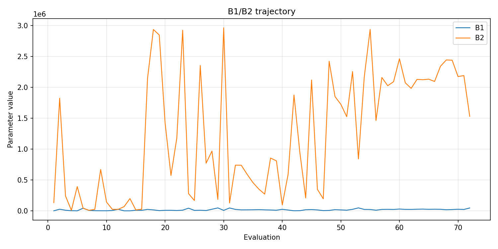
- [`bo_optimize_20260505T214714Z_job7012261_b1_ratio_heatmap.png`](plots/bo_optimize_20260505T214714Z_job7012261_b1_ratio_heatmap.png)
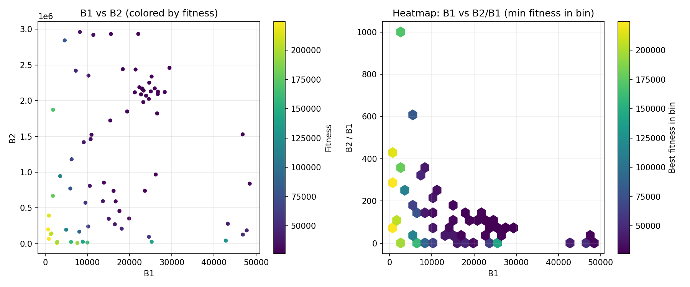
- [`bo_optimize_20260505T214714Z_job7012261_jump_plot.png`](plots/bo_optimize_20260505T214714Z_job7012261_jump_plot.png)
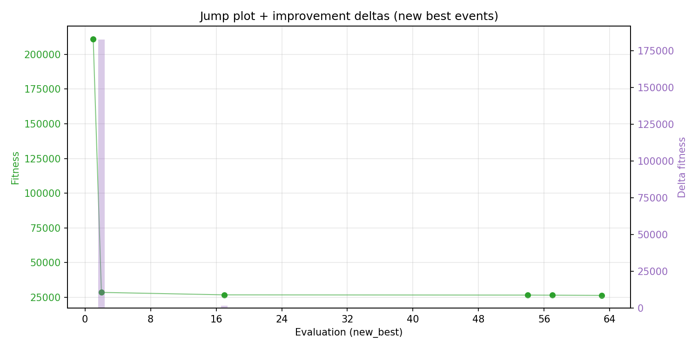
- [`bo_optimize_20260505T214714Z_job7012261_progress_by_phase.png`](plots/bo_optimize_20260505T214714Z_job7012261_progress_by_phase.png)
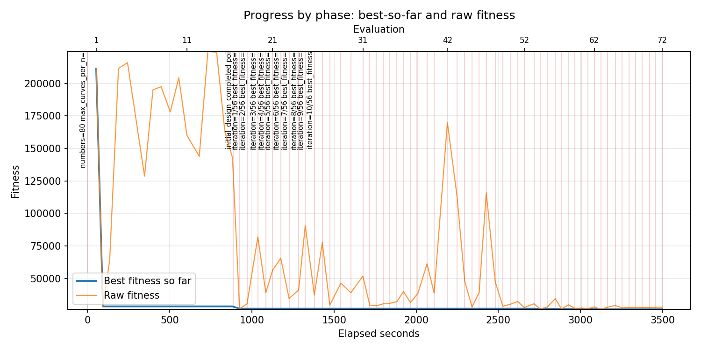
- [`bo_optimize_20260505T214714Z_job7012261_time_efficiency.png`](plots/bo_optimize_20260505T214714Z_job7012261_time_efficiency.png)
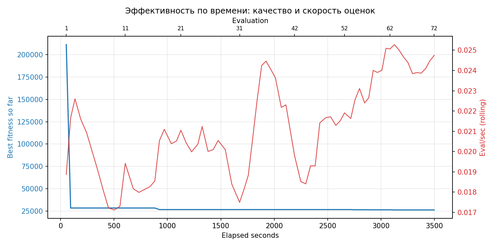

## Таблицы

## Validation runs

### Validation run `20260506T000600Z`
- validation file: [`bo_validate_20260506T000600Z_job7012262.json`](bo_validate_20260506T000600Z_job7012262.json)
- dataset: `data/numbers/20_dset_20260505T214657Z_job7012254/control.json`
- method: `bo`
- optimized params: `(B1, B2)=(26729, 2126731)`
- baseline params: `(B1, B2)=(11000, 1900000)`
- max_curves_per_n: `600`
- repeats_per_n: `80`
- curve_timeout_sec: `None`
- workers: `56`
- seed: `42`
- optimized_mean_score: `27844.51789839323`
- baseline_mean_score: `37325.69181546241`
- relative_improvement_pct: `25.401200770621855`
- optimized_mean_time_sec: `2.514313508589323`
- baseline_mean_time_sec: `3.2435543377962404`
- time_improvement_pct: `22.482769001563373`
- optimized_mean_curves: `54.02765624999999`
- baseline_mean_curves: `97.80296875`
- curves_improvement_pct: `44.758674567330054`
- optimized_mean_success_rate: `1.0`
- baseline_mean_success_rate: `0.9974999999999999`
- success_rate_delta_pp: `0.2500000000000058`
- trace plots:
  - score_trace_plot: [`bo_validate_20260506T000600Z_job7012262_score_trace.png`](plots/bo_validate_20260506T000600Z_job7012262_score_trace.png)
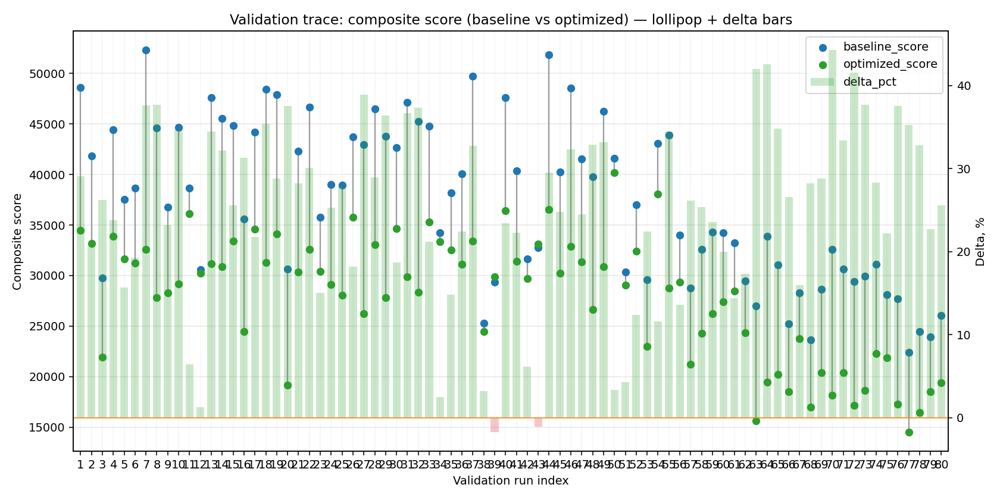
  - score_distribution_plot: [`bo_validate_20260506T000600Z_job7012262_score_distribution.png`](plots/bo_validate_20260506T000600Z_job7012262_score_distribution.png)
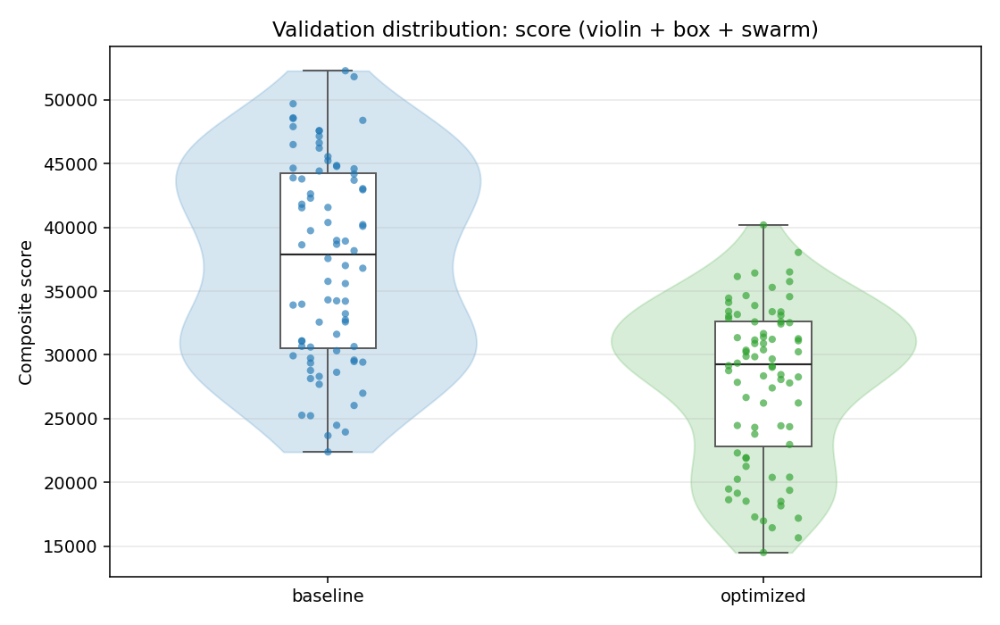
  - success_trace_plot: [`bo_validate_20260506T000600Z_job7012262_success_trace.png`](plots/bo_validate_20260506T000600Z_job7012262_success_trace.png)
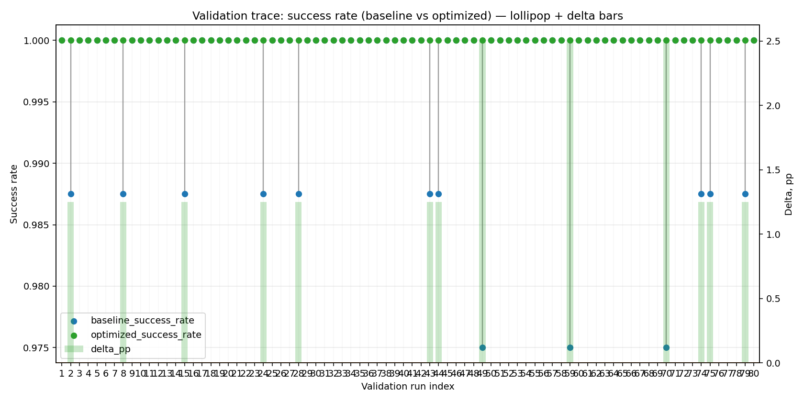
  - success_distribution_plot: [`bo_validate_20260506T000600Z_job7012262_success_distribution.png`](plots/bo_validate_20260506T000600Z_job7012262_success_distribution.png)
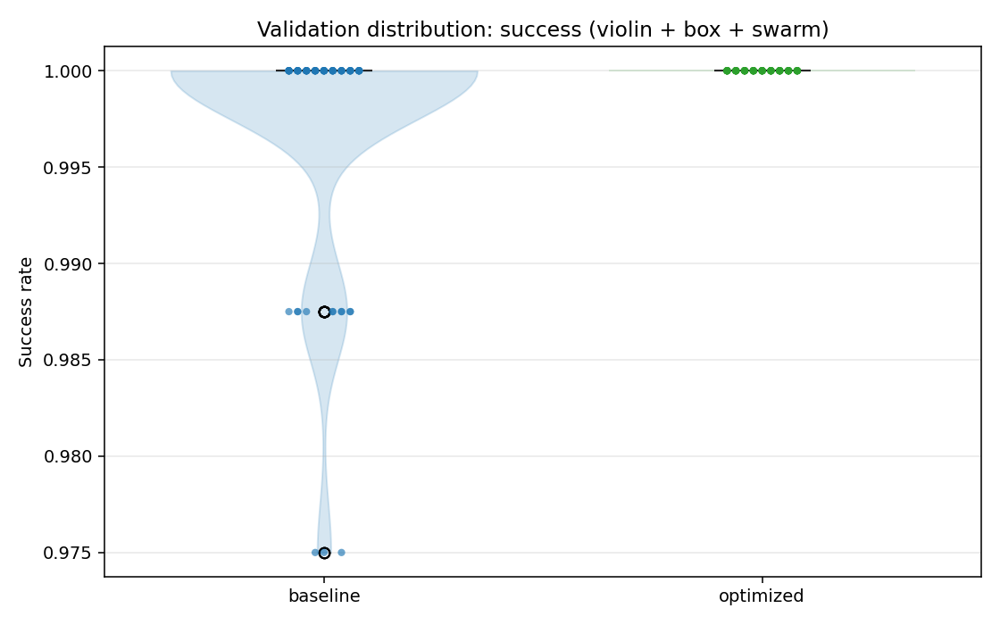
  - time_trace_plot: [`bo_validate_20260506T000600Z_job7012262_time_trace.png`](plots/bo_validate_20260506T000600Z_job7012262_time_trace.png)
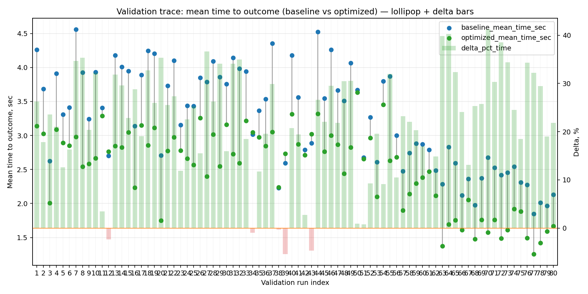
  - time_distribution_plot: [`bo_validate_20260506T000600Z_job7012262_time_distribution.png`](plots/bo_validate_20260506T000600Z_job7012262_time_distribution.png)
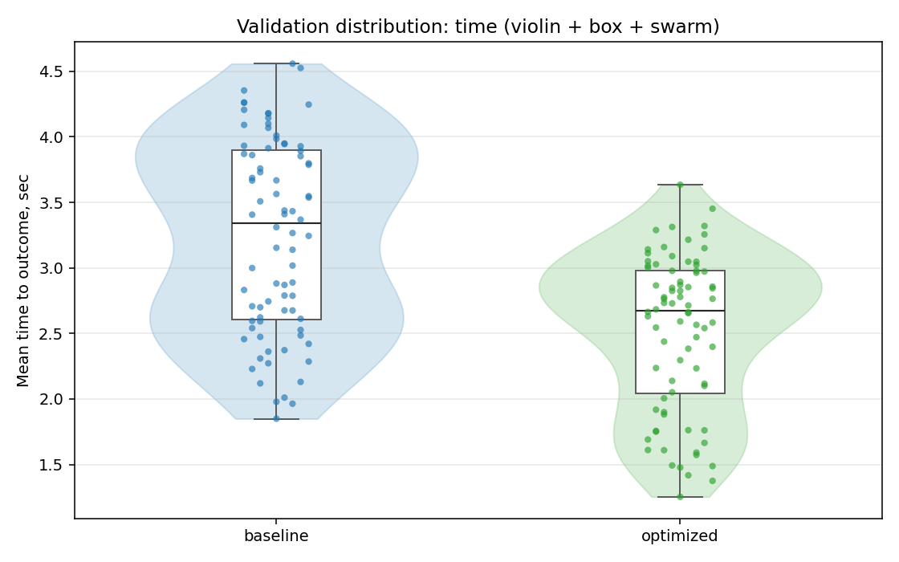
  - curves_trace_plot: [`bo_validate_20260506T000600Z_job7012262_curves_trace.png`](plots/bo_validate_20260506T000600Z_job7012262_curves_trace.png)
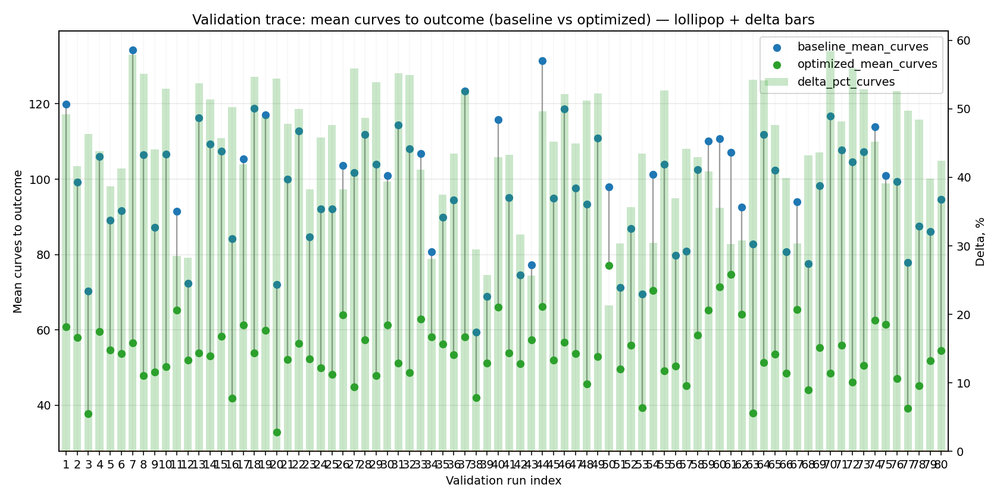
  - curves_distribution_plot: [`bo_validate_20260506T000600Z_job7012262_curves_distribution.png`](plots/bo_validate_20260506T000600Z_job7012262_curves_distribution.png)
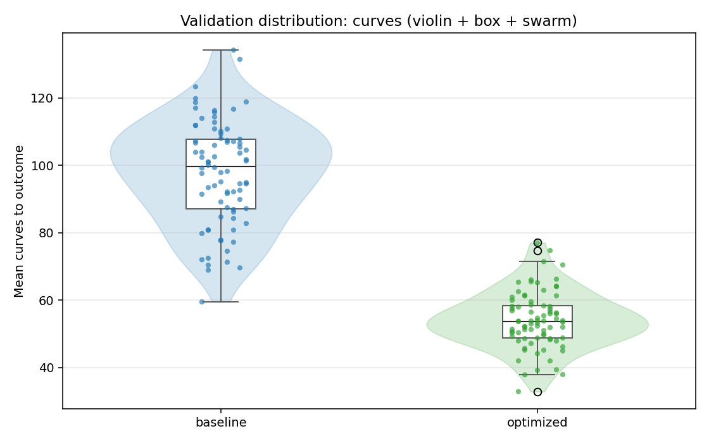

---
