# Отчёт по оптимизации: de_optimize_20260505T214714Z_job7012255

## Метаданные
- метод: `de`
- датасет: `data/numbers/20_dset_20260505T214657Z_job7012254/train.json`
- оптимум `(B1, B2)`: `(38271, 2713793)`
- objective: `24544.070942027396`
- max_curves_per_n: `260`
- repeats_per_n: `8`
- границы: `B1[500.0, 50000.0]`, `B2[5000.0, 3000000.0]`, `ratio_max=1000.0`

## Ключевые статистики
- `best_eval`: `457`
- `best_eval_fraction`: `0.7879310344827586`
- `eval_per_sec`: `0.02138132095835882`
- `evaluation_count`: `580`
- `improvement_percent`: `19.93729841348158`
- `max_plateau_evals`: `250`
- `median_plateau_evals`: `12.0`
- `new_best_count`: `9`
- `new_best_rate`: `0.015517241379310345`
- `p90_plateau_evals`: `151.89999999999995`
- `time_to_best_sec`: `21041.446031820997`
- `time_to_first_improvement_sec`: `48.96654292999301`
- `total_runtime_sec`: `27126.49488256299`

## Флаги внимания

| Флаг | Статус | Текущее значение | Порог | Что это значит | Что делать |
|---|---|---:|---:|---|---|
| `b1_hits_boundary` | ✅ ОК | `0.03103448275862069` | `> 0.10` | Большая доля оценок проходит близко к границам B1. | Расширить диапазон B1, если упор в границу повторяется. |
| `b2_hits_boundary` | ⚠️ ВНИМАНИЕ | `0.21724137931034482` | `> 0.10` | Большая доля оценок проходит близко к границам B2. | Расширить диапазон B2, если упор в границу повторяется. |
| `best_b1_on_boundary` | ✅ ОК | `38271.0` | `within 2% of log-range [500.0, 50000.0]` | Лучший найденный B1 лежит на границе диапазона. | Проверить расширенный диапазон B1 вокруг текущей границы. |
| `best_b2_on_boundary` | ⚠️ ВНИМАНИЕ | `2713793.0` | `within 2% of log-range [5000.0, 3000000.0]` | Лучший найденный B2 лежит на границе диапазона. | Проверить расширенный диапазон B2 вокруг текущей границы. |
| `best_ratio_on_boundary` | ✅ ОК | `70.90990567270256` | `within 2% of log-range up to ratio_max=1000.0` | Лучшее отношение B2/B1 находится у верхней границы ratio_max. | Увеличить ratio_max и перепроверить локальный поиск в новой области. |
| `late_best` | ✅ ОК | `0.7756787643561909` | `> 0.85` | Лучшее решение найдено слишком поздно относительно общего времени. | Усилить ранний поиск или пересмотреть бюджет/инициализацию. |
| `low_improvement` | ✅ ОК | `19.93729841348158` | `< 10%` | Итоговый прирост качества слишком мал. | Сузить границы поиска или изменить параметры метода. |
| `low_signal` | ⚠️ ВНИМАНИЕ | `0.015517241379310345` | `< 0.03` | Слишком низкая плотность новых best-событий (слабый сигнал оптимизации). | Перенастроить exploration и сделать переоценку top-k кандидатов. |
| `plateau_too_long` | ✅ ОК | `0.43103448275862066` | `> 0.50` | Слишком длинное плато: улучшений почти нет на большом участке запуска. | Увеличить exploration или добавить политику рестартов. |
| `ratio_hits_boundary` | ✅ ОК | `0.04827586206896552` | `> 0.10` | Большая доля оценок проходит близко к границе отношения B2/B1. | Увеличить ratio_max, если хорошие точки упираются в ограничение отношения B2/B1. |

## Графики
- [`de_optimize_20260505T214714Z_job7012255_b1_b2_trajectory.png`](plots/de_optimize_20260505T214714Z_job7012255_b1_b2_trajectory.png)
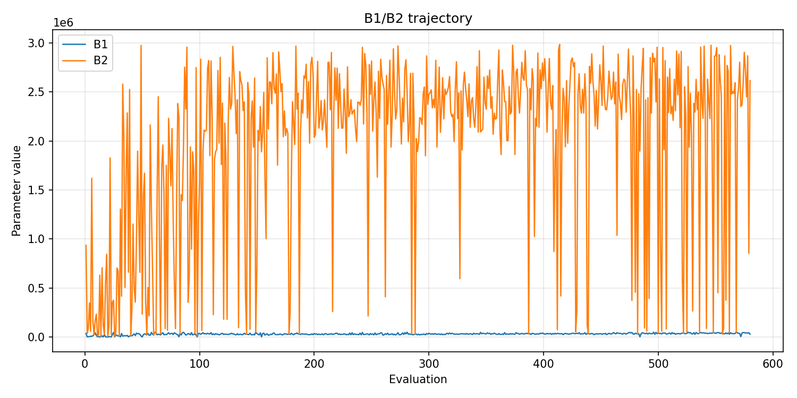
- [`de_optimize_20260505T214714Z_job7012255_b1_ratio_heatmap.png`](plots/de_optimize_20260505T214714Z_job7012255_b1_ratio_heatmap.png)
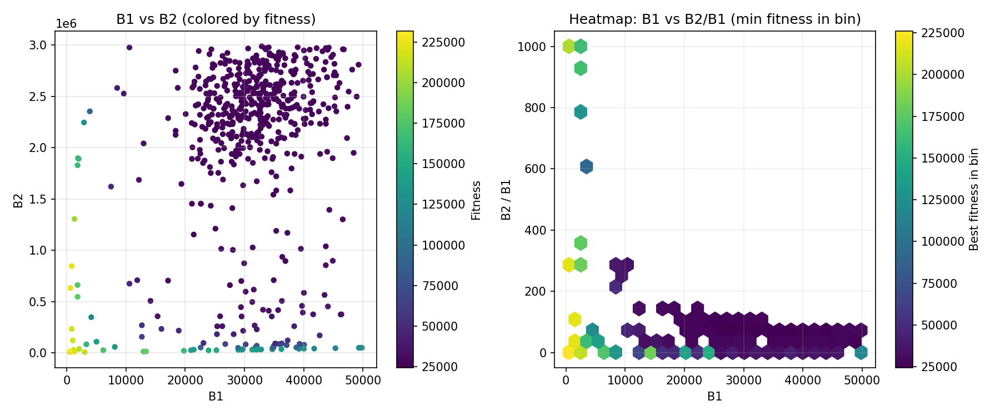
- [`de_optimize_20260505T214714Z_job7012255_jump_plot.png`](plots/de_optimize_20260505T214714Z_job7012255_jump_plot.png)
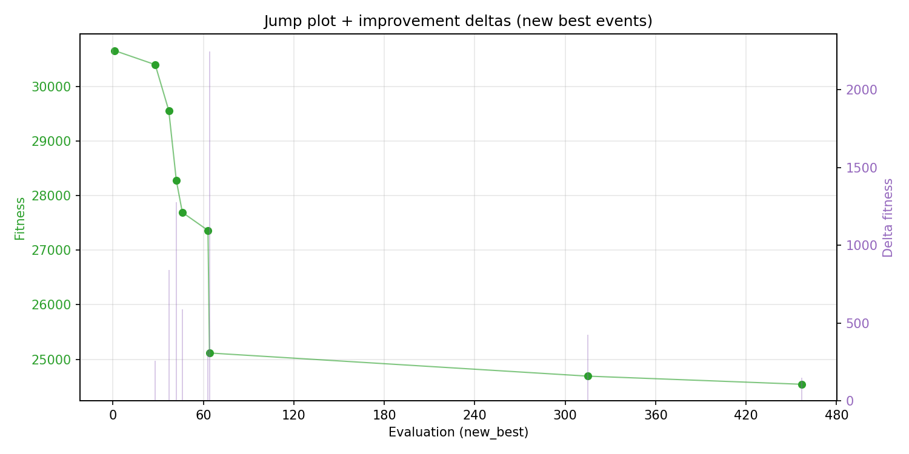
- [`de_optimize_20260505T214714Z_job7012255_progress_by_phase.png`](plots/de_optimize_20260505T214714Z_job7012255_progress_by_phase.png)
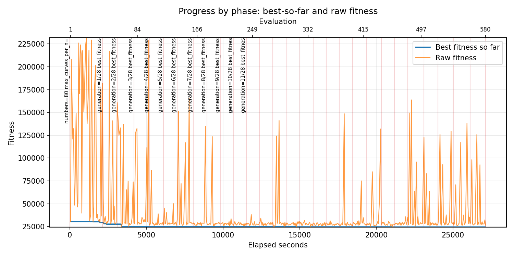
- [`de_optimize_20260505T214714Z_job7012255_time_efficiency.png`](plots/de_optimize_20260505T214714Z_job7012255_time_efficiency.png)
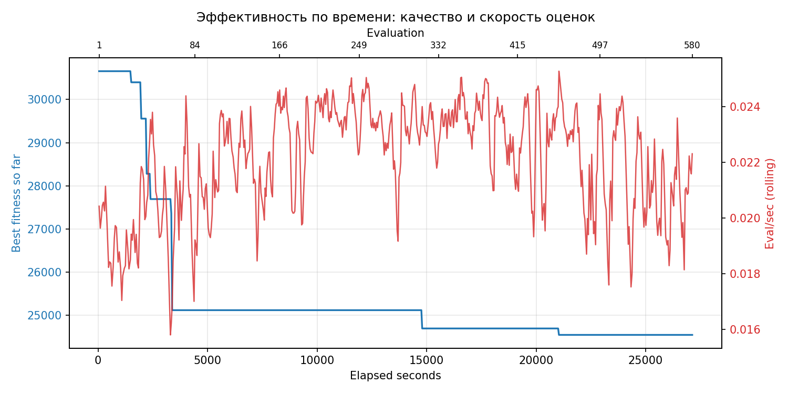

## Таблицы

## Validation runs

### Validation run `20260506T051949Z`
- validation file: [`de_validate_20260506T051949Z_job7012256.json`](de_validate_20260506T051949Z_job7012256.json)
- dataset: `data/numbers/20_dset_20260505T214657Z_job7012254/control.json`
- method: `de`
- optimized params: `(B1, B2)=(38271, 2713793)`
- baseline params: `(B1, B2)=(11000, 1900000)`
- max_curves_per_n: `600`
- repeats_per_n: `80`
- curve_timeout_sec: `None`
- workers: `56`
- seed: `42`
- optimized_mean_score: `27670.371655650542`
- baseline_mean_score: `36652.989393877324`
- relative_improvement_pct: `24.507189963957693`
- optimized_mean_time_sec: `2.5543731030650543`
- baseline_mean_time_sec: `3.1841536268877326`
- time_improvement_pct: `19.77858475497744`
- optimized_mean_curves: `42.5328125`
- baseline_mean_curves: `96.2290625`
- curves_improvement_pct: `55.80045009791091`
- optimized_mean_success_rate: `1.0`
- baseline_mean_success_rate: `0.99828125`
- success_rate_delta_pp: `0.1718749999999991`
- trace plots:
  - score_trace_plot: [`de_validate_20260506T051949Z_job7012256_score_trace.png`](plots/de_validate_20260506T051949Z_job7012256_score_trace.png)
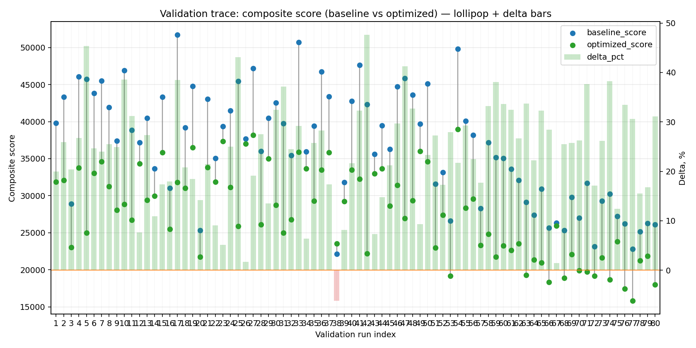
  - score_distribution_plot: [`de_validate_20260506T051949Z_job7012256_score_distribution.png`](plots/de_validate_20260506T051949Z_job7012256_score_distribution.png)
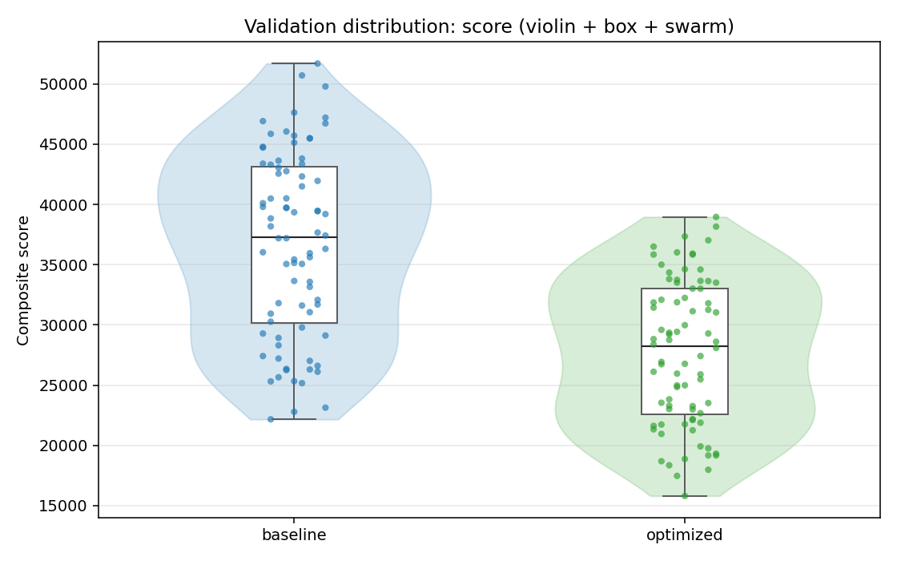
  - success_trace_plot: [`de_validate_20260506T051949Z_job7012256_success_trace.png`](plots/de_validate_20260506T051949Z_job7012256_success_trace.png)
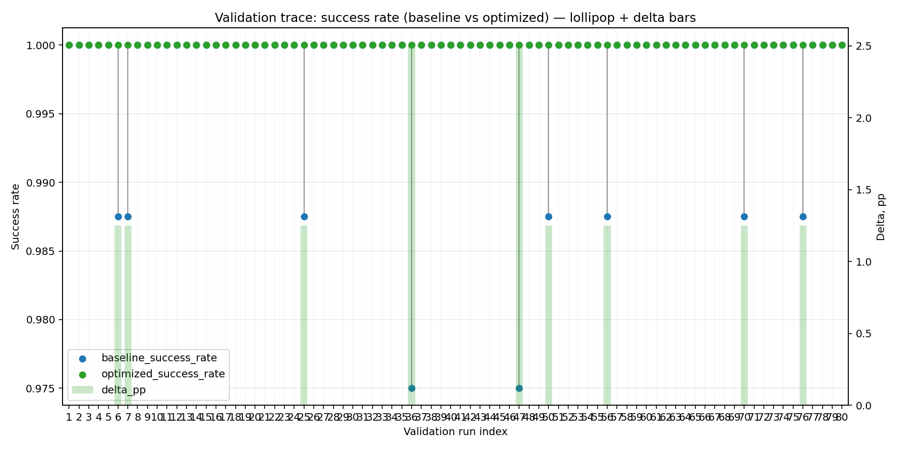
  - success_distribution_plot: [`de_validate_20260506T051949Z_job7012256_success_distribution.png`](plots/de_validate_20260506T051949Z_job7012256_success_distribution.png)
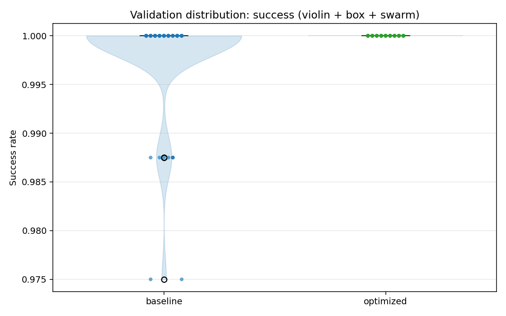
  - time_trace_plot: [`de_validate_20260506T051949Z_job7012256_time_trace.png`](plots/de_validate_20260506T051949Z_job7012256_time_trace.png)
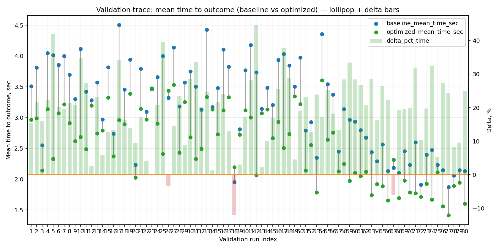
  - time_distribution_plot: [`de_validate_20260506T051949Z_job7012256_time_distribution.png`](plots/de_validate_20260506T051949Z_job7012256_time_distribution.png)
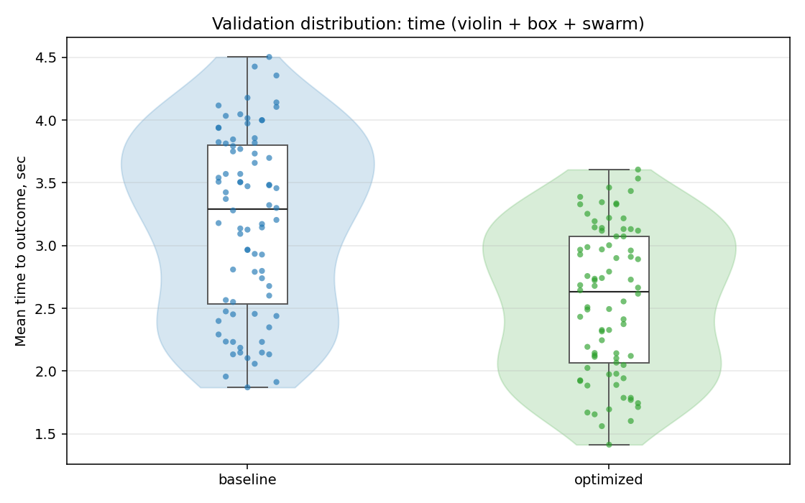
  - curves_trace_plot: [`de_validate_20260506T051949Z_job7012256_curves_trace.png`](plots/de_validate_20260506T051949Z_job7012256_curves_trace.png)
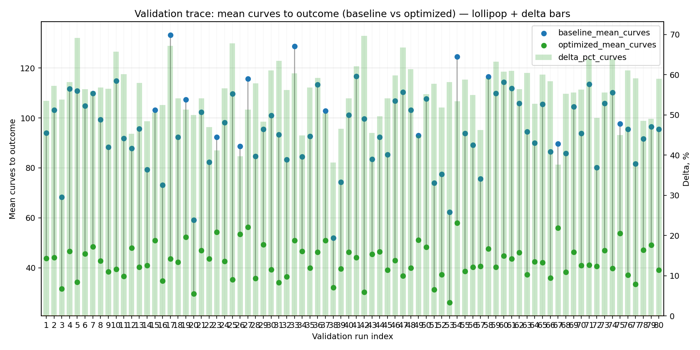
  - curves_distribution_plot: [`de_validate_20260506T051949Z_job7012256_curves_distribution.png`](plots/de_validate_20260506T051949Z_job7012256_curves_distribution.png)
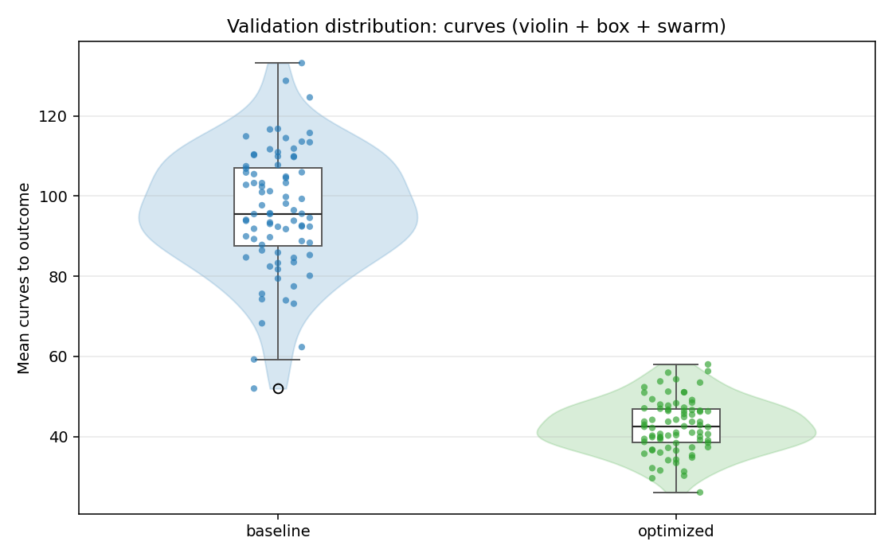

---
